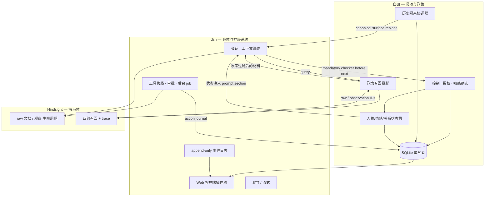
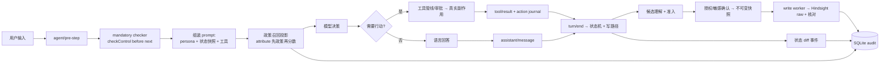

# 蝶忆 Lepimemory — 架构概念

本文记录**设计决策与理由**，不是实现文档。实现细节随代码演进，此处的判断不应被无声推翻。

对应题目：`CHALLENGE.md`。目标 Level：**Lv1 + Lv2 做到扎实，Lv3/Lv4 在骨架成型后接入**。

> **版本状态（2026-10-05，`exp/runtime-convergence`）**：本轮**运行时收敛**替换了早期若干机制。下文**第 2–6 节**描述的是**收敛后的当前设计**；早期被推翻的机制集中在 **§9 历史**，`§7` 的阶段清单降级为**收敛前的历史路线图检查点**，不再代表当前实现。收敛把「可解释的因果」从「事后日志」推进到**单一 SQLite 事务 + 策略投影 + 不可变快照**：记忆写入先过理解/准入/授权，遗忘先做本地抑制 fence 再做远端整理，召回先过政策再打分。

---

## 1. 命题重述

题目表面在问「如何做记忆和行动」，真正的评分口径是这条闭环：

> **过去发生的事情，经过记忆与状态系统，确实改变了角色未来的判断、表达和行动；而这条因果链又可以被人看到。**

这条闭环可以拆成四个必须被证明的环节：

| 环节 | 失败形态 | 我们要给出的证据 |
| --- | --- | --- |
| 角色存在 | 无状态文本生成器 | 跨会话的人格连续性、显式可读的状态 |
| 记忆影响未来 | 向量库 RAG，召回了但说不清影响了什么 | 每条入选记忆的入选理由 + 被写进本轮决策记录 |
| 真实行动 | 说「我帮你记下了」但系统里什么也没发生 | 语言输出与系统行为在数据模型上可区分 |
| 可解释 | 有 trace 但没有归因，翻日志答不出「为什么」 | 可回放的决策事件：候选集、排除原因、状态 diff |

**结论：把「可解释的因果」当作一等公民设计，而不是事后补日志。** 这也是我们与「有记忆有工具的普通 Agent」拉开差距的唯一地方。

---

## 2. 三个核心决策

### 决策一：复用 DeepSeek Harness 作为角色运行时骨架

`dsh` 是 MIT 的 Cordis 插件式 harness（`/home/lycecilion/Workspace/external/deepseek-harness`，当前 `0.1.7-rc.2`）。

**理由**（每条都有仓库级证据）：

1. **「Model-visible ⟺ logged」是运行时强制不变式**，不只是文档承诺：

   > *Model-visible means logged.* A runtime invariant checks model requests are reconstructable from the log。
   > — `docs/architecture.md`

   题目「可观测性与审计」要的几乎就是这句话。我们把审计建在它上面，等于白得一个结构性保证。

2. **一切皆插件，无需 fork**：扩展点按层叠加（bundle patch → profile patch → home patch → `--patch` overlay）。

3. **注入点齐备且都是 effect（可卸载）**：
   - 系统提示词：`ctx.systemPrompt.section()`，**且有 persona 专用槽位**（`deployment:persona-prefix` / `-suffix`）。
   - 动态上下文：`ctx.systemPrompt.context()`，会作为 durable user-role 快照落 log。
   - 上下文注入：`agent/pre-step` waterfall 监听（本插件的 mandatory checker **prepend 并在 `next()` 之前**执行）。
   - 工具：`ctx.tools.register(definition)`；审批走 `ctx.approval`（fail-closed）。
   - 事件订阅：`ctx.on()`（`session/event`、`agent/*`、`tools/*`）。

4. **会话是 append-only 可回放事件日志**：`SessionEvent<T>` 带单调 `seq`，`required-on-read` 默认。

5. **工具管线六段可插拔，审批 fail-closed**：缺席/异常一律 `unavailable` = 拒；审批留成对审计且**不进模型**。

6. **前端是纯浏览器 SPA，客户端自身也是插件树**，可注册 `conversation.input.dock` 等 slot（本插件状态面板即此）。

**收敛后的运行时固定与安装图（0 代码配置 → 固定工具链）**：

- 默认入口**不使用系统 Node / 全局 dsh / pnpm**：`make bootstrap` 按固定 SHA 拉 Node `24.20.0`，同 Node 运行 pnpm `10.28.2`；根 `package.json` + `pnpm-workspace.yaml` 锁定 dsh `0.1.7-rc.2` 与四个 helper；`scripts/runtime.mjs` 生成 home profile（本地插件 link + 连接 patch，provider IDs `lepimemory-role/process/control-fallback`），**不调用全局 `dsh plugin install`**。冲突 profile 报 `LEPI_PROFILE_CONFLICT`，不静默改用户其它 profile。
- 角色默认模型来自 `LEPI_ROLE_MODEL`，原生 UI 的临时角色模型选择不改变独立处理路由；`LEPI_PROCESS_MODEL` / `LEPI_CONTROL_FALLBACK_MODEL` / `LEPI_HINDSIGHT_MODEL` 在启动时固定，其中备用控制模型默认取启动时的角色模型。共享连接（`LEPI_LLM_BASE_URL/API_KEY`）成对，未配置 = unconfigured（只读，不回落官方端点，不放行 stock 模型）。
- 编码向能力裁剪仍在 **agent preset 的 plugins 列表**；`tool-web.fetch=false`、`search` 保留。

### 决策二：Hindsight 作为记忆微服务，只负责**原始**记忆生命周期

`/home/lycecilion/Workspace/external/hindsight`，REST 接入（`/v1/default/banks/{bank_id}/...`），实际版本 `0.10.0`。

**为什么值得用**——它把「记忆是信息生命周期系统」做进内核：

| 题目要求 | Hindsight 的对应机制 |
| --- | --- |
| 什么成为记忆 | `retain`（LLM 抽取事实/实体/时间/关系）；`retain_mission` 窄化 |
| 冲突处理 | 观察（observation）refine-not-overwrite，带 exact quotes 与 proof_count |
| 回忆 | 四臂召回 → RRF → cross-encoder 重排 → token 裁剪（中文部署 keyword 臂停用，见 §6） |
| 「宁缺勿滥」 | `min_scores` 结果级地板做弃权 |
| 可解释召回 | `trace: true` 返回完整 `SearchTrace` |

它也明确区分 **world facts** 与 **experiences**——与题目对齐。

**收敛后的接入姿势（与早期不同）**：

- bank 固定为新名（默认 `lepimemory-v2`），**拒绝旧 `lepimemory`**；旧库保留、不迁入、不作为默认写入目标。
- 只走**精确方法**：`retainAsync`（一候选一文档一 `operation_id`）、`operation`、`document`、`units`（分页）、`cancel`；`invalidate`/`revert` **只作用 raw world/experience**，`reason` 固定 `lepimemory:<request_id>`、**不含正文**。
- **Hindsight 不再是遗忘的唯一权威**：本地 SQLite 先建**抑制 fence**（`forget_scopes`）与政策 epoch，再做远端 `invalidate`/整理；两者**分开报** `local_isolated` 与 `remote_*`。**不承诺「可逆复原历史」**。
- **写入只有一条路径**：`retainAsync`。旧 fire-and-forget `retain` 删除。
- 不再需要自研 `OPERATION_VALIDATOR` 扩展；授权/时效/遗忘/异步写入由**插件侧**（SQLite store + control/history/recall）统一协调，REST 客户端隔离为独立模块。

### 决策三：人格 / 情绪 / 关系状态机**完全自研**（收敛后落在统一 SQLite）

**明确不使用 Hindsight 的 `banks.disposition`**：它是静态配置、因果链会断、题目要的是显式状态。

**收敛后实现**：

- 状态是 `state(id=1)` 的 JSON；**每次数值提交与完整 before/after 审计在同一个同步事务**（不再分散编辑 `state.json`）。
- 更新仍由**离散规则 + 事件触发**决定，模型文本不直接改状态；`renderState` 只显示当前显著的近期 cause（不出现数值）。
- **操作者编辑**：`POST /lepimemory/state` 只在 authenticated operator 路由下，body **恰好** `{mood:{valence,arousal},relation:{trust,closeness,familiarity}}`，逐字段 `validateState` 后提交，cause 固定「操作者调整演示状态」，**不接受自由原因**；角色没有 HTTP 写工具。
- 心境 6h 半衰期衰减在**短事务**内按当前 clock 进行并记 `mood.decay`；`settled_turns` + `actions.state_applied` 保证重启/重复结算**不双算**、不重复 brighten。
- turn/end 的状态审计按真实 `session/turn` 汇总结算，不伪造一个顶层 tool call；`data.action_calls` 从同轮 journal 列出真实 `action_id/step/call_id/status`，面板详情直接展示这些因果引用。拒绝仍可追到原生 call，但不成为成功行动或增加 closeness。

---

## 3. 职责边界



一句话分工：

- **dsh 治「做过什么、说过什么」**（行为与经验的忠实记录）
- **Hindsight 治「原始地记得住什么」**（raw 文档/观察的生命周期）
- **自研层治「什么能成为长期记忆、因何而变、以及为什么这么想」**（准入、授权、时效、遗忘、状态演化与归因）

> 必须守住的边界：**不把角色人格外包给 Hindsight 的 bank config，也不把记忆检索退化成一次性 RAG 塞进 prompt；更不让 observation 凭 prose 升格为事实。**

---

## 4. 核心数据流

### 4.1 一次交互的完整闭环



### 4.2 记忆的写路径（题目的「什么应该成为记忆」）

**不是每句话都进长期记忆，也不是模型说写就写。** 收敛后的管线：

1. **忠实理解**：处理模型从**当前 session 的真实证据**（`evidence.js`，以 `session_id:seq:block_index:start:end` 引用消息，不存正文）抽取候选 `CandidateDraft`（`content_kind` / `origin` / `sensitivity` / 时间字段）。候选不按价值少提；纯提问、来源不明、含糊编号不造确定陈述。
2. **控制前置**：`checkControl` 在 `next()` **之前**按真实 `source.kind=user` 检查；模型文本不直接授权。显式记忆请求绕过价值判定但**不绕过来源与抑制**。附有实际断言的「先确认再记住」仍启动 `remember` 与候选理解，不因尚待确认而当成普通消息或空候选，也不把请求本身当作保存授权。
3. **逐候选准入**（`admission.js`）：`laya`（`/v1/systemone`，读 `answers.should_store.noul` 作为 yes 概率、非 confidence，`[0,1]` 校验）或 `generative`（同 processor 固定 route，返回 verdict + 封闭 reason_code，**不伪造概率**）二选一，**显式选择、运行时不自动切换**。稳定 `stable_fact/preference/plan/event` 与 `temporary_state/other` 用不同阈值（demo 起点，**非校准概率**）。
4. **敏感与授权**：`ordinary` 可自主保存；`private`/`excluded` **不落队列正文**，价值判断先做，拟保存才走 `ctx.userQuestions.ask` 的非工具确认卡（heap-only，不持久化正文、不写 session）。授权是 `grants` 里的 typed scope（item/topic/continuous）；已有范围匹配后，还要核验当前任务的 live root、`policy_epoch` 与遗忘 fence，不能拿授权范围对象替代任务上下文。有效话题授权可用于范围内的新材料；撤销先停止依赖它的新保存，已有获准记忆是否遗忘另行确认。
5. **不可变快照**：获准候选 `INSERT snapshots`（DB 触发器禁止 `UPDATE`）+ `lifecycle` pending + write task，**同一事务**。
6. **可核对写入**：write worker 用 `retainAsync` 写 `document_id=lepi-<candidate_id>`；只有 `units(document_id)` 全分页 + document 原文/metadata 与可用 raw 核对通过才 `written`。accepted/`submitted`/`completed` **都不等于 written**；`completed` 无可用 raw 是 `LEPI_RETAIN_EMPTY`。lost-ack 沿原 `operation_id` 查询，doc+raw 均证明在库才 `reconciled`，否则 `unknown`。

处理器的 `fetch_context` 仅公布本次核验的原生 evidence ID 枚举，candidate、scope、raw 与辅助 recall ID 不能借作会话取证。范围匹配的 `submit_result.source_ids` 同样列出当前已提供的真实来源 ID，不能把范围/请求 ID 当成来源。结果与工具参数共用**一次**结构修复额度，只回传封闭 code/字段路径，不回显非法引用或值；来源失效、政策变化、流不完整与预算耗尽不因此放行。

授权话题匹配与遗忘方面匹配共用有界处理器，但用途明确区分：三个遗忘检查入口传入 `match_purpose=forget`，以已确认的非值主体/方面为完整边界，不能把表达或提问行为扩大成它谈论的所有事实、偏好，也不能为匹配重读被忘正文。无法证明无关仍抑制；既有范围、epoch 和授权复核不变。控制与范围匹配优先使用已提供的完整来源，避免重复取同一原文消耗调用额度。

有 active 遗忘范围且没有显式记忆操作时，`context_guards` 必须覆盖每个本次主表达，包括纯寒暄、开放查询与对话指令的非值方面；没有可记忆断言不等于没有 guard。遗漏或部分覆盖属于结果契约失败，复用既有一次结构纠正与固定备用控制路线；全部失败仍停车/拒绝，不以空 guard 绕过遗忘屏障，也不因此生成记忆候选。

**信任与衰减**（`trust.js`）：

| 类型 | 来源 | 信任度 | 衰减 |
| --- | --- | --- | --- |
| fact | 用户明说 | 高 | 不衰减；被纠正走 supersession |
| experience | 角色亲历（**journal 确认已执行**的行动） | 高（但主观） | 不衰减，是关系演化依据 |
| inference | 角色推断 | 中 | **半衰期 14 天**；有效分 = `semantic × 0.5^(age/halfLife)`，被明确否认立即停用 |

> **observation 不是自动事实**：综合观察必须标「未确认」，只有通过 `verifyObservation`（每个断言有来源、时间/身份未被扩大）后才可作为参考材料，**不能借 metadata 或 prose 升为 fact**。`trustOf` 只接受**已关联 snapshot** 的 origin/formation，unknown 返回 `unknown`。

### 4.3 记忆的读路径（题目的「什么时候应该重新想起它」）

用 Hindsight 的 `recall` + `trace: true`，但**先过政策，再打分**：

1. 构造 query；`recall` 拿候选 + trace（含 `source_fact_ids` / `source_facts` / 截断标志）。
2. **政策投影**（`attribute(results,{sourceMap,store,purpose,nowMs,...})`）：`current` 不采用 `superseded`/`history_only`；`forgotten`/`audit_only`/`unknown`/`pending` 从**所有模型材料排除**；active 需 source version 当前、raw valid、授权已有保存未遗忘。
3. **再打分**（`scoreOf`，默认 `minSemantic=0.35`、`maxItems=4`）：排序只在政策允许集合内进行，优先原生 `scores.final`。有 semantic 时仍检查阈值；原生 keyword/graph 结果的 `semantic=null` 不等于测得的 0，获准陈述/已核实行动可用有限的 final 排序；未确认推断缺 semantic 则排除，仍须满足衰减后的相关性阈值。source fallback 继承触发它的 observation 检索分，记 `score_source='parent_observation'`，不伪装 raw 自己有 semantic 分；缺 final/semantic 的材料不参与排序。
4. 入选材料标注 **user statement / verified action / unconfirmed inference**、日期与 current/history 用途，**不给模型数值当人格**。
5. 全部候选、入选、排除、排除 code 写审计（**不存召回正文/embedding trace**）。

未来尚未执行计划的 `valid_from` 绑定真实主表达的 `source.at`，不接受模型把 UTC 钟面重新标成另一时区；计划的事件时间与当日截止仍分别保留。过去日期的计划只作历史，日期过去不自动升级为已发生。

### 4.4 行动（题目的「语言输出与系统行为是两个可区分的概念」）

- 行动**必须真的执行**，并且**成功以 journal 为准**：`write_note` 每次调用分配 `action_id`，先前登记 `prepared`（含真实 session/turn/step/call），事务外独占创建同目录临时文件、fsync 后 `link(final)` **原子只创建**（碰撞绝不覆盖），最终文件 hash 匹配后**同一事务**改 `executed` + 完整 audit。
- 输出精确 `{action_id,path,title,outcome,executed}`；`outcome` 正常只有 `allowed-once`/`rejected`/`cancelled`/`unavailable`，真正 unknown 通过 journal + 抛稳定码呈现。**绝不拿 `isError === false` 当成功。**
- 崩溃后 `prepared` 行显式对账：hash 匹配则 recovered executed，否则 unknown，**绝不重写一遍**。
- **失败不降信任**：真实拒绝/取消/不可用与控制错误**不计工具失败**；普通失败只降 `valence`，**不降 `relation.trust`**（早期 `tool.failure.dampen` 的 trust delta 已删除）。

### 4.5 上下文管理（Lv1）与历史隔离（Lv2）

- **压缩复用 dsh**：`compaction-basic` + `tool-result-pruner` + `command-compact`（`/compact`）。region 选择纯位置化，**system 节点 0（persona + 状态段）永不被压**；被压的旧 recall 注入只是冗余副本（记忆真源在 Hindsight/政策投影，每轮重取）。
- **历史隔离（遗忘）是 canonical surface 操作**：`history.js` 复用 `Session.append` + `sessionQuery` + `runMaintenance` + surface fold，不建第二写者、不新增 dsh event type。
  - 选中候选后**同一事务**：`lifecycle=forgotten`、active `forget_scope`、`policy_epoch++`、停止相关/无法排除关联的任务、所有 owner sessions 加 `history_work` pending。
  - 被改 user/assistant/tool 区间用 `lepimemory-redacted` notice 替换；**assistant 不能作 replace 体**，tool-call/result 组**配对平衡**扩大，`sourceEventSeqs` 用 canonical 顺序（非数字排序）。
  - 冷会话经 `ctx.agents.resume` → 同一 liveSession → flush → dispose；setup 先从原生 `agentPreset` session projection 取当前预设并 `agentPresets.mount`，不拿不可变创建 header 代替当前选择，也不以裸部署人设覆盖原角色。node0 system 受保护；若无法净化则 reject，不放行旧 snapshot。
  - **只有所有可读会话隔离证明完成**才发 `local_isolated`；`remote_curating` 另报。

---

## 5. 领域模型

### 5.1 人格与状态（自研层）

- **不变层**：身份内核（角色身份、价值观、说话方式），变更需显著事件且留理由。
- **可变层**：关系（trust/closeness/familiarity）+ 情绪（valence/arousal）；情绪向基线回归，关系不衰减（或极慢）。
- **更新规则**：`状态变更 := f(触发事件, 当前状态, 关系上下文)`；每次变更产出 `{前值, 后值, 触发事件 id, 命中的规则, 时刻}`。
- **持久化**：`state` 表；**数值提交与完整审计同事务**；操作者编辑见 §2 决策三。呈现层只渲染当前显著 cause（中性文字 + 实际时间），不显示数值。

### 5.2 记忆（Hindsight + 自研政策层）

Bank 划分：**一个角色 = 一个新命名 bank**（严格隔离，无跨库泄漏）。

- **什么成为记忆**：先理解、再逐候选准入、再授权，最后才写；不写寒暄/近场噪声、不写未核实的推断。
- **冲突**：走 **supersession**（旧 snapshot 不变、`lifecycle=superseded`、current 停用），**保留历史**。
- **遗忘**：本地抑制 fence 先生效（`local_isolated`），远端 `invalidate`（**仅 raw world/experience**，`reason` 固定）另报；**不承诺可逆复原历史**。
- **恢复**：只恢复**已核实的当前 `forgotten` 原始记录**为 LTM，**不重建净化过的旧 surface**；`re_remember` 只为新内容立例外。

### 5.3 审计（跨层）

**主账本仍是 dsh session log**（model-visible ⟺ logged）；**自研侧真源是单一 SQLite**。

> ⚠️ **2026-09-29 实测更正**：out-of-tree 插件**不能**往 session log 加自定义 durable 事件类型（写侧无 `ignorable` 透传、读侧静态白名单；追加即让整档重载被拒）。因此自研审计**不建在 session log 上**，而是落在插件自有 SQLite。

**分层落点**：

| 审计要素 | 落点 | 说明 |
| --- | --- | --- |
| **效果**：模型实际看到什么 | `system/message`（dsh 原生） | 状态/记忆注入即提示词变更；Trajectory 的 **Prompt Diff** 可回放 |
| **原因**：状态/记忆为何变化 | **SQLite `audit` 表** | 与状态变更/授权/遗忘同事务；前值→后值 + 命中规则/固定 cause |
| 工具与审批 | `tool/call` + `tool/result`（dsh 原生）+ `actions` 表 | 行动成功以 journal 为准，不以 `isError` 为准 |
| 记忆召回/写入/遗忘 | SQLite（`requests`/`tasks`/`snapshots`/`lifecycle`/`raw_links`/`forget_scopes`/`history_work`） | 与 `audit` 交叉引用；UI 经操作者路由暴露 |

**对外公开健康与操作者受限投影（后者先鉴权，401/403 在读取前拒绝）**：

- `GET /lepimemory/health`（公开只读）：`core`/`node`/`dsh`/`schema`/`serviceReady` bool，不含 key/body/端点。
- `GET /lepimemory/state`：`{ok,rendered,mood,relation,updatedAt,core,status,counts}`。
- `POST /lepimemory/state`：操作者状态编辑（见 §2 决策三）。
- `GET /lepimemory/history?kind=&limit=&offset=`：**8 个封闭 kind**（`audit|recall|retain|forget|action|control|consent|task`），SQL 分页、最新在前；未知 kind 400。
- `GET /lepimemory/candidate?id=&reveal=`：批准快照/生命周期/来源引用/raw links/operations/grants；无 heap 回退；已遗忘默认隐藏正文，`reveal=1` **仅审计、不恢复**。
- `POST /lepimemory/retry`：`{kind:'request'|'task', id}`，只按既有身份唤醒，不换新 operation；旧输入被新 fence 判为不安全返回 `LEPI_INPUT_RESUBMIT_REQUIRED`。

**审计要能回答的问题**（照抄题目，逐条对应）：

| 题目问题 | 数据来源 |
| --- | --- |
| 使用了哪些上下文和记忆 | `system/message` Prompt Diff + `history?kind=recall` + candidate 来源链 |
| 内部状态是否发生变化 | `history?kind=audit`（前值→后值 + 命中规则）+ Prompt Diff |
| 是否调用了工具，输入和结果是什么 | `tool/call` + `tool/result`（原生）+ `history?kind=action`（journal） |
| 最终产生了什么语言或行为 | `assistant/message`（原生） |
| **为什么这样决定** | `history?kind=control/consent/task` + `audit` + 来源链 |

> 私密/excluded 内容不存 body/hash/含敏感值的错误；未授权任务结束清 `draft_json`/`payload_json`；已获准快照保留为 audit-only，不作为独立当前真相。

---

## 6. 取舍与已知风险

**明确接受的代价**：

| 取舍 | 接受的理由 |
| --- | --- |
| 引入 PG + pgvector（Hindsight 无 SQLite 后端） | 换来已验证的记忆生命周期语义；自行实现同等深度不现实 |
| 依赖 `0.1.7-rc.2`（预稳定） | 锁版本 + 只依赖文档化扩展点 |
| 两套运行时（TS + Python） | 语言边界清晰，用 REST 隔离 |
| **中文停用 BM25 关键词臂**（CJK 无分词扩展） | 蝶忆是中文语义记忆，语义 + 图臂足够；不为它牺牲单容器部署 |
| Laya/Generative 双后端，**运行时不自动切换** | 语义不合格时可显式改配置复跑并报告 backend，不静默降级 |
| 单用户 home / 单角色 | demo 时区 `Asia/Shanghai`；不自动导入旧 bank、不弱化遗忘 |

**风险与对策**：

1. **上游破坏性变更** → 锁版本；接触面限定在文档化扩展点；Hindsight REST 客户端隔离成独立模块。
2. **Hindsight 部署重量**（PG + LLM provider）→ 单机 Docker/内嵌 `pg0`；embedding/reranker 走锁定 snapshot（本地/远端皆可）。
3. **人格状态机退化成一个大的 `if` 集合** → 规则显式声明为数据；每条规则配测试与「为什么这条规则存在」的注释。
4. **审计信息量淹没可读性** → 审计有两档：SQLite 完整事件流，与面板/路由的人可读摘要；后者默认展示、可下钻。
5. **评委自行运行时卡死** → 见 §6.5；凭据可替换、启动时间透明、状态可重置（用新 home，不 `make reset`）、零 key 有只读降级路径。

---

## 6.5 部署与交付

### 交付物

| 交付物 | 作用 |
| --- | --- |
| GitHub 仓库 | dsh profile + 自研插件包 + `docker-compose.yml` + `Makefile` + 文档 |
| PPT | 讲清问题定义、三个核心决策、取舍、闭环演示 |
| **`docs/DEMO.md`** | 评委自助路径：`make bootstrap` → `make install-profile` → `make dev` → 打开认证链接 → 按 D0–D8 走 |
| 录屏 / GIF | 现场跑不起来时的保底 |

### 部署形态：docker compose + 本地跑 dsh

```
docker compose up -d                    → Hindsight（0.10.0，内含 pg0）、laya
make bootstrap && make install-profile  → 固定 Node/pnpm，生成 home profile
make dev                                → 固定 Node 启动 dsh（新 home / 新 bank）
```

`make dev` 先检查真实 `process.version`、CLI/核心插件版本和 `/lepimemory/health.core`；核心不兼容或 SQLite 失败**终止**，外部服务故障留界面/任务状态。

**为什么这个组合最优**：插件改完直接重启 dsh，不碰容器；Hindsight 自带 UI 调试记忆；`Makefile` 把步骤串起来；语言边界天然隔离。

### 评委自行运行：必须保证的事

1. **模型凭据与端点可替换**：全部走 `.env`；绝不硬编码 key/端点；提交 `.env.example`（留空占位）。共享连接成对填写，缺一项报 `LEPI_CONNECTION_INCOMPLETE`。
2. **首次启动时间写清**：Hindsight 首启建 PG + 加载固定 snapshot 可能数分钟。
3. **不破坏旧状态**：新增机制**不**用 `make reset` / `down -v` 验证；用新的 `DSH_HOME` 与新 bank。
4. **零 key 也能看到点什么**：无共享连接时至少允许只读界面与健康检查；但**不宣称可以对话**。

### 演示剧本

见 **`docs/DEMO.md`**：固定 **D0–D8** 脚本要求每步提供**实际 SQLite 状态、请求/工具/文件或 UI 证据**。本轮11项运行时实现及实际 D0–D7已完成；按用户要求收束，不继续D8完整独立验收及额外后端比较，**不得**据单点证据声称D0–D8全套通过。真实失败与验收边界保留在 `docs/DEVLOG.md`。

---

## 7. 推进计划（**收敛前的历史路线图检查点**）

> ⚠️ 以下 Phase 清单是**收敛前的历史检查点**，勾选只代表当时的机制验证，**不代表当前实现**。当前实现与验收口径以 §2–6 与 `docs/DEMO.md` 的 D0–D8 为准；两处冲突时以后者为准。

### Phase 0 — 架构与验证

- [x] 题目重述与评分口径分析
- [x] 复用可行性评估（dsh / Hindsight）
- [x] 三项核心决策
- [x] 本文档评审定稿（后被本轮收敛更新）

### Phase 1 — 骨架跑通

- [x] dsh profile 定义；最小 Host 插件包
- [x] Hindsight 单机跑起来
- [x] 竖切（读路径）+ 最小审计面板

### Phase 2 — Lv1 完整

- [x] 人格状态机（显式状态 + 规则 + 衰减 + 持久化）
- [x] persona 注入
- [x] 状态审计 + 状态面板
- [x] 上下文管理策略（复用 dsh `compaction`）

### Phase 3 — Lv2 完整

- [x] 记忆写路径 v1 → **已被收敛后的理解/准入/授权/快照管线取代**
- [x] 三档信任 + 推断衰减（保留，见 §4.2）
- [x] 遗忘 + 恢复 → **已被政策投影 + 历史隔离取代**（不再承诺可逆复原）
- [x] 归因筛选 + 自研归因审计 → **已迁移到 SQLite 政策投影**
- [x] 行动能力（`write_note`）→ **已迁移到 action journal（成功以 journal 为准）**
- [x] 审计与回放 → **已迁移到单一 SQLite + 操作者路由**

### Phase 4 — Lv3 状态外化

- [ ] 状态 → 视觉映射定义
- [ ] Live2D/2D 形象接入（client 插件 overlay）
- [ ] 情绪/思考/说话/等待/执行工具 驱动表情与动作
- [ ] 关键：Avatar **不是**独立播放动画的前端组件，而是状态的一种输出

### Phase 5 — Lv4 实时交流

- [ ] TTS 接入
- [ ] 情绪状态影响语音特征
- [ ] STT 接入（复用 dsh `experimental voice-input`）
- [ ] 首字反馈 < 10s 的量化验证

---

## 8. 待回答的开放问题

| 题目问题 | 当前立场 | 状态 |
| --- | --- | --- |
| 人格在 Prompt 还是显式状态 | 显式状态，Prompt 只承载渲染 | 已定 |
| Agent 是否应拥有关于自己的记忆 | 是，作为 experience（journal 确认），关系演化依据 | 已定 |
| 用户与 Agent 的关系是否需要建模 | 需要，独立维度 | 已定 |
| 事实/推断/经历是否用不同策略 | 是，三档信任与差异化衰减；**observation 不自动升格** | 已定 |
| 错误记忆如何修正 | supersession（保留历史 + 标记失效，current 停用） | 已定 |
| 旧记忆什么时候失效 | 冲突时、用户要求时、推断衰减时、过期计划转历史 | 已定 |
| 工具结果是否进长期记忆 | 进，但作为 experience；**成功以 journal 为准** | 已定 |
| 副作用操作是否要求确认 | 是，走 dsh fail-closed 审批 | 已定 |
| 行动失败是否影响角色状态 | 是，作为 experience；**失败不降信任** | 已定 |
| 工具长时间执行时角色如何表现 | 状态反映「执行中」，Lv3 外化 | 部分 |
| 用户打断 Agent 如何处理 | dsh cancellation 语义 + 本地 fence；旧输入不安全则要求重新发起 | 部分 |

---

## 9. 历史（已被本轮收敛推翻/替换的机制）

> 保留此处作**决策演进的诚实记录**；下列机制**不再**代表当前实现。详见 `docs/DEVLOG.md` 与 `docs/research/` 下的历史 artifact。

- **JSONL 作为自研审计真源**：`audit.jsonl`/`recall.jsonl`/`retain.jsonl`/`forget.jsonl`/`action.jsonl`。现由**单一 SQLite** 取代；旧文件在首次启动时**原位归档**为 legacy（`data.legacy=true`，缺身份记 NULL），**不再读它作为当前状态**。读者**不要**再编辑 `state.json` 或读 JSONL 当当前真相。
- **`state.json` 直接编辑当状态**：现由 `state` 表 + 操作者路由取代。
- **遗忘＝Hindsight `invalidate`（可无损 revert）**：现为**本地抑制 fence 先行 + 远端整理另报**；`invalidate/revert` 仅作用 raw world/experience；**不承诺可逆复原历史**。
- **observation 一律按 fact、不衰减**：现要求 `verifyObservation`，且**不自动升格为事实**。
- **`retain` fire-and-forget 写路径 / 工具 `isError=false` 即成功 / accepted async 即写入**：现为唯一 `retainAsync` + `written` 需 doc+raw 核对；行动成功以 journal 为准。
- **`remember`/`forget`/`restore_memory` 三个工具**：现合并为一个 `manage_memory`（`{kind,source_ids,candidate_ids}`，不传正文），角色不能自行授权。
- **自研 `OPERATION_VALIDATOR` 扩展设想 / 正则识别「忘掉 X」**：不采用前者；旧消息正则路径已由插件侧政策层与必经控制确认取代。
- **`tool.failure.dampen` 的 relation.trust delta**：已删除；普通失败只降 `valence`。

---

## 附：关键外部接口索引

**DeepSeek Harness**（`/home/lycecilion/Workspace/external/deepseek-harness`）

| 用途 | 位置 |
| --- | --- |
| 架构总览、扩展点总表、turn flow | `docs/architecture.md` |
| 事件词汇与自定义事件 | `docs/subsystems/session.md` |
| 系统提示词 section 与 persona 槽位 | `docs/subsystems/system-prompt.md` |
| 工具定义与六段管线 | `docs/subsystems/tools.md`、`docs/tool-execution-pipeline.md` |
| 审批（fail-closed） | `docs/subsystems/approval.md` |
| persona 注入 | `packages/preset/persona/README.md` |
| 记忆召回来源类型 | `packages/llm/llm/src/message.ts`（`ContextForm`、`MessageSourceMap`） |
| Web 端语音输入 | `docs/subsystems/voice-input.md` |

**Hindsight**（`/home/lycecilion/Workspace/external/hindsight`，v0.10.0）

| 用途 | 位置 |
| --- | --- |
| 写入控制（mission / 抽取模式 / 策略） | `hindsight-docs/docs/developer/configuration.mdx` |
| 召回参数与 trace | `docs/developer/retrieval`、`api/http.py` |
| 数据模型（记忆单元/失效归档/观察） | `hindsight-api-slim/hindsight_api/alembic/versions/` |
| 保留/操作契约 | `api/http.py`（RetainRequest / OperationStatus / units list / source includes） |
