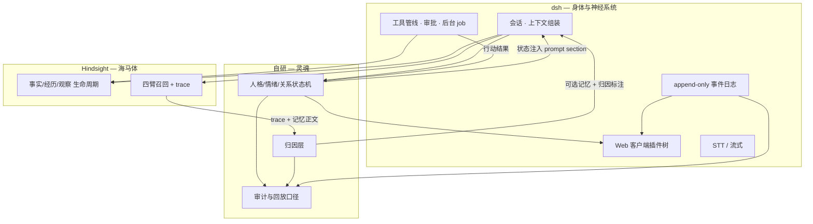
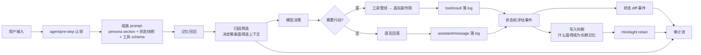

# 蝶忆 Lepimemory — 架构概念

本文记录**设计决策与理由**，不是实现文档。实现细节随代码演进，此处的判断不应被无声推翻。

对应题目：`CHALLENGE.md`。目标 Level：**Lv1 + Lv2 做到扎实，Lv3/Lv4 在骨架成型后接入**。

---

## 1. 命题重述

题目表面在问「如何做记忆和行动」，真正的评分口径是这条闭环：

> **过去发生的事情，经过记忆与状态系统，确实改变了角色未来的判断、表达和行动；而这条因果链又可以被人看到。**

这条闭环可以拆成四个必须被证明的环节：

| 环节 | 失败形态 | 我们要给出的证据 |
| --- | --- | --- |
| 角色存在 | 无状态文本生成器 | 跨会话的人格连续性、显式可读的状态 |
| 记忆影响未来 | 向量库 RAG，召回了但说不清影响了什么 | 每条入选记忆的入选理由 + 被写进本轮决策记录 |
| 真实行动 | 说「我帮你记下了」但系统里什么也没发生 | 语言输出与系统行为在数据模型上可区分 |
| 可解释 | 有 trace 但没有归因，翻日志答不出「为什么」 | 可回放的决策事件：候选集、排除原因、状态 diff |

**结论：把「可解释的因果」当作一等公民设计，而不是事后补日志。** 这也是我们与「有记忆有工具的普通 Agent」拉开差距的唯一地方。

---

## 2. 三个核心决策

### 决策一：复用 DeepSeek Harness 作为角色运行时骨架

`dsh` 是 MIT 的 Cordis 插件式 harness（`/home/lycecilion/Workspace/external/deepseek-harness`，当前 `0.1.7-rc.2`）。

**理由**（每条都有仓库级证据）：

1. **「Model-visible ⟺ logged」是运行时强制不变式**，不只是文档承诺：

   > *Model-visible means logged.* A runtime invariant checks model requests are reconstructable from the log.
   > — `docs/architecture.md`

   题目「可观测性与审计」要的几乎就是这句话。我们把审计建在它上面，等于白得一个结构性保证。

2. **一切皆插件，无需 fork**：`docs/architecture.md` 明确「There is no privileged core to patch: you extend dsh by mounting a plugin beside the others」，第三方插件经 `dsh plugin --profile <name> add <pkg>` 进入 profile，行为按层叠加（bundle patch → profile patch → home patch → `--patch` overlay）。

3. **注入点齐备且都是 effect（可卸载）**：
   - 系统提示词：`ctx.systemPrompt.section()`，**且有 persona 专用槽位** `PERSONA_PREFIX_SECTION` / `PERSONA_SUFFIX_SECTION`（`deployment:persona-prefix` / `deployment:persona-suffix`），per-agent persona 走 `packages/preset/persona/`。
   - 动态上下文：`ctx.systemPrompt.context()`，会作为 durable user-role 快照落 log。
   - 上下文注入：`agent/pre-step` waterfall 监听、`agent.inject()`、工具的 `additionalContexts` / `exec.deferContext()`。
   - 工具：`ctx.tools.register(definition)`。
   - 事件订阅：`ctx.on()`，可订阅 `session/event`、`agent/*`、`tools/*`。

4. **会话是 append-only 可回放事件日志**：`SessionEvent<T>` 带单调 `seq`，`required-on-read` 默认——构建不认识的事件类型会**拒绝**重建 log，除非写者显式标 `ignorable: true`。这种对审计完整性的态度正是我们要的。

5. **工具管线六段可插拔**，且审批是 fail-closed 的：

   `tool/call` → `tools/pre-execute`(allow|deny|ask) → 单调 guards → `ctx.approval` 一次性询问（缺席/异常一律 `unavailable` = 拒）→ `tools/execute` → `tools/post-execute` → `tool/result`

   审批留 `approval/asked` + `approval/decided` 成对审计且**不进模型**——正好回答题目开放问题里的「具有副作用的操作是否应该要求确认」。

6. **前端是纯浏览器 SPA，与 Electron 独立**，客户端自身也是插件树，第三方 client 插件可注册 `ConversationNodeDefinition` 与 `tool.call.toolview` slot。已有 `ui-tool` 提供全部工具调用卡（含参数流式预览）。

7. **Lv4 已有半程**：`experimental voice-input` bundle 提供麦克风 UI + `speech-to-text` seam + SenseVoice 本地推理；全链路 token 级流式，并已有 `assistantStreamFirstTokenTime` / `runFirstVisibleTime` 等首字延迟观测函数。**无 TTS，需自建。**

**要写的胶水**不是适配层，而是「1 个插件包 + 1 个 profile」：

- 配置层（0 代码）：profile 声明 + `cordis.patch.yml`；编码向能力（fs/shell/lsp/skills/agent-instructions 等）的裁剪落在 **agent preset 的 plugins 列表**（已实测：Web 面下会话能力由 preset 决定，见 `docs/research/dsh-findings.md` §2.7）。核心包（session/tools/agent-loop/llm）领域中立，编码假设集中在 bundle 行。
- Host 插件层（主要工作量）：声明 `dsh:{manifestVersion:1, bundle:{patch}, client}`，实现状态机、记忆桥、审计事件。
- Client 插件层：状态外化面板、记忆归因卡、Avatar overlay。

### 决策二：Hindsight 作为记忆微服务，**只负责记忆生命周期**

`/home/lycecilion/Workspace/external/hindsight`，REST 接入（`/v1/default/banks/{bank_id}/...`）。

**为什么值得用**——它把「记忆是信息生命周期系统」这件事做进了内核，而非薄封装：

| 题目要求 | Hindsight 的对应机制 |
| --- | --- |
| 什么成为记忆 | `retain` 走 LLM 抽取事实/实体/时间/关系；`retain_mission` 窄化、`retain_extraction_mode` 五档（含零 LLM 成本的 `chunks`）、`retain_strategies` 命名策略 |
| 冲突处理 | **观察（observation）refine-not-overwrite**：新证据强化/削弱/扩展既有信念而非静默替换，带 exact quotes 与 proof_count |
| 遗忘 | `PATCH state=invalidate` 移入 `invalidated_memory_units` 冷归档，**可无损 revert**；另有显式 DELETE 级联 |
| 回忆 | 四臂并行（semantic/keyword BM25/graph/temporal）→ RRF 融合 → cross-encoder 重排 → token 预算裁剪。⚠️ 中文部署下 keyword 臂停用，见 §6 |
| 「宁缺勿滥」 | `min_scores` 结果级地板可做弃权；`prefer_observations` 观察优先 |
| 可解释召回 | **`trace: true` 返回完整 `SearchTrace`**：每臂 rank/score、RRF 的 `source_ranks`、重排 `rank_change`、阶段耗时 |

它也明确区分 **world facts**（世界的事实）与 **experiences**（Agent 自己的经历）——与题目「Agent 是否应该拥有关于自己的记忆」正好对齐。

**代价**（必须接受，不粉饰）：

- **PostgreSQL + pgvector 硬依赖**，无 SQLite 后端；可内嵌 `pg0` 免管外部实例但仍是 PG。
- 需要 LLM provider 才有完整管线；无 LLM 时退化为 `chunks` 模式（无实体、无观察、`reflect` 直接 400）。
- `recall` / `reflect` **无流式**，长任务只有 async operations + webhook/轮询。
- per-bank 无法改模型/provider（`_CONFIGURABLE_FIELDS` 双重过滤），每个角色不同模型需多实例。
- 召回结果**无 post-hook 可变改写**；深度定制打分需 fork 或实现 `MEMORIES` 存储扩展。
- 版本迭代快，扩展是仓库内 in-process 包、随镜像分发。
- **中文场景下关键词（BM25）臂在本部署不可用**：内嵌 `pg0` 无 CJK 分词扩展，`native` 后端对中文不切词。取舍见 §6。

**接入姿势**：以 REST 为契约当记忆微服务。需要一个自研 `OPERATION_VALIDATOR` 扩展来控制写入与召回作用域（这是唯一需要跟着它版本升级的组件，隔离成单独模块）。

### 决策三：人格 / 情绪 / 关系状态机**完全自研**

**明确不使用 Hindsight 的 `banks.disposition`**（skepticism/literalism/empathy）作为角色人格。三个理由：

1. **它是静态配置，不是可演进状态**。题目要求「能够被更新、读取，并实际影响之后回复或行为的状态」，三个固定维度的旋钮表达不了关系演化。
2. **因果链会断裂**。如果人格在 Hindsight 而驱动它变化的事件在 dsh，两者之间没有通路，审计时必然露馅。
3. **题目开放问题「人格应该主要存在于 Prompt 中，还是应该成为显式状态？」**——我们的答案必须是显式状态，否则这题就成了「写个好人设 prompt」。

**状态机只接受事件驱动，不接受模型自由发挥**（题目开放问题「事实、推断和经历是否应该使用不同的记忆策略？」的延伸回答）：

- 状态更新由**离散规则 + 事件触发**决定，规则本身是我们的设计产物，可被单独审阅。
- 模型文本**不直接改状态**。它要么触发一个显式 action，要么什么都不改变。这保证「为什么她变冷淡了」永远能追到一个具体事件与一条具体规则。
- 状态更新本身是 durable 事件，进入审计流。

---

## 3. 职责边界



一句话概括分工：

- **dsh 治「做过什么、说过什么」**（行为与经验的忠实记录）
- **Hindsight 治「记得住什么」**（长期事实与信念的生命周期）
- **自研层治「因何而变、以及为什么这么想」**（状态演化与归因）

> 必须守住的边界：**不要把角色人格外包给 Hindsight 的 bank config，也不要把记忆检索退化成一次性 RAG 塞进 prompt。** 前者割裂因果，后者让审计无所依附。

---

## 4. 核心数据流

### 4.1 一次交互的完整闭环



### 4.2 记忆的写路径（题目的「什么应该成为记忆」）

**不是每句话都进长期记忆。** 写入判断分三层：

1. **不落长期记忆**：寒暄、可以在会话上下文里直接看到的近场对话。dsh 的 session log 已经忠实记录，不需要污染长期记忆。
2. **落为 experience**：角色自己做过的事、工具结果、行动成败。题目开放问题「工具产生的结果是否值得进入长期记忆」——我们的答案是**值得，但作为经历而非事实**，并且失败经历要参与状态演化（见 5.1）。
3. **落为 fact / preference**：用户长期事实、偏好、约定。

对第 3 层要显式区分**事实、推断、经历**三种信任等级，写进 item 的 `metadata.trust`，因为在审计时它们的可信度不同（**已落地**，见 `docs/research/artifacts/memory-update-trust.md`）：

| 类型 | 来源 | 信任度 | 衰减（已实现） |
| --- | --- | --- | --- |
| fact | 用户明说 | 高 | 不衰减；矛盾走 Hindsight observation **supersede**（读时 `prefer_observations` 取最新） |
| inference | 角色推断（`remember` 工具写入） | 中 | **半衰期 14 天**；衰减到阈值下则召回时排除（理由入审计） |
| experience | 角色亲历（行动成功） | 高（但主观） | 不衰减，是关系演化的依据 |

> 读侧 `trustOf()` 优先读 `metadata.trust`，缺失按 Hindsight `fact_type` 兜底；**观察（observation）一律按 fact**——被 consolidation 吸收即「已确认」，不衰减。推断档的**差异化衰减**在 `attribute()` 里按有效分（`semantic × decayFactor`）筛选与排序。

### 4.3 记忆的读路径（题目的「什么时候应该重新想起它」）

用 Hindsight 的 `recall` + `trace: true`，但**不止于把结果塞进 prompt**：

1. 构造 query（当前输入 + 当前状态：情绪/关系会改变什么值得被想起）。
2. `recall` 拿到候选与 trace。
3. **归因筛选**：决定哪几条真正进入上下文，以及为什么。被排除的也要记录理由（分数不足 / 与当前状态不匹配 / 已被更新版本取代）。`min_scores` 给我们「无相关就不召回」的弃权能力。
4. 入选记忆以 `ContextForm = 'recall'` 的形式注入——dsh 的 `ContextForm` 里这个 form 的语义正是「Material lifted out of another session's log」，与本用途天然吻合。
5. 全部候选、入选、排除、理由写入本轮的 durable 审计事件。

### 4.4 行动（题目的「语言输出与系统行为是两个可区分的概念」）

- 行动**必须真的执行**：`ctx.tools.register()` 注册的工具走六段管线，结果作为 `tool/result` durable 事件落 log。说「我记下了」但库里没有记录——在数据模型上不可能发生，因为「记下」是一个工具调用，它的结果是可查的。
- **需要审批的行动**交给 `ctx.approval`（fail-closed，缺席即拒），审批记录不进模型，单独成审计对。
- **长任务**用 `ctx.jobs.start()` + `run_in_background`，角色状态可持续反映「正在执行」（这是 Lv3 状态外化的素材，也回答题目「如果工具需要长时间执行，角色应该如何表现」）。
- **行动失败影响状态**：失败是 experience，进入状态机评估。这直接回答题目开放问题。

### 4.5 上下文管理（Lv1）

**决策：复用 dsh 的 compaction 后端，不自研。** 理由与边界（实测见 `docs/research/artifacts/context-management.md`）：

- 「与题目重点关系不大的模块可以直接用成熟方案」——上下文管理是 Lv1 的支撑项，不是命题核心；重复实现一个「按位置裁剪 + 摘要」的引擎不划算。
- `compaction-basic` 的 region 选择**纯位置化**（跳过 system 节点 0 → 保留近期 token 尾部 → 摘要最老一段）。**状态段在 system/message 节点 0，永不被压**——人格锚的安全由机制保证，不靠约定。
- 我们的 recall 注入是普通 user 消息，滑出保留尾部会被摘要；**可接受**：记忆真源在 Hindsight，每轮重新召回注入，被压的只是旧副本。
- 配 `tool-result-pruner`（确定性裁超长工具输出，不碰 user 消息）与 `command-compact`（`/compact` 手动压）。
- **落点要求**：压缩服务必须挂在 preset 的 `isolate` realm 里（`cordis:group` + `isolate`），否则 registry 拒绝挂载。

> 这一项补上了 Lv1「保留 / 压缩 / 筛选 / 重组」的最后一格；与 §4.3 的**归因筛选**（决定哪些记忆进上下文）合起来，构成完整的上下文组装策略。

---

## 5. 领域模型

### 5.1 人格与状态（自研层）

分两层，这是「稳定但不僵化」的实现方式：

**不变层 — 身份内核**

- 角色身份、价值观、说话方式、底色。
- 原则上不变。变更需要**显著事件**（`identity` 级别），且每次变更留下理由记录。

**可变层 — 演化状态**

- **关系状态**：信任度、亲密度、熟悉度等，独立维度而非单一标量。
- **情绪状态**：小规模显式维度（如 valence / arousal）+ 若干离散标签。
- **衰减**：情绪向基线回归，关系不衰减（或极慢）。
- **持久化**：状态是 durable 的，跨会话存续，不是每次调用重新生成的。

**更新规则**（状态机的核心，也是我们最需要独立审阅与测试的部分）：

```
状态变更 := f(触发事件, 当前状态, 关系上下文)
每次变更产出: { 前值, 后值, 触发事件 id, 命中的规则, 时刻 }
```

**为什么这样设计**：题目说「我们希望看到的是一种可以解释的连续性，而不是每次调用都重新生成一个人格」。显式状态 + 显式规则 + 显式因果记录 = 可解释的连续性。

### 5.2 记忆（Hindsight 层）

Bank 划分：**一个角色 = 一个 bank**（严格隔离，无跨库泄漏）。

要点：

- 用 `retain_mission` 窄化抽取焦点到角色该记住的东西，而非把它变成垃圾桶。
- **用户说「忘掉这件事」要产生实际效果**：走 `invalidate`（可逆、保留审计）或 DELETE（级联），并在审计里记录「这条已在 X 时刻因用户要求移除」，后续召回不再命中。
- **冲突走 supersede 而非静默覆盖**：保留历史，标记失效，这样「我上次说错了，改过来」在系统里是真实发生的。
- 观察（observation）的 refine-not-overwrite 语义正好符合题目「记忆可能过期、冲突、被修正，或者随着新信息而发生变化」。

### 5.3 审计（跨层）

**审计数据模型**：dsh 的 session log 是主账本。

> ⚠️ **2026-09-29 更正（实测推翻）**：原计划「用 `SessionEventMap` 声明合并、追加我们自己的 durable 事件类型」**对 out-of-tree 插件不可行**——本版本写侧 `Session.append()` 无 `ignorable` 透传入口，读侧按仓库内**静态白名单** `KNOWN_SESSION_EVENT_TYPES` 准入；追加一个不在表内、又不带 `ignorable: true` 的新类型，会让**整个会话在重载时被整档拒绝**（实测原文见 `docs/research/dsh-findings.md` §2.14）。**故：不能往 session log 加自定义事件类型。**（原表里列举的 `memory/recall` / `memory/retain` / `persona/state-diff` / `decision/attribution` 四个自研事件全部作废。）

据此，审计改为**分层落点**：

| 审计要素 | 落点 | 说明 |
| --- | --- | --- |
| **效果**：模型实际看到什么 | `system/message`（dsh 原生） | 状态/记忆注入本就是**提示词变更** → 每次变更都落 `system/message`；Trajectory 的 **Prompt Diff** 即「效果」的可回放证据 |
| **原因**：状态为何变化 | **插件自有持久化** | 状态文件 + 追加式审计 `<DSH_HOME>/lepimemory/audit.jsonl`：`{时刻, 触发事件, 命中规则, 维度前→后}`；人可读、可回放、供自研面板 |
| 工具与审批 | `tool/call` + `tool/result` + `approval/*`（dsh 原生） | 直接可用 |
| 记忆召回（未来） | 插件自有持久化 / 服务侧 | Hindsight `trace` 已含完整召回明细，落自有审计即可 |

> 原「插件声明 `MessageSourceMap` kind / 用 `sourceEventSeqs` 归因」仍限**原生 surface 事件的产出方**；我们无法新增 surface 事件，故这两项对自研层暂不适用（待复核）。`tool/result.meta` 同理，仅产出工具可用。
> 若将来确需「带 schema 校验 + 变更事件」的审计，再评估 `ctx.storageDomain`（路 A）——其 `domain/changed` 是 **cordis 服务事件**，不属 session log，无重载问题。

**审计要能回答的问题**（照抄题目，逐条对应）：

| 题目问题 | 数据来源 |
| --- | --- |
| Agent 使用了哪些上下文和记忆 | `request/context`（原生）+ `system/message` 的 Prompt Diff + 自研审计 |
| 内部状态是否发生变化 | 自研审计（前值→后值）+ Prompt Diff |
| 是否调用了工具，输入和结果是什么 | `tool/call` + `tool/result`（原生）+ `approval/*` |
| 最终产生了什么语言或行为 | `assistant/message` / `assistant/attempt`（原生） |
| **为什么这样决定** | 自研审计（命中规则 + 记忆入选/排除理由）+ 上述交叉引用 |

dsh 另有现成设施可复用：`sessionTelemetry` seam（含 OTel backend）、`agent/assistant-stream` 实时帧、`session-query`（跨会话检索与血缘）、`experimental/inspector`（CDP 查看 Cordis 树）。

---

## 6. 取舍与已知风险

**明确接受的代价**：

| 取舍 | 接受的理由 |
| --- | --- |
| 引入 PG + pgvector（无 SQLite 选项） | 换来已验证的记忆生命周期语义；自行实现同等深度不现实 |
| 依赖 `0.1.7-rc.2`（预稳定，「THERE WILL BE COMPATIBILITY-BREAKING CHANGES」） | 锁版本 + 只依赖文档化扩展点；用 npm 发布版而非全仓构建 |
| recall 无流式 | 记忆召回不是 Lv4 首字延迟的瓶颈；首字反馈靠 dsh 全链路流式 + 状态外化 |
| 两套运行时（TS + Python） | 语言边界清晰，用 REST 隔离；代价是多一个进程 |
| 需自研 TTS（dsh 只有 STT） | 直接使用现成语音合成服务，题目明确不要求自行实现 |
| **中文停用 BM25 关键词臂**（CJK 无分词扩展） | 见下方说明；蝶忆是中文语义记忆，语义 + 图臂已足够，不为它牺牲单容器部署 |

> **关于 BM25（关键词臂）的取舍**：Hindsight 检索默认四臂（semantic / keyword BM25 / graph / temporal）。
> 但 BM25 本质是**字面分词匹配**，而内嵌 `pg0` 既无 CJK 分词（`native` 后端把中文整串当 1 个 token），
> 也装不了 `pgroonga` / `pg_search`（两者都要求外置 PostgreSQL）。
> 蝶忆是**中文语义记忆**，回忆是聊天式查询——正是语义 + 图扩展的主场；实测关键词臂贡献为 0，
> 语义栈修好后召回已精准、并能自然弃权。为 BM25 引入第二个常驻 PG 服务，会牺牲「单容器开箱即用」，
> 得不偿失。**决定：中文部署下弃用关键词臂（现状下它对中文不生效），检索仅依赖 semantic + graph + temporal。**
> 若未来确有字面检索需求，再加官方 `docker/docker-compose/pgroonga/` 变体作为可选部署。

**风险与对策**：

1. **上游破坏性变更** → 锁版本；自研代码与 dsh 的接触面限定在文档化扩展点；`OPERATION_VALIDATOR` 单独隔离。
2. **Hindsight 部署重量**（PG + LLM provider）→ 先用单机 Docker/内嵌 `pg0`；embedding/reranker 可走远程或 `local-ml` extras。
3. **人格状态机退化成一个大的 `if` 集合** → 规则显式声明为数据（可列举、可测试），而不是散落在控制流里；每条规则配单元测试与「为什么这条规则存在」的注释。
4. **审计信息量淹没可读性** → 审计有两档：机器可读的完整事件流，与人可读的归因摘要。UI 默认展示后者，可下钻到前者。
5. **评委自行运行时卡死** → 见 6.5；凭据可替换、启动时间透明、状态可重置、零 key 有降级路径。

---

## 6.5 部署与交付

### 交付物

形式是**面试 presentation（PPT）+ 公开 GitHub 仓库**，不是可发布产品。因此交付物定为：

| 交付物 | 作用 |
| --- | --- |
| GitHub 仓库 | dsh profile + 自研插件包 + `docker-compose.yml` + `Makefile` + 文档 |
| PPT | 讲清问题定义、三个核心决策、取舍、闭环演示 |
| **`docs/DEMO.md`** | 评委自助路径：`make dev` → 打开 :3080 → 按剧本走 |
| **录屏 / GIF** | 现场跑不起来时的保底 |

### 部署形态：docker compose + 本地跑 dsh

```
docker compose up -d                    → Hindsight（内含 pg0），等健康检查
pnpm dsh --profile lepimemory           → dsh 本地跑，加载自研插件
```

**为什么不打包成单个容器**：

- Hindsight 官方镜像**已经内含 pg0**（`-v hindsight-data:/home/hindsight/.pg0` 那个卷就是 PG），所以「PG 塞进去」不是问题，上游已解决。
- 但把 Node 叠到 Python 基础镜像上会膨胀到 GB 级，且**开发期改插件要重建整个镜像**——开发循环是决定性的。
- 两个服务日志混在一个 stdout，调试变差。

**为什么这个组合最优**：

- 插件改完直接重启 dsh，不碰容器
- :9999 是 Hindsight 自带 UI，调试记忆时极有用
- 用 `Makefile` 把两步串起来，评体验与单容器一致
- 语言边界天然隔离（TS / Python），与本文第 3 节的 REST 契约一致

**Fallback（无 Docker 环境）**：`pip install hindsight-api && hindsight-api`，它会自行起内嵌 pg0。写进 README，避免「评委没有 Docker」时无解。

### 评委自行运行：必须保证的事

题目说「不要求 Production Ready」，但**评委大概率会自己跑一遍**。所以：

1. **模型凭据与端点必须可替换**：`HINDSIGHT_API_LLM_API_KEY` / `HINDSIGHT_API_LLM_BASE_URL`、dsh 的 `GEEK_TECH_CLUB_API_KEY` / `LEPI_LLM_BASE_URL` **全部走 `.env`**；**绝不硬编码任何人的 key 或端点地址**；提交 `.env.example`（留空占位）。
2. **首次启动时间要写清**：Hindsight 首启需建 PG + 拉 embedding 模型，可能数分钟。README 必须写明「第一次启动请等待 X 分钟」。
3. **状态可一键清理**：`DSH_HOME` 与 PG 卷都要能干净重置，否则评委会拿到一个状态诡异的实例。
4. **零 key 也能看到点什么**：至少让演示剧本的前几步在无外部 LLM key 时仍可运行（Hindsight 的 `chunks` 模式零 LLM 成本），避免评委第一时间就卡死。

### 演示剧本

演示**不做现场即兴**，用脚本化剧本，且剧本要刻意设计成能展示闭环：

1. 聊几轮，埋下一条信息（如「我下周三要去见一个重要的人」）
2. **换一个会话**（证明跨会话记忆）→ 角色主动问起这件事
3. 打开审计面板：**这句话被哪条记忆驱动**
4. 让角色执行一个真实行动（产生真实副作用，非「我帮你记下了」）
5. 要求「忘掉刚才那个人」→ 展示**遗忘计划预览** → 确认 → 展示后续不再提起

第 5 步对应 `DESIGN_NOTES.md` §2，是相对「普通 Agent 基线」最能拉开差距的一段——大多数实现会把「忘记」做成一个 DELETE。

---

## 7. 推进计划

### Phase 0 — 架构与验证（进行中）

- [x] 题目重述与评分口径分析
- [x] 复用可行性评估（dsh / Hindsight）
- [x] 三项核心决策
- [ ] 本文档评审定稿

### Phase 1 — 骨架跑通（最高风险假设优先）

目标：证明**一条记忆确实改变了一个具体决策，并且可被证明**。

- [x] dsh profile 定义（模型接入 + 按 row id 裁剪编码向工具）
- [x] 最小 Host 插件包（可加载、可看到效果）
- [x] Hindsight 跑起来（单机），bank 建好，`retain_mission` 配好
- [x] 竖切（读路径）：一次交互 → `recall` → 归因筛选 → 注入（`form:'recall'`）→ 自研审计（写路径 `retain` 已接）
- [x] 最小审计面板：能看到「这句话被哪条记忆驱动」（recall 注入落 Trajectory + 面板 History 召回页 + `recall.jsonl`）

### Phase 2 — Lv1 完整

- [x] 人格状态机（显式状态 + 规则 + 衰减 + 持久化）
- [x] persona 注入（正式人设文本 + 动态状态快照）
- [x] 状态审计（插件自有 `audit.jsonl`：前值→后值 + 命中规则）+ 状态面板（`client.js` + `/lepimemory/state` 路由，实时显示）
- [x] 上下文管理策略（长历史压缩/筛选：**复用 dsh `compaction`** + pruner + `/compact`，见 §4.5）

### Phase 3 — Lv2 完整

- [x] 记忆写路径 v1（不写/寒暄跳过 + 用户陈述→`retain` concise + `metadata.trust=fact`；**三档均接入**：fact / experience（行动成功）/ inference（`remember` 工具））
- [x] 事实·推断·经历的信任等级与衰减策略（`lib/trust.js`：fact/experience 不衰减；inference 半衰期 14 天，读侧按有效分筛选）
- [x] 遗忘（工具化：`forget` 两段式「候选计划 → `ctx.approval` → `invalidate`」，支持子集/单条；`restore_memory` 撤销）；冲突 supersede 走 Hindsight 原生
- [x] 归因筛选（含排除理由）与自研归因审计（`recall.jsonl`：候选/入选/排除理由；复用 `tool/result` + 自有持久化）
- [x] 行动能力：至少一类真实副作用操作 + 审批 + 失败影响状态（`write_note` → 真实落盘 `<DSH_HOME>/lepimemory/notes/`；`ctx.approval`；失败→`tool.failure.dampen`）
- [x] 审计与回放（双档：完整事件流＝dsh session log / Trajectory；人可读归因＝`recall.jsonl`/`retain.jsonl`/`forget.jsonl`/`audit.jsonl`/`action.jsonl`）

### Phase 4 — Lv3 状态外化

- [ ] 状态 → 视觉映射定义（先定义映射，再做动画）
- [ ] Live2D/2D 形象接入（client 插件 overlay）
- [ ] 情绪/思考/说话/等待/执行工具 驱动表情与动作
- [ ] 关键：Avatar **不是**独立播放动画的前端组件，而是状态的一种输出

### Phase 5 — Lv4 实时交流

- [ ] TTS 接入
- [ ] 情绪状态影响语音特征（语速/停顿/音高）
- [ ] STT 接入（复用 dsh `experimental voice-input`）
- [ ] 首字反馈 < 10s 的量化验证（用 dsh 现成的 `runFirstVisibleTime` 一类指标）

---

## 8. 待回答的开放问题

题目列出的开放问题，我们的**当前立场**与**尚未定论的部分**：

| 题目问题 | 当前立场 | 状态 |
| --- | --- | --- |
| 人格在 Prompt 还是显式状态 | 显式状态，Prompt 只承载渲染 | 已定 |
| Agent 是否应拥有关于自己的记忆 | 是，作为 experience，且是关系演化依据 | 已定 |
| 用户与 Agent 的关系是否需要建模 | 需要，独立维度 | 已定 |
| 事实/推断/经历是否用不同策略 | 是，三档信任度与衰减 | 已定 |
| 错误记忆如何修正 | supersede（保留历史 + 标记失效） | 已定 |
| 旧记忆什么时候失效 | 冲突时、用户要求时、推断未被确认时衰减 | 部分 |
| 工具结果是否进长期记忆 | 进，但作为经历而非事实 | 已定 |
| 副作用操作是否要求确认 | 是，走 dsh 的 fail-closed 审批 | 已定 |
| 行动失败是否影响角色状态 | 是，作为 experience 进入状态机 | 已定 |
| 工具长时间执行时角色如何表现 | 状态反映「执行中」，Lv3 外化 | 部分 |
| 用户打断 Agent 如何处理 | 待定（dsh 有 cancellation 语义，需实测） | **未定** |

---

## 附：关键外部接口索引

**DeepSeek Harness**（`/home/lycecilion/Workspace/external/deepseek-harness`）

| 用途 | 位置 |
| --- | --- |
| 架构总览、扩展点总表、turn flow | `docs/architecture.md` |
| 事件词汇与自定义事件 | `docs/subsystems/session.md` |
| 系统提示词 section 与 persona 槽位 | `docs/subsystems/system-prompt.md` |
| 工具定义与六段管线 | `docs/subsystems/tools.md`、`docs/tool-execution-pipeline.md` |
| 审批（fail-closed） | `docs/subsystems/approval.md` |
| 上下文注入三类模式 | `docs/cookbook/adding-a-tool.md`、`packages/context/time-context/README.md` |
| persona 注入 | `packages/preset/persona/README.md` |
| 最小 profile（裁剪参考） | `packages/bundle/sdk-minimal/README.md` |
| 自定义模型端点（零代码） | `docs/user/guide/providers.md` |
| 记忆召回来源类型 | `packages/llm/llm/src/message.ts`（`ContextForm`、`MessageSourceMap`） |
| Web 端语音输入 | `docs/subsystems/voice-input.md` |

**Hindsight**（`/home/lycecilion/Workspace/external/hindsight`）

| 用途 | 位置 |
| --- | --- |
| 记忆类型、三操作、观察、mental models | 根 `README.md` |
| 写入控制（mission / 抽取模式 / 策略） | `hindsight-docs/docs/developer/configuration.mdx` |
| 召回参数与 trace | `docs/developer/retrieval`、`api/http.py`（recall `5934`、curate `5847`） |
| 数据模型（记忆单元/失效归档/观察） | `hindsight-api-slim/hindsight_api/alembic/versions/` |
| 扩展插槽（validator / memory defense） | `hindsight-extensions/README.md`、`extensions/operation_validator.py` |
