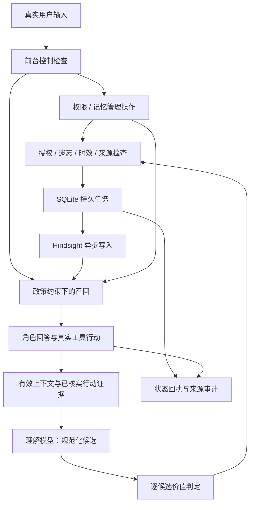

# Lepimemory Lv1 / Lv2 实施计划

> 状态（2026-10-06）：Lv1/Lv2 已完成并收尾。本文保留访谈形成的历史实施契约、依赖顺序与当时的验收计划，不再表示实施尚未开始。当前实现与真实证据以 [README](README.md)、[CONCEPTS](CONCEPTS.md)、[DEMO](docs/DEMO.md)、[DEVLOG](docs/DEVLOG.md) 为准；实际 Web D0–D7 已验收，D8 完整独立演示及额外后端比较按用户要求收束、未宣称通过。后续正文中的计划时态、待验证和阶段顺序应按历史记录阅读，不自动成为新待办。
> 范围：修正现有闭环，替换记忆筛选机制，收敛配置、运行基线、审计与文档。以固定演示剧本验收，不扩展为生产级平台。

## 1. 目标与范围

本次要证明：角色的过去能够形成有来源、有授权、有时效的记忆，影响后续回答与行动；执行结果和状态变化可以追溯，而不是由模型口头宣称完成。

### 1.1 必须保持的行为契约

- 正常多轮对话、稳定身份、显式状态与已有上下文压缩继续保留；只考虑 [CHALLENGE.md](CHALLENGE.md) 的 Lv1 / Lv2。
- 不用消息正则判定记忆价值、遗忘意图或授权意图。模型表达结构化请求，确定的状态机执行操作。
- 每次真实用户输入都经过前台控制检查，先于本轮召回与角色生成。主角色工具是提前入口，不是唯一入口；两个入口共用去重与执行规则。
- 控制检查使用独立处理路由；允许一次经过验证的备用路由检查。所有检查失败则暂停本轮与受影响写入，不把失败解释为“没有控制请求”。
- 普通记忆理解与准入后台执行；用户明确记住、纠错、遗忘等请求必须获得实际状态回执。收到请求、完成本地操作、完成远端写入是不同状态。
- 理解模型只做忠实还原与候选整理，不预先按长期价值过滤；laya 按候选判定普通材料的价值。
- 用户明确记住或纠错绕过价值筛选，但不绕过来源、敏感授权和遗忘约束。
- 被忘内容不再进入角色所有会话的后续模型输入，包括历史、摘要、召回、取证和迟到的后台结果。不能用 suppression directive 代替输入隔离。
- 原始日志可以保留供审计，但不因此向模型重新开放。已经发送给提供方的数据不能追溯撤回。
- 实际副作用才是行动完成证据。拒绝、取消或缺少审批通道不算成功，也不算用户失信。
- 确认纠错后，旧版本立即退出当前认识；新版本保存进度另行记录。历史快照不改写、不自动恢复为当前事实。

### 1.2 明确不做

- Lv3 / Lv4、多人权限系统、通用 Agent 框架、大规模压测与长期故障矩阵。
- Jev / OpenRouter 接入；本次先使用 laya，并准备可显式切换的独立生成式准入后端。
- Hindsight fork、通用存储驱动层、SQLite / JSON 双写兼容、自动追随上游版本。
- 旧 bank 自动迁入、自动删除旧 bank、因界面能打开就宣称所有能力可用。
- 未经验证的中文质量、严格结构化输出、零数据持久化或远端 cache 删除承诺。

## 2. 确认后的数据流

私密候选在取得授权之前只能暂留内存：先判断是否拟保存，再发起具体确认；不提前进入持久任务。明确记忆请求绕过价值步骤，不绕过其他检查。

## 3. 政策与默认参数

| 项目 | 确认的行为 |
| --- | --- |
| 内容类别 | 稳定事实、偏好习惯、计划约定、已发生事件、暂时状态、其他 / 不确定；理解模型依据证据分配 |
| 来源身份 | 用户明确表达、核实的行动经历、角色推断；召回材料不构成新的独立证据 |
| 事实确认 | 只接受用户明确表达 / 确认，不把 consolidation 或重复召回当确认 |
| 推断淡出 | 十四天半衰期，可配置；以候选形成时间计时，召回 / 合成 / 重新入库不刷新 |
| 时间适用性 | 当前适用与历史价值分开；日期过去不证明计划发生；无截止暂态保留为带时间的表达，不无条件当当前事实 |
| 时间锚点 | 原消息时间，默认 `Asia/Shanghai`，可配置；用户明确时间表达优先 |
| 普通不确定候选 | 不进 Hindsight、不参与召回；持久待判定默认七天，按原因有限重试，到期结束 |
| 私密确认 | 默认逐条；未授权正文只在内存，默认十分钟；重启、超时或所属实例释放后失效 |
| 高风险内容 | 默认排除，不通过普通授权流程绕过 |
| 扩大授权 | 默认用户确认的话题 + 当前会话；持续授权另行确认，默认三十天 |
| 话题匹配 | 处理模型给覆盖依据；校验会话 / 主体 / 期限 / 来源等约束，含糊则不放行；laya 不判权限 |
| 私密推断 | 话题授权默认不覆盖；逐条确认，除非用户明确扩大到此类推断；获准不升级为事实 |
| 撤销 | 停止新的相关写入，包括尚未执行任务；询问是否遗忘已有内容，未回答不擅自处理历史 |
| 遗忘 | 用户选择具体内容；本地输入隔离与后端清理分别报告；普通提及不解除抑制 |
| 恢复 | 恢复选定长期记忆，不重建清理后的旧历史输入 |
| 重新记住 | 仅针对新提供并确认的内容，不复活其他旧内容 |
| 行动 | 便条只创建、不覆盖；真实成功 / 有意义的失败可成为经历，普通技术噪声不必长期保存 |
| 关系 | 移除工具失败降低信任的规则，不新增信任规则 |
| 状态 | 回复前使用有效心境，原因按时效呈现；状态和完整审计同事务提交 |

确定性校验不能假装解决所有语义判断。模型分类、话题匹配和候选整理仍需观察真实样例；含糊时遵守保守边界，不靠高置信度放宽授权。

## 4. 数据、身份与审计契约

### 4.1 本地记录

在同一 SQLite 库内管理：

- 不可变的获准候选快照：规范化正文、内容类型、来源身份、时间约束、证据引用、准入与授权依据。
- 可变化的生命周期：当前适用、历史用途、纠正 / 取代、遗忘 / 恢复、来源版本核查状态。
- 授权范围与撤销状态、控制请求、待处理任务、异步写入身份和处理进度。
- 原始记忆关联、观察来源关联、召回决定、真实行动结果、角色状态和完整审计。

快照不是第二套当前事实。回退到快照必须核对现行政策、取代关系和来源版本；缺少证明不能仅凭本地正文放行。未获准或最终结束的普通候选移除正文，只保留必要结果、来源、版本和校验标识。未授权私密正文从不落盘，也不以可逆编码或敏感描述伪装成标识。

### 4.2 稳定身份与来源链

- `candidate_id`：本地候选身份；正文改变或纠正产生新候选，不能复用身份改写快照。
- `document_id`：每候选的稳定 Hindsight 文档身份；避免多候选挤入一个参数包。
- `operation_id`：固定写入工作身份，重放时 payload 不变；与候选 ID、记忆 UUID 分开。
- Hindsight raw UUID：一个候选可能产生多条原始记忆，不能假设一对一。
- observation 的 `source_fact_ids`：关联来源事实，再通过 raw metadata / document identity 回到候选。请求 `include.source_facts`，明确处理来源缺失和预算裁剪。
- 证据引用：真实 `session_id`、事件 seq、说话者、内容位置；行动使用真实工具调用与完成结果。摘要与已有记忆必须标明来源性质，不能冒充新的用户表达。

Hindsight observation 不自动继承候选 metadata。动态类型、时效和判定结果不直接全塞 tags，因为 tags 还控制合成 scope。准入判定属于原候选，不自动授权新的综合文本。

### 4.3 item-7 审计修复必须显式完成

- 状态审计补齐真实 `session_id`、`turn`，并关联触发行动 / 事件；不能只靠时间猜。
- 行动审计补齐真实 `session_id`、`turn`、`call_id`，记录成功、失败、拒绝、取消和未执行；工具管线错误与已发生的副作用分别描述。
- recall、retain、remember、forget、restore、权限操作、任务与回执使用同一关联约定；需要时记录 `step`、请求 / 任务 / 候选 / 操作 ID。
- 背景任务没有真实工具调用时，`call_id` 应为空，以自身请求 / 任务身份关联；不得伪造 tool/call。
- 历史记录缺少身份时标明 legacy / unknown，不从时间或标题补造。
- 面板按实际状态显示：已接收、待处理、待授权、已完成、失败、结果不明、已拒绝、已取消、已过期、已跳过。
- 明确修复 `panel.js` 把 `degraded` / error retain 显示成“写入”的问题；请求成功返回不等于记忆成功入库。
- 来源详情回答：从哪次表达 / 行动形成、怎样规范化、为何获准、如何合成、现在为什么可用、是否进入这轮输入。
- 未授权私密正文不进入工具参数、审批 reason、内容审计或错误输出。UI 展示与持久审计分离；现有会话日志与提供方数据处理不在“零持久化”承诺内。

## 5. 运行与配置基线

- 项目管理 Node `24.20.0` 工件并校验身份，用它启动 dsh `0.1.7-rc.2`；不是只写版本号，也不是依赖本机个人 wrapper。
- 默认入口不使用裸 `npx`；CLI 安装树与 profile 依赖分别冻结。安装工具使用受控运行时，普通启动不重新解析浮动依赖。
- 使用 `node:sqlite` 的基础接口；明确它在该版本为 RC。检查真实 `process.version`，不能默默退回系统 Node。
- Hindsight `0.10.0` 是已调查的 API 基线；镜像 digest 在隔离确认后锁定，不能把参考源码 `0.10.1` 当运行实现。
- laya `0.3.26` / multilingual 是待运行验证的部署基线；固定 Python 服务依赖、权重 revision、配置与校准身份。先用官方常驻 HTTP 路径，不引入 Node split-ONNX 工件链。
- 云模型可固定 revision 则固定；只有浮动别名时如实记录限制。角色与处理路由独立，备用控制路由必须接受相同契约验证。
- `.env` 是唯一用户入口。共享默认模型连接，允许按服务完整覆盖；endpoint、协议、key 成组校验。使用项目中性变量名，不保留含混的旧 key 别名。
- 不把第三方 key 发往默认官方 endpoint；不把 key、完整配置或敏感请求打印到日志。laya 地址 / 可选访问凭据与云模型 key 分开。
- 新 bank 与旧 bank 分离；不自动迁入或删除旧记忆。现有有效角色状态迁移保留，迁移前保留可恢复副本。

## 6. 阶段顺序与门槛

| 阶段 | 依赖 | 交付 |
| --- | --- | --- |
| P0：固定环境与接口证明 | 无 | 可复现入口、统一配置、关键 seam 的隔离证据 |
| P1：本地事务与身份 | P0 | SQLite、迁移、审计键、快照 / 生命周期 / 任务契约 |
| P2：前台控制与授权 | P1 | 必经检查、权限状态机、短期确认与安全回执 |
| P3：理解与准入 | P2 | 多来源规范化、取证工具、laya 与备选后端 |
| P4：持久写入 | P1、P3 | 异步操作、恢复与结果核对 |
| P5：生命周期与召回 | P4 | 时间 / 推断 / 取代 / 来源约束和安全回退 |
| P6：行为遗忘与恢复 | P2、P5，P0 历史替换证据 | 全会话输入隔离、后端清理、恢复 / 重新记住 |
| P7：行动与状态 | P1、P3；集成接入 P5 / P6 | 真实完成判据、唯一便条、有效心境与事务审计 |
| P8：面板与固定 demo | P2–P7 | 可观察的真实表面、来源详情与演示证据 |
| P9：文档收敛与交付 | P8 | 与实际实现一致的读者文档与交接记录 |

P7 的独立行动 / 状态工作可在 P2–P4 期间进行，不等全部记忆工作结束；共用记录与事件契约必须先在 P1 定下。并行实施只按独立切片划分，共享契约设一个集成负责人。

### P0：先固定环境，再证明关键接口

- [ ] 项目管理 Node / dsh 安装入口和锁文件；校验版本、工件、profile 解析及核心插件 readiness，收敛任意命令覆盖入口。
- [ ] 统一 `.env` 映射，固定 Hindsight / laya 服务工件，使用全新临时 home、SQLite 文件与合成 bank；不运行现有 `make reset` 清用户数据。
- [ ] 在实际固定 Node 下验证文件数据库提交、回滚和重开；内存事务成功不替代文件证据。
- [ ] 声明并验证 `ctx.llm` 注入 / 隔离可达性、独立工具式结构输出与本地校验；普通 schema 声明不是原生严格生成。
- [ ] 验证 live idle root 的非工具 `userQuestions.ask` 和原生 UI 展示、取消及超时；`approval.request` 不能用于 turn/end 后后台确认。
- [ ] 合成验证 `surfaceOp: replace` 的合法写入、flush / reload、当前节点覆盖、checkpoint 替换和下一请求内容。活 / 冷会话使用公开 writer / resume 路径，不新增 deprecated snapshot 调用。
- [ ] 验证固定 Hindsight 的 async operation 重放、状态查询、document / metadata 往返和 observation 来源恢复；不依赖未承诺稳定的 result_metadata。

**通过条件：**上述每个关键 seam 有最小运行证据，注明“实际运行 / 静态依据 / 未验证”。缺少关键能力就停止对应阶段并报告，不先铺实现后用假降级掩盖。

### P1：建立事务与身份边界

- [ ] 实现单 SQLite 权威来源、schema version、事务和明确迁移；不建通用 ORM / 多存储框架。
- [ ] 固定第 4 节身份、快照、生命周期、授权、任务、行动、审计和状态记录；来源缺失可表示、不可补造。
- [ ] 原子提交状态与完整审计；旧 JSON 不再作为运行中的第二写入口，历史文件明确归档性质。
- [ ] 提供仅供操作者 / 演示使用的显式状态设置路径，不让角色模型直接修改数值状态。

**通过条件：**事务中断不留下半套政策 / 任务更新；重开保持状态；有效旧状态迁移不重置；示例审计可按真实身份关联。

### P2：控制检查与授权状态机

- [ ] 真用户输入先检查控制请求，主角色工具共用执行入口；请求引用用户证据，不能由角色自行授予权限。
- [ ] 绑定独立处理路由和一次已验证的备用检查；失败暂停，明确显示原因。已暂停的控制请求先解决，再放行受影响工作。
- [ ] 逐条 / 会话话题 / 持续授权及撤销；候选覆盖有依据，含糊不放行，私密推断不自动落入话题授权。
- [ ] 使用非工具确认承载私密展示；正文只在内存，十分钟失效，晚到回答无效；审计只留非正文标识与结果。
- [ ] 撤销阻止新的相关入队与未执行任务；询问历史遗忘，已经发出的远端工作另行协调，不把 abort Promise 当撤回。

**通过条件：**同一请求通过工具和必经检查到达不会执行两次；控制失败不继续旧上下文生成；私密确认前没有新增正文落盘。

### P3：多来源理解与逐候选准入

- [ ] 收集真实用户、assistant 表达与核实行动结果；推理内部块不作为证据，召回 / 摘要标明性质。
- [ ] 实现受限取证工具：有效会话片段与允许的长期记忆，来源明确、预算可配置；不到位不宣称不存在。
- [ ] 规范化候选及六类内容 / 时间属性；正确还原编号回答、否定与条件，不把问句或角色猜测变成用户事实。
- [ ] 最小可替换 admission 契约，实现 laya HTTP 与独立生成式后端；报告判定、运行版本、裁剪 / 不确定性，不把 confidence 当已校准可靠率。
- [ ] 普通按条判定；显式记忆 / 纠错绕过价值；不确定普通候选暂缓，私密未授权候选不进入七天持久队列。

**通过条件：**固定编号回答样例生成可追溯、自足材料；普通寒暄不产生有价值的长期事实；真实准入输出可观察，不只验证接口返回。

### P4：持久异步写入与恢复

- [ ] 获准候选入持久任务；保留不可变 payload、candidate / document / operation 身份及政策版本。
- [ ] 使用异步 retain，重启核对原操作；同身份不换 payload，不盲目增加新身份或重试同步请求。
- [ ] 确认写入结果及来源映射；零可用结果、后端失败、映射未验证不能显示为已记住。
- [ ] 查不到操作先按文档 / 候选身份核对，仍不明就暂停；不假定从未执行。操作完成与 observation 完成分开。
- [ ] 区分 in-flight 与成功去重，明确失败不能永久挡住用户再次表达；任务恢复前重新检查撤销、遗忘和时效。
- [ ] 有限重试 / 七天结束策略；终止候选清正文，保留必要记录；明确操作发系统回执，不增加通知用模型调用。

**通过条件：**合成任务跨重启可恢复，不产生新身份重写；未知结果可见；失败后不会因“成功去重”静默漏写。

### P5：纠正、时效与来源约束召回

- [ ] 建立取代关系；可靠明确纠错立即停用旧当前认识，新版本保存状态独立。迟到旧材料不能仅凭入库新近性覆盖新认识。
- [ ] 用原消息时间解析相对日期；区分计划 / 发生和当前 / 历史；无期限暂态按 dated statement 使用。
- [ ] 推断衰减从原形成时间计算；明确否认立即退出当前认识，合成不升级可信度。
- [ ] 读取 observation 来源与原候选政策；不直接依赖丢失的 metadata，不把 tags 当无限属性袋。
- [ ] 不安全综合文本不注入；合格来源回退仍核查授权、遗忘、时效、取代和来源版本。当前 / 历史用途明确，缺项不补猜。

**通过条件：**本地旧快照不复活被纠正内容；过去计划不会被当当前安排或已发生事件；混合 / 缺失来源不获得整段放行。

### P6：行为遗忘、恢复与重新记住

- [ ] 候选预览区分对象信息与共同事件；选择具体范围，operation 记录逐项真实结果，不拿历史选择清单冒充当前抑制状态。
- [ ] 暂停相关及不确定关联的工作；更新本地抑制、在途任务与所有相关会话的有效 surface。
- [ ] 定位当前节点与替换链，覆盖全部 shadowed 节点；checkpoint 整节点清理，保留有证据的非目标材料；复述、fork 和后续重组不能回流。
- [ ] 使用合法 mutation 边界，不能在 observer 中同步重入，也不能在工具中等待自身进入 idle 造成死锁；实际 writer / maintenance 时序以 P0 证据为准。
- [ ] 仅 local isolation 确认完成后才能给停止使用回执；后端 invalidate / 迟到写入清理状态另列。
- [ ] 恢复只针对选定记录；不重建旧历史输入；重新记住只承接新内容，不普遍解除旧抑制。
- [ ] 取证、审计展示、原始日志访问分权限；模型工具不能借审计路径读取已忘正文。

**通过条件：**固定例子在当前、已有其他会话、新会话和 checkpoint 后的实际请求中都无被忘材料；旧日志仍可供操作者审计。只检查 deriveMessages 或注入指令不算通过。

### P7：真实行动与状态

- [ ] 用真实业务完成记录统一状态与经历判据，不再把 `isError !== true` 当副作用成功。
- [ ] 便条使用独立身份和只创建语义；同名不覆盖。审批、失败、取消、真实落盘和可能的管线错误如实区分。
- [ ] 成功与有意义失败参与候选经历；拒绝未执行不生成“我做过”；内容与主体不混淆。
- [ ] 移除失败降低信任，保留可解释的精简规则；心境在本轮输入前有效衰减，原因不永久使用近期口吻。
- [ ] 状态和完整审计事务提交；action / state 关联真实 session、turn、call 与来源事件。

**通过条件：**允许有文件与真实经历，拒绝没有副作用 / 假成功；同名两次创建不丢第一张；状态与审计一致，不把技术故障归为用户失信。

### P8：面板、回执与固定演示

- [ ] SQLite 驱动的状态 / 历史 / 任务详情与来源链；真实身份可跳转，legacy 缺项可见，未授权正文不通过详情泄露。
- [ ] 所有操作摘要按实际状态显示，尤其修复 failed / degraded retain 显示“写入”；区分本地生效和远端清理、接收和完成。
- [ ] 系统主动回执，不额外生成角色通知；下次角色输入只收到政策允许的真实状态。
- [ ] 在实际 Web 表面验证确认、取消、状态变化、来源详情与失败显示，不能用 HTTP 成功替代界面证据。
- [ ] 新启动 / 不兼容 / 外部服务故障状态明确，核心插件缺失不呈现为完整蝶忆。

**通过条件：**第 7 节固定剧本有真实请求、文件、数据库 / 操作状态和界面证据。用户只选了固定 demo，不开展模型 × 网络 × 重启 × 多客户端的系统矩阵。

### P9：收敛读者文档

- [ ] README 写清受控启动、统一配置、实际能力、限制与新 bank；不再以“Phase 全完成”代替行为证据。
- [ ] DEMO 改为已执行过的剧本、来源和回执；移除直接编辑 state.json 的旧步骤，不把 observation / prefer_observations 称为事实确认或严格取最新。
- [ ] CONCEPTS 记录最终职责和政策，DESIGN_NOTES 保留真正的未验证判断；HANDOFF 指向当前计划及真实进度。
- [ ] DEVLOG / research 保留有价值历史，注明被推翻或仅历史观察的结论；计划与实现完成状态分开。

每阶段有运行证据后同步记录真实进度；最终整理不把未验证功能写成完成。

## 7. 固定演示剧本

仅使用合成内容、隔离 home / 数据库 / bank 和合法配置。运行真实系统，记录当次结果；不修改旧 bank，不将私人数据作为 fixture。

| 场景 | 用户可见结果 | 必须观察的证据 |
| --- | --- | --- |
| D0 启动与配置 | 一处填配置，版本 / readiness 明确 | 实际 Node、dsh、镜像 / 模型身份，新 bank，核心插件状态；无 key 输出 |
| D1 多轮与候选理解 | 编号回答被还原为自足材料；正常问候不成为无用长期事实 | 问答来源、候选类别、真实 laya 判定与回执 |
| D2 跨会话记忆 | 新会话用到获准材料，可解释来源 | candidate → raw → observation / 合格来源 → 本轮注入的链 |
| D3 纠错与时效 | 旧版本退出当前认识；过期安排仅作历史，不冒充已发生 | 取代状态、写入进度、实际入选 / 排除原因，本地快照不复活旧值 |
| D4 真实便条与状态 | 允许真实落盘，同名不覆盖；拒绝不算成功、不生成假经历 | 文件、业务结果、session / turn / call 关联的状态和完整审计 |
| D5 私密授权 | 拟保存内容在确认中展示；未授权不保存，撤销停新写入并询问历史 | 内存确认与实际 UI、非正文审计、授权范围、过期晚答不执行 |
| D6 遗忘与恢复 | 选择内容后不再进入未来输入；恢复不重建旧历史，重新记住不复活其他内容 | 当前 / 旧 / 新会话及 checkpoint 的实际请求，本地隔离与后端清理分别回执 |
| D7 后端暂不可用与恢复 | 不假装已写入；任务恢复或结果不明明确可见 | 一项固定重启恢复 / 操作身份例子，错误状态面板不是“写入成功” |
| D8 上下文管理与审计 | 压缩后身份 / 状态仍有效，来源详情可查看 | /compact 实际结果、提示词 / 请求变化与审计详情 |

D5 / D7 的超时等使用隔离配置缩短演示等待，默认十分钟 / 七天 / 三十天不因测试改动。推断衰减使用合成时间锚点，不等待十四天。

验收以固定剧本和本次核心修复的最小运行证据为准。必要、可重复的消费者行为回归可以保留；不测试注册接线、源码文本或固定措辞，不铺生产级测试矩阵。laya 和备选后端只如实报告这些样例的表现，不把 schema 合法或小样本跑通包装成普遍中文可靠。

## 8. 现有模块的实施落点

下表的 `lib/` 和 `client.js` 均相对 `dsh/plugins/dsh-lepimemory-state/`。新增模块是职责划分，不是已经存在的接口。

| 路径 | 主要变更 |
| --- | --- |
| `Makefile`、`.env.example`、`docker-compose.yml` | 受控运行时 / 锁定安装、统一连接映射、固定服务、新 bank 与 readiness |
| `dsh/profiles/lepimemory/` | 项目中性 provider / key、独立处理路由、必要服务依赖与能力约束 |
| `lib/index.js` | 生命周期组合、前台控制入口、真实完成判据、状态 / 审计关联 |
| `lib/state.js`、`lib/machine.js` | 数据库读写、有效心境、原因时效、移除失败信任惩罚 |
| `lib/action.js` | 只创建便条、真实结果和完整关联审计 |
| `lib/memory.js` | 移除正则筛选与无托管 retain，改为控制 / 理解 / 准入 / 任务 / 政策协作 |
| `lib/hindsight.js`、`lib/trust.js` | 异步身份、来源恢复、显式状态、原形成时间与来源可信度 |
| `lib/panel.js`、`client.js` | 实际状态摘要、系统回执、来源链、隐私确认展示与分页读取 |
| 插件内新增职责模块 | 必要时拆存储、控制、理解、准入、任务、政策与历史操作；保留 JavaScript ESM 约定，不建第二个框架 |
| README / DEMO / CONCEPTS / DESIGN_NOTES / HANDOFF / DEVLOG | 与已运行结果一致的文档收敛及历史标注 |

## 9. 停止条件与执行纪律

- 使用实际安装基线验证接口，不把参考源码、子任务报告或未执行的调用当运行证据。
- SQLite file / crash 证据、live 模型调用、后台确认、历史 mutation 与 Hindsight operation 任何关键契约不能成立，就停止对应切片并带证据返回；不能换成假 fallback、静默降级或空实现。
- 本地事务不能与远端写入原子提交；用稳定身份、恢复记录、政策重新检查与分阶段回执协调，不宣称 exactly-once 无限有效。
- 状态与数值 reasons 原本已在同一个 JSON 对象中；SQLite 的额外收益是完整审计同事务和统一查询，不错误归因。
- 模型分类 / 准入 / 话题覆盖仍可能出错；不确定结果显式处理，不声称必经检查等于完美识别。
- 降级不越过隐私边界：后台记忆可暂缓，无法可靠排除控制请求则暂停；laya 后端更换需显式选择，不能借控制备用路由偷偷替换价值判定。
- 默认参数及具体模块名可按已确认契约选择；降低输入隔离、放宽授权、引入新服务商、改变准入权或扩大数据迁移须重新确认。
- 旧数据、旧 bank、原始会话不自动删除；新 bank / 临时数据与用户数据严格分开，不运行全量 reset 来“证明正常”。
- 不提前写完成日志。每阶段先运行实际路径，再记录证据、未验证部分与下一依赖；全部交付不得只剩骨架或等待实现的关键分支。
