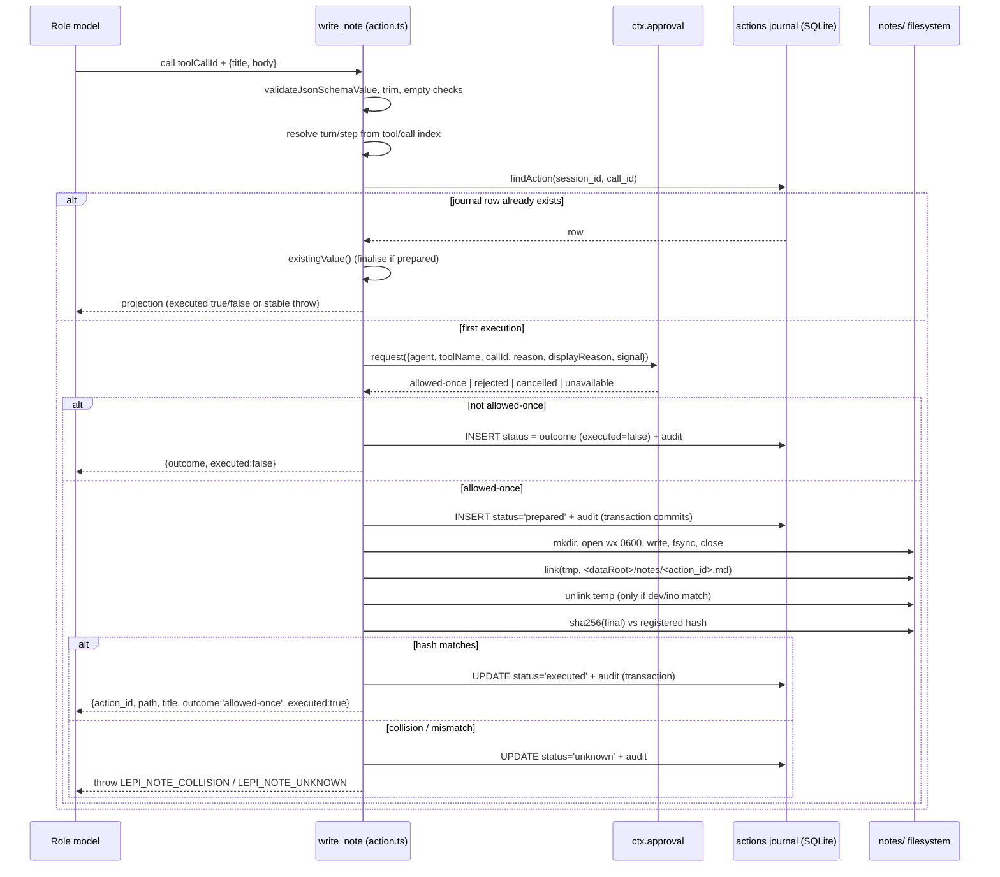

# Action

This document covers Lepimemory's action capability layer: the tools the plugin registers on `ctx.tools`, the `action_id` journal in the `actions` table, the atomic write-and-verify protocol used for real filesystem side effects, its approval integration, and how action outcomes flow back to the model, the panel, the state machine, and the memory data path. Read it if you are adding a second action tool, changing the journal protocol, or tracing why an action did or did not count as a success.

## Language versus behaviour

The character model produces language. Actions are the only way it can change the world outside the conversation, and `dsh/plugins/dsh-lepimemory-state/src/action.ts` treats them as a separate, auditable capability:

- Every call gets its own `action_id` and a journal row before any I/O, so a crash cannot leave an unattributable file.
- The final file path is *derived*, never taken from the model or the tool arguments.
- A success is only ever claimed after the file on disk has been hashed and matched against the registered hash; everything else becomes a stable error.
- Approval denials are recorded as themselves — `rejected`, `cancelled`, `unavailable` — with `executed=false`, because `审批 rejected/cancelled/unavailable 记录**真实 outcome**（executed=false），不造成功经历` (`action.ts:12`).

The scope note in the header is explicit about blast radius: `副作用落在**插件自有目录**，不越权写用户项目` (`action.ts:5`). The deployment profile matches this — the lepimemory agent preset deliberately ships no shell/filesystem tooling, and the only side-effecting tool is this plugin's (`dsh/profiles/lepimemory/cordis.patch.yml`, section 2).

## Tools registered on `ctx.tools`

Two model-facing tools exist in total. `write_note` is registered by `installAction()` in `action.ts`; `manage_memory` is registered by the plugin entry point from the control facade and is documented in [Control](./CONTROL.md).

| Tool | Registered by | What it does | Side effect |
| --- | --- | --- | --- |
| `write_note` | `installAction()` → `tools.register({...})`, labelled `lepimemory.write_note()` (`action.ts:573-577`) | Writes a real note file after approval | Creates `<dataRoot>/notes/<action_id>.md` |
| `manage_memory` | `index.ts` → `ctx.tools.register(control.tool)`, labelled `lepimemory.manage_memory` (`index.ts:277-280`) | Turns a real user turn's memory operation into a request row | No filesystem effect; see [Control](./CONTROL.md) |

`write_note`'s model-facing description is quoted verbatim in the descriptor:

```ts
// action.ts:577-581
description:
  '把一段文字写成一张真实便条（落盘为文件）。执行前会请求用户确认。当用户明确要你“记下来/写下来/记一张便条”时调用。',
parameters: NOTE_ARGS_SCHEMA,
```

Its JSON schemas are private constants in `action.ts`, deliberately minimal and closed:

| Schema | Shape | Notes |
| --- | --- | --- |
| `NOTE_ARGS_SCHEMA` (`action.ts:55-64`) | `{ title: string, body: string }`, both required, `additionalProperties: false` | Re-validated locally with `validateJsonSchemaValue`; no argument repair is performed at all (`仅用于本地复核，不做任何 String(...) 修补`) |
| `NOTE_OUTPUT_SCHEMA` (`action.ts:66-75`) | `{ action_id, path, title, outcome, executed }`, all required | `executed` is a boolean, `outcome` a string from the closed outcome set |

`installAction()` is a no-op unless all prerequisites exist (`action.ts:530-543`): it returns early when `config?.action?.enabled === false`, when `ctx.tools.register` is unavailable, or when `store.transaction` / `dataRoot` are missing. `index.ts` passes its `config` object through an explicit cast (`config as unknown as Parameters<typeof installAction>[1]`), and `resolveConfig()` in `config.ts` declares no `action` field at all — so with the shipped profile the `action.enabled` switch is never triggered. [INFERENCE] The guard exists as a defensive seam for embedders; there is currently no env var or config key that disables the tool.

## Identity binding

An action row's primary identity is `(session_id, call_id)`, which the `actions` table enforces as `UNIQUE(session_id,call_id)` (`store.ts:115-118`). The turn and step are recorded too, because they are what the state runtime and the operator UI need, and they must never be guessed.

`installAction()` subscribes to the native `session/event` feed and indexes only its own tool:

```ts
// action.ts:552-565 (abridged)
if (event.type === 'tool/call' && event.data?.name === ACTION_TOOL) {
  byCall.set(String(event.data.callId), { turn: event.data.turn, step: event.data.step });
} else if (event.type === 'turn/end') {
  callIndex.delete(sid);
}
```

At execute time the identity is looked up by the exact `(sessionId, callId)`; if it is missing, or `turn`/`step` are not positive safe integers, the tool throws `LEPI_ACTION_IDENTITY` (`action.ts:603-619`). The header states the intent: `执行时按精确 (sessionId, callId) 取真实 turn/step（必须为正整数），否则抛 LEPI_ACTION_IDENTITY，绝不猜旧 step` (`action.ts:19-22`).

Arguments are validated before identity, and empty content is rejected separately: schema violations throw `LEPI_NOTE_INVALID`, and `title.trim()`/`body.trim()` being empty throws `LEPI_NOTE_EMPTY` (`action.ts:588-593`).

## The `action_id` journal lifecycle

The `actions` row is the single source of truth about what happened. Its status column is constrained to the closed set from `shared/domain.ts` (`ActionStatus`):

```sql
-- store.ts:112-118
CREATE TABLE actions (
    action_id TEXT PRIMARY KEY, session_id TEXT NOT NULL, turn INTEGER, step INTEGER,
    call_id TEXT NOT NULL, title TEXT, path TEXT, temp_path TEXT, body_hash TEXT,
    status TEXT NOT NULL CHECK(status IN ('prepared','executed','rejected','cancelled','unavailable','failed','unknown')),
    error_code TEXT, state_applied INTEGER NOT NULL DEFAULT 0 CHECK(state_applied IN (0,1)),
    UNIQUE(session_id,call_id)
);
```

| Status | Meaning | Written by | `executed` reported to the model |
| --- | --- | --- | --- |
| `prepared` | Journal row exists; the outcome is not yet proven | `insertPrepared()` (`action.ts:298-334`) | — (never returned as output; a re-entrant call finalises it first) |
| `executed` | Final file hash matched the registered hash | `markExecuted()` (`action.ts:371-396`) | `true` |
| `rejected` / `cancelled` / `unavailable` | The approval path produced that outcome; nothing was written | `recordTerminal()` (`action.ts:335-370`) | `false` |
| `failed` | Provably nothing landed (I/O failed before `link()`) | `markFailed()` (`action.ts:424-449`) | Throws `LEPI_NOTE_WRITE_FAILED` |
| `unknown` | Success cannot be proven (collision, hash mismatch, audit not committed, unresolved recovery) | `markUnknown()` (`action.ts:397-423`) | Throws `LEPI_NOTE_UNKNOWN`/`LEPI_NOTE_COLLISION` |

The ordering rule is that **the journal transaction commits before I/O, and the I/O happens strictly outside the transaction**. `insertPrepared()` is a `store.transaction()` that inserts the row *and* writes an `action`/`prepared` audit event, with the rationale in its own comment: `登记 prepared 行 + audit（I/O 之前，以便崩溃可对账）` (`action.ts:297`). `markExecuted()` is a second, later transaction. Filesystem calls never appear inside a `store.transaction()` callback — which is also enforced structurally, since `Store.transaction()` rejects `AsyncFunction` callbacks and any thenable result (`store.ts:388-397`).

Re-entrancy is handled in two places:

1. Before doing anything, `findAction(store, sessionId, callId)` short-circuits: if a row exists, `existingValue()` projects it instead of re-executing (`action.ts:621-622`).
2. If the insert races and hits the unique constraint, `isUniqueViolation(error)` triggers a re-read and the same projection (`action.ts:700-705`).

`existingValue()` (`action.ts:497-514`) is the projection that keeps a replayed call honest: `prepared` is finalised on the spot, `executed` returns `outcome: 'allowed-once', executed: true`, the three terminal approval outcomes return `executed: false` with an empty `path`, and anything else throws — `LEPI_NOTE_COLLISION` when the row's `error_code` says so, otherwise `LEPI_NOTE_UNKNOWN`.

## Atomicity and verification protocol

Once approval is granted, the file write is a fixed sequence designed so that a crash at any point leaves either no file or a file that recovery can verify:

1. `fs.mkdirSync(path.dirname(final), { recursive: true, mode: 0o700 })` — the notes directory is created 0700.
2. Temp file: `fs.openSync(temp, 'wx', 0o600)` where `temp = path.join(dirname(final), '.' + actionId + '.' + randomUUID() + '.tmp')`. The `wx` flag fails rather than truncating, and the content itself is `# ${title}\n\n${body}\n` (`noteContent()`, `action.ts:250-252`).
3. Record the temp file's ownership: `fs.fstatSync(fd, { bigint: true })` into `{ dev, ino }`.
4. `fs.writeSync(fd, content)` then `fs.fsyncSync(fd)`, then close.
5. `fs.linkSync(temp, final)` — a hard link creates the final name atomically and **never overwrites**: if the target exists the call fails with `EEXIST`, which is mapped to `markUnknown(..., 'LEPI_NOTE_COLLISION')` plus a thrown `LEPI_NOTE_COLLISION` (`碰撞（EEXIST）**绝不覆盖、绝不宣称成功**`, `action.ts:9-10`).
6. Delete the temp file only if it is provably ours: `removeOwnTemp()` re-stats and compares `dev`/`ino` before unlinking, and silently gives up otherwise (`只删除确实由本调用创建、且未被替换的临时文件`, `action.ts:270-280`).
7. Verify before committing: `hashFile(final) === hash` where `hash = sha256hex(Buffer.from(content, 'utf8'))`. A mismatch becomes `markUnknown(..., 'LEPI_NOTE_UNKNOWN')` and a thrown error — the row is never promoted to `executed` on faith.
8. Only then `markExecuted(store, prepared, false)` writes `status='executed', path=?, temp_path=NULL` and the audit event. If that transaction itself fails, the code deliberately leaves the row in `prepared` for recovery and still reports unknown: `A real file exists but the execution audit did not commit: keep prepared for recovery and report unknown, never a false failure` (`action.ts:729-735`).

`exactNotePath(dataRoot, actionId)` (`action.ts:258-262`) is the reason the path is trustworthy: it returns a path only when `dataRoot` is a non-empty string and `actionId` matches `UUID_RE`, and it is the only source of both the write target and the read/verify target.



## Approval integration

Approval is resolved through the optional host service, looked up by name: `const approver = ctx.get ? ctx.get('approval') : undefined` (`action.ts:634`). If the service is missing or has no `request` function, the outcome is `unavailable` with `code = LEPI_APPROVAL_UNAVAILABLE` — nothing is written. The request payload is:

```ts
// action.ts:641-651
outcome = await approver.request({
  agent: exec.agent,
  toolName: ACTION_TOOL,
  callId: exec.callId,
  reason: `写一张便条：${title}`,
  displayReason: {
    zh: `写一张便条：${title}`,
    en: `Write a note titled "${title}".`,
  },
  ...(exec.signal ? { signal: exec.signal } : {}),
});
```

The host service's outcome vocabulary is closed and identical to what this plugin accepts: `["allowed-once", "rejected", "cancelled", "unavailable"]`, with `'allowed-once'` documented as the only grant (`dsh-user-approval/lib/index.js:29-35, 124`).

| Outcome | Journal row | Returned value | Reason for that shape |
| --- | --- | --- | --- |
| `allowed-once` | `prepared` → later `executed` (or `failed`/`unknown`) | `executed: true` only after hash verification | A grant is scoped to one call, never reusable |
| `rejected` | `rejected`, `executed=false` | `用户拒绝了，未写便条。` | Records the real user decision; no fake experience |
| `cancelled` | `cancelled`, `executed=false` | `便条写入已取消。` | Also used when `exec.signal` was already aborted before/after approval |
| `unavailable` | `unavailable`, `executed=false`, `code=LEPI_APPROVAL_UNAVAILABLE` | `没有可用的确认通道，未写便条。` | Missing answerer fails closed instead of auto-approving |
| anything else | `unavailable` + `LEPI_APPROVAL_UNAVAILABLE` | same as above | An unrecognised approval string is never treated as consent |
| a thrown approval error | `unavailable` + `LEPI_APPROVAL_UNAVAILABLE` | same as above | Fail closed |

There are two abort checkpoints — before asking for approval and again after it — both of which record `cancelled` (`action.ts:626-629`, `672-675`).

The tool's *normal output* set is deliberately closed: `ACTION_OUTCOMES = new Set(['allowed-once', 'rejected', 'cancelled', 'unavailable'])` (`action.ts:41`), with the header explaining that any other truth is surfaced through the journal plus a stable thrown code `真正的 unknown 通过 journal + 抛错呈现` (`action.ts:13-14`). The reason this matters is that a model that receives a success-shaped result will treat the action as a lived experience; an unprovable state therefore becomes an error, never a plausible success.

Rendering is gated on `executed`, not on `path` being present:

```ts
// action.ts:220-236
function renderNote(value: NoteValue): string {
  if (value?.executed === true && typeof value.path === 'string' && value.path) {
    return `已写下便条《${value.title}》→ ${value.path}`;
  }
  ...
}
```

## Error codes

All stable action error codes live in `ACTION_ERRORS` (`action.ts:44-52`) plus the identity guard.

| Code | Thrown when | Journal state left behind |
| --- | --- | --- |
| `LEPI_NOTE_EMPTY` | `title` or `body` is empty after `trim()` | none (rejected before any row) |
| `LEPI_NOTE_INVALID` | Arguments fail `validateJsonSchemaValue` | none |
| `LEPI_ACTION_IDENTITY` | Missing `sessionId`/`callId`, or the observed `turn`/`step` are absent or not positive integers | none |
| `LEPI_APPROVAL_UNAVAILABLE` | No `approval` service, no `request`, a thrown approval error, or an unknown approval string | `unavailable` row with this `error_code` |
| `LEPI_NOTE_WRITE_FAILED` | Any filesystem error other than `EEXIST` during mkdir/open/write/fsync/link, or the prepared insert failing for a non-unique reason | `failed` row with this `error_code` |
| `LEPI_NOTE_COLLISION` | `link()` failed with `EEXIST` (final name already taken) | `unknown` row with `error_code='LEPI_NOTE_COLLISION'` |
| `LEPI_NOTE_UNKNOWN` | Final-file hash mismatch, execution audit not committed, or recovery that cannot prove success | `unknown` row |

`ActionError` is a plain `Error` subclass carrying `code` (`action.ts:81-88`), mirroring the `StoreError`/`ProcessorError`/`ContractError` pattern used elsewhere in the plugin.

## Where side effects land

The only write target is the plugin's own data directory:

```ts
// action.ts:263-267
if (typeof dataRoot !== 'string' || !dataRoot) return null;
if (typeof actionId !== 'string' || !UUID_RE.test(actionId)) return null;
return path.join(dataRoot, 'notes', `${actionId}.md`);
```

`dataRoot` is resolved once at plugin construction: `expandHome(options.dataRoot ?? path.join(config.home.dshHome, 'lepimemory'))` (`index.ts:142`), and the deployment profile sets `dataRoot: dshHomePath('lepimemory')` (`dsh/profiles/lepimemory/cordis.patch.yml`). File mode is `0o600`, directory mode `0o700`. Because the file name is the server-generated UUID, a model-chosen title can never influence a path.

## Crash recovery

Two layers of reconciliation exist and they are independent:

- **File layer** — `recoverActions({ store, dataRoot })` (`action.ts:476-489`) scans all rows with `status='prepared'` and calls `finalizePrepared()` on each. That function only promotes a row when the expected path is exactly `exactNotePath(dataRoot, row.action_id)`, `row.path` matches it, `body_hash` is a 64-char string, and the current file's hash equals it; then it calls `markExecuted(..., recovered=true)`. Otherwise the row becomes `unknown`. It never rewrites a file and never deletes a temp file it cannot prove ownership of (`不读/删任何非精确推导出的路径，不清理临时文件（无持久所有权证明）`, `action.ts:470-472`). `installAction()` calls this at install time, logging `lepimemory-action: 遗留行动对账失败` on failure (`action.ts:544-549`).
- **State layer** — `state.reconcileActions()` (`index.ts:286`) joins `actions` against `settled_turns` for `status='executed' AND state_applied=0` and replays the missed success exactly once. That logic is documented in [State and emotion](./STATE-AND-EMOTION.md).

## Receipts, notices, and downstream observation

The tool result is not the only record; three independent projections exist.

**Persistent presentation meta.** The descriptor's `presentationMeta` writes the durable fact onto the tool result:

```ts
// action.ts:585-591
presentationMeta: (_args: unknown, val: NoteValue) => ({
  kind: META_KIND,            // 'lepimemory-action'
  action_id: val.action_id,
  outcome: val.outcome,
  executed: val.executed,
  path: val.path,
}),
```

`toolResultInfo(message, meta)` (`action.ts:192-197`) is the reader for that projection: it returns `{ callId, isError, metadata }` where `metadata` comes from `normalizeMeta()`. `normalizeMeta()` (`action.ts:202-219`) is strict and returns `null` for anything malformed — wrong `kind`, empty `action_id`, an `outcome` outside `ACTION_OUTCOMES`, non-boolean `executed`, non-string `path`. The header is explicit that this must not be conflated with the host's error flag: `toolResultInfo(message, meta) 只依据 journal/meta 事实判定成功，不拿 isError === false 当成功` (`action.ts:17`). Note that in this repository `toolResultInfo` is currently exercised only by `test/action.test.js`; no production module imports it. [INFERENCE] It is a public seam for the host/UI to consume rather than an internal consumer.

**Audit rows.** Every journal transition also writes an `audit` row with `type='action'` and `status` equal to the journal status (`prepared`, `executed`, `rejected`, `cancelled`, `unavailable`, `failed`, `unknown`), carrying `action_id`, `outcome`, `executed`, `hash`, and — for `executed` — `recovered` (`action.ts:317-333`, `378-395`). `action` is one of the eight history kinds the store projects (`store.ts:16-24`) and one of the eight panel tabs (`client/constants.ts:31-37`). See [Observability](./OBSERVABILITY.md) and [UI](./UI.md).

**Memory and state feed-in.** An executed action becomes a *verified* evidence source, not a model claim: `evidence.ts` records `actor='action' / kind='verified_action'` only when the `actions` table has `(session_id, call_id)` with `status='executed'` (`evidence.ts:15-17`, `evidence.ts:52`). From there:

- The extractor may only build an `origin: 'action'` candidate if at least one source is `actor='action' AND kind='verified_action'` (`contracts.ts:31`, `VERIFIED_ACTION_KIND` at `contracts.ts:149`).
- Recall maps that origin to the `experience` trust level, which does not decay (`trust.ts:4-8`, `TRUST.EXPERIENCE`).
- The state machine counts `status='executed' AND state_applied=0` rows as `actionSuccesses` for the round, which is what fires `action.success.brighten`.

The common thread is that every one of these paths keys off the journal status `executed`, never off the tool result text or the host's `isError` flag.

## Related documents

- [State and emotion](./STATE-AND-EMOTION.md) — how action successes enter the state machine and how late ones are recovered.
- [Control](./CONTROL.md) — the other registered tool, `manage_memory`, and its approval-question flow.
- [Memory](./MEMORY.md) — how executed actions become `verified_action` evidence and memory candidates.
- [Observability](./OBSERVABILITY.md) — audit kinds, `actions` journal projection, and recovery auditing.
- [UI](./UI.md) — the action tab and how a pending approval is surfaced.
- [Configuration](./CONFIGURATION.md) — `dataRoot`, `databaseFile`, and the pinned Node/dsh versions asserted by `assertRuntime()`.
- [Troubleshooting](./TROUBLESHOOTING.md) — symptom-to-cause lookup for `LEPI_NOTE_*` failures.
