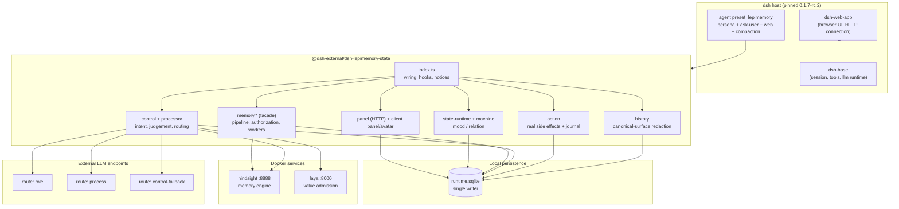
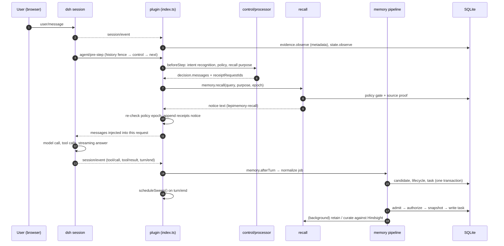

# Architecture

This document is the map of Lepimemory: what the system is made of, which component owns which decision, and how a single user turn travels through it. Read it first; every other document in `docs/` expands one box of the diagrams below.

If you are here to run the system, start with [RUNTIME.md](./RUNTIME.md) and [CONFIGURATION.md](./CONFIGURATION.md). If you want to understand the memory model, read [MEMORY.md](./MEMORY.md) and [RECALL.md](./RECALL.md) after this document.

## What Lepimemory is

Lepimemory is a character Agent, not a coding assistant. It is built for the Geek Tech Club second-round interview challenge ([`CHALLENGE.md`](../CHALLENGE.md)): *design and implement an intelligent character Agent with persistent state, personality, memory and action capabilities*.

Concretely, the system is:

- **A profile on DeepSeek Harness (`dsh`).** dsh is a Cordis-based plugin host. Lepimemory installs one profile (`dsh/profiles/lepimemory`) that composes an agent preset with the project's own plugin.
- **One plugin that implements the character kernel.** `@dsh-external/dsh-lepimemory-state` (`dsh/plugins/dsh-lepimemory-state`) owns state, memory, control, actions, history and the operator panel.
- **Two local services behind it.** `hindsight` is the long-term memory engine (retrieval, raw storage, remote curation); `laya` scores how much a candidate memory is worth keeping. Both are Docker services defined in `docker-compose.yml`.
- **One SQLite database as the local source of truth.** `<DSH_HOME>/lepimemory/runtime.sqlite` holds state, memory lifecycle, tasks, evidence metadata, actions and the audit ledger.

The project deliberately does *not* treat memory as "chat log plus vector search". It treats memory as a lifecycle with admission, authorisation, versioning, supersession, forgetting and verifiable receipts — see [MEMORY.md](./MEMORY.md).

## Layer map

Reading the map: the plugin is a single process-wide object graph created inside `apply()` in `dsh/plugins/dsh-lepimemory-state/src/index.ts`. Each subsystem keeps a narrow ownership boundary, and every one of them ultimately reads and writes through the same `Store`.

## The subsystem contract

| Subsystem | Owner module(s) | Owns | Must not |
| --- | --- | --- | --- |
| Wiring | `src/index.ts` | Service injection, hook order, notice rendering, disposal | Contain business rules |
| State | `src/state-runtime.ts`, `src/machine.ts`, `src/shared/state.ts` | Mood/relation values, decay, rule-driven deltas, prompt section text | Read model prose as state input, re-enter `session.append` |
| Evidence | `src/evidence.ts` | Session-sourced citations (metadata only, no bodies on disk) | Store message text, keep shadowed content alive |
| Memory pipeline | `src/memory-pipeline.ts`, `src/admission.ts`, `src/memory-authorization.ts`, `src/candidate-store.ts`, `src/task-store.ts` | Candidate value judgement, authorisation, atomic commit, task queue | Touch the network inline, commit partial candidate state |
| Remote workers | `src/write-worker.ts`, `src/curate-worker.ts` | Retain/curate jobs against Hindsight, receipts only with proof | Blind-retry writes, claim success without verification |
| Scheduler | `src/memory-supervisor.ts`, `src/memory.ts` | Single tick, job slots, leases, facade | Be imported by the pipeline (keeps the import graph acyclic) |
| Recall | `src/recall.ts`, `src/recall-source.ts`, `src/hindsight.ts` | Query, policy gate, source re-binding, injection text | Inject unverified or forgotten content |
| Control | `src/control.ts`, `src/processor.ts`, `src/contracts.ts` | Turning real user intent into memory operations, structured model judgement | Persist model free text as a reason, authorise from non-user sources |
| Action | `src/action.ts` | Tools with real side effects, approval, journal, hash verification | Claim success without a verified file |
| History | `src/history.ts` | Redacting the live session surface after a forget request | Rewrite the canonical log, resurrect shadowed content |
| Observability | `src/store.ts`, `src/panel.ts`, `src/client/**` | Schema, audit ledger, read-only HTTP projections, operator UI | Read data before authentication, expose private bodies without consent |

## The life of one turn

Every turn passes through the same four hook points. This is the whole runtime loop; everything else is a detail of one of the boxes.

Two ordering rules in that loop are load-bearing:

1. **The fence runs first.** `agent/pre-step` is registered with `{ prepend: true }` and calls `history.beforeStep(...)` outermost, then `control.beforeStep(...)`, and only then `next()`. A rejected request consumes the turn without submitting the user message, which is what makes "forget this" actually stop subsequent use of the content.
2. **Recall is injected as a notice, not as user speech.** Recalled text arrives as a `lepimemory-recall` message with `form: 'notice'`, so it can inform the answer without ever being counted as a user utterance that could authorise a new memory operation.

## Design principles

These are the rules the code is written to. When a change would break one of them, that is a design decision, not a refactor.

### Fail closed, never invent

- A missing LLM connection is a state, not an error to paper over: with no `LEPI_LLM_BASE_URL`/`LEPI_LLM_API_KEY` pair the runtime starts read-only and **never** falls back to a default public endpoint. Half-configured pairs raise `LEPI_CONNECTION_INCOMPLETE` (`src/config.ts`).
- Unavailable backends defer work instead of guessing: admission returns `defer` when Laya is unreachable or clipping evidence is missing (`src/admission.ts`), and the control plane surfaces `LEPI_CONTROL_UNAVAILABLE` rather than a fabricated judgement (`src/processor.ts`).
- Any abort, epoch mismatch or missing source proof returns a stable error code with no content, before any network call and again after every `await` (`src/recall-source.ts`, `src/trust.ts`).

### One writer per table

The SQLite schema is owned table-by-table: `candidate-store.ts` writes `snapshots`/`lifecycle`, `task-store.ts` writes `tasks`, `action.ts` writes `actions`, `store.ts` itself owns `audit`, `meta`, `state` and the read projections. Modules that need data from another owner call that owner instead of issuing SQL. Transaction boundaries stay with the caller, so a candidate's snapshot, lifecycle row, task and audit row commit together or not at all.

### Model text is never truth

- The state machine consumes **structural facts only** — did the user speak, did a tool fail — and never parses assistant prose (`src/machine.ts`).
- Model output for memory work is validated against closed schemas and closed reason dictionaries before use; anything outside the dictionary is dropped rather than persisted (`src/contracts.ts`).
- Facts, experiences and inferences are separated by trust tier, and only snapshot-bound candidates can become facts (`src/trust.ts`).

### Language and behaviour are different things

"I wrote you a note" and "a file named `<action_id>.md` exists" are separate claims. The action layer writes a `prepared` row before doing I/O, creates the file atomically, verifies the final hash, and only then commits `executed` in the same transaction as the audit (`src/action.ts`). Receipts shown to the character are derived from the ledger, never from the model's own narration.

### Observability is a first-class output

Every subsystem writes audit rows with real session/turn/step/call identity, and the operator panel projects them read-only over authenticated HTTP. Given a bad answer, you can reconstruct which evidence was cited, which candidate was authorised, which task ran and what the character's state was at the time. See [OBSERVABILITY.md](./OBSERVABILITY.md).

### Shared code must be browser-safe

Anything under `src/shared/` imports no `node:` builtins, so the same definitions serve the host runtime and the browser bundle: `domain.ts` (vocabulary), `state.ts` (state shape and rendering), `api.ts` (HTTP DTOs), `activity.ts` (what the character is doing right now), `avatar-assets.ts` / `avatar-frames.ts` (立绘 mapping). The client never re-implements them.

## Runtime boundaries

| Boundary | Rule | Where enforced |
| --- | --- | --- |
| Toolchain | Pinned Node `v24.20.0`, pnpm `10.28.2`, dsh `0.1.7-rc.2` | `src/shared/pins.ts`, checked at boot by `assertRuntime()` in `src/index.ts` and by the launcher |
| Build | Hand-written sources compile to generated artifacts; generated files are never edited | `scripts/build.mts` (tsc for server, esbuild for the client bundle) |
| Data | One SQLite file per `DSH_HOME`, one live owner; a second concurrent supervisor is refused | `openStore()` → `LEPI_STORE_OWNED` |
| Services | Hindsight and Laya are reached over loopback HTTP only; credentials never default | `docker-compose.yml` (ports bound to `127.0.0.1`), `src/hindsight.ts` |
| Credentials | Resolved once per process into explicit routes, never written back to user files | `src/config.ts` `resolveConfig()` / `applyDerivedEnv()` |

## Where the challenge is answered

The mapping from the interview levels (Lv1 continuity and emotion, Lv2 memory and action, Lv2.5 storyline, Lv3 avatar, Lv4 realtime) to actual modules is tracked in [CHALLENGE-MAPPING.md](./CHALLENGE-MAPPING.md), including the parts that are deliberately not implemented.

## Current limits

The README is explicit that this is a demo-grade system, and the architecture should be read the same way:

- The home is single-user, single-role. Concurrent operators against one `DSH_HOME` are refused rather than merged.
- Hindsight and Laya are required for the full memory loop; with them unavailable the system stays observable but defers writes instead of failing loudly.
- Some behaviour is tuned for the demo (admission thresholds, avatar frame choices, persona text in `dsh/profiles/lepimemory/cordis.patch.yml`) and is expected to be revised rather than treated as calibrated.
- The character's voice is Chinese-first; the browser panel ships both Chinese and English locales (`src/client/locales.ts`).

## Related documents

- [PROJECT-STRUCTURE.md](./PROJECT-STRUCTURE.md) — every directory and module with its responsibility
- [RUNTIME.md](./RUNTIME.md) — toolchain, build pipeline, launcher, `make` targets
- [CONFIGURATION.md](./CONFIGURATION.md) — the complete `LEPI_*` reference
- [DEPLOYMENT.md](./DEPLOYMENT.md) — Hindsight and Laya containers
- [MEMORY.md](./MEMORY.md) / [RECALL.md](./RECALL.md) — the write and read halves of memory
- [STATE-AND-EMOTION.md](./STATE-AND-EMOTION.md) — the character's internal state
- [ACTION.md](./ACTION.md) — real side effects and the language/behaviour split
- [CONTROL.md](./CONTROL.md) — intent recognition, model routes and structured judgement
- [OBSERVABILITY.md](./OBSERVABILITY.md) / [UI.md](./UI.md) — ledger, panel and browser surface
- [TESTING.md](./TESTING.md) / [DEVELOPMENT.md](./DEVELOPMENT.md) / [TROUBLESHOOTING.md](./TROUBLESHOOTING.md) — verification, workflow, failure modes
- [GLOSSARY.md](./GLOSSARY.md) — the vocabulary used across these documents
