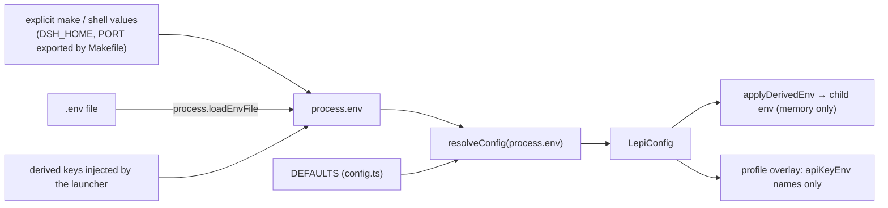

# Configuration

This document is the complete reference for Lepimemory's configuration surface: where values come from, how `.env` is loaded and migrated, the fail-closed connection rules, every `LEPI_*` variable with its type and default, the plugin defaults in `DEFAULTS`, and the dsh-level settings (`DSH_HOME`, `PORT`, the LLM provider switch). Read it when preparing a `.env`, changing a threshold, or interpreting a startup error code.

All configuration is resolved by one module: `dsh/plugins/dsh-lepimemory-state/src/config.ts`. Its exported entry points are `resolveConfig()`, `loadEnvFile()`, `migrateLegacyEnv()`, `applyDerivedEnv()`, `derivedEnv()`, `redactConfig()`, `expandHome()`, plus the `DEFAULTS`, `ROUTES`, `LEGACY_BANK`, `ADMISSION_BACKENDS`, `ErrorCodes`, and `ConfigError` symbols.

## Where values come from

`resolveConfig(env = process.env)` is a **pure function**: it reads only the mapping it is given, touches no files, and writes nothing. Everything that has side effects (loading `.env`, migrating legacy keys, injecting derived values into a child process) lives in `loadEnvFile()` and `applyDerivedEnv()`.



Precedence, highest first:

1. **Values already present in the process environment.** `loadEnvFile()` snapshots `process.env` before calling `process.loadEnvFile(file)` and writes the preserved entries back afterwards, so a file value can never overwrite an exported one.
2. **Values from the `.env` file** (if it exists).
3. **`DEFAULTS` in `config.ts`** for anything still empty.

A blank value is treated as unset for every optional field: `readString()` trims, and empty strings fall through to the default or to "inherited from the shared group".

## `.env` loading semantics

`loadEnvFile()` is called by the launcher (`scripts/src/runtime.ts` `loadResolvedConfig()`) for the `install` and `dev` subcommands, and only there. The plugin itself does **not** read `.env` at runtime — `dsh/plugins/dsh-lepimemory-state/src/index.ts` calls `resolveConfig()` on the environment the launcher handed it. Anything that boots dsh without the launcher therefore sees only real process environment variables.

| Step | Behavior |
| --- | --- |
| File selection | explicit argument, else `LEPI_ENV_FILE` (trimmed), else `<repo>/.env` |
| Migration | `migrateLegacyEnv()` runs first when `migrate: true` (the launcher passes `true`) |
| Missing file | returns `loaded: false` without creating anything |
| Load | `process.loadEnvFile(file)` |
| Precedence | every key that already existed in `process.env` is restored afterwards |
| Result | `{ file, loaded, migrated, backupPath, missingFields }` |

The launcher reports the outcome: a migration prints `migrated legacy .env; backup written to <path>`, and each unresolved connection field prints `missing <FIELD>: add it to <file>; no endpoint is guessed`.

### Derived values stay in memory

`derivedEnv(config)` produces the resolved per-route credentials under stable env names:

| Derived key | Value |
| --- | --- |
| `LEPI_ROLE_API_KEY`, `LEPI_ROLE_BASE_URL` | resolved role route |
| `LEPI_PROCESS_API_KEY`, `LEPI_PROCESS_BASE_URL` | resolved process route |
| `LEPI_CONTROL_FALLBACK_API_KEY`, `LEPI_CONTROL_FALLBACK_BASE_URL` | resolved control-fallback route |
| `LEPI_HINDSIGHT_API_KEY`, `LEPI_HINDSIGHT_BASE_URL` | resolved Hindsight route |

These are exactly the names the generated profile references through `apiKeyEnv`, so credentials reach the model providers as environment values and are **never written to the profile, the `.env` file, or a log**. `applyDerivedEnv(env, config)` assigns them into a target mapping (the launcher builds the dsh child env; the plugin re-applies them to `process.env` at boot). Because a derived pair is always written as a complete pair — both members, possibly both empty — a second `resolveConfig()` inside the child cannot trip the incomplete-connection rule.

Logging uses `redactConfig(config)`, which replaces every API key with `***` (or `''` when empty) and keeps everything else. The launcher prints it only when `LEPI_RUNTIME_DEBUG=1`.

### Legacy migration

`migrateLegacyEnv()` rewrites a pre-v2 `.env` once. Any line matching `^\s*(?:export\s+)?([A-Za-z_][A-Za-z0-9_]*)\s*=` is inspected by key name.

| Legacy key | Action |
| --- | --- |
| `GEEK_TECH_CLUB_API_KEY` | renamed to `LEPI_LLM_API_KEY`, value preserved; an existing `LEPI_LLM_BASE_URL` is left alone |
| `HINDSIGHT_API_LLM_BASE_URL` | renamed to `LEPI_HINDSIGHT_BASE_URL` |
| `HINDSIGHT_API_LLM_API_KEY` | renamed to `LEPI_HINDSIGHT_API_KEY` |
| `HINDSIGHT_API_LLM_MODEL` | renamed to `LEPI_HINDSIGHT_MODEL` |
| `HINDSIGHT_API_LLM_PROVIDER` | deleted (the new schema has no equivalent) |

Rules that matter operationally:

- **Idempotent.** If none of the legacy key names is present, the file is not touched and no backup is made.
- **Backup first.** The original text is written to `<file>.legacy-<ISO timestamp with ':' and '.' replaced by '-'>` with mode `0600` and `flag: 'wx'` (never overwriting an existing backup); a numeric suffix is appended if that path is taken. The backup contains the secret values by design and is gitignored via `.env.legacy*`.
- **No duplicates.** If the destination key already exists in the file, the legacy line is dropped rather than producing two assignments.
- **Missing endpoints are reported, not guessed.** If `LEPI_LLM_API_KEY` ends up present without `LEPI_LLM_BASE_URL`, the field name is added to `missingFields`; likewise for `LEPI_HINDSIGHT_API_KEY` without `LEPI_HINDSIGHT_BASE_URL`.
- **Legacy aliases are not supported in normal resolution.** After migration the old names are gone, and `resolveConfig()` only reads the `LEPI_*` schema below.

The repository currently contains one such backup (`.env.legacy-2026-10-05T03-11-01-514Z`), documenting a real migration of the legacy `HINDSIGHT_API_LLM_*`/`GEEK_TECH_CLUB_API_KEY` keys.

## Fail-closed connection rules

The connection model is one shared OpenAI-compatible connection plus four routes that either inherit it or override it as a complete pair.

| Situation | Result |
| --- | --- |
| `LEPI_LLM_BASE_URL` and `LEPI_LLM_API_KEY` both empty | shared connection unconfigured; **no default endpoint is ever assumed** |
| exactly one of the two set | `LEPI_CONNECTION_INCOMPLETE`, field = the missing member |
| a route's `*_BASE_URL` and `*_API_KEY` both empty | inherits the shared group (`source: 'shared'`, or `'unconfigured'`) |
| exactly one of a route's pair set | `LEPI_CONNECTION_INCOMPLETE`, field = the missing member ("override must set both base URL and API key") |
| both set on a route | `source: 'override'`, `configured: true` |

`LepiConfig.configured` is defined as **the role route's** `configured` flag. The rest of the system keys off it:

- The launcher's profile overlay emits `llm-pi-ai` providers only when configured; when unconfigured it emits `providers: {}`, which both refuses any custom route and neutralises the draft profile's stale official-URL fallback.
- Laya is an independent local service: `LEPI_LAYA_API_KEY` is its own service token and is **not** inherited from the shared cloud connection (`services.laya.configured` is simply `apiKey !== ''`).

## Environment variable reference

### Shared connection and per-route overrides

| Variable | Type / default | Meaning |
| --- | --- | --- |
| `LEPI_LLM_BASE_URL` | string, default empty | shared OpenAI-compatible base URL |
| `LEPI_LLM_API_KEY` | string, default empty | shared API key; both members must be set together |
| `LEPI_ROLE_BASE_URL` / `LEPI_ROLE_API_KEY` | string, inherit shared | override for the character's main model route (`apiKeyEnv` = `LEPI_ROLE_API_KEY`) |
| `LEPI_PROCESS_BASE_URL` / `LEPI_PROCESS_API_KEY` | string, inherit shared | override for the processing route used by evidence/processing calls |
| `LEPI_CONTROL_FALLBACK_BASE_URL` / `LEPI_CONTROL_FALLBACK_API_KEY` | string, inherit shared | override for the bounded fallback control route |
| `LEPI_HINDSIGHT_BASE_URL` / `LEPI_HINDSIGHT_API_KEY` | string, inherit shared | override for the LLM connection Hindsight itself uses; also sent to the `hindsight` container as `HINDSIGHT_API_LLM_BASE_URL`/`_API_KEY` |

Each pair is all-or-nothing. There is no partial inheritance, and no route has a default URL.

### Models

| Variable | Type / default | Meaning |
| --- | --- | --- |
| `LEPI_ROLE_MODEL` | non-empty string, `deepseek-flash` | model served on the role route; also the value written to `agent-default-model` |
| `LEPI_PROCESS_MODEL` | non-empty string, `deepseek-flash` | model on the fixed processing route |
| `LEPI_CONTROL_FALLBACK_MODEL` | non-empty string, default = resolved `LEPI_ROLE_MODEL` | fallback control model, fixed at startup; it does not follow a session's temporary model selection |
| `LEPI_HINDSIGHT_MODEL` | non-empty string, `deepseek-flash` | model for the Hindsight connection |

Blank strings mean "use the default", not "no model".

### Memory services and policy

| Variable | Type / default | Meaning |
| --- | --- | --- |
| `LEPI_HINDSIGHT_URL` | non-empty string, `http://127.0.0.1:8888` | Hindsight REST base URL used by the plugin's `HindsightClient` |
| `LEPI_LAYA_URL` | non-empty string, `http://127.0.0.1:8000` | Laya HTTP base URL |
| `LEPI_LAYA_API_KEY` | string, default empty | independent Laya service token; also passed to the container as `LAYA_API_KEY` and sent as `Authorization: Bearer …` |
| `LEPI_BANK` | string, `lepimemory-v2` | memory bank written to; the legacy value `lepimemory` is rejected |
| `LEPI_ADMISSION_BACKEND` | enum, `laya` | only `laya` or `generative`; chosen explicitly, never switched automatically at runtime |
| `LEPI_TIME_ZONE` | IANA time zone, `Asia/Shanghai` | validated with `Intl.DateTimeFormat`; a time zone stated inside a message still takes precedence |

`LEPI_BANK=lepimemory` raises `LEPI_CONFIG_INVALID` in `bankField()`. The reject is repeated defensively at service level: `HindsightClient` throws with HTTP status 409 when constructed with the legacy bank (`dsh/plugins/dsh-lepimemory-state/src/hindsight.ts`, `if (bank === 'lepimemory') throw new HindsightError(409)`), whose default is `DEFAULT_BANK = 'lepimemory-v2'`. Use a demo-specific bank such as `lepimemory-demo` for experiments so nothing lands in a real bank.

### Timeouts and TTLs

All of these are positive safe integers in milliseconds (`positiveInt`): an empty value takes the default, a non-digit value raises `expected a positive integer`, and a value that is not a safe integer in range raises `out of range`.

| Variable | Default | Meaning |
| --- | --- | --- |
| `LEPI_CONSENT_TIMEOUT_MS` | `600000` | how long a private-content consent request stays open |
| `LEPI_TASK_TTL_MS` | `604800000` | lifetime of a submitted background task |
| `LEPI_GRANT_TTL_MS` | `2592000000` | lifetime of a granted permission |
| `LEPI_INFERENCE_HALF_LIFE_MS` | `1209600000` | resolved and validated, but currently **not consumed**: the decay actually applied to inferred memory uses the hardcoded `INFERENCE_HALF_LIFE_MS = 14 days` in `dsh/plugins/dsh-lepimemory-state/src/trust.ts`, which happens to equal this default. Changing the variable today has no effect |

### Budgets and limits

| Variable | Default | Meaning |
| --- | --- | --- |
| `LEPI_CONTEXT_MAX_CHARS` | `12000` | character budget when assembling injected context |
| `LEPI_EVIDENCE_MAX_CALLS` | `4` | maximum evidence lookups per processing step |
| `LEPI_PROCESS_MAX_TOKENS` | `4096` | output token bound for processing requests |
| `LEPI_PROCESS_TIMEOUT_MS` | `30000` | processing request deadline |
| `LEPI_CONTROL_TIMEOUT_MS` | `20000` | control-fallback request deadline |

### Laya admission thresholds

`validateThresholdPair()` reads both members as finite numbers in `[0, 1]` (`unitNumber`) and then requires `reject < accept`; otherwise `LEPI_CONFIG_INVALID` is raised against the **accept** key with detail ``<REJECT_KEY> must be < <ACCEPT_KEY>``.

| Variable | Default | Pair rule |
| --- | --- | --- |
| `LEPI_LAYA_ACCEPT_DURABLE` | `0.65` | must be greater than `LEPI_LAYA_REJECT_DURABLE` |
| `LEPI_LAYA_REJECT_DURABLE` | `0.2` | strictly below the matching accept value |
| `LEPI_LAYA_ACCEPT_TRANSIENT` | `0.85` | must be greater than `LEPI_LAYA_REJECT_TRANSIENT` |
| `LEPI_LAYA_REJECT_TRANSIENT` | `0.35` | strictly below the matching accept value |

These are documented in `.env.example` as a demo starting point, not calibrated probabilities.

### Run location

| Variable | Type / default | Meaning |
| --- | --- | --- |
| `DSH_HOME` | path, default `<repo>/.dsh` | dsh state directory; `~` and `~/…` are expanded, then the path is resolved to absolute |
| `PORT` | integer in `[1, 65535]`, `3080` | dsh Web UI port; also exported to the child as `PORT` and passed as `--port` |
| `LEPI_ENV_FILE` | path | overrides the `.env` path used by `loadEnvFile()` |
| `LEPI_RUNTIME_DEBUG` | `'1'` to enable | makes launcher `install` print `redactConfig(cfg)` |

`DSH_HOME` resolution differs slightly between the two consumers, and both agree in practice: `config.ts` uses `<repo>/.dsh` when unset, while dsh itself prefers an explicitly configured path, then `$DSH_HOME`, then `~/.dsh`, treating a whitespace-only `$DSH_HOME` as unset. The launcher always passes its resolved value to the child, so the child never has to guess.

### Retrieval stack sample fields

These are deployment fields owned by the Hindsight image and the compose file; the plugin only reads them to pass them through. Do not repeat internal LLM keys here.

| Variable | Default | Consumed by |
| --- | --- | --- |
| `HINDSIGHT_API_EMBEDDINGS_LOCAL_MODEL` | `sentence-transformers/paraphrase-multilingual-MiniLM-L12-v2` | passed to the container as `HINDSIGHT_API_EMBEDDINGS_LOCAL_MODEL` |
| `HINDSIGHT_API_RERANKER_LOCAL_MODEL` | `cross-encoder/mmarco-mMiniLMv2-L12-H384-v1` | passed to the container as `HINDSIGHT_API_RERANKER_LOCAL_MODEL` |
| `HF_ENDPOINT` | `https://hf-mirror.com` | model-bake endpoint; see the resolution rule below |

`HF_ENDPOINT` is resolved by the launcher, not by the plugin: an explicit value always wins; otherwise the presence of any of `HTTPS_PROXY`, `https_proxy`, `HTTP_PROXY`, `http_proxy` selects the official `https://huggingface.co`; otherwise the configured default is used. The mirror and a proxy must not be combined — see [DEPLOYMENT.md](./DEPLOYMENT.md).

## `DEFAULTS`

`DEFAULTS` in `config.ts` is the single authoritative default source; every value in the tables above that has a default comes from it:

| Field | Default |
| --- | --- |
| `roleModel`, `processModel`, `hindsightModel` | `deepseek-flash` |
| `hindsightUrl` | `http://127.0.0.1:8888` |
| `layaUrl` | `http://127.0.0.1:8000` |
| `bank` | `lepimemory-v2` |
| `admissionBackend` | `laya` |
| `timeZone` | `Asia/Shanghai` |
| `consentTimeoutMs` | `600000` |
| `taskTtlMs` | `604800000` |
| `grantTtlMs` | `2592000000` |
| `inferenceHalfLifeMs` | `1209600000` |
| `contextMaxChars` | `12000` |
| `evidenceMaxCalls` | `4` |
| `processMaxTokens` | `4096` |
| `processTimeoutMs` | `30000` |
| `controlTimeoutMs` | `20000` |
| `acceptDurable` | `0.65` |
| `rejectDurable` | `0.2` |
| `acceptTransient` | `0.85` |
| `rejectTransient` | `0.35` |
| `port` | `3080` |
| `embeddingsLocalModel` | `sentence-transformers/paraphrase-multilingual-MiniLM-L12-v2` |
| `rerankerLocalModel` | `cross-encoder/mmarco-mMiniLMv2-L12-H384-v1` |
| `hfEndpoint` | `https://hf-mirror.com` |

`LEPI_CONTROL_FALLBACK_MODEL` is the one default not taken from `DEFAULTS`: it defaults to the resolved `LEPI_ROLE_MODEL`.

## dsh-level settings

### `DSH_HOME`

Holds profiles, sessions, logs, storages, and the plugin's SQLite store. The launcher generates `$DSH_HOME/profiles/lepimemory/` and sets the same `DSH_HOME` on the dsh child. Two `!!js` expressions in the profile bind the plugin's data files to it:

```yaml
- id: lepimemory-state
  config:
    databaseFile: !!js dshHomePath('lepimemory/runtime.sqlite')
    dataRoot: !!js dshHomePath('lepimemory')
```

`expandHome()` is applied to both the `dataRoot` and `databaseFile` options inside the plugin, so `~` works there too. See [RUNTIME.md](./RUNTIME.md) for the full directory layout.

### `PORT`

`PORT` is validated by `positiveInt(..., { min: 1, max: 65535 })` with default `3080`. The launcher sets it on the child environment and also passes `--port <PORT>` explicitly, then polls `http://127.0.0.1:<PORT>/lepimemory/health` until the core reports ready. A `PORT` change must therefore be made where the launcher can see it (make/shell or `.env`), not only in a browser URL.

### LLM provider switch

There is no single "provider" variable for the plugin. The effective switch is the composition of two layers:

| Layer | Switch | Effect |
| --- | --- | --- |
| dsh profile | `llm-pi-ai` providers dict | generated by the launcher: one `openai-completions` provider per configured route (`lepimemory-role`, `lepimemory-process`, `lepimemory-control-fallback`), or `providers: {}` when the shared connection is unconfigured |
| dsh profile | `agent-default-model` | `provider: lepimemory-role`, `model: <LEPI_ROLE_MODEL>`; emitted only when configured |
| Hindsight container | `HINDSIGHT_API_LLM_PROVIDER` | `openai` when the Hindsight route is configured, else `none` (read-only memory) |

On the two fixed processing routes with model `deepseek-flash`, the launcher additionally emits `reasoning: "off"` and a compat block (`thinkingFormat: deepseek`, `supportsReasoningEffort: false`, `supportsDeveloperRole: false`) so the bounded output is not spent on thinking. Role and UI models are left untouched.

### Credentials in the profile

The profile never contains a key value. Each provider entry carries only the environment variable name:

```yaml
      lepimemory-role:
        displayName: "Lepimemory 角色"
        apiKeyEnv: "LEPI_ROLE_API_KEY"
        api: openai-completions
        baseURL: "https://…"
        models:
          - id: "deepseek-flash"
            name: "deepseek-flash"
```

## Worked example

A minimal `.env` that enables conversation against a custom endpoint, keeps everything else at its default, and stays demo-safe:

```bash
# Shared OpenAI-compatible connection — both members required.
LEPI_LLM_BASE_URL=https://example-endpoint.invalid/v1
LEPI_LLM_API_KEY=<your-key>

# Local services on their default loopback addresses.
LEPI_HINDSIGHT_URL=http://127.0.0.1:8888
LEPI_LAYA_URL=http://127.0.0.1:8000
LEPI_LAYA_API_KEY=<laya-service-token>

# Demo bank + place.
LEPI_BANK=lepimemory-demo
LEPI_TIME_ZONE=Asia/Shanghai

# Optional: Hindsight may use a different endpoint than the character does.
# Both members must be present if either is.
# LEPI_HINDSIGHT_BASE_URL=https://memory-endpoint.invalid/v1
# LEPI_HINDSIGHT_API_KEY=<your-key>

# Optional: pin the model-bake endpoint instead of letting the launcher infer it.
# HF_ENDPOINT=https://hf-mirror.com

# Optional: run the UI somewhere other than :3080 and the state outside the repo.
# PORT=3181
# DSH_HOME=/tmp/lepimemory-home
```

Corresponding launch commands (the Makefile forwards `DSH_HOME`/`PORT` from the environment, and those win over the file):

```bash
make bootstrap
make install-profile DSH_HOME=/tmp/lepimemory-home
DSH_HOME=/tmp/lepimemory-home PORT=3181 make dev
```

With only one of `LEPI_LLM_BASE_URL` / `LEPI_LLM_API_KEY` filled, startup stops with `LEPI_CONNECTION_INCOMPLETE` naming the missing member. With neither filled, the system starts in the unconfigured state: read-only UI and task status, no provider and no default model, and no requests to any endpoint.

## Error codes

`config.ts` defines exactly two codes (as `ErrorCodes`), and both carry the offending `field` name:

| Code | Raised when | `field` |
| --- | --- | --- |
| `LEPI_CONNECTION_INCOMPLETE` | shared connection has only one of URL/key, or a route override has only one of its pair | the missing member (`LEPI_LLM_API_KEY`, `LEPI_ROLE_API_KEY`, …) |
| `LEPI_CONFIG_INVALID` | `positiveInt` value is not digits (`expected a positive integer`) or out of range (`out of range`); `unitNumber` value is not finite (`expected a finite number`) or outside `[0, 1]` (`expected a value in [0, 1]`); unknown IANA time zone (`unknown IANA time zone`); `LEPI_BANK=lepimemory` (`legacy bank rejected; use a v2 bank`); `LEPI_ADMISSION_BACKEND` outside `laya, generative` (`expected one of laya, generative`); threshold pair with `reject >= accept` | the variable being validated (the accept key for a threshold pair) |

`ConfigError` prints as `<code> [<field>]: <detail>`; the launcher rethrows it as a `LaunchError` with the same code and field so the terminal shows `lepimemory-runtime: LEPI_CONNECTION_INCOMPLETE [LEPI_LLM_API_KEY]`.

Codes you may see around configuration but which are **not** produced by `config.ts`:

| Code | Owner | Note |
| --- | --- | --- |
| `LEPI_NODE_VERSION_MISMATCH`, `LEPI_NODE_UNBOUND`, `LEPI_DEPS_MISSING`, `LEPI_LOCKFILE_MISSING`, `LEPI_TYPECHECK_FAILED`, … | `scripts/build.mts` | toolchain/build prerequisites; see [RUNTIME.md](./RUNTIME.md) |
| `LEPI_CLI_MISSING`, `LEPI_CORE_NOT_READY`, `LEPI_PROFILE_CONFLICT`, `LEPI_PROFILE_SHAPE`, `LEPI_DEV_FAILED`, … | `scripts/src/runtime.ts` | installation/profile/launch failures; see [RUNTIME.md](./RUNTIME.md) |
| `LEPI_STORE_OWNED`, `LEPI_STORE_UNAVAILABLE` | `lib/store.js` | single-writer ownership of `runtime.sqlite` |
| `LEPI_HINDSIGHT_UNAVAILABLE`, `LEPI_HINDSIGHT_CONFLICT` | `lib/hindsight.js` | transport-level memory-service errors |
| `LEPI_LAYA_*` thresholds rejected at parse time | `config.ts` | appear as `LEPI_CONFIG_INVALID` with detail text, not as a separate code |

## Switches that exist in code but cannot be set today

Two subsystems read an optional config field that `resolveConfig()` never produces, so with the shipped launcher they are always on:

| Field read | Reader | Effect if set to `false` |
| --- | --- | --- |
| `config.action.enabled` | `installAction()` (`action.ts`) | Skips registering the `write_note` tool |
| `config.panel.enabled` | `installPanel()` (`panel.ts`) | Skips registering the `/lepimemory/*` routes |

`LepiConfig` declares no `action` or `panel` object, and no environment variable maps to them, so there is currently no supported way to disable either half. Both checks are defensive seams for embedders that construct the plugin with their own options object. [INFERENCE] If you need to disable one, add the field to `LepiConfig` and its parser first — do not expect an existing env var to work.

## Secret hygiene

- `.env` and `.env.legacy*` are gitignored; never commit a real key or paste one into an issue.
- Migration backups are written with mode `0600` and are the only files that intentionally contain the pre-migration values.
- Derived credentials live in process memory only and are passed to children through the environment.
- `redactConfig()` masks every key; `LEPI_RUNTIME_DEBUG=1` prints that redacted snapshot.
- The generated profile references credentials by `apiKeyEnv` name only.

## Related documents

- [RUNTIME.md](./RUNTIME.md) — the launcher, `.env` loading call site, derived env, and runtime error codes
- [DEPLOYMENT.md](./DEPLOYMENT.md) — the memory services that consume `LEPI_HINDSIGHT_*`, `LEPI_LAYA_*`, and `HF_ENDPOINT`
- [MEMORY.md](./MEMORY.md) — what `LEPI_BANK` selects and how retention writes to Hindsight
- [ACTION.md](./ACTION.md) — how the Laya token and the admission thresholds are used
- [STATE-AND-EMOTION.md](./STATE-AND-EMOTION.md) — how `LEPI_TIME_ZONE` and the inference half-life affect perceived state
- [TROUBLESHOOTING.md](./TROUBLESHOOTING.md) — diagnosing startup failures by error code
