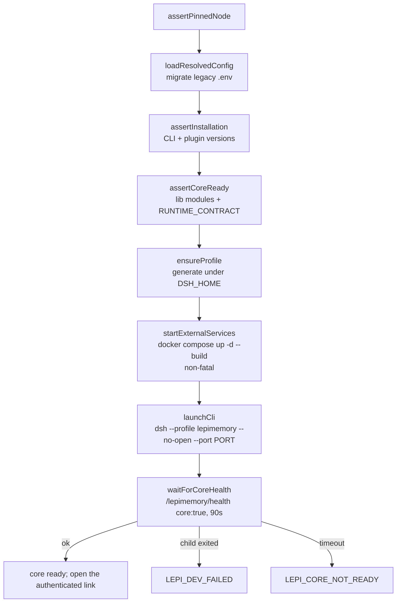

# Development

How to set up a workstation, run the loop, and change the code without breaking the invariants the runtime depends on. Read it once end-to-end when you join; after that use the "where do I add X" section as a map.

## Prerequisites

The repository is self-contained: it downloads and verifies its own Node and pnpm, so you do not install Node, pnpm or DeepSeek Harness globally. The host only needs the tools the bootstrap script actually invokes.

| Requirement | Notes |
| --- | --- |
| Docker with Compose v2 | Runs the `hindsight` (port 8888/9999) and `laya` (port 8000) services. Missing Docker is non-fatal: `scripts/src/runtime.ts` `startExternalServices()` warns and the core UI still starts. |
| `make`, `bash` | `Makefile` is the only supported command surface. |
| `curl`, `tar`, `openssl`, `shasum`, `find`, `sort`, `diff` | Required by `scripts/bootstrap-runtime.sh`; a missing tool fails with `LEPI_BOOTSTRAP_UNAVAILABLE: <tool>`. |
| Platform | Linux or macOS, `x64` or `arm64`. Anything else exits with `LEPI_UNSUPPORTED_PLATFORM`. |

### Pinned toolchain

Versions are pinned in exactly one place, `dsh/plugins/dsh-lepimemory-state/src/shared/pins.ts`, and every gate reads it from there.

| Tool | Version | Where it is pinned / verified |
| --- | --- | --- |
| Node | `v24.20.0` | `shared/pins.ts` `NODE_VERSION`; bootstrap downloads the official build and checks a per-platform SHA-256 |
| pnpm | `10.28.2` | `shared/pins.ts` `PNPM_VERSION`; bootstrap checks the tarball's SHA-512 |
| DeepSeek Harness (`dsh`) | `0.1.7-rc.2` | `shared/pins.ts` `DSH_VERSION`; root `package.json` dependency and the plugin's `peerDependencies`/helper dependencies |
| TypeScript / esbuild | `5.9.3` / `0.25.12` | root `package.json` devDependencies |
| ESLint / Prettier | `10.12.0` / `3.6.2` | root `package.json` devDependencies |

`scripts/src/runtime.ts` `assertPinnedNode()` refuses to run under any interpreter that is not the real `.runtime/bin/node`, and `assertInstallation()` re-checks the CLI version plus the plugin's pinned helper packages, raising `LEPI_CLI_VERSION_MISMATCH` / `LEPI_CORE_VERSION_MISMATCH` when a version drifts. `scripts/build.mts` applies the same node check and raises `LEPI_DEPS_MISSING` if `node_modules` was never installed.

## First-run setup

Run these in order from the repository root.

```bash
# 1. Download and verify the pinned Node + pnpm into .runtime/
make bootstrap

# 2. Create the local environment file (gitignored, never committed)
cp .env.example .env
# edit .env: fill LEPI_LLM_BASE_URL and LEPI_LLM_API_KEY (both or neither)

# 3. Frozen install + profile generation
make install-profile DSH_HOME=/tmp/lepimemory-home

# 4. Start the development server
DSH_HOME=/tmp/lepimemory-home PORT=3181 LEPI_BANK=lepimemory-demo make dev
```

What each step actually does:

- `make bootstrap` runs `scripts/bootstrap-runtime.sh`. It creates a `bootstrap.lock` directory (a second concurrent run exits with `LEPI_BOOTSTRAP_BUSY`), downloads Node and pnpm into `.runtime/cache`, verifies them, and publishes them into `.runtime/<name>` with a `.verified-tree` manifest covering files *and* symlink targets. An existing tree is re-verified before use; a mismatch is quarantined rather than trusted. It then pins `.runtime/bin/node` and writes the `.runtime/bin/pnpm` wrapper, which always runs the pinned Node.
- `make install-profile` runs `build.mts --install` — a `pnpm install --frozen-lockfile` through the pinned pnpm, which requires a materialised `pnpm-lock.yaml` (else `LEPI_LOCKFILE_MISSING`) — and then `runtime.js install`, which loads and resolves config, asserts the installation anchors, and generates the runtime profile. It prints `install complete (home <DSH_HOME>, bank <bank>)`.
- `make dev` requires a configured connection unless you only want to inspect the UI; the same command is used for a UI-only start (see below).

Without credentials the system still starts: `.env.example` documents that an empty shared connection means "unconfigured" — the read-only panel works, no provider or default model is generated, and nothing falls back to a default official endpoint. `HINDSIGHT_API_LLM_PROVIDER: ${…:-none}` in `docker-compose.yml` keeps the memory service in the same read-only posture.

## The day-to-day loop

`make dev` is `make build` followed by `runtime.js dev`. The steps are ordered deliberately, and each one fails closed:



Notable details:

- `ensureProfile()` regenerates the profile under `$DSH_HOME/profiles/lepimemory` on every run and refuses to touch a directory it did not create. A profile that exists without the `.lepimemory-runtime.json` marker raises `LEPI_PROFILE_CONFLICT` ("refusing to overwrite"). Never place your own files in that directory.
- Provider credentials never reach the profile file. The generated `cordis.patch.yml` references them only by `apiKeyEnv` name; the values are injected into the child process environment by `runtimeEnv()`/`applyDerivedEnv()`.
- When the connection is unconfigured the launcher emits an empty `providers: {}` block instead of a route, which both refuses a custom route and neutralises the draft profile's official-URL fallback.
- The generated patch forces `fetch: false` on the `tool-web` preset row (web search stays). This is done by rewriting the copied source patch text — the checked-in `dsh/profiles/lepimemory/cordis.patch.yml` deliberately still says `fetch: true`; do not "fix" that, the launcher is the authority. If the row shape moves, you get `LEPI_PROFILE_SHAPE`.
- `LEPI_RUNTIME_DEBUG=1` makes `runtime.js install` print the resolved (redacted) config.

### Build outputs and what regenerates

`make build` (`scripts/build.mts`) calls `cleanGenerated()` first, which removes only generated areas — never `assets/`, `test/`, sources or the profile — and then compiles:

| Output | Produced by | Committed? |
| --- | --- | --- |
| `dsh/plugins/dsh-lepimemory-state/lib/**` (`*.js`, `*.d.ts`, maps) | `tsc -p dsh/plugins/dsh-lepimemory-state/tsconfig.json` | No (gitignored) |
| `scripts/dist/**` | `tsc -p scripts/tsconfig.json` | No |
| `dsh/plugins/dsh-lepimemory-state/client.js` (+ inline source map) | esbuild bundle of `src/client/index.tsx` | No |
| `dsh/plugins/dsh-lepimemory-state/src/client/**` TSX type check | `tsc -p src/client/tsconfig.json` (`noEmit`) | n/a |
| `scripts/build.mts` type check | `tsc -p scripts/tsconfig.tools.json` (`noEmit`) | n/a |

Because `make build` compiles all four TypeScript projects, a type error fails the build before anything is launched; `make typecheck` exists for a faster loop that refreshes declarations and skips emit. Test suites import `lib/*.js`, so they always see freshly compiled code after a build.

The client is not a normal library build. esbuild bundles the TSX entry as CommonJS and wraps it in the exact module-loader envelope the host expects:

```ts
// scripts/build.mts buildClient()
const banner = [
  'window.__ModuleLoader__.load({',
  `  id: ${JSON.stringify(pluginId)},`,
  '  factory: (require) => {',
  // …
].join('\n');
```

`assertClientBundle()` then proves the bundle is well-formed: the only external imports may be `react`, `react-dom` and `@deepseek-ai/dsh-client-ui-primitives`, and every bundled input must live under `src/client/` or `src/shared/`. Violations raise `LEPI_CLIENT_EXTERNALS` / `LEPI_CLIENT_INPUT`. `readClientPluginId()` additionally asserts the plugin package name is still `@dsh-external/dsh-lepimemory-state` (`LEPI_CLIENT_ID_MISMATCH`) because the host uses it as the boot row id. CSS is loaded as text (`loader: { '.css': 'text' }`), which is why `panel.css` is excluded from Prettier.

### Maintenance commands

| Command | Effect |
| --- | --- |
| `make build` | Regenerate `lib/`, `scripts/dist/`, `client.js` |
| `make typecheck` | Declaration refresh + `--noEmit` checks |
| `make dev` | Build, start services, launch the CLI, wait for core health |
| `make verify` / `make check` | Verification and the full gate (see [TESTING.md](./TESTING.md)) |
| `make stop` / `make clean` | `docker compose stop` / `docker compose down` — do not reset data |
| `make reset` | `docker compose down -v` plus removal of `$DSH_HOME` (defaults to `./.dsh`) — destructive |

`make stop`/`clean` intentionally keep volumes; only `reset` removes data.

## Source layout rules enforced by the code

The plugin lives in `dsh/plugins/dsh-lepimemory-state/src`. Two build assertions and several module headers turn the layout into a rule, not a convention.

- **Hand-written vs generated.** `eslint.config.mjs` and `.prettierignore` both ignore `lib/`, `client.js` and `scripts/dist/` with the same comment: generated output is produced by `scripts/build.mts`; "lint it by regenerating, never by editing it".
- **`src/shared/**` is a browser-safe leaf set.** `shared/domain.ts` states the rule: "Browser-safe: no `node:` imports, so the client bundle and the server runtime can both consume it." The esbuild bundle assertion (`LEPI_CLIENT_INPUT`) enforces the other half — a server module pulled into the client bundle fails the build. `shared/state.ts`, `domain.ts`, `activity.ts`, `avatar-assets.ts`, `avatar-frames.ts`, `api.ts` and `pins.ts` are the leaves; when you add one, keep it free of filesystem, process, SQLite and network imports.
- **`src/client/**` is browser-only.** Its `tsconfig.json` adds `DOM`/`DOM.Iterable` and `jsx: react`, uses `types: []`, and sets `allowJs: false`. ESLint gives it browser globals and the React Hooks rules. It may import from `../shared/`, never from server modules.
- **Generated output is imported with `.js`; sources are imported with `.ts`/`.tsx`.** `tsconfig.base.json` enables `allowImportingTsExtensions` + `rewriteRelativeImportExtensions`, so cross-source imports name the real file (`./shared/state.ts`) while imports of already-emitting output keep `.js`. `verbatimModuleSyntax` is on, so type-only imports must use `import type`.

### Single writers for SQLite tables

The scheduler is the only place that writes most tables, and ownership is explicit in the module headers:

| Owner | Tables | Rule |
| --- | --- | --- |
| `src/store.ts` | schema, `state`, `meta`, `audit`, `evidence`, `history_work`, `grants`, `requests`, `raw_links`, `settled_turns`, … | Owns the schema, pragmas, transactions, ownership and legacy import. `SCHEMA_VERSION` and the `CHECK` constraints live here. |
| `src/task-store.ts` | `tasks` | "`tasks` 表的唯一写入 owner（记忆协调流程内）" — exposes only explicit operations (read, enqueue, claim/lease, terminal/retry/reschedule, expiry sweep); the caller owns the transaction. |
| `src/candidate-store.ts` | `snapshots` + `lifecycle` | "`snapshots` + `lifecycle` 的写入 owner" — the snapshot and lifecycle inserts must share the caller's outer transaction together with the write task and audit; never split into separate commits. |
| `src/memory-pipeline.ts` | none | "本模块不含任何 SQL：政策与落库都经 authorizer / taskStore / store.transaction。" |
| `src/memory-supervisor.ts` | none | Pure scheduler: it calls an injected `runTask`/`runRemote`, so it never imports the pipeline. |

Reader/writer helpers such as `memory-common.ts` are pure leaves (`allRows`, `firstRow`, error-code helpers) with no SQL side effects of their own. When you need a new statement, add it to the owning store module rather than inlining SQL in a caller.

### Transaction boundaries

`store.transaction<T>(fn)` is synchronous by contract. `verify-runtime.ts` proves both the rollback (a thrown error restores `policyEpoch`) and the sync requirement (an `async` callback throws and its body never runs). Consequences:

- Never `await` inside `store.transaction()`; collect what you need first, then run the write.
- A policy epoch bump and everything that must be atomic with it belong in one transaction. `bumpPolicyEpoch()` is only meaningful inside one.
- I/O (file writes, HTTP) happens outside the transaction. `src/action.ts` documents the pattern: register `prepared` in SQLite, do the file I/O outside the transaction, then verify the hash and flip to `executed` in a transaction.

### Do not re-enter `session.append`

`src/state-runtime.ts` is explicit: `observe(session, event)` is a pure observer that "只做 session 之外的状态记录，绝不重入 `session.append`" (aligned with the same constraint in `evidence.ts`). `src/index.ts` repeats the rule for event callbacks — "never await `whenIdle` or re-enter `append` from an event callback" — which is why sweeps are dispatched through an unref'd `setTimeout` instead of being awaited inline. If you need to react to events with session work, queue it; do not append from inside a handler.

### Repository hygiene

- `.env` and `.env.legacy*` are gitignored: credentials and migration backups never enter history.
- `.sanitize-patterns` is a local, gitignored list of personal identifiers used for redaction checks (`.gitignore` labels it "脱敏检查模式（含个人标识，绝不提交）"). It is not read by any script in this repository — [PROJECT-STRUCTURE.md](./PROJECT-STRUCTURE.md) describes it as the pattern list excluded from generated/public material — so treat it as an external check input, never a build dependency.
- `.dsh/`, `.runtime/`, `node_modules/`, `lib/`, `client.js` and `scripts/dist/` are all local state or regenerated output; none of them is committed.

### Keep the graph acyclic

- `memory-supervisor.ts` never imports `memory-pipeline.ts`; the facade injects the runners, so the scheduler stays reusable.
- `memory-common.ts` is a pure leaf: no SQL, no side effects, no imports from its consumers.
- `src/shared/**` and `src/client/**` may not import `node:` builtins or server modules.

## TypeScript, ESLint and Prettier conventions

`tsconfig.base.json` is inherited by every project and sets a strict baseline: `target`/`lib: ES2024`, `module: ESNext`, `moduleResolution: Bundler`, `strict`, `noUncheckedIndexedAccess`, `noImplicitOverride`, `noFallthroughCasesInSwitch`, `noUnusedLocals`, `noUnusedParameters`, `verbatimModuleSyntax`, `erasableSyntaxOnly`, `noEmitOnError`. There are four projects:

| Project | Mode | Purpose |
| --- | --- | --- |
| `dsh/plugins/dsh-lepimemory-state/tsconfig.json` | emit to `lib/` with declarations | Server-side plugin code |
| `dsh/plugins/dsh-lepimemory-state/src/client/tsconfig.json` | `noEmit`, DOM libs, JSX | Browser client (also type-checks `../shared/**`) |
| `scripts/tsconfig.json` | emit to `scripts/dist/` | Launcher and verification programs |
| `scripts/tsconfig.tools.json` | `noEmit` | `scripts/build.mts` itself |

Conventions that follow from this and from the existing code:

- `noUncheckedIndexedAccess` means indexing gives `T | undefined`; handle the miss or assert it deliberately. The store modules centralise this with small helpers (`firstRow`, `one`, `asRecord`) instead of scattering `!`.
- `erasableSyntaxOnly` bans `enum`, `namespace` and constructor parameter properties. Use union string types as `shared/domain.ts` does (`type TaskKind = 'normalize' | 'admit' | …`), which are also the SQLite `CHECK` literals.
- At untyped boundaries, narrow `unknown` with a local guard rather than importing a wide type. `panel.ts`, `history.ts`, `recall.ts` all define narrow interfaces for the dependency surface they actually use (`ProcessorLike`, `AgentLike`, `ConnectionLike`).
- Prefix intentionally unused parameters/locals with `_` (ESLint `argsIgnorePattern: '^_'`).
- Suppress with `@ts-expect-error <reason>` only; plain `@ts-ignore`/`@ts-nocheck` are errors, and a bare `@ts-expect-error` without a description is an error too.
- `any` is an error. Use `unknown` + narrowing.
- `src/client/components/atoms.tsx` states the client rendering rule: everything renders as plain text and `dangerouslySetInnerHTML` is never used ("全部渲染为纯文本，绝不使用 dangerouslySetInnerHTML。"). Keep it that way.

Formatting is Prettier-only, `printWidth: 100`, single quotes, trailing commas, semicolons, two spaces, LF. `pnpm format` rewrites the same file set that `format:check` verifies (use `.runtime/bin/pnpm`, or run through the Makefile environment where `.runtime/bin` is prepended to `PATH`). Do not hand-align code that Prettier owns.

## Commit conventions

The history mixes two gitmoji-flavoured variants of Conventional Commits; both are accepted, but a commit must be one logical change.

```
<type>(<scope>): <subject>          # scope used since the maintenance refactor
<type>: <emoji> <subject>           # older commits carry a gitmoji in the subject
```

Observed types and scopes in `git log`:

| Element | Values seen |
| --- | --- |
| type | `feat`, `fix`, `docs`, `refactor`, `style`, `chore`, `build`, `merge` |
| scope | `panel`, `avatar`, `state`, `memory`, `ts`, `lint`, `tooling`, `profile`, `plugin`, `src`, `local` |
| gitmoji (older style) | `:memo:`, `:sparkles:`, `:bug:`, `:fire:`, `:wastebasket:`, `:wrench:`, `:art:` |

Examples from history: `feat(panel): collapse same-subject lifecycle rows in the default view`, `refactor(ts): migrate the client to TSX and bundle it with esbuild`, `fix: :memo: fix numbering in DEVLOG`, `chore: :wrench: pin TS/eslint/prettier/esbuild and add lint/format scripts`.

Subjects are written in English or Chinese; both appear and neither is wrong. Prefer the scoped form for new work, since conventional-commit tooling and reviewers both read it. The atomic-commit expectation is visible in the refactor series: each migration commit changes one module group and nothing else, and does not mix formatting with behaviour.

### Branch and PR flow

- `main` is the release line and `develop` is the integration line; both are tracked.
- Work happens on a topic branch named `feat/…`, `fix/…`, `refactor/…`, `docs/…` or `exp/…` (for example `fix/memory-transcript-avatar`, `refactor/sustainable-maintenance`, `exp/runtime-convergence`).
- Branches land through pull requests. Merge commits read `Merge pull request #N from <owner>/<branch>`.
- There is no CI configuration in the repository, so the gate is whatever the maintainer runs locally: `make check` before opening the PR, and `make verify` at minimum on a machine that can build. [INFERENCE] if CI is added later, `make check` is the intended target.

## Where do I add X

| I want to… | Touch these files |
| --- | --- |
| **Add an action tool** | `src/action.ts` (add the id to `ACTION_TOOLS` and implement the tool beside `write_note`), then register it in `src/index.ts`. Keep the journal-first contract: allocate an id, write a `prepared` row before I/O, commit the side effect outside the transaction, verify, then flip to `executed` with the full audit. Update `docs/ACTION.md`. |
| **Add a state field** | `src/shared/state.ts` (`BASELINE`, `NUMERIC_FIELDS`, the `MoodState`/`RelationState` interfaces, the `TOP_KEYS`/`MOOD_KEYS`/`RELATION_KEYS` whitelists, and the `DIMENSION_TEXT` render table), `src/machine.ts` for how events move it, `src/state-runtime.ts` for settlement, and the client panels (`src/client/components/EditorForm.tsx`, `StateStrip.tsx`) plus `shared/api.ts` if the field is operator-editable. Because the whitelists are explicit, a misspelled key is reported by name. |
| **Add a memory stage** | `src/shared/domain.ts` (`TaskKind`, `TaskStatus`, `LifecycleStatus` — these mirror closed contract literals), `src/store.ts` for the `CHECK` constraint and any new table, `src/task-store.ts` for the operations and `src/candidate-store.ts` if a candidate is written, `src/memory-pipeline.ts` (or a dedicated worker) for the runner, `src/memory.ts` for the `runTask`/`runRemote` dispatch, and `src/memory-supervisor.ts` only if scheduling changes. Reflect new terminal statuses in `src/index.ts` `RECEIPT_LABELS` so receipts stay truthful. |
| **Add a panel route** | `src/panel.ts` — register a `WebRoute` with `kind: 'exact'`, call `rejected(res, connection, req)` *before* any database read or body action, and answer with `sendJson`. Add the response type to `src/shared/api.ts`, then consume it from `src/client/hooks.ts`/`feed.ts` and a component under `src/client/components/`. Keep `/lepimemory/health` public and everything else operator-authenticated. |
| **Add a configuration variable** | `src/config.ts` (`DEFAULTS`, `resolveConfig`, and a validation that throws `ConfigError(LEPI_CONFIG_INVALID, field, detail)` so bad values fail before startup), `.env.example` with the same wording, and `docs/CONFIGURATION.md`. If it has a security-relevant default, add a case to `test/runtime.test.js`'s "unsafe policy inputs fail before the runtime can start". |
| **Add a native integration point** | `src/index.ts` — the `inject` list, the `ctx.on`/`ctx.effect` registrations, and the dispose effect. Anything that must run before the provider request goes through the `agent/pre-step` / `agent/request` hooks with `{ prepend: true }`, as the history coordinator already does. |
| **Add an avatar frame** | Add the GIF under `assets/avatar/` and register it in `src/shared/avatar-assets.ts`; `test/avatar.test.js` enforces that the manifest and the directory are exactly equal and that each file is a 256×256 GIF89a. |

## Invariants a maintainer must not break

These are enforced by code or by tests; treat them as hard constraints rather than preferences.

- **A URL and its key are one pair.** A partial per-route override must fail with `LEPI_CONNECTION_INCOMPLETE` naming the missing field; never infer the other half. Covered by `test/runtime.test.js`.
- **No success without proof.** `actions.status = 'executed'` requires a matching file hash; recovery never rewrites or deletes a file it cannot prove it owns (`LEPI_NOTE_UNKNOWN`). Covered by `test/action.test.js`.
- **No stale rendering on failure.** A failed audit or prompt assembly throws rather than returning a cached state or an old cause. Covered by `test/action.test.js`.
- **Policy epochs fence everything.** A decision taken under epoch *N* must not commit after `bumpPolicyEpoch()`; the corresponding code is `LEPI_INPUT_RESUBMIT_REQUIRED` or a rejected assembly. Covered by `test/runtime.test.js`, `test/history.test.js`.
- **Snapshots are immutable and lifecycle is the truth.** Never `UPDATE snapshots`; lifecycle status drives exclusion. Proven by `verify-runtime.ts`.
- **Forgetting is total and auditable.** Isolation survives reload, applies to cold sessions, and a raw SQL restore cannot rebuild the surface. Covered by `test/history.test.js`.
- **One writer per table.** Do not add SQL to a module that does not own the table.
- **Never re-enter `session.append` from an observer or event callback.**
- **Transactions are synchronous.** Nothing awaited inside `store.transaction()`.
- **The launcher owns the profile.** Never edit `$DSH_HOME/profiles/lepimemory` by hand; it is regenerated and ownership-checked.
- **The client bundle only reaches host seeds and its own browser-safe sources.** Adding a Node import to `src/shared/**` fails the build, by design.

## Related documents

- [TESTING.md](./TESTING.md) — the verification gates you must run before merging.
- [PROJECT-STRUCTURE.md](./PROJECT-STRUCTURE.md) — the file-by-file map of the repository.
- [ARCHITECTURE.md](./ARCHITECTURE.md) — how the subsystems compose.
- [RUNTIME.md](./RUNTIME.md) — the launcher, profile generation and health gate in depth.
- [DEPLOYMENT.md](./DEPLOYMENT.md) — install and Docker service details.
- [CONFIGURATION.md](./CONFIGURATION.md) — every environment variable and its validation.
- [MEMORY.md](./MEMORY.md) — the lifecycle the memory stages implement.
- [ACTION.md](./ACTION.md) — the action contract when you add a tool.
- [OBSERVABILITY.md](./OBSERVABILITY.md) — what audit rows your new stage should write.
