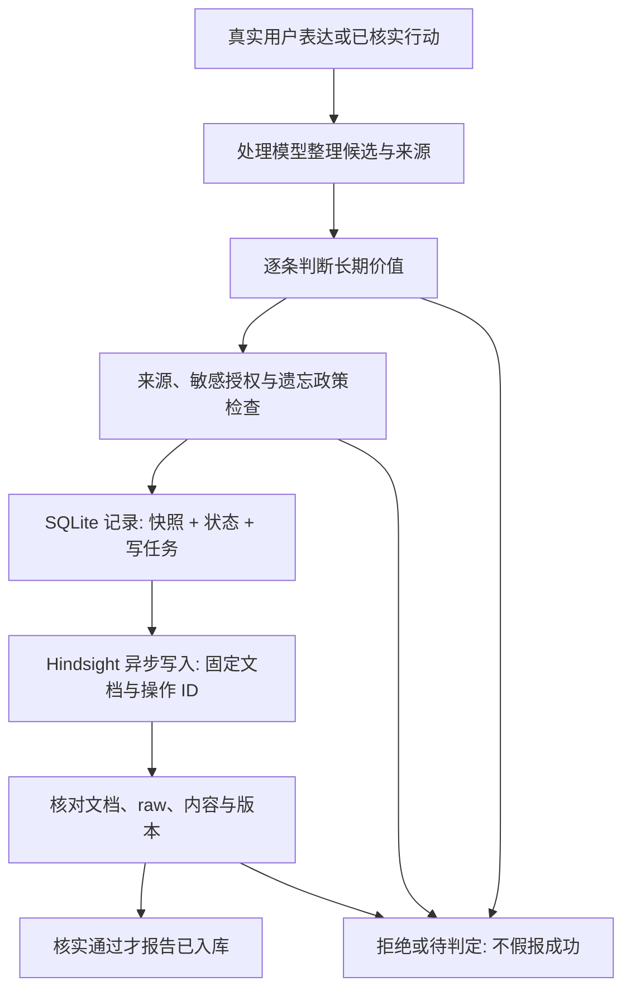

# Lepimemory 怎么工作：机制与页面导览

这份文档面向第一次看演示的观众，也供讲解者照着讲。它解释的是现在的实现。

- 想马上讲页面：读第 1、2 节。
- 想讲背后的机制：读第 3–7 节。
- 想现场演示：照第 8 节的路线走。
- 安装配置见 [README](../README.md)，架构与实现细节见 [ARCHITECTURE](ARCHITECTURE.md)。

## 1. 一分钟讲清楚它是什么

可以直接这样开场：

> Lepimemory 不只是给聊天模型塞一段人设。它在模型外面维护着持续的角色状态、长期记忆和行动记录。
>
> 用户说话后，系统先理解这次表达，再判断哪些内容值得记、哪些需要授权。获准的内容通过后台任务写入记忆服务，核对成功后才报告"已记住"。下一轮聊天时，系统重新筛选目前允许使用的记忆，连同人设和有效状态一起交给角色模型。
>
> 角色做事必须真的产生副作用：说"我写好了"不算，文件和执行记录才算。用户要求忘记时，系统不仅停用长期记忆，还会清理模型能够继续读取的对话历史。
>
> 页面下方不是另一个聊天机器人，也不是模型的"内心独白"。它是这套系统的仪表盘：能看到角色现在的状态、处理到哪一步、用了哪些来源，以及什么事情确实完成了。

**最重要的区别：自然语言是角色的表达，执行记录才是系统完成事实的依据。**

## 2. 页面应该怎么看

页面分两层：上面是角色交互（右下角有角色立绘），**右侧栏的状态面板**是系统观测面。标签会随界面语言显示中文或英文。

| 页面区域 | 它在回答什么 | 它不代表什么 |
| --- | --- | --- |
| **Chat** | 角色说了什么 | 一句"记住了"不证明写入成功 |
| **Trajectory** | 这轮模型实际用的提示词、上下文、工具调用与结果 | 不是模型内部思维过程的公开 |
| **状态文字段** | 相对基线，现在该怎样调整语气与行为倾向 | 不是角色临时编的情绪，也不是心理测量 |
| **Mood / Relation / Core / Counts** | 状态数值、核心基线检查、记录统计 | 不是智力分数，也不是"所有服务正常"的总灯 |
| **System receipts** | 最近的请求或任务实际处理到哪一步 | 不是模型生成的保证书 |
| **History** | 按类别追溯处理过程、结果与来源 | 行数不等于成功记忆条数 |
| **Operator state edit** | 演示者显式调整数值，观察状态如何影响角色输入 | 不是角色自己改状态的工具 |

### 2.1 读懂 Mood 和 Relation

以下只是格式示意：

```text
Mood -0.3/0.4 · Relation 0.3/0.2/0.6 · Core=ok
```

- `Mood` 是 **valence / arousal**（愉悦度 / 唤醒度）。愉悦度范围 `[-1, 1]`，越低越低落；唤醒度范围 `[0, 1]`，越高越活跃，不等于开心。
- `Relation` 是 **trust / closeness / familiarity**（信任 / 亲近 / 熟悉），范围都是 `[0, 1]`。熟悉度随交互累积，不代表已经信任用户。
- 上方文字把数值相对基线的偏移翻译成"比平常低落""更熟悉"这类提示，供角色调整表达，不是让它向用户报数字。

这些是可解释的演示变量，不是心理学标定结果。另外注意：这里的 `Relation.trust` 是角色对用户的关系参数，记忆里的 `fact / experience / inference` 是材料的来源身份（见第 5 节），两者是不同的东西。

### 2.2 Core 和 Counts 怎么读

`Core=ok` 只表示核心基线检查通过（固定 Node、dsh、SQLite schema）。它不保证云模型、Hindsight 或 laya 此刻可达——外部调用失败要看具体任务状态。

`Counts` 统计数据库里的记录，`tasks={...}` 是后台任务分组：

| 分组 | 统计对象 | 读法 |
| --- | --- | --- |
| `lifecycle` | 获准记忆的当前状态 | `active` 是本地有效；这一轮能不能用还要看来源、时效和政策 |
| `requests` | 控制检查与记忆管理请求 | 不等于用户消息数 |
| `tasks` | 理解、判定、写入、整理等后台工作 | 一个候选可能关联多个任务 |
| `grants` | 授权记录 | `active` 指尚未撤销；用的时候还要匹配范围与期限 |

面板每 **5 秒**刷新一次，后台状态和页面显示之间会有短暂延迟。历史页默认每页 10 条、最新在前；同一个任务反复处理会产生多条审计记录，但可能只有一个任务、一条记忆。

### 2.3 八个 History 标签各看什么

| 标签 | 主要内容 | 演示时可以问 |
| --- | --- | --- |
| **Audit / 审计** | 各层事件、状态前后值、命中规则 | "为什么它变了？" |
| **Recall / 召回** | 这轮入选与被排除的材料，含来源链 | "这次回答到底用了什么？" |
| **Retain / 写入** | 判定、提交、核实入库或写入失败 | "它是真记住了，还是只在排队？" |
| **Forget / 遗忘** | 本地隔离、历史清理、后端作废与恢复 | "它从哪一步开始不能用这条内容？" |
| **Action / 行动** | 真实工具行动与执行记录 | "文件真的创建了吗？" |
| **Task / 任务** | 后台任务的阶段、重试、未知结果 | "现在卡在哪一步？" |
| **Control / 控制** | 记忆意图识别、管理请求、停车与重发 | "为什么这条输入没直接进角色生成？" |
| **Consent / 确认** | 确认问题的允许、拒绝、超时、取消 | "谁授权了这次保存？" |

点 **Details / 详情**可以沿引用查看候选、来源、任务和授权。记录里的短 ID 是缩写，详情里是完整身份。

### 2.4 为什么同一件事有很多 ID

这些 ID 不是重复的记忆，而是不同问题的索引：

| 身份 | 回答什么 |
| --- | --- |
| session / message / seq | 哪个会话、哪条消息、哪个事件 |
| source / evidence | 原始表达里的哪个片段（含消息、事件与文本范围） |
| request | 用户这次"记住 / 忘记 / 恢复 / 授权"的请求 |
| candidate | 从真实表达整理出的一条可独立判断的内容 |
| task | 为它执行的一项后台工作 |
| operation | 记忆服务的一次异步写入身份，失败后不会偷偷换一个再写 |
| action | 一次真实便条的执行身份，和记忆写入是两回事 |

一条典型的追溯路径：**这次回答引用的材料 → 它的原始来源 → 本地获准的候选 → 用户的原话或已执行的行动**。

## 3. 幕后分工：不是一个模型包办所有事

| 组件 | 职责 | 它不能替谁决定 |
| --- | --- | --- |
| **dsh（DeepSeek Harness）** | 会话、模型调用、工具管线、审批、有效历史与压缩 | 不决定长期记忆的授权与可用性 |
| **角色模型** | 在人设、有效状态与允许材料之上回答、选择行动 | 一句输出不能自行授权敏感保存，也不能证明行动成功 |
| **处理模型** | 理解控制意图、整理候选、匹配范围、核验来源 | 不改造未知来源，不编造完成事实 |
| **准入后端**（默认 laya） | 判断一条候选对长期陪伴有没有保存价值 | "值得记"不等于"是真的"，更不等于"已获授权" |
| **SQLite + 协调器** | 状态、快照、授权、生命周期、任务、审计 | 本地存着旧正文，不代表它还能用于当前回答 |
| **Hindsight** | 记忆的保存、检索、综合与异步操作 | 检索到了不等于允许使用；综合出来的文字不能自动升格为事实 |

"处理模型"指职责独立，不要求换厂商。角色、处理与记忆服务可以走同一套模型服务，但处理路由固定，不随角色页的模型选择而变。这些组件影响的是**当前模型输入**，不是在训练或修改模型权重。

## 4. 一句话怎样进入长期记忆

以"我喜欢安静，不喜欢突然来访"为例。目标是保留主体和否定条件，而不是把整轮聊天原样打包。



这是职责图，不是调用栈；提交与结果应用时还会重复核验政策。

### 四道关，各自回答不同的问题

1. **理解关：你实际说了什么？**
   不丢否定、时间、条件和主体。"这个周末有空"不变成"每个周末有空"；纯寒暄、纯提问不能编成用户事实。用户陈述、角色推断、真实执行的行动保留不同的来源身份。
2. **价值关：值得长期保存吗？**
   普通候选逐条判定，不是整轮"全存 / 全丢"。判定分数是该任务的输出，不是事实正确率；阈值是可配置的起点，未经概率校准。明确要求"记住"会跳过这道关，但跳不过来源、授权和遗忘政策。
3. **权限关：允许保存吗？**
   普通偏好可自主保存；私密内容需要有效授权；凭据、证件、精确地址等敏感内容直接排除。敏感确认用原生问题卡，未授权的正文只存在于处理内存里。授权分 `item`（仅这一条）、`topic`（限定话题）、`continuous`（限定范围与期限）——一次允许不等于无限授权。
4. **完成关：真的写进去了吗？**
   获准内容存为不可改写的快照，纠正走新候选。服务端"接受请求""操作完成"都不等于入库——只有核对了后端文档、raw 与获准内容一致，才报告 `written`；证明不了就是 `unknown`。

**隐私边界要说准确**：敏感确认管的是"新增的长期保存"。它不代表原始聊天日志不存在，也不代表输入只留在本机。演示请用虚构材料。

后台处理由受控任务槽推进，网络等待不占数据库事务。关掉页面不等于写任务完成了；重启后要按执行记录和原操作身份核对，而不是靠模型"回忆自己做过什么"。

## 5. 下一轮为什么会想起它，又为什么可能不用

一个角色回合在逻辑上经过：


### 先允许，再相关——不能"分高就用"

记忆服务返回的是候选，不是直接给角色的上下文。系统还要检查：当前状态、授权和遗忘政策是否允许；来源是否确实关联获准快照、后端版本是否仍然有效；计划或临时状态是否适用于当前时间；内容是用户陈述、已执行行动还是未确认推断。

被遗忘、未知、待写入、仅审计的候选不进模型材料；被取代的材料只在允许的历史用途下参与。过去日期的计划是"过去的计划"，不会自动变成"已经发生"。在这个允许集合内才做相关性排序（默认相关度下限 0.35、最多 4 条）。

所以"后端存了它""检索分很高""本地还能看到正文"，都不是这一轮必须用它的理由。

### 综合材料不能借壳升格

假设一段综合摘要同时用了"喜欢安静"和另一条已被遗忘的经历：不能把整段塞给角色再要求它忽略一半。系统会先检查全部来源——有不允许的来源就不用这段综合文字，换成预算内的合格原始快照；来源都允许时，也要逐条核验，不能扩大时间、身份或确定性。

| 来源标签 | 正确理解 |
| --- | --- |
| `fact` / 用户陈述 | 用户明确说过的内容；有表达证据，不等于外部世界已被独立证实 |
| `experience` / 已执行行动 | 有执行记录支撑的真实行动；批准过但没执行的不算 |
| `inference` / 未确认推断 | 角色提出的推断；保存后仍保留推断身份，写得再流畅也不是事实 |

推断默认 **14 天半衰期**逐渐失效；这和下一节的心境衰减是两条不同的时间线。

## 6. 人格、心境、关系与行动

**人设是稳定的身份内核，心境和关系是显式状态，语言仍由模型生成。**状态被翻译成相对基线的自然提示，不要求每句话固定格式。

当前自动规则很少，全部可审计：

| 真实回合事实 | 状态变化 |
| --- | --- |
| 本轮有真正提交的用户表达 | 熟悉度 `+0.03` |
| 本轮有记录确认的成功行动 | 愉悦度 `+0.12`、亲近度 `+0.03` |
| 本轮有真实工具失败 | 愉悦度 `-0.12`，不降低信任 |
| 审批被拒绝、取消，或控制出错 | 不算成功，也不当作普通失败惩罚关系 |

规则按回合事实触发、去重结算，不是每个回执都加分；迟到完成的行动有防重复标记，重启也不会双算。**自动规则不会因为多聊几句就提升信任**——操作者可以显式调整，但别把它解释成复杂的社会信任学习。

心境偏离基线的部分按 **6 小时半衰期**回归（不是六小时后清零），关系参数没有自然衰减。过旧的原因不会一直显示成"刚刚发生"。

### "写便条"有两套不同的权限

1. **行动审批**：允许这个工具真的创建文件。
2. **长期保存授权**：允许把相关经历存为长期记忆。

允许写文件不自动授予长期保存权限。每次便条有独立的行动 ID 和文件，同标题不覆盖。只有文件和执行记录核对后才算 `executed`，之后相关候选仍要走记忆管线。模型说"我写好了"、或工具没报错，都不能替代这个证据。

## 7. 压缩、忘记、恢复：三个不同的动作

### `/compact` 是整理工作台，不是保存许可

压缩为对话的有效历史产生摘要，工具结果也有裁剪机制，人设与状态所在的系统头不被压缩吞掉。摘要是方便继续对话的副本，不是长期记忆。所以一条内容被压进摘要后，遗忘时仍然要处理摘要、引用和复述。

### 忘记：先停止使用，再完成后端清理

把**原始日志**理解成档案，把**有效历史**（模型当前获准阅读的对话历史）理解成工作台。确认遗忘后：

1. 数据库同一事务停用选中的记忆、建立抑制范围、政策版本加一，停止相关或无法排除关联的任务。
2. 清理本机所有可读会话的有效历史，包括压缩后的副本和相关引用；不确定的片段一律替换为固定的净化提示，工具调用与结果保持配对。
3. 冷会话也必须在下次模型请求前过屏障。无法证明清理完成时，直接拒绝使用旧输入，而不是提示模型"请忽略它"。
4. 后端清理独立进行。取消异步任务不等于撤回已经产生的数据；恢复连接后仍按原操作身份查找迟到的记录并逐条作废。

"本地已停止使用"和"后端清理待完成"可以同时出现，两者并不矛盾。

这不是物理擦除所有原始档案、远端缓存的承诺。旧审计仍可供已认证的操作者查看。忘记也不会重置心境和关系数值，但含旧材料的状态原因文字会被清理。

### 恢复、重新记住、撤销授权

| 操作 | 做什么 | 不做什么 |
| --- | --- | --- |
| **恢复 restore** | 明确选中已遗忘的条目，核验后恢复长期来源 | 不倒带已清理的旧会话，不自动恢复其他条目 |
| **重新记住 re_remember** | 为这次真实的新表达建立明确例外 | 普通再次提及不会解除抑制 |
| **撤销授权 revoke** | 停止用该范围做新的保存 | 已保存的旧记忆是否一并忘记，是另一项选择 |

点"查看原始获准快照（仅审计）"只是看档案，不是恢复。

## 8. 演示路线

用新的合成 home / bank，别污染真实资料，也别靠删库制造"干净结果"。以下是讲解路线，不是固定台词。

**第一步：先分清两层界面。**指着 Chat 说"这里看她怎么表达"，再指着下方说"这里看系统实际做了什么"。先看状态、回执、History 就够，长 ID 不用背。

**第二步：记住一条偏好，再看来源。**输入一条虚构的明确表达，比如"这是虚构演示：请记住我喜欢安静"。在 **Control** 看请求，在 **Task / Retain** 看处理与写入状态——看到核实结果之前不说"保存完成"。换会话问她，在 **Recall → Details** 看这轮实际引用的来源；没召回就如实看排除原因。

讲解句："她记住的不是聊天的字面，而是有出处、保留否定条件的内容；下一轮还要再核验能不能用。"

**第三步：真实行动与状态变化。**要求写一份虚构便条，展示行动审批。允许后在 **Action** 看执行记录、核对真实文件，在 **Audit** 看状态前后值；再拒绝一份，确认没有新文件、没有状态加分。如果模型只说不做，就说明这次没有行动证据。

讲解句："表达由模型生成，完成由文件和记录核验；状态只吃真实事件。"

**第四步：忘记与恢复的边界。**明确要求遗忘，在确认卡里只选目标。在 **Forget** 看本地隔离进度和后端整理状态。之后只基于允许的材料提问。如果演示恢复，强调只恢复选中的长期来源，清理过的旧对话不会倒带。

讲解句："关掉的不只是检索命中，还有模型下一轮继续看到的历史副本。"

涉及私密授权时用明确标注的虚构材料演示允许、拒绝和超时；不要把真实的健康、财务或凭据信息输入进去。

## 9. 遇到这些状态怎么解释

| 状态 | 说法 |
| --- | --- |
| `pending / running` | 还在处理，不能称完成 |
| `submitted` | 已登记进入异步写入，尚未核实 |
| `written` | 内容已通过后端文档与 raw 核对 |
| `reconciled` | 处理已完成核对；是否新增记忆要看任务类型 |
| `deferred` | 暂不能决定或服务不可达，等待显式处理 |
| `unknown` | 无法证明结果——"不知道成没成功"不等于成功 |
| `rejected / cancelled / expired` | 拒绝、取消、过期，都不是成功的别名 |
| `blocked / resubmit_required` | 旧输入不再适用，需要新的明确输入 |
| `active / history_only / superseded` | 有效 / 仅历史 / 已被新内容取代 |
| `local_isolated` | 本地已停止使用；后端整理状态另看 |

**Retry request / Retry task** 是唤醒既有身份，不是复制内容重新提交。异步写入结果不明时必须沿原操作 ID 查询。

常见问答：

- **为什么没有马上"记住"？**理解、授权和写入分开处理，面板还是轮询的。延迟不代表丢失，排队也不代表成功。
- **为什么有时候会拒绝看似无关的话？**范围匹配依赖模型判断，无法证明无关时保守阻断。实现中确实观察到过保守误判——这属于已知边界，不是已解决的通用质量问题。
- **面板下方那些文字是思维链吗？**不是。那里展示的是可复核的输入、规则、授权、来源和结果，不展示模型内部的推理。
- **有本地数据库就是完全离线吗？**不是。SQLite 只是本地记录，模型连接和记忆服务另有配置。缺云连接时只能看，不能聊。
- **这是普通 RAG 吗？**有检索也有上下文注入，但多了授权、时效、来源身份、不可改写快照、异步核对、行动事实和历史隔离。"搜到就塞进去"不是这里的完成标准。

## 10. 要深入源码，去哪看

| 想了解什么 | 入口 |
| --- | --- |
| 前置检查、召回注入与回执 | [src/index.ts](../dsh/plugins/dsh-lepimemory-state/src/index.ts) |
| 理解与结果契约 | [src/processor.ts](../dsh/plugins/dsh-lepimemory-state/src/processor.ts)、[src/contracts.ts](../dsh/plugins/dsh-lepimemory-state/src/contracts.ts) |
| 证据与授权控制 | [src/evidence.ts](../dsh/plugins/dsh-lepimemory-state/src/evidence.ts)、[src/control.ts](../dsh/plugins/dsh-lepimemory-state/src/control.ts) |
| 价值判定与后台协调 | [src/admission.ts](../dsh/plugins/dsh-lepimemory-state/src/admission.ts)、[src/memory.ts](../dsh/plugins/dsh-lepimemory-state/src/memory.ts) |
| 写入核对与后端整理 | [src/write-worker.ts](../dsh/plugins/dsh-lepimemory-state/src/write-worker.ts)、[src/curate-worker.ts](../dsh/plugins/dsh-lepimemory-state/src/curate-worker.ts) |
| 召回过滤与来源核验 | [src/recall.ts](../dsh/plugins/dsh-lepimemory-state/src/recall.ts)、[src/recall-source.ts](../dsh/plugins/dsh-lepimemory-state/src/recall-source.ts)、[src/trust.ts](../dsh/plugins/dsh-lepimemory-state/src/trust.ts) |
| 历史隔离 | [src/history.ts](../dsh/plugins/dsh-lepimemory-state/src/history.ts) |
| 便条、状态与结算 | [src/action.ts](../dsh/plugins/dsh-lepimemory-state/src/action.ts)、[src/state-runtime.ts](../dsh/plugins/dsh-lepimemory-state/src/state-runtime.ts)、[src/machine.ts](../dsh/plugins/dsh-lepimemory-state/src/machine.ts) |
| 记录与页面 | [src/store.ts](../dsh/plugins/dsh-lepimemory-state/src/store.ts)、[src/panel.ts](../dsh/plugins/dsh-lepimemory-state/src/panel.ts)、[src/client/index.tsx](../dsh/plugins/dsh-lepimemory-state/src/client/index.tsx) |
| 状态 / 活动 / 立绘定义 | [src/shared/state.ts](../dsh/plugins/dsh-lepimemory-state/src/shared/state.ts)、[src/shared/activity.ts](../dsh/plugins/dsh-lepimemory-state/src/shared/activity.ts)、[src/shared/avatar-frames.ts](../dsh/plugins/dsh-lepimemory-state/src/shared/avatar-frames.ts) |
