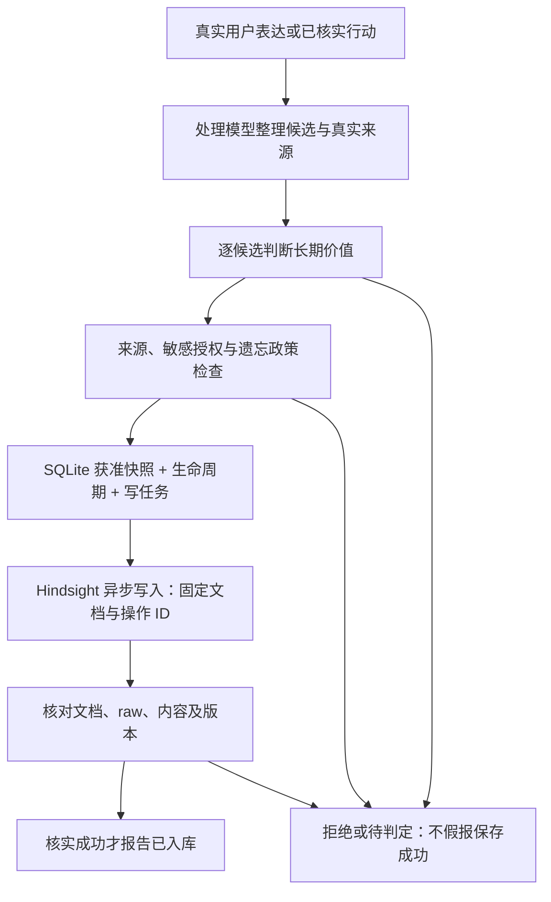

# Lepimemory 怎么工作：机制与 Demo 页面导览

这份文档面向第一次看 Demo 的观众，也供演示者拿着讲解。它解释**现在的实现**，不是未来功能清单。

- 想马上解释页面：先读第 1、2 节。
- 想了解背后的闭环：读第 3–7 节。
- 想现场演示：照第 8 节的路线走。
- 安装与配置见 [README](../README.md)，完整验收步骤见 [DEMO](DEMO.md)，实现取舍见 [CONCEPTS](../CONCEPTS.md)，实际运行证据见 [DEVLOG](DEVLOG.md)。

## 1. 一分钟讲清楚它是什么

可以直接这样向观众介绍：

> Lepimemory 不只是给聊天模型塞一段人设。它在模型外面维护了一套持续的角色状态、长期记忆和行动账本。
>
> 用户说话后，系统先理解这次表达，再判断哪些内容值得记、哪些需要授权。获准内容通过后台任务写入记忆服务，核对成功后才报告“已记住”。下一轮聊天时，系统重新筛选目前允许使用的记忆，再连同人设和有效状态交给角色模型。
>
> 角色做事也必须真的产生副作用：说“我写好了”不算，文件和执行记录才算。用户要求忘记时，系统不仅停用长期记忆，还会净化模型能够继续读取的对话历史。
>
> 页面下方不是另一个聊天机器人，也不是模型的“内心独白”。它是这套闭环的仪表盘：我们能看到它现在是什么状态、处理到哪一步、用了哪些来源，以及什么事情确实完成了。

**最重要的区别：自然语言是角色的表达，回执和账本才是系统完成事实的依据。**

## 2. 页面应该怎么看

页面由两层组成：上面是角色交互（右下角有角色立绘），**右侧栏的状态面板**是系统观测面。标签会随界面语言显示中文或英文。

| 页面区域 | 它在回答什么问题 | 不代表什么 |
| --- | --- | --- |
| **Chat** | 角色说了什么；用户和工具交互如何呈现 | 一句“记住了”不证明长期写入成功 |
| **Trajectory** | 这轮模型实际使用的提示词、上下文、工具调用与结果 | 不是模型内部思维过程的完整公开 |
| **状态文字段** | 相对角色基线，目前应如何调整语气与行为倾向 | 不是角色自己临时编出的情绪，也不是人的真实心理测量 |
| **Mood / Relation / Core / Counts** | 状态数值、核心基线检查与账本统计 | 不是模型智力分数，也不是“所有服务正常”的总灯 |
| **System receipts / 系统回执** | 最近相关请求或任务实际处理到哪一步 | 不是再调用一次模型生成的保证书 |
| **History / 历史记录** | 按类别追溯处理过程、结果与来源 | 行数不等于成功记忆条数 |
| **Operator state edit / 操作者调整演示状态** | 演示者显式调整数值，观察状态如何影响角色输入 | 不是角色自行修改状态的工具，也不是记忆编辑器 |

### 2.1 读懂 Mood 和 Relation

以下只是**格式示意，不是某次运行的原始输出**：

```text
Mood -0.3/0.4 · Relation 0.3/0.2/0.6 · Core=ok
```

- `Mood` 顺序为 **valence / arousal**：愉悦度 / 唤醒度。
  - 愉悦度范围 `[-1, 1]`，用于表达偏低落或偏积极的状态。
  - 唤醒度范围 `[0, 1]`，表示偏平静或偏活跃，不等于开心程度。
- `Relation` 顺序为 **trust / closeness / familiarity**：信任 / 亲近 / 熟悉，范围都是 `[0, 1]`。
  - 熟悉度表达交互累积，不等于已经信任用户或更亲近。
  - 这些是可解释的演示状态变量，不是经过心理学标定的测量结果。
- 上方文字把数值相对基线的偏移翻译成“比平常低落”“更熟悉”等提示，供角色调整表达；不是直接要求角色向用户报数值。

**有两种不同的“信任”，不要混淆：**这里的 `Relation.trust` 是角色对用户的关系参数；记忆中的 `fact / experience / inference` 是材料的来源身份，见第 5 节。

### 2.2 Core 和 Counts 不是全局成功指示灯

`Core=ok` 表示固定 Node、dsh 与 SQLite schema 等核心基线检查通过。它**不保证**云模型、Hindsight 或 laya 此刻都可达，也不保证模型判断正确。外部调用失败仍要看具体任务和错误状态。

`tasks={...}` / `total=...` 展示后台任务分组；`Counts` 展示 SQLite 中不同类别的行数：

| 分组 | 统计对象 | 读法 |
| --- | --- | --- |
| `lifecycle` | 获准候选目前的生命周期 | `active` 是本地标为有效；最终是否可用于这一轮，还要核验后端来源、时效和政策 |
| `requests` | 控制检查与记忆管理请求 | 不等于用户消息数；一次表达可能涉及检查和管理请求 |
| `tasks` | 理解、准入、写入、整理等后台工作 | 一个候选可能关联多个阶段任务，不能全部当作新增记忆 |
| `grants` | 已持久化的授权记录 | `active` 计数按“尚未撤销”统计；不等于每条都未过期、都覆盖当前候选，使用时还要匹配范围与期限 |

面板通常每 **5 秒**刷新一次；后台状态和页面显示之间可能有短暂延迟。历史页默认每页 10 条，最新在前；后台多次处理同一任务会产生多条审计记录，但仍可能只有一个任务、一条候选。

### 2.3 八个 History 标签，各看什么

| 标签 | 主要内容 | 演示时可以问的问题 |
| --- | --- | --- |
| **Audit / 审计** | 各层事件、状态变更、前后值、规则及身份引用 | “为什么它变了？” |
| **Recall / 召回** | 本轮入选、被排除的材料，以及 observation → raw → candidate 的来源链 | “这次回答到底用了什么？” |
| **Retain / 写入** | 准入判定、提交、核实入库或写入失败等事件 | “它是真记住，还是只进入了队列？” |
| **Forget / 遗忘** | 本地隔离、历史净化、后端作废或恢复的记录 | “它从哪一步开始不能再使用这条内容？” |
| **Action / 行动** | 真实工具行动及执行账本 | “文件真的创建了吗？还是被拒绝了？” |
| **Task / 任务** | 后台任务的阶段、退避、未知结果及重试 | “现在卡在哪一步？” |
| **Control / 控制** | 明确记忆意图的识别、管理请求、停车或需新发 | “为什么这条输入没有直接进入角色生成？” |
| **Consent / 确认** | 确认问题的允许、拒绝、超时、取消等结果 | “谁授权了这次保存或管理操作？” |

点 **Details / 详情**，沿引用查看候选、来源、任务、操作和授权。记录中的短 ID 是方便人读的缩写；详情给出完整身份。

### 2.4 为什么同一件事有这么多 ID

这些 ID 不是重复记忆，而是不同问题的索引：

| 身份 | 相当于什么 |
| --- | --- |
| session / message / seq | 哪个会话、哪条消息、哪个原生事件；`splice` 指真实输入最初进入收件箱的事件，不保证已进入模型有效历史 |
| source / evidence | 原始表达中的哪个明确片段；引用包含消息、事件与文本范围，不是随意编的出处 |
| request | 用户这次记住、忘记、恢复或授权等请求 |
| candidate | 从真实表达整理出的一个可独立判断的断言 |
| task | 为这个请求或候选执行的一项后台工作 |
| operation | Hindsight 的一次异步写入身份；用于查询和恢复，不能失败后偷偷换一个再写 |
| action | 一次真实便条行动的执行身份，与记忆写入的 operation 不同 |

一条常见的追溯路径是：**这次回答引用的综合观察 → 其原始来源 → 本地获准候选 → 用户原始表达或已执行行动**。不是每条材料都经过综合观察；安全回退也可以直接使用核验合格的来源快照。

## 3. 幕后分工：不是一个模型包办所有事情

| 组件 | 职责 | 不能替别人决定什么 |
| --- | --- | --- |
| **dsh（DeepSeek Harness）** | 会话、模型调用、工具管线、审批、有效历史与 `/compact` | 不替 Lepimemory 决定长期记忆的授权与可用性 |
| **角色模型** | 在人设、有效状态与允许材料之上回答、选择行动 | 一句模型输出不能自行授权敏感保存，也不能证明行动成功 |
| **独立处理模型** | 理解控制意图、整理候选、匹配范围、核验来源与历史安全片段 | 不能改造未知来源、编造完成事实或自由改账本 |
| **准入后端** | 判断一个候选对长期陪伴是否有保存价值；默认 laya，也可显式配置 generative | “值得记”不是“是真的”，也不是“已获授权” |
| **SQLite + 自研协调器** | 状态、批准快照、授权、生命周期、任务、审计与并发政策复核 | 本地有一份旧正文不代表它仍可用于当前回答 |
| **Hindsight** | 文档与 raw 记忆保存、检索、综合观察及异步操作 | 检索到了不等于允许使用；综合文字不能自动升级为事实 |

“独立处理模型”指**调用与职责独立**，并不要求换一家厂商或另一套模型。角色、处理器与记忆服务可以使用同一服务，但处理路由固定，不随角色页临时换模型而改变。Hindsight 自身也有处理记忆的模型，这不是角色人格本身。

人设来自配置，心境与关系来自规则，长期材料来自过滤后的记忆系统；这些共同影响**当前模型输入**，不是在持续训练或修改角色模型权重。

## 4. 一句话怎样进入长期记忆

以“我喜欢安静，不喜欢突然来访”为例，目标是保留主体与否定条件，而不是把整轮聊天原样打包保存。



这是**业务职责图，不是逐函数调用栈**；提交与结果应用时还会重复核验政策，不是只在箭头上的一个点查一次。

### 四道关，分别回答不同问题

1. **理解关：你实际表达了什么？**
   - 不丢掉否定、时间、条件和主体。
   - “这个周末有空”不变成“每个周末有空”。纯寒暄、纯查询不能编成用户事实。
   - 用户陈述、角色推断、真正执行的行动保留不同来源身份。
2. **价值关：值得用于长期陪伴吗？**
   - 普通候选逐条由 laya 或显式选择的 generative 判定，不是整轮“全存 / 全丢”。
   - laya 的分数是该任务的 yes 输出，不是事实正确率；阈值是可配置的 demo 起点，未经概率校准。
   - 明确要求记住、纠错等会绕过**价值筛选**，但不绕过来源、敏感限制或遗忘抑制。
3. **权限关：允许长期保存吗？**
   - 普通稳定偏好可自主保存；私密内容需有效授权；凭据、证件、精确地址、支付数据等 excluded 内容不进入长期保存。
   - 敏感确认用原生非工具问题卡。未授权候选正文只在处理内存中，不复制进新增长期快照、队列正文或审计。
   - item 授权只覆盖这一条；topic / continuous 还有限定话题、会话、期限及是否包含推断。不能把一次允许泛化成无限授权。
4. **完成关：确实写入且能核对吗？**
   - 获准快照不可原地改写；纠正通过新候选及生命周期变化保留来龙去脉。
   - 后台一个候选绑定固定文档和操作 ID。服务接受请求、操作显示 completed，都不直接等于核实入库。
   - 必须核对后端文档、可用 raw 与获准内容/metadata/版本，才报告 `written`；结果不明则 `unknown`。

**隐私边界要说准确：**敏感确认管的是新增的长期保存，不代表原始聊天日志不存在、不代表模型处理原始输入时从未接触它，也不保证所有输入只在本机。演示请用虚构材料，不要输入真实凭据或真实敏感信息。

后台处理由受控任务槽推进，网络等待不占 SQLite 事务。关闭页面不等于写任务已完成；重启后仍须依据账本与原操作身份核对，而不是靠模型“回忆自己做过”。

## 5. 下一轮为什么会想起它，又为什么可能不用它

一个可用的角色回合，在逻辑上经过以下流程：


状态在原生提示词组装的真实窗口中提供。若隔离或授权变化使已准备输入过时，本轮会拒绝，并在安全的下一步重建；不会假装同一次组装已经被原地修好了。

### 先允许，再相关；不能“分高就用”

Hindsight 返回的是检索候选，不是直接给角色的最终上下文。系统还要检查：

- 当前生命周期、授权、遗忘范围是否允许；
- 来源是否确实关联获准快照，后端文档与 raw 是否仍有效、同版；
- 计划或临时状态是否适用于当前时间；
- 内容是用户陈述、已执行行动还是未确认推断。

被遗忘、未知、待写入、仅审计的候选不能作为模型材料。被取代或仅历史的材料不当作“现在的事实”，只能在允许的历史用途下参与。过去日期的计划仍是**过去的计划**，不会自动变成“已经发生”。

在这个允许集合内，才做相关性排序与有限条数/上下文预算选择。因此“后端存了它”“检索分很高”“本地还能看到正文”，都不是当前必用的理由。

### 综合观察不是新的事实许可证

假设一段综合观察同时用了“喜欢安静”和另一条已被遗忘的经历：系统不能把整段文字直接塞给角色，再要求它忽略一半。

它会先检查**全部来源**。有不允许或缺失的来源，就不用这段综合文字，改为正常预算内的合格原始来源快照；全部来源允许时，也要逐断言核验，不能扩大时间、身份或确定性。

| 来源标签 | 正确理解 |
| --- | --- |
| `fact` / user statement | 用户明确说过的内容；有表达证据，不等于外部世界已经被独立证实 |
| `experience` / verified action | 有执行账本支撑的真实行动；不把仅批准、未执行或被拒绝的动作算进去 |
| `inference` / unconfirmed inference | 角色提出的未确认推断；若通过准入而保存，仍保留推断身份，不因被写成流畅摘要就变成事实 |

推断的有效相关性默认有 **14 天半衰期**；这和下一节的心境衰减是两个不同时间轴。

## 6. 人格、心境、关系与行动怎样连起来

**人设是相对稳定的身份内核；心境和关系是显式状态；语言仍由角色模型生成。**状态变量会被翻译成相对基线的自然语言指引，不要求每次回复说同一句话。

当前自动规则很少且可审计：

| 实际回合事实 | 当前规则影响 |
| --- | --- |
| 本轮有真正提交的用户表达 | 熟悉度 `+0.03` |
| 本轮有账本确认的成功行动 | 愉悦度 `+0.12`、亲近度 `+0.03` |
| 本轮有真实工具失败 | 愉悦度 `-0.12`，不因此降低对用户的信任 |
| 审批拒绝、取消、不可用，或一般控制错误 | 不冒充成功，也不按普通工具失败处罚用户关系 |

规则按回合事实触发并做去重结算，不是每个回执、每次刷新都加分；迟到执行恢复也有账本标记，避免重启重复结算。数值有范围限制。

当前自动规则**不会因为多聊几句就提升 `trust`**。操作者可以显式调整它，但不要把演示参数解释成已经实现了复杂的社会信任学习。

心境偏离基线的部分以 **6 小时半衰期**回归：不是六小时后清零。关系参数没有同样的自然衰减。过旧原因不持续显示为“刚刚发生”，状态数值与近期原因也不是一回事。

### “写便条”有两套不同的权限

1. **行动审批**：是否允许这个工具真的创建文件。
2. **长期保存授权**：是否允许把相关经历作为长期材料保存。

允许创建文件不自动授予敏感长期保存权限。每次便条有独立行动 ID 和文件；同标题不会覆盖前一次。只有文件与执行账本核验后才算 `executed`，随后相关候选仍要走记忆管线。模型说“我写好了”，或工具管线看起来没有报错，都不能替代这个证据。

## 7. 压缩、忘记、恢复：三个不同动作

### `/compact`：减小工作上下文，不是生成长期保存许可

压缩为对话有效历史产生摘要，工具结果也有裁剪机制；人设与状态所在的系统头不被普通压缩吞掉。摘要是方便继续对话的副本，不是长期记忆真源，也不是“从此可靠”的授权。

因此一条材料被压进摘要后，遗忘仍要处理摘要、引用和复述，不能只删原始 user 消息。

### 忘记：先停止使用，再完成远端整理

可以把**原始日志**理解成留存档案，把 **canonical surface（当前有效历史）**理解成这轮模型获准阅读的工作台。

确认遗忘后：

1. SQLite 同一事务停用选中候选、建立抑制范围、递增政策版本，并停止相关或无法证明无关的任务。
2. 净化本 home 中可读会话的有效历史，包括已压缩的副本与相关引用；不确定片段保守替换为固定净化提示，工具调用/结果保持配对。
3. 冷会话也必须在后续模型请求前过屏障；无法证明隔离完成时，拒绝使用旧输入，而不是只提示模型“请忽略它”。
4. 后端清理独立进行。取消异步任务不等于撤回已经产生的数据；恢复连接后仍沿原操作/文档查找迟到 raw，并逐条作废。

`local_isolating → local_isolated` 表示**本地行为隔离**推进；只有满足隔离证明才能报告“已停止使用”。后台清理可能仍待处理，两者同时出现并不矛盾。

这不是物理擦除全部原始档案、远端请求或 provider cache 的承诺。旧审计仍可供已认证操作者查看，但不能绕过模型的受限取证与记忆政策。忘记时也不把心境和关系数值全部重置；可能含旧材料的状态原因文字会被清理。

### 恢复与重新记住，不是撤销所有历史净化

| 操作 | 做什么 | 不做什么 |
| --- | --- | --- |
| **恢复 restore** | 操作者明确选择当前已遗忘的候选，重新核验并恢复相应长期来源 | 不倒带已经净化的旧会话，不自动恢复其他旧候选 |
| **重新记住 re_remember** | 为这次真实新表达、经确认的新候选建立明确例外 | 普通再次提及不会解除抑制，也不复活所有相似旧快照 |
| **撤销授权 revoke** | 停止依赖该范围进行新的保存 | 已获准保存的旧记忆是否一并忘记，是另一项确认选择 |

点“查看原始获准快照（仅审计，不恢复）”只是看档案，**不是 restore**。

## 8. 演示者可以这样带大家看

以下是**讲解用路线，不是新的验收记录或保证每次模型都输出固定文案**。用新合成 demo home / bank，避免污染真实资料；不要通过 reset 或删除旧库来制造“干净结果”。

### 第一步：先让大家知道两层界面

指着 Chat 说：“这里看她怎么表达。”

再指着下方说：“这里看系统实际做了什么。我们只先看状态、回执、History，长 ID 暂时不用背。”

### 第二步：记住一条普通偏好，再看来源

输入一条虚构、明确的表达，例如：

> 这是虚构演示：请记住我喜欢安静，不喜欢突然来访。

- 在 **Control** 看这次请求，在 **Task / Retain** 看候选处理与最终写入状态。
- 不把 `queued / pending / submitted` 当成功；看到核实结果才介绍“保存完成”。
- 换会话询问允许使用的偏好，在 **Recall → Details** 看这轮实际引用的来源；没有召回就如实看排除原因，不代替现场结果口头宣称成功。

讲解句：“它不是记住聊天的表面字样，而是把有出处、保留否定条件的材料整理成候选；下一轮再核验是否允许用。”

### 第三步：真实行动和关系变化

要求写一份纯虚构便条，展示原生行动审批。

- 允许时，在 **Action** 看执行记录，并核对真实文件；在 **Audit** 看状态前后值及命中规则。
- 拒绝另一份时，不应出现新文件，也不能出现这次“成功办成”的状态增量。
- 如果模型只回答而没调用工具，就说明这次尚无行动证据，不把回答当文件。

讲解句：“表达由模型生成，成功由文件和账本核验；角色状态只吃真实事件。”

### 第四步：忘记及恢复的边界

明确要求遗忘，并在原生问题卡中只选目标候选。

- 在 **Forget** 看“本地隔离中 / 已停止使用”，同时看后台整理是否完成。
- 后续只基于允许材料提问；看 **Recall** 与实际输入，而不要求角色背诵一段“我已忘记”的保证。
- 如演示恢复，强调只恢复选中长期来源，净化过的旧对话不倒带。

讲解句：“我们关掉的不只是检索命中，还包括模型下一轮继续看到的历史副本。”

涉及私密授权时，另用明确标注的虚构材料，展示允许、拒绝和超时；不要为了演示把真实健康、财务或凭据放进输入框。完整脚本与已验证范围见 [DEMO](DEMO.md)。

## 9. 遇到这些状态，应该怎么解释

| 状态 | 面向观众的说法 |
| --- | --- |
| `pending / running` | 还在处理，不能称完成 |
| `submitted` | 已登记并进入异步提交/查询阶段，可能尚未获得 ACK 或完成核验，不能称已入库 |
| `written` | 获准内容已通过后端文档与 raw 核验 |
| `reconciled` | 已完成相应对账或处理；写任务可表示核实入库，理解/整理任务不是新增记忆，必须看类型、摘要和详情 |
| `deferred` | 暂不能决定或服务不可达，等待合适的显式处理，不是悄悄换后端成功了 |
| `unknown` | 无法证明结果；不把“不知道失败了没”翻译成“成功” |
| `rejected / cancelled / expired` | 分别是拒绝、取消、过期；不是成功的别名 |
| `blocked / resubmit_required` | 安全窗口或旧输入不再适用；需要处理屏障或新的明确输入，不自动搬回旧正文 |
| `active / history_only / superseded` | 本地候选有效 / 仅历史 / 已被新内容取代；不等于这一轮全部都会被引用 |
| `local_isolated` | 本地已停止使用；后端整理状态另看 |

**Retry request / Retry task** 是唤醒既有身份，不是复制一份内容重新保存。尤其异步写入结果不明时，必须沿原 operation ID 查询；被新遗忘屏障判为不安全的旧输入，要由用户重新发起。

常见问答：

- **为什么没有马上“记住”？** 理解、授权与后端写入分开处理，面板还会轮询；延迟不证明丢失，也不能据排队证明成功。
- **为什么有时会拒绝看似无关的话？** 范围匹配依赖模型，不能证明无关时保守阻断；限流或坏结果也不能换成假成功。实现曾观测到保守误判，这不是已经解决的通用模型质量问题。
- **下方那些文字是思维链吗？** 不是。这里解释的是可复核的输入、规则、授权、来源和结果，不持久化或展示模型内部 reasoning 作为因果证明。
- **只有本地数据库就是完全离线吗？** 不是。SQLite 是本地账本；模型连接与服务另有配置。缺云连接时可只读，但不代表可聊天。
- **这是普通 RAG 吗？** 也有检索与上下文注入，但多了明确授权、时效、来源身份、不可变快照、异步对账、行动事实和有效历史隔离；“搜到就塞进去”不是这里的完成语义。

## 10. 要深入源码，去哪看

| 想了解的机制 | 入口 |
| --- | --- |
| 整体前置检查、召回注入与真实回执 | [index.js](../dsh/plugins/dsh-lepimemory-state/lib/index.js) |
| 独立理解与结果契约 | [processor.js](../dsh/plugins/dsh-lepimemory-state/lib/processor.js)、[contracts.js](../dsh/plugins/dsh-lepimemory-state/lib/contracts.js) |
| 原生证据与授权控制 | [evidence.js](../dsh/plugins/dsh-lepimemory-state/lib/evidence.js)、[control.js](../dsh/plugins/dsh-lepimemory-state/lib/control.js) |
| 长期价值与后台协调 | [admission.js](../dsh/plugins/dsh-lepimemory-state/lib/admission.js)、[memory.js](../dsh/plugins/dsh-lepimemory-state/lib/memory.js) |
| 原操作写入核验与整理 | [write-worker.js](../dsh/plugins/dsh-lepimemory-state/lib/write-worker.js)、[curate-worker.js](../dsh/plugins/dsh-lepimemory-state/lib/curate-worker.js) |
| 召回过滤、来源核验与来源身份 | [recall.js](../dsh/plugins/dsh-lepimemory-state/lib/recall.js)、[recall-source.js](../dsh/plugins/dsh-lepimemory-state/lib/recall-source.js)、[trust.js](../dsh/plugins/dsh-lepimemory-state/lib/trust.js) |
| 有效历史隔离 | [history.js](../dsh/plugins/dsh-lepimemory-state/lib/history.js) |
| 真实便条、状态与去重结算 | [action.js](../dsh/plugins/dsh-lepimemory-state/lib/action.js)、[state-runtime.js](../dsh/plugins/dsh-lepimemory-state/lib/state-runtime.js)、[machine.js](../dsh/plugins/dsh-lepimemory-state/lib/machine.js) |
| 账本与页面 | [store.js](../dsh/plugins/dsh-lepimemory-state/lib/store.js)、[panel.js](../dsh/plugins/dsh-lepimemory-state/lib/panel.js)、[client.js](../dsh/plugins/dsh-lepimemory-state/client.js) |

**验收边界**：现有运行时实现及真实 Web D0–D7 已有运行证据；D8 完整独立演示与额外后端比较按要求收束，未宣称通过。此前最终行为检查为 93/93，细节见 [DEVLOG](DEVLOG.md)。本文是机制导览，不会把说明文字、示意图或演示建议当成新增运行证据，也不承诺生产级全场景可靠性。
