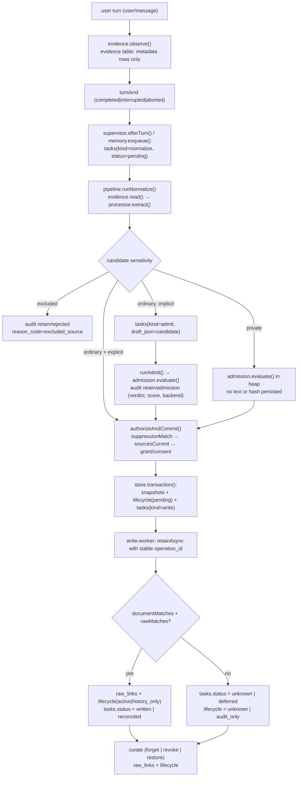

# Memory

This document covers the **write half** of memory: how a session turn becomes an immutable, approved snapshot and eventually a document retained by Hindsight. It is for anyone changing the memory pipeline, the admission backends, the authorization rules, or the background workers. The read half is [RECALL.md](./RECALL.md).

The write path is a chain of independent gatekeepers, and each one can only say "no" or "not yet" — never "probably yes":

1. **Evidence** (`evidence.ts`) turns live session events into immutable, metadata-only citations.
2. **Normalize/admit jobs** (`memory-pipeline.ts`) read that evidence, ask a model to extract candidates, and route each candidate.
3. **Value admission** (`admission.ts`) decides whether a candidate is worth keeping at all.
4. **Authorization** (`memory-authorization.ts`, `trust.ts`) decides whether policy allows keeping it and, if so, commits atomic state.
5. **Retention** (`write-worker.ts`) submits the approved snapshot to Hindsight and only claims `written` with live document + raw proof.
6. **Curation** (`curate-worker.ts`) retracts or restores already-retained material.
7. **Scheduling** (`memory-supervisor.ts`) owns the single tick, job slots and leases; `memory.ts` wires all of it together.

Everything above is orchestrated by `dsh/plugins/dsh-lepimemory-state/src/memory.ts` `createMemoryRuntime()`, which is constructed once per plugin load in `index.ts`.

## Why the write path is built this way

Three rules explain most of the code:

- **Model text is never truth.** Extraction, value judgement, grant matching and observation verification all return closed-schema values validated in `contracts.ts` (`validateResult()`); the coordinator binds identity, timestamps and every admission score itself. Nothing a model returns is written to disk verbatim.
- **Policy is checked synchronously against the current store, not against a carried copy.** `trust.ts` `candidateExclusion()` re-reads `lifecycle`, `grants` and `forget_scopes` on every call, and `memory-authorization.ts` `current(scope)` re-checks the live agent handle, abort state, fence and `store.policyEpoch` after every `await`.
- **Nothing is claimed without proof.** A write task reaches `written` only when `documentMatches()` and `rawMatches()` prove that the remote document and at least one valid raw carry the approved snapshot's exact `payload_hash` (`write-worker.ts` `commitProof()`).

## Session evidence capture

`dsh/plugins/dsh-lepimemory-state/src/evidence.ts` `createEvidenceIndex()` is registered on `session/event` in `index.ts` (`ctx.on('session/event', …)` → `evidence.observe(session, event)`). It is a pure observer: it never appends to the session, never starts a task and never re-enters the session store.

### Metadata-only rows, bodies on the heap

Rows in the `evidence` table store **references, not text**: `id, session_id, message_id, seq, block_index, start, end, actor, at, kind` (schema in `store.ts`). Body text lives only in the in-process `bodies: Map<string, Array<string | undefined>>` keyed by message id and indexed by content-block position. `persistRows()` computes the id with `encodeId()` — a base64url JSON tuple `[sessionId, messageId, seq, blockIndex, start, end]` — and `decodeEvidenceId()` is the only decoder.

Because bodies are not on disk, they can only be recovered two ways:

| Situation | Body source | Method |
| --- | --- | --- |
| Uncommitted input (a splice that has not become a committed message) | current heap | `sliceBody()` — the exact `[start, end)` slice of the remembered block |
| Committed input (`user` / `assistant` / `action` / `context`) | current canonical surface | `sessionQuery.readSurface(sessionId)` + `deriveEventMessage()`, then `sliceMessage()` |

The committed path deliberately re-reads the **canonical surface** (with `replace`/projections already applied) rather than trusting the heap: a message that was shadowed by a history redaction is simply not on the surface any more and cannot be resurrected from an old audit log. If no surface proof is available at all, `resolveRow()` returns `LEPI_CONTROL_UNAVAILABLE`; if the surface exists but the node/slice is missing, it returns `LEPI_INPUT_RESUBMIT_REQUIRED`.

### Actor attribution

`observe()` reads the real dsh envelopes and assigns exactly one actor per committed source:

| Session event | Read path | Actor | `kind` |
| --- | --- | --- | --- |
| `user/message` with `event.data.source.kind === 'user'` | `event.data` is the `UserMessage` | `user` | `user_message` |
| `user/message` with any other source kind (injected context, notices, recall text) | same | `context` | `context` |
| `assistant/message` | `event.data.message` | `assistant` | `assistant_message` |
| `tool/result` where the journal confirms execution | `event.data.message` | `action` | `verified_action` |
| `agent/inbox/spliced` (`inserted[]`) | `event.data.inserted[]` | `user` | `splice` |

Only **public text blocks** are captured: `textBlocks()` keeps `block.type === 'text'` and skips reasoning, tool-call and media blocks. There is no reasoning capture anywhere in the module. Media (`image`/`file`) is only *flagged* (`mediaFlags`); `mediaHeld()` then holds such messages conservatively unless a policy gate decides otherwise.

`tool/result` is _not_ proof of an action: `actionExecuted(sessionId, callId)` requires a row in the `actions` table with `status === 'executed'` (the journal written by `action.ts`, see [ACTION.md](./ACTION.md)). A tool result with `isError === false` alone produces no evidence at all.

`context` never becomes an independent fact: `recent()` and `turnWindow()` filter with `actor IN ('user','assistant','action')`, and the extraction contract only accepts `context` sources as supporting material (see [CONTROL.md](./CONTROL.md)).

### First-splice wins, and request-scoped claims

Two mechanisms keep uncommitted input honest:

- `ensureSplice()` writes exactly one `splice` row per message id. When the same id is requeued, the **first** `seq`/`at` is preserved (`earliestSplice` lookup plus the `firstSplice` map) — a requeue never refreshes time. `recordCommitted()` then reuses the original splice timestamp so a committed source's `at` is stable too.
- `claimed()` records the step's active input for the agent (turn, step, epoch, message ids). A `splice` that is not yet committed is only readable when it is either part of that live claim (same epoch) or covered by an exact `requestClaims` entry installed by `holdRequest(requestId, ids, agent)`. The caller must first prove the request row is a `remember`/`correct`/`re_remember` request, in the same session, whose stored `source_ids_json` contains every requested id. `advanceClaim()` is the only way to move a claim to a new epoch, and it requires `epochNow() === previousEpoch + 1` as well as a matching live or request claim. These three entry points are the seam used by the control plane after consent; their policy semantics are described in [CONTROL.md](./CONTROL.md).

### Read gates and budgets

`read(ids, { agent, signal, request_id })` is the only public read. Per id it:

1. loads the row, rejects another session with `LEPI_CONTROL_UNAVAILABLE`;
2. consults the optional `setReadableGate(fn)` (injected in `index.ts` as `history.isReadable`); a falsy/throwing gate yields `LEPI_INPUT_RESUBMIT_REQUIRED`;
3. resolves the body as described above.

`recent()` is the bounded-context helper: at most `RECENT_SCAN_LIMIT = 200` rows (`kind <> 'splice'`, actor in user/assistant/action) are scanned, then trimmed **whole-block** from newest to oldest until `maxChars` is reached — a slice is never cut mid-sentence, so a negated or conditional statement is either included in full or not at all.

## The normalize/admit pipeline

`dsh/plugins/dsh-lepimemory-state/src/memory-pipeline.ts` `createPipeline()` is the only module that turns evidence into candidates. It contains **no SQL**: policy reads and writes go through the authorizer, the two stores and `store.transaction()`.

### Where normalize jobs come from

Two producers, both in `memory-supervisor.ts`:

- `enqueue({ request_id, session_id, source_ids, kind, explicit, turn })` — called from `index.ts` as `memory.enqueue`, ultimately from the control plane after it recognises a real memory operation. It de-duplicates on `request_id` via `taskStore.findByRequest()`.
- `afterTurn(session, event)` — on `turn/end` with `data.reason.kind ∈ { completed, interrupted, aborted }`, and only when this process witnessed the matching `turn/start`. It queues the delivered `user`/`assistant`/`action` evidence in `(startSeq, endSeq]` via `evidence.turnWindow()`, de-duplicates on `(session_id, turn)` by scanning existing normalize payloads, and skips non-`completed` closers that contain no assistant/action row. A cold resume never reconstructs a missed turn (`if (!start) return;`).

Both insert a `tasks` row of kind `normalize` with `status='pending'` inside `store.transaction()`, together with an audit row, then call `wake()`.

### `runNormalize()`

Steps, in order:

1. Parse the payload; missing session or zero source ids → `finish(task, 'cancelled', …, { clearDraft: true })`.
2. Capture `epoch0 = store.policyEpoch` and `fence0 = latestFence()`; resolve the live agent with `ctx.agents.get(sessionId)` and require `liveRoot(agent)`. A missing/dead agent → `unknown`. `fenced(sessionId)` (an unapplied `history_work` row) → `unknown` for explicit requests with `LEPI_INPUT_RESUBMIT_REQUIRED`, `cancelled` otherwise.
3. `evidence.read(sourceIds, …)`. Exclusions are classified: any `LEPI_INPUT_RESUBMIT_REQUIRED` in the list means the caller must resubmit (`unknown` + that code), otherwise `LEPI_CONTROL_UNAVAILABLE`.
4. `processor.extract({ agent, source_ids, explicit, request_id }, { signal })`. This is where the process model may call `fetch_context` / `fetch_memory` under the evidence budget. Failure classification:
   - `ContractError` → **one** schema retry: `patchPayload(task, { schema_retry: true })` then `rearmPending()` with the first backoff step; a second contract failure finishes `unknown`.
   - deterministic codes (`LEPI_INPUT_RESUBMIT_REQUIRED`, `LEPI_EVIDENCE_BUDGET`) → `unknown`, no retry.
   - anything else → `hooks.scheduleRetry(task, code)` (bounded backoff).
5. After the extraction `await`, re-check `store.policyEpoch === epoch0`, `latestFence() === fence0`, `liveRoot(agent)` and `signal.aborted`; a mismatch finishes `unknown` with `LEPI_INPUT_RESUBMIT_REQUIRED`.
6. For each candidate, build the `baseScope` (`agent, signal, sessionId, explicit, requestId, requestKind, turn, epoch, fence`) and call `processCandidate()`, stopping at the first cancellation signal.

The task's terminal status is then derived from the collected outcomes:

| Outcomes | Task status | Code |
| --- | --- | --- |
| any `failed` | `unknown` | `LEPI_CONTROL_UNAVAILABLE` |
| `explicit` and any `suppressed` | `unknown` | `LEPI_INPUT_RESUBMIT_REQUIRED` |
| otherwise | `reconciled` | — |

`reconciled` here means "this extraction round is complete", not "everything was retained"; per-candidate outcomes are recorded in the audit ledger (see [OBSERVABILITY.md](./OBSERVABILITY.md)).

### Candidate outcomes and the private/normal split

`processCandidate()` is the routing decision:

| Candidate | Decision |
| --- | --- |
| `sensitivity === 'excluded'` | audit `retain` / `rejected` with `reason_code: 'excluded_source'`, outcome `rejected` |
| `sensitivity === 'private'` | judge in the heap, then `authorizeAndCommit()` |
| otherwise, `scope.explicit` | `authorizeAndCommit()` directly with `reason_code: 'explicit_request'` |
| otherwise, implicit | `createAdmitTask()` and return `deferred` |

- **Excluded** (`credentials`/`government_id`/`exact_address`/`payment`-class content) is rejected before any judgement, and `candidateExclusion()` refuses it on the read side as well.
- **Private** is judged *in memory only*: `evaluateAdmissionBounded()` runs, and the outcome is only used to decide whether to continue. No text and no hash reach `snapshots`, `tasks.draft_json` or the audit `data` until `authorizer.authorizeAndCommit()` succeeds. An explicit private request skips value judgement entirely (`reason_code: 'explicit_request'`) but still has to pass the grant/consent path in the authorizer.
- **Ordinary, non-explicit** candidates are deferred to a durable `admit` task. This is the one place where a candidate body is persisted before approval: `createAdmitTask()` stores the candidate JSON in `tasks.draft_json` with `status='pending'`, plus an audit row. The task is short-lived (`taskTtlMs`, default 7 days) and the draft is cleared (`clearDraft`) on every terminal path.
- **Ordinary, explicit** ("remember this", "correct this") bypasses the queue and goes straight to `authorizeAndCommit()` — the value backend is never asked about something the user asked to remember.

`evaluateAdmissionBounded()` wraps the admission call with the shared bounded backoff (`BACKOFF = [1000, 2000, 4000]` from `memory-common.ts`): an `AdmissionError` becomes a deterministic `reject`/`value_reject`, a transient failure or a `defer`/`backend_unavailable` result is retried at most three times, and a scope that stops being current returns `null` (which the caller reports as `deferred` with `backend_unavailable`).

### `runAdmit()`

`runAdmit()` reconstructs the candidate from `tasks.draft_json`, forces `explicit: false` (a deferred candidate is by definition not an explicit request) and re-derives `request_id`. It then:

1. resolves the live agent and `fenced(sessionId)`;
2. calls `authorizer.guards.sourcesCurrent(candidate, scope)` — every source id must still read back — before spending a model call;
3. calls `admission.evaluate()` and audits `retain` / `admission` with `verdict, reason_code, score, backend, model, revision, truncated`;
4. maps the verdict: `reject` → `cancelled` + clear draft; `defer` + `backend_unavailable` → `scheduleRetry`; other `defer` → `deferred` (draft kept, so the judgement can be revisited); `accept` → `authorizeAndCommit()`, then `reconciled` / `unknown` / `cancelled` depending on the outcome.

An `AdmissionError` at this stage is treated as deterministically unusable (`cancelled`, draft cleared); `LEPI_INPUT_RESUBMIT_REQUIRED` and `LEPI_EVIDENCE_BUDGET` finish `unknown` without retry; everything else is retried with backoff.

## Value admission

`dsh/plugins/dsh-lepimemory-state/src/admission.ts` `createAdmission()` is deliberately separate from authorization: it answers "is this worth keeping for a long-term companion?", never "may we keep it?". Construction validates config and touches nothing else — no connection, no request, no timer; only `evaluate()` talks to a backend.

### Rule-based short circuit

`evaluate()` normalises the candidate first (`normalizeCandidate()` validates `text` (≤ `CANDIDATE_TEXT_MAX = 4000`), `content_kind`, at least one `source_ids` entry, and drops any unknown enum value to `null`). Then:

- `explicit === true` → `accept` / `explicit_request`, **without calling a backend**. This is the rule-based value judgement: a user's explicit request is by itself sufficient value.
- an aborted signal → `defer` / `backend_unavailable`.

### Backend `laya` (default)

`LEPI_ADMISSION_BACKEND=laya` (the default in `config.ts` `DEFAULTS.admissionBackend`) posts one request to `${LEPI_LAYA_URL}/v1/systemone` with:

```json
{
  "model": "multilingual",
  "lang": "zh",
  "max_len": 2048,
  "state": { "candidate": { ... }, "related": [ ... ] },
  "questions": { "should_store": { "type": "noul", "instructions": "…" } }
}
```

`LAYA_MODEL`/`LAYA_REVISION` are pinned constants (`multilingual`, `1720e3e3357cfe1e281542e223f8273b0890ca34`) rather than runtime probes. The response must contain `answers.should_store.type === 'noul'`, a finite `noul` score in `[0, 1]`, and a boolean `usage.truncated`; anything else is treated as `backend_unavailable` rather than being interpreted. The score is used as-is — the module's contract comment is explicit that laya reports its own `noul` value, not a calibrated confidence, and no probability is invented (a generative score is `null`).

Thresholds are a two-tier pair per `content_kind`: `temporary_state` and `other` use the stricter `transient` thresholds, everything else `durable` (`config.ts` `layaThresholds`, env `LEPI_LAYA_ACCEPT_DURABLE` / `LEPI_LAYA_ACCEPT_TRANSIENT`). The decision is:

| Condition | Verdict | `reason_code` |
| --- | --- | --- |
| `score >= tier.accept` | `accept` | `value_accept` |
| `score <= tier.reject` | `reject` | `value_reject` |
| otherwise | `defer` | `value_uncertain` |

### Clipping is not acceptance

Truncated input can never be accepted. `detectTruncation()` is conservative: `usage.truncated === true`, a positive numeric `truncated`, a positive `state_tokens_dropped`, a non-empty `truncated_questions`, or a collapsed `options` object all count. Additionally, a serialized body over 50 000 characters, or an HTTP 413, defers with `input_truncated`. A truncated response yields `defer` / `input_truncated` even if the score would have been fine.

### Backend `generative`

`LEPI_ADMISSION_BACKEND=generative` routes through the fixed process model (`LEPI_PROCESS_MODEL`): `processor.evaluateAdmission({ candidate, source_ids, context_sources, agent })` must return a value that passes `validateResult('admission')`, i.e. only `verdict` + a `reason_code` from the closed map in `contracts.ts` (`accept` → `explicit_request`/`value_accept`; `reject` → `value_reject`; `defer` → `value_uncertain`/`backend_unavailable`/`input_truncated`). Score, backend, model, revision and `truncated` are assembled by the coordinator, never read from the model. Any throw or invalid value becomes `defer` / `backend_unavailable`.

### Related context and health

Both backends are given up to `MAX_RELATED = 3` related snapshots (`relatedContext()`), selected from `active` lifecycle rows for the same `subject_key` through a deliberately conservative filter chain: not in any active forget scope, bound grant live and unexpired (a `NULL` `grant_id` means "no extra restriction"), candidate `valid_until` not elapsed, and text actually recoverable from the snapshot JSON. Any store read failure returns an empty list rather than unverified material.

`health()` returns the last *observed* backend facts — `{ backend, available, model, revision, truncated }` — with no endpoint, key or body content. It never issues a request. This value is surfaced in the plugin health payload (`memory.ts` `health()`), described in [OBSERVABILITY.md](./OBSERVABILITY.md).

## Authorization and policy

`dsh/plugins/dsh-lepimemory-state/src/memory-authorization.ts` `createAuthorization()` is the write-side policy owner and the only module allowed to commit a candidate. It also exposes five guards reused by the pipeline, the workers and the supervisor.

### Guards

| Guard | Meaning |
| --- | --- |
| `liveRoot(agent)` | not disposed, the agent handle is still the one `ctx.agents.get(id)` returns, and it is still in `ctx.agents.roots()` |
| `fenced(sessionId)` | an unapplied `history_work` row exists for this session (a redaction is in flight) |
| `current(scope)` | `liveRoot` + not aborted + not fenced + `store.policyEpoch === scope.epoch` + `latestFence() === scope.fence` |
| `sourcesCurrent(candidate, scope)` | re-reads every candidate source id through `evidence.read()` and requires all of them to still resolve |
| `latestFence()` | `SELECT max(epoch) FROM forget_scopes` |

`store.policyEpoch` is the `policy_epoch` counter in the `meta` table (`store.ts`); it is bumped inside transactions (`bumpPolicyEpoch()`), which is what makes "epoch changed" a reliable signal that some policy decision happened while an async step was in flight.

### Suppression before relevance

`suppressionMatch(candidate, scope)` runs **first** in `authorizeAndCommit()` and only ever uses the *typed* selector of each active forget scope (`selector_json` → `subject_key` + `facet_key`), never the forgotten text: the code comment states that an old, possibly forgotten value is never re-sent to a model for matching (except through the `typed` projection with empty `text`/`source_ids` in `checkWritePolicy()`). A scope with no usable selector is conservatively treated as suppressing. `processor.matchGrant()` is called with `purpose: 'forget'`; `covered` and `uncertain` both suppress. A `re_remember` request can pass a set of `exception_scope_ids` that exempts specific scopes. The result is audited as `forget` / `suppressed` with `reason_code: 'forget_scope'`, and the candidate outcome is `suppressed` for explicit requests, `rejected` otherwise.

Note the ordering implication: a candidate that is suppressed never reaches the value backend in the private path, and never reaches a commit in either path. Policy is cheap and local; relevance is expensive and remote. The read side follows the same rule (see [RECALL.md](./RECALL.md)).

### Grants, consent and the private path

For `sensitivity === 'private'`, `authorizeAndCommit()` needs a grant:

1. `matchActiveGrant()` first tries the existing live grants (`revoked_at IS NULL AND expires_at > now`). `item` scopes must match `candidate_id`, session and source-id array exactly; `topic` scopes must match session (if the scope is session-bound) and pass `processor.matchGrant()`; `continuous` scopes are session-independent. An `inference` candidate additionally requires `allow_inference`.
2. Otherwise `askPrivate(candidate, agent, { signal })` (implemented by the control plane's consent flow — see [CONTROL.md](./CONTROL.md)) is asked. The outcome must be `allowed` with a real `grant_id`, and the epoch/fence must have advanced by exactly the amount the consent flow implies.
3. `validateOwnGrant()` then re-reads that grant from the database and requires: not revoked, not expired, same session, `scope.kind === 'item'`, `scope.candidate_id === candidate.candidate_id`, `source_ids_json` equal to the candidate's `source_ids`, `allow_inference` exactly equal to whether the candidate is an inference, a still-live agent, `store.policyEpoch === epochBefore + 1`, and an unchanged fence. Anything else is `cancelled` and audited as `consent` / `cancelled` with `reason_code: 'grant_invalid'`.

The scope kinds and their semantics (`item` / `topic` / `continuous`) are defined in [CONTROL.md](./CONTROL.md); this module only verifies them.

### Atomic commit

`commitApproved()` performs the only state-creating transaction in the write path. Inside a single `store.transaction()`:

1. re-assert `store.policyEpoch === expectedEpoch` and `latestFence() === expectedFence`, throwing `LEPI_INPUT_RESUBMIT_REQUIRED` otherwise;
2. `candidateStore.insertPending()` → `INSERT INTO snapshots` + `INSERT INTO lifecycle` with `status='pending'`, `purpose='current'`, `confirmed_by = grantId ?? (scope.explicit ? 'explicit_request' : 'auto')` and the current epoch;
3. `taskStore.insert()` → a `write` task with `status='pending'`, `payload_json = { session_id, request_id }`;
4. an audit row `retain` / `pending` carrying `content_kind`, `origin`, `sensitivity`, `reason_code` and `grant_id`.

Either all four happen or none do. The snapshot row is immutable in the database itself: `store.ts` installs a trigger that raises `LEPI_SNAPSHOT_IMMUTABLE` on any update to `snapshots`.

### Trust tiers and decay

`dsh/plugins/dsh-lepimemory-state/src/trust.ts` owns the read-side interpretation of trust, but the vocabulary is fixed by the write path: a candidate's `origin` is bound at extraction time and stored in the immutable snapshot.

| `origin` | Trust tier | Decay |
| --- | --- | --- |
| `user` | `fact` | none |
| `action` | `experience` | none |
| `inference` | `inference` | half-life `INFERENCE_HALF_LIFE_MS` = 14 days |
| missing / unknown | `unknown` | — (always excluded from recall) |

`trustOf()` only ever reads `candidate.origin` (plus a parseable `formed_at`); it explicitly refuses to fall back to remote `metadata.trust`, `type` or `observation`. `decayFactor()` applies `Math.pow(0.5, ageMs / INFERENCE_HALF_LIFE_MS)` for inferences only, and returns `1` when the timestamp is unparseable ("rather keep than kill"). `scoreOf()` combines the native `scores.semantic` with that factor into `effective = semantic * factor`.

### `candidateExclusion()`

The shared, synchronous, body-free pre-check. It is called on the **read** side by `recall.ts` (`createRecallSources()` injects it as `checkSource`) and by `hindsight.ts` `attribute()`. The write side re-derives the equivalent checks against a task in `memory-authorization.ts` `checkWritePolicy()`, because it must additionally verify snapshot, task and request state that a read never sees. Given a snapshot-bound candidate it returns `null` (allowed) or a stable code:

| Check | Code |
| --- | --- |
| missing/empty `candidate_id` | `LEPI_SNAPSHOT_INVALID` |
| `sensitivity === 'excluded'` | `LEPI_MEMORY_SUPPRESSED` |
| no `lifecycle` row | `LEPI_SOURCE_UNKNOWN` |
| status not allowed for the purpose (`current` → `active`; `history` → `active`, `history_only`, `superseded`) | `LEPI_MEMORY_SUPPRESSED` |
| `valid_from` in the future, or `valid_until` elapsed (for `current` only) | `LEPI_MEMORY_SUPPRESSED` |
| `private` without its original grant row, with a bad scope kind, with `inference` origin on a grant that forbids inference, or with source-id/session mismatch | `LEPI_GRANT_INVALID` |
| candidate id listed in any `active` forget scope's `candidate_ids_json` | `LEPI_MEMORY_SUPPRESSED` |

Two subtleties matter. First, the lifecycle status is always re-read from the current `lifecycle` table — a status carried inside a compound object is treated as stale. Second, for private candidates only the *existence and shape* of the original grant is required, not its current validity: "a grant that later expired or was revoked only blocks **new** saves; it never retroactively deletes an explicitly retained active/history source" (module comment). Grant expiry therefore gates `checkWritePolicy()` and `matchActiveGrant()`, not `candidateExclusion()`.

## Persistence owners

Two small modules own the two tables the coordinator writes most often. Both are deliberately narrow: they expose named operations and never open their own business transaction.

### `candidate-store.ts` — `snapshots` + `lifecycle`

| Operation | SQL effect |
| --- | --- |
| `insertPending({ candidateId, json, payloadHash, confirmedBy, grantId, epoch })` | `INSERT INTO snapshots(...)` + `INSERT INTO lifecycle(status='pending', purpose='current', ...)` |
| `listOrphanPendingWrites()` | pending lifecycle rows with no reachable `write` task in `pending`/`running`/`submitted`/`deferred` |
| `markAuditOnly(candidateId, at)` | `UPDATE lifecycle SET status='audit_only' WHERE candidate_id=? AND status='pending'` |

`payloadHash` is `sha256` of the exact snapshot JSON; `loadSource()` (in `raw-source.ts`) re-verifies it on every load and throws `LEPI_SNAPSHOT_INVALID` on mismatch or if the embedded `candidate_id` disagrees.

### `task-store.ts` — `tasks`

The single writer for the queue. Notable operations:

| Operation | Behaviour |
| --- | --- |
| `claimReady(lease, at)` | one short transaction: `SELECT` the oldest ready `normalize`/`admit` row (`status='pending' AND next_at<=? AND expires_at>?`) then `UPDATE ... status='running', lease_owner=?`. The returned row still reads `pending` — only the claim is durable. |
| `insert(row)` | raw `INSERT`; the caller keeps it inside its own transaction |
| `finish(id, {status, code, nextAt, draftJson}, audit)` | guarded update: only from `running`/`pending`, otherwise returns `false` |
| `retry(id, {status, attempts, code, nextAt}, audit)` | bounded backoff bookkeeping, same guard |
| `rearmForRetry(id, {status, nextAt}, audit)` | operator retry: resets `attempts=0`, clears lease and `error_code` |
| `rearmPending(id, {code, nextAt})` | schema retry: single `UPDATE ... status='pending'` |
| `dueForExpiry(at)` / `expireRow(id, payload)` | rows of kind ≠ `curate` with `submitted_at IS NULL`, status in `pending`/`deferred`/`running`, `expires_at <= at` → `expired`, draft cleared, payload replaced |
| `countByKindStatus()` | health projection |

The `tasks` table is the durable home of retries, leases, drafts and the remote `operation_id` (unique). Its full column list and audit linkage belong to [OBSERVABILITY.md](./OBSERVABILITY.md).

## Remote retention

`dsh/plugins/dsh-lepimemory-state/src/write-worker.ts` `createWriteWorker()` pumps `write` tasks against Hindsight. It receives `checkPolicy` (the authorizer's `checkWritePolicy`) so that policy stays owned by one module.

### Stable async identities

Retention uses Hindsight's asynchronous API with a **client-allocated UUID**:

- `submitFresh()` computes `opId` as the existing `task.operation_id` if it is already a UUID, otherwise a fresh `randomUUID()`, and writes it together with `status='submitted'`, `submitted_at` and a payload recording `bank`, `document_id`, `payload_hash` and `policy_epoch` — all in one guarded transaction (`WHERE id=? AND submitted_at IS NULL`).
- `hindsight.retainAsync(item, { operationId: opId, signal })` posts `POST /memories` with `{ items: [item], async: true, operation_id: opId }`. A missing/invalid `operation_id` is rejected client-side with `LEPI_HINDSIGHT_CONFLICT`.
- If the acknowledgement is lost (network failure), the task is retried **with the same operation id**: the next pass only queries the operation instead of re-posting. A lost request is never blindly re-sent, and the module comment is explicit that the allocated UUID survives even when a live pre-POST policy change undoes the submission marker (`revertUnsent()` clears `submitted_at`, never `operation_id`).
- An ack whose `operation_id` differs from the allocated one is a permanent `failed` / `LEPI_HINDSIGHT_CONFLICT`.

The item itself comes from `raw-source.ts` `retainItem()`: `content = candidate.text`, `timestamp = candidate.formed_at`, `document_id = 'lepi-' + candidate_id`, metadata carrying `candidate_id`, `payload_hash`, `content_kind`, `origin`, validity window and a derived `trust` string, `tags: ['lepimemory:v2']`, `update_mode: 'replace'`.

### Proof, not optimism

Every terminal "landed" path requires proof against the immutable snapshot:

- `documentMatches(document, source, bank)` requires the remote document id `lepi-<candidate_id>`, the configured bank, `original_text === candidate.text`, and `document_metadata.candidate_id`/`payload_hash` equal to the snapshot's.
- `rawMatches(raw, source, state)` requires a raw of `fact_type` `world` or `experience`, `state` equal to the expected state (`valid`, or `invalidated` for cleanup), non-blank text, `document_id === source.documentId`, and matching `candidate_id`/`payload_hash` metadata.
- `rawVersion(raw)` is a sha256 over a canonical projection of `{id, document_id, text, metadata, fact_type, date, mentioned_at, occurred_start, occurred_end}` — retrieval scores and curation timestamps are deliberately excluded so a version hash identifies *content*, not state.

`pollSubmitted()` switches on the operation status:

| Operation status | Action |
| --- | --- |
| `pending`, `processing` | `keepSubmitted()` — re-arm the 2 s poll, `attempts` reset, audit `phase: 'poll_scheduled'` |
| `not_found` | `reconcileOrUnknown()` — check document + valid units; commit `reconciled` only if both prove the payload; else `unknown` |
| `completed` | `verifyCompleted()` — require `documentMatches()` and ≥1 matching valid raw, then `commitProof(..., 'written', epoch)` |
| `cancelled` | treat as forbidden retention: mark cleanup and run the remote cleanup path |
| `failed` | terminal `failed` with `LEPI_HINDSIGHT_UNAVAILABLE` and `audit_only` lifecycle |
| anything else / 404 on the operation endpoint while polling | retry with backoff / reconcile |

`commitProof()` is the single landing transaction: it upserts one `raw_links` row per matched raw (with `rawVersion(raw)` as `version_hash`), promotes the lifecycle row with `UPDATE lifecycle SET status=?, policy_epoch=? WHERE candidate_id=? AND status IN ('pending','unknown')`, and finishes the task as `written` (or `reconciled`). The promoted status is `history_only` when `valid_until` has already elapsed (`timeExpired()`), otherwise `active`. If the epoch changed inside the transaction, the task is rescheduled rather than committed.

Failures that must not fake success:

- `LEPI_RETAIN_EMPTY` — the operation reported `completed` but no usable raw exists (also used when the task has lost its UUID).
- `LEPI_WRITE_TARGET_CHANGED` — the task payload's `bank` no longer matches the client's bank; the task ends `unknown` and the lifecycle row becomes `unknown`.
- `LEPI_SOURCE_CHANGED` — a raw/link version mismatch during proof or cleanup.
- `LEPI_SNAPSHOT_INVALID` — the snapshot cannot be loaded or its hash does not match.

### Backoff and polling

| Situation | Timing |
| --- | --- |
| Not yet submitted (`submitted_at IS NULL`) | `BACKOFF = [1000, 2000, 4000]` ms; after the third failure the task becomes `deferred` (never revived automatically) |
| Already submitted, transient failure | status stays `submitted`; retry after `BACKOFF[attempt-1]` ms, then `deferred` after the budget is exhausted |
| Submitted and healthy | `POLL_MS = 2000` between operation polls |
| Cleanup required | status stays `cancelled` with `payload_json.cleanup = 'required'`; retried every `POLL_MS` |

The claim query accepts `pending`/`submitted` rows whose `next_at` is due **and** which are either submitted or unexpired (`submitted_at IS NOT NULL OR expires_at > ?`), plus `cancelled` rows flagged for cleanup. So a submitted retention is never silently dropped by task expiry — only the remote outcome can finish it.

### Cancellation is not retraction

A denial that arrives *after* a submit does not simply cancel the task. `execute()` distinguishes:

| Situation | Path |
| --- | --- |
| policy denies and `submitted_at IS NULL` | `terminal(task, 'cancelled', code, { auditOnly: true })` — nothing was sent, no remote work to undo |
| policy denies after submission | `markCleanup(task)` then `runForbiddenCleanup()` |
| operation later reports `cancelled` | same cleanup path |
| cleanup already superseded by a verified restore | payload flag becomes `cleanup: 'superseded'` and the task stops; restored sources are **not** re-invalidated |

`runForbiddenCleanup()` cancels the operation, invalidates every matching raw one at a time (verifying each appears in the `invalidated` listing with the same semantic version and is gone from the `valid` listing before it marks the local `raw_links` row), then re-scans both listings. The task is only finished `cancelled` when the operation reached a terminal state *and* no valid raw remains; `not_found` is treated as uncertainty, not as proof, because a lost request could still land. It never promotes a lifecycle row to `active`.

## Curation of already-retained items

`dsh/plugins/dsh-lepimemory-state/src/curate-worker.ts` `createCurateWorker()` handles the three operations that act on material that already has a lifecycle row: `forget`, `revoke` and `restore`. Tasks of kind `curate` are never expired by the sweeper (the `tasks` expiry query excludes the kind) — curation keeps tracking until it has proof.

| Payload `kind` | Precondition on lifecycle | Effect |
| --- | --- | --- |
| `forget` | row must be `forgotten` | retract all remote raws bound to the candidate |
| `revoke` | `active` / `history_only` → **kept**; `pending` / `unknown` → retract | a revoked grant never retracts memories the user already keeps (module constant `REVOKE_KEEP`), only in-flight/unlanded ones (`REVOKE_RETRACT`) |
| `restore` | row must be `unknown` | revert invalidated raws back to `valid` and set lifecycle `active` or `history_only` |

### Retraction

`retractCandidate()`:

1. cancels every still-running write operation for the candidate (stable operation ids, no blind retry);
2. reads the remote document plus the `valid` **and** `invalidated` unit listings;
3. decides:
   - remote entirely empty → `succeeded` only if every operation is terminal and no local `raw_links` row survives; otherwise `pending` / `LEPI_CURATE_UNPROVEN`;
   - document present but no matching raw → unprovable;
4. for each valid matching raw: assert the existing link version matches (`LEPI_CURATE_MISMATCH` otherwise), insert a link row if missing, `PATCH /memories/<id>` with `state: 'invalidated', reason: 'lepimemory:<requestId>'`, then re-verify the invalidated listing *and* that the id is gone from the valid listing before marking the local link `invalidated`;
5. already-invalidated raws still have to match the original semantic version;
6. the final check re-reads `valid` units; any survivor keeps the task `pending` with `LEPI_CURATE_UNPROVEN`.

`requestId` for the remote reason string is a real UUID: `uuidOr(task.request_id) ?? task.id`.

### Restoration requires unchanged-source proof

`restoreCandidate()` is the strictest path in the system, because restoring is re-publishing content the user once removed:

- the lifecycle row must currently be `unknown`, and at least one `raw_links` row must exist (`LEPI_CURATE_SOURCE_MISSING` otherwise);
- a `gate()` runs before **every** await and before the final apply: it re-asks `checkPolicy(source, task, { restore: true })` and requires the same epoch as the first acceptance plus `store.policyEpoch === epoch`; a change yields `pending` / `LEPI_POLICY_CHANGED` (reschedule, never cancel);
- `documentMatches()` must prove the document still carries the approved payload;
- each link must resolve to a raw found in the `valid`/`invalidated` pool, matching `rawMatches()` for its state **and** having `rawVersion(raw) === link.version_hash` — i.e. the remote content must be byte-identical to what was originally retained. Anything else is `LEPI_CURATE_MISMATCH`;
- invalidated raws are reverted one at a time and each revert is re-verified through the `valid` listing with the same version before continuing;
- only then does one transaction set the lifecycle row to `active` (or `history_only` when `valid_until` has elapsed) and flip all links back to `valid`, audited as `forget` / `restored`.

### Progress, retries and error classification

`processTask()` persists a body-free progress record (`attempted_ids`, `succeeded_ids`, `kept_ids`, `pending_ids`) into `tasks.payload_json` after each candidate and skips ids already marked succeeded/kept on a re-run, so a crash mid-task is idempotent.

`finalize()` maps the aggregate to a status: any `pending_ids` → `pending` with backoff (`1000 / 2000 / 4000` ms capped) and code `LEPI_CURATE_UNPROVEN` unless a more specific error was recorded; otherwise any `failed_ids` → `failed`; otherwise `reconciled`. `finalizeInvalid()` marks a task `failed` with `LEPI_CURATE_INVALID` when the payload kind is unknown or the candidate list is empty.

`mapError()` is the classification rule shared by all three kinds:

| Error | State | Code |
| --- | --- | --- |
| abort / `LEPI_WORKER_STOPPED` | `pending` | `LEPI_WORKER_STOPPED` |
| `LEPI_POLICY_CHANGED` | `pending` | `LEPI_POLICY_CHANGED` |
| HTTP 409 / `LEPI_HINDSIGHT_CONFLICT` | `failed` | `LEPI_HINDSIGHT_CONFLICT` |
| anything else (network, 503, timeout) | `pending` | `LEPI_HINDSIGHT_UNAVAILABLE` |

This is the same "uncertainty keeps the task alive, only proven conflicts kill it" rule the write worker uses.

## Scheduling and concurrency

`dsh/plugins/dsh-lepimemory-state/src/memory-supervisor.ts` `createSupervisor()` is the single owner of timers, job slots and leases. It never imports the pipeline; the facade injects `runTask` and `runRemote`, keeping the import graph acyclic.

### One tick, two slots

- `TICK_MS = 2000`. `start()` installs the interval (and an immediate `tick()`), `wake()` schedules a 0 ms `unref()`ed timer so callers can request prompt progress without a second timer existing.
- Each `tick()` may have at most **one** local job (`normalize`/`admit`, via `job`) and **one** remote job (`write` or `curate`, via `remoteJob`). A remote job that claims work flips `preferCurate`, so the two remote kinds alternate instead of one starving the other.
- `runJob()` claims one task with `claimReady(leaseOwner(), now())`, where the lease owner is lazily minted as `${process.pid}-${randomUUID()}`. The abort controller for that task is registered in `controllers` and cleared in `finally`.
- When no local task is claimable, the same tick performs housekeeping: `expireSweep()` (expire due tasks, clearing drafts — a `write` task keeps its non-body payload) and `reconcileAuditOnly()` (turn orphaned `pending` lifecycle rows into `audit_only` with the audit reason `unwritten_terminal`).
- After a local job finishes, `wake()` is called again so the queue drains sequentially instead of waiting for the next 2 s tick. When a `normalize` task that held a request claim is no longer `pending`, `evidence.releaseRequest(requestId)` runs — releasing the request-scoped evidence claim is therefore bounded by task lifetime, not by a timer.

### Bounded retry and operator retry

`hooks.scheduleRetry()` (passed into pipeline jobs) increments `attempts`, sets `next_at` to `BACKOFF[retries-1]` while under the budget, and flips the task to `deferred` once the budget is exhausted — a deferred task is never revived by the tick, only by an operator.

`retry(taskId)` is the operator entry point for **tasks**, exposed on the memory facade and used by the panel's task-retry route (`panel.ts`; the separate request-level retry is `control.retry()` — see [CONTROL.md](./CONTROL.md)). It only revives statuses in `RETRYABLE_STATUS = { deferred, unknown, failed }`; `cancelled` and `expired` stay dead because they encode policy decisions, not failures. The re-armed status is `submitted` when the task is a `write` that already reached the remote, otherwise `pending`, and the audit row is `task` / `retry_requested`. The returned receipt (`{ task_id, kind, status, code, retryable }`) is what the UI shows.

### Shutdown

`drain()` clears both timers, aborts every task controller and the remote controller, clears bookkeeping and awaits all in-flight jobs. `memory.ts` `dispose()` first aborts all outstanding recall jobs, then drains the supervisor. Nothing is committed during shutdown: workers call `preserve()`/`rescheduleRead()` rather than `terminal()` when they observe an aborted signal, so an interrupt leaves recoverable state.

## Facade wiring

`dsh/plugins/dsh-lepimemory-state/src/memory.ts` `createMemoryRuntime()` constructs the whole graph exactly once and exposes a narrow surface (`enqueue`, `afterTurn`, `start`, `wake`, `retry`, `health`, `dispose`, `recall`, `readMemory`).

```ts
const taskStore      = createTaskStore({ store, now });
const candidateStore = createCandidateStore({ store, now });
const authorizer     = createAuthorization({ ctx, store, taskStore, candidateStore, processor,
                                             evidence, askPrivate, now, taskTtlMs, isDisposed, setError, audit });
const pipeline       = createPipeline({ ctx, store, taskStore, evidence, processor, admission,
                                        authorizer, now, taskTtlMs, setError, audit });
const writeWorker    = createWriteWorker({ store, hindsight, checkPolicy: authorizer.checkPolicy, now });
const curateWorker   = createCurateWorker({ store, hindsight, checkPolicy: authorizer.checkPolicy, now });
const recaller       = createRecaller({ store, hindsight, processor, now });
const supervisor     = createSupervisor({ /* …, runTask, runRemote */ });
```

Construction is **side-effect free**: no query is executed, no timer is created, no hook is registered, and every prepared statement is compiled lazily on first use inside the stores and workers. `index.ts` then:

- creates the evidence index with the store and `ctx.sessionQuery`;
- constructs the processor, admission, history coordinator and control plane;
- calls `createMemoryRuntime({ … askPrivate: (c, a, o) => controlRef.askPrivate!(c, a, o) })` — a forward reference resolved immediately after `createControl()`, because consent belongs to the control plane;
- installs `controlRef.askPrivate`, `processor.setMemoryReader(memory.readMemory)` and `evidence.setReadableGate(history.isReadable)`;
- registers `session/event` (evidence + `afterTurn` + state + receipts), the `agent/pre-step` recall injection, the `manage_memory` tool and the panel;
- calls `memory.start()` last.

`health()` merges the supervisor's task counts with the admission backend's last observed facts and the facade's `last_error`, which is set whenever any owner calls its injected `setError` callback.

## End-to-end flow



The tables touched, in order: `evidence` → `tasks` → (`requests`) → `snapshots` → `lifecycle` → `tasks` → `raw_links` → `audit`. `grants`, `forget_scopes`, `history_work` and `actions` are read as policy/public inputs along the way; their full descriptions and the audit ledger are covered in [OBSERVABILITY.md](./OBSERVABILITY.md).

## Status and enum reference

The lifecycle status vocabulary is enforced by a `CHECK` constraint in `store.ts` and mirrored in `dsh/plugins/dsh-lepimemory-state/src/shared/domain.ts`.

### Lifecycle status

| Status | Written by | Meaning |
| --- | --- | --- |
| `pending` | `candidate-store.ts` `insertPending()` | snapshot approved, write task queued, remote outcome unknown |
| `active` | `write-worker.ts` `commitProof()`, `curate-worker.ts` restore | current, usable material |
| `history_only` | `commitProof()` (expired `valid_until`), `recall.ts` `expireSources()`, restore | real but no longer current |
| `superseded` | `control.ts` `correct` request (`UPDATE ... WHERE status IN ('active','pending','history_only')`, with `cancelUnsent()`) | replaced by a newer value; body kept for audit |
| `forgotten` | `history.ts` forget plan | user removed it; curation then retracts the remote copy |
| `audit_only` | `candidate-store.ts` `markAuditOnly()`, `write-worker.ts` denial/conflict paths | kept as a record only, never recallable |
| `unknown` | `control.ts` restore request (`forgotten` → `unknown`, epoch bumped, ids removed from the active forget scopes), `write-worker.ts` `withSource()`/`terminal()` failures | outcome not proven; the restore precondition |

### Task kind and status

| Enum | Values | Source of truth |
| --- | --- | --- |
| `TaskKind` | `normalize`, `admit`, `write`, `curate`, `history` | `shared/domain.ts`, `CHECK` in `store.ts` |
| `TaskStatus` | `pending`, `running`, `submitted`, `deferred`, `written`, `reconciled`, `unknown`, `failed`, `cancelled`, `expired` | same |
| Outcome of one normalize round | `reconciled` (round complete) | `memory-pipeline.ts` `runNormalize()` |
| Terminal-retryable (`operator retry`) | `deferred`, `unknown`, `failed` | `memory-supervisor.ts` `RETRYABLE_STATUS` |

### Trust tiers

| Tier | Origin | Decay | Recall treatment |
| --- | --- | --- | --- |
| `fact` | `user` | none | rendered as `用户陈述` |
| `experience` | `action` | none | rendered as `已验证的行动` |
| `inference` | `inference` | 14-day half-life | rendered as `未确认的推断`; dropped when decayed below threshold |
| `unknown` | anything else | — | excluded from recall with `LEPI_SOURCE_UNKNOWN` |

### Admission and reason codes

| Verdict | Allowed `reason_code` | Producer |
| --- | --- | --- |
| `accept` | `explicit_request`, `value_accept` | rule short-circuit / laya / generative |
| `reject` | `value_reject` | laya below `tier.reject`, `AdmissionError` |
| `defer` | `value_uncertain`, `backend_unavailable`, `input_truncated` | laya band, unavailable backend, clipping |

## Error-code reference

Codes that the write path and its read-back gates emit, with the module that emits them. `LEPI_CONTROL_UNAVAILABLE` and `LEPI_INPUT_RESUBMIT_REQUIRED` are the shared generics (`memory-common.ts`).

| Code | Emitted by | Trigger |
| --- | --- | --- |
| `LEPI_STORE_UNAVAILABLE` | `evidence.ts` `createEvidenceIndex()` | store or `db.prepare` missing |
| `LEPI_CONTROL_UNAVAILABLE` | `evidence.ts`, `memory-common.ts` `GENERIC_CODE` | unreadable evidence, generic owner failure |
| `LEPI_INPUT_RESUBMIT_REQUIRED` | `evidence.ts`, `memory-authorization.ts` (commit re-check), pipeline | uncommitted/held input, gate refusal, epoch/fence moved mid-flight |
| `LEPI_SNAPSHOT_INVALID` | `raw-source.ts` `loadSource()`, `trust.ts`, `memory-authorization.ts`, workers | snapshot missing, hash mismatch, embedded id mismatch |
| `LEPI_SNAPSHOT_IMMUTABLE` | `store.ts` trigger | attempted `UPDATE` of `snapshots` (by design) |
| `LEPI_MEMORY_SUPPRESSED` | `trust.ts`, `memory-authorization.ts` | status not allowed, excluded sensitivity, forget scope, unresolvable selector |
| `LEPI_GRANT_INVALID` | `trust.ts`, `memory-authorization.ts` | missing/malformed/expired/revoked grant, scope or source mismatch |
| `LEPI_SOURCE_UNKNOWN` | `trust.ts` | no `lifecycle` row for the candidate |
| `LEPI_SOURCE_CHANGED` | `write-worker.ts`, `recall-source.ts` (predicates in `raw-source.ts`) | raw/document/link version mismatch |
| `LEPI_POLICY_CHANGED` | `memory-authorization.ts`, workers | policy epoch moved while a worker held the task |
| `LEPI_WORKER_STOPPED` | `memory-authorization.ts`, `memory.ts` | disposal or abort during a policy check |
| `LEPI_HINDSIGHT_UNAVAILABLE` | `hindsight.ts` (full-scan exclusions), write/curate workers | network/backend failure, unknown operation status |
| `LEPI_HINDSIGHT_CONFLICT` | `hindsight.ts` (HTTP 409 or missing UUID) | conflicting/short-circuited operation identity |
| `LEPI_RETAIN_EMPTY` | `write-worker.ts` | `completed` with no usable raw, or missing operation UUID |
| `LEPI_WRITE_TARGET_CHANGED` | `write-worker.ts` | task payload bank ≠ client bank |
| `LEPI_CURATE_INVALID` | `curate-worker.ts` | unknown curate kind or empty candidate list |
| `LEPI_CURATE_MISMATCH` | `curate-worker.ts` | lifecycle precondition, version or proof mismatch |
| `LEPI_CURATE_UNPROVEN` | `curate-worker.ts` | remote state cannot yet prove the operation completed |
| `LEPI_CURATE_SOURCE_MISSING` | `curate-worker.ts` | restore with no `raw_links` row |
| `LEPI_EVIDENCE_BUDGET` | `processor.ts`, consumed in `memory-pipeline.ts` | tool-call/context budget exhausted during extraction |
| `LEPI_STATE_INVALID` | `store.ts` | `policy_epoch` row unreadable (see [OBSERVABILITY.md](./OBSERVABILITY.md)) |

The user-visible consequences of these codes (what the panel and receipts show) are documented in [OBSERVABILITY.md](./OBSERVABILITY.md) and [TROUBLESHOOTING.md](./TROUBLESHOOTING.md).

## What the write path deliberately never does

- **Never stores bodies in `evidence`.** Only metadata plus a slice coordinate; the text is re-derived from the live canonical surface.
- **Never captures reasoning or non-text blocks.** `textBlocks()` skips them entirely; media is flagged and held rather than stored.
- **Never treats a tool result as an action proof.** Only an `actions` row with `status='executed'` produces `verified_action` evidence.
- **Never persists a private candidate before approval.** Admission for private material happens in the heap; only `ordinary` non-explicit candidates get a durable `admit` draft.
- **Never lets a model invent a score.** The generative backend returns a verdict and a closed reason code; `score` stays `null`.
- **Never accepts clipped input.** Truncation forces `defer` / `input_truncated`.
- **Never claims `written` without live document + raw proof** against the snapshot's `payload_hash`.
- **Never blind-retries a write.** The operation UUID is allocated locally and reused for queries only.
- **Never revives a policy decision.** `cancelled` and `expired` tasks are not retryable; only `deferred`/`unknown`/`failed` are.
- **Never lets a cancellation delete an explicit restore.** Cleanup is marked `superseded` when the lifecycle is already `active`/`history_only`.

## Related documents

- [RECALL.md](./RECALL.md) — the read half: query formation, policy gate, source proof and injection
- [ARCHITECTURE.md](./ARCHITECTURE.md) — subsystem ownership and the life of one turn
- [CONTROL.md](./CONTROL.md) — intent recognition, consents, grants and the `manage_memory` tool
- [OBSERVABILITY.md](./OBSERVABILITY.md) — SQLite schema, audit ledger, receipts and panel routes
- [ACTION.md](./ACTION.md) — the `actions` journal that makes `verified_action` evidence possible
- [CONFIGURATION.md](./CONFIGURATION.md) — `LEPI_LAYA_*`, `LEPI_ADMISSION_BACKEND`, `LEPI_PROCESS_*`, timeouts
- [GLOSSARY.md](./GLOSSARY.md) — candidate, snapshot, lifecycle, trust tier, fence
- [TROUBLESHOOTING.md](./TROUBLESHOOTING.md) — what to do when a code above appears in the ledger
