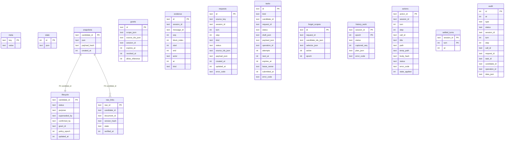

# Observability and audit

This document describes the substrate that makes the Lepimemory character inspectable: the single SQLite database that holds state, evidence, snapshots, tasks and the append-only audit trail, the read projections built on top of it, and the authenticated HTTP surface the browser panel consumes. Read it if you are debugging a bad reply, wondering where a fact in the panel comes from, or changing anything in `dsh/plugins/dsh-lepimemory-state/src/store.ts`, `src/history.ts` or `src/panel.ts`.

The design rule is one sentence long: **every externally visible fact is a row in SQLite, and every mutation writes an audit row in the same transaction.** There is no second source of truth, no derived-file cache, and no in-memory shadow state that a restart can lose.

## Why one database instead of files

The pre-cutover implementation derived the panel from `state.json` plus five `*.jsonl` logs. That made the panel a second implementation of the runtime: statuses drifted, ordering was file order rather than transaction order, and a crashed process could leave a half-written line. The current implementation replaced that with:

- one `node:sqlite` `DatabaseSync` handle owned by `openStore()` in `dsh/plugins/dsh-lepimemory-state/src/store.ts`, opened once per process by `apply()` in `dsh/plugins/dsh-lepimemory-state/src/index.ts:144`;
- the `audit` table as the only append-only event log, written through `Store.audit()` inside the same transaction as the row change it describes;
- read-only projections (`Store.history()`, `Store.historyGroups()`) that the panel and the launcher both call;
- the legacy `*.jsonl` files migrated once, then archived (see [Legacy JSONL migration](#legacy-jsonl-migration)).

Consequently the panel never reads files, and `panel.ts` opens no database of its own: it is handed the live `Store` instance from `installPanel(ctx, config, { logger, store, coordinator: memory, control })` (`src/index.ts:287`).

## Database location and file safety

`openStore({ dbFile, legacyDir })` is the only entry point. The path comes from configuration, not from this module:

| Setting | Default | Source |
| --- | --- | --- |
| `dataRoot` | `dshHomePath('lepimemory')` | `dsh/plugins/dsh-lepimemory-state/cordis.patch.yml`, consumed by `apply()` in `src/index.ts:142` |
| `databaseFile` | `<dataRoot>/runtime.sqlite` | `cordis.patch.yml`; `src/index.ts:143` falls back to `path.join(dataRoot, 'runtime.sqlite')` |
| `legacyDir` | `path.dirname(dbFile)` | `openStore()` default parameter |

With an unset `DSH_HOME`, `resolveConfig()` in `src/config.ts:335` resolves the dsh home to `<repo>/.dsh`, so a developer checkout stores the database at `.dsh/lepimemory/runtime.sqlite` with the legacy files next to it. Path and environment handling are owned by [Configuration](./CONFIGURATION.md) and [Runtime](./RUNTIME.md).

`openStore()` enforces several safety properties before returning:

- The parent directory is created with mode `0700`; a fresh file is created with `fs.openSync(dbFile, 'wx', 0o600)`, and an existing file is re-`chmod`ed to `0600`.
- Known network filesystems are refused by `statfs` magic type: `0x6969` (NFS), `0xff534d42` (CIFS), `0x517b` (SMB), `0xfe534d42` (SMB2). Network-shared homes are unsupported because the ownership/lease protocol assumes local `pid` liveness.
- If opening throws, and the file was created by this call, the file is unlinked again — but only when `dev`/`ino` still match the just-created stat, so a concurrent process's database is never deleted.
- `readOnly: true` refuses to create a missing database, skips `initialize()`, and only runs `readState()` (so an inspection tool can never migrate or claim ownership). The read-only path is exercised by `scripts/src/verify-runtime.ts`.

## Schema

`SCHEMA_VERSION` is `1` (`src/store.ts:15`). The schema string `SCHEMA` (`src/store.ts:49`) creates fourteen tables, one trigger and two indexes on a fresh database. `sqlite_sequence` also appears on disk because `audit.id` is `INTEGER PRIMARY KEY AUTOINCREMENT`; it is not part of the completeness check.



Only two relationships are real foreign keys (`lifecycle.candidate_id` and `raw_links.candidate_id` both `REFERENCES snapshots(candidate_id)`). Every other association is a soft link resolved in queries: `tasks.candidate_id`, `tasks.request_id`, `forget_scopes.request_id`, `lifecycle.grant_id`, and all nine identity columns on `audit`. `PRAGMA foreign_keys=ON` therefore enforces exactly those two references, which is why a "dangling candidate" is possible for a task but not for a lifecycle row.

### Table purposes and owners

| Table | Purpose | Primary writer (module) |
| --- | --- | --- |
| `meta` | Key/value runtime metadata: `schema_version`, `policy_epoch`, `owner`, `legacy_migrated`, `legacy_archive`, `history:last`, `history:enumerating`, `turn_facts:<session>`, `receipts:<session>` | `store.ts` (`initialize`, `bumpPolicyEpoch`), `history.ts`, `state-runtime.ts`, `index.ts` |
| `state` | Single row (`id=1`) holding the validated `LepiState` JSON | `store.ts` (`commitState`), `state-runtime.ts` |
| `snapshots` | Immutable candidate snapshot JSON plus `payload_hash`; frozen and non-restorable | `candidate-store.ts` `insertPending()` |
| `lifecycle` | One row per candidate: `status`, `purpose`, `superseded_by`, `confirmed_by`, `grant_id`, `policy_epoch` | `candidate-store.ts`, `curate-worker.ts`, `write-worker.ts`, `control.ts`, `history.ts` |
| `grants` | Consent grants with scope JSON, expiry, revocation and `allow_inference` | `control.ts` |
| `evidence` | Frozen evidence spans: id is an opaque base64url encoding of `[sessionId, messageId, seq, block_index, start, end]` (`src/evidence.ts:132`) | `evidence.ts` (`INSERT OR IGNORE INTO evidence`) |
| `requests` | Control requests (`remember`/`correct`/`forget`/…) with `kind`, `status`, source ids and payload | `control.ts` (`register`/`update`), `history.ts` (status transitions) |
| `tasks` | Durable background queue: `normalize`/`admit`/`write`/`curate`/`history` with lease, attempts, `next_at`, `operation_id` | `task-store.ts` (sole owner), created by `memory-supervisor.ts`, `memory-pipeline.ts`, `memory-authorization.ts`, `history.ts` |
| `raw_links` | Remote (Hindsight) raw entry verification state per candidate | `write-worker.ts`, `curate-worker.ts` |
| `forget_scopes` | Active/suppressed forget scopes keyed by `request_id`, with `epoch` | `history.ts` (`plan()`), `control.ts` |
| `history_work` | Per `(session_id, epoch)` canonical-history cutover state: `pending`/`applied`/`blocked` plus `plan_json` | `history.ts` |
| `actions` | Real file-action ledger: `call_id`, `title`, `path`, `temp_path`, `body_hash`, `status`, `state_applied` | `action.ts`; `state-runtime.ts` only flips `state_applied` |
| `settled_turns` | Idempotence guard for turn-end state advance | `state-runtime.ts` |
| `audit` | Append-only audit trail; every column except `id`/`at`/`type`/`status`/`data_json` is a nullable soft identity | every subsystem via `Store.audit()` |

Two schema-level invariants are worth calling out because they are enforced by SQLite, not by convention:

- `snapshots` is immutable: the `snapshots_immutable` trigger raises `LEPI_SNAPSHOT_IMMUTABLE` on any `UPDATE`.
- `audit` is indexed by `audit_kind ON audit(type,id DESC)` for the newest-first, kind-filtered pagination the panel uses.

All JSON columns carry `CHECK(json_valid(...))`; `evidence` carries a six-column `UNIQUE` constraint; `actions` carries `UNIQUE(session_id,call_id)`; `tasks.operation_id` is `UNIQUE` (nullable).

### Schema-version and completeness checks

On every open of an existing database, `openStore()` verifies two things before touching data:

```ts
const version = getRow<{ value?: unknown }>(
  db.prepare("SELECT value FROM meta WHERE key='schema_version'"),
)?.value;
if (version !== String(SCHEMA_VERSION)) throw new StoreError();
const present = new Set(/* SELECT name FROM sqlite_master WHERE type='table' */);
if (TABLES.some((name) => !present.has(name))) throw new StoreError();
```

`TABLES` (`src/store.ts:33`) lists exactly the fourteen tables created by `SCHEMA`. There is no migration path: a mismatched version or a missing table fails closed with `StoreError('LEPI_STORE_UNAVAILABLE')`, and `coreReady()` in `panel.ts` reports `core: false` so the UI shows the core-abnormal badge. Schema changes therefore mean a new database, not an in-place upgrade.

### Startup ownership and lease reclaim

`initialize()` is called only for a writable store. It runs inside a single transaction and does the following in order:

1. On a fresh file, execute `SCHEMA`, insert `meta('schema_version', '1')` and `meta('policy_epoch', '0')`.
2. Read `meta('owner')`. If it parses and `ownerAlive()` says yes, throw `StoreError('LEPI_STORE_OWNED')`. `ownerAlive()` treats a different hostname as alive (a foreign-host owner is never reclaimed), and on the same host probes `process.kill(pid, 0)`, treating only `ESRCH` as dead.
3. Reclaim orphaned leases: every `tasks` row with `lease_owner IS NOT NULL` is cleared, `running` becomes `pending` when `submitted_at IS NULL` and `submitted` otherwise, and `next_at` is pushed to now for `running`/`submitted`.
4. Write the new owner row `{ host: os.hostname(), pid: process.pid, nonce: randomUUID() }`.
5. Migrate legacy files once (see below), then `readState()` to validate the state JSON.

`close()` deletes the owner row only when its stored value still equals this process's token, then closes the database handle. A crashed process leaves a stale owner row that the next start reclaims — unless the OS has recycled the pid for an unrelated live process, which is the one case where `LEPI_STORE_OWNED` is a false alarm; `TROUBLESHOOTING.md` covers that recovery.

### Legacy JSONL migration

`LEGACY_FILES` (`src/store.ts:26`) is exactly:

```ts
const LEGACY_FILES = ['audit.jsonl', 'recall.jsonl', 'retain.jsonl', 'forget.jsonl', 'action.jsonl'];
```

`legacyData(dir)` additionally reads `state.json`. Migration runs when `meta('legacy_migrated')` is absent, and is performed as follows:

| Input | Action |
| --- | --- |
| `state.json` | Validated with `validateState()`; inserted into `state(id=1)` only if no state row exists yet. Invalid JSON throws `LEPI_STATE_INVALID`. |
| Each `*.jsonl` | Every non-blank line is parsed as a JSON object (arrays and primitives throw). The file's base name (minus `.jsonl`) becomes the audit `type`, so `recall.jsonl` → `recall` rows. |
| Row fields | `at` from numeric `data.at` or `Date.parse(data.at)` falling back to now; `session_id` from `data.session_id ?? data.session`; `turn` from `data.turn`; `step` from `data.step`; `call_id` from `data.call_id ?? data.callId`. |
| Row status | `'failed'` when `data.ok === false || data.isError === true`, otherwise `'unknown'` — never a fabricated success. |
| Row body | The whole original record is preserved as `data_json = { legacy: true, record: <original> }`. |
| Archive | All consumed files are copied into `<legacyDir>/legacy-<now>-<uuid>` with mode `0600`, `COPYFILE_EXCL` and an `fsync`; the directory is created mode `0700`. |
| Bookkeeping | `meta('legacy_migrated')` = now, `meta('legacy_archive')` = archive path. |

The originals are never deleted — they are copied, so an operator keeps the raw log for as long as they want. The panel surfaces migrated rows with the `（历史记录）` / ` (legacy)` suffix (`src/panel.ts:159` `summarize()`, `src/client/status.ts:72` `statusLabel()`), and `statusClass()` deliberately renders legacy rows as `muted` unless they actually failed.

## Connection pragmas and transaction helpers

`openStore()` applies the following pragmas immediately after constructing `DatabaseSync`:

```ts
db.exec('PRAGMA foreign_keys=ON; PRAGMA busy_timeout=1000;');
if (readOnly) db.exec('PRAGMA query_only=ON;');
else {
  db.exec('PRAGMA journal_mode=DELETE; PRAGMA synchronous=FULL;');
  fs.chmodSync(dbFile, 0o600);
}
```

Note the deliberate absence of WAL: the store runs `journal_mode=DELETE` with `synchronous=FULL`, trading write throughput for the strongest crash guarantee and for single-file portability (no `-wal`/`-shm` companions to lose or to confuse a backup). Verification on the live database used by this checkout:

```console
$ sqlite3 -readonly .dsh/lepimemory/runtime.sqlite "pragma journal_mode; pragma synchronous;"
delete
2
```

`busy_timeout` is 1 s, and concurrent writers are prevented at a higher level by the single-owner row rather than by database locking.

`Store.transaction(fn)` is the only write path:

- The outermost call runs `BEGIN IMMEDIATE`; nested calls run `SAVEPOINT lepi_<depth>` and `RELEASE lepi_<depth>`, so subsystems can compose without committing early.
- It rejects `readOnly` stores, closed stores, non-functions, `AsyncFunction`s, and any callback that returns a thenable — a stray `await` inside a transaction cannot silently interleave writes.
- On error it rolls back (`ROLLBACK TO lepi_<depth>; RELEASE lepi_<depth>` or `ROLLBACK`) and rethrows the original error, preserving its code; a failed `BEGIN` has nothing to roll back, and that case is swallowed on purpose.
- `#depth` is decremented in `finally`, so a throw cannot corrupt nesting.

`bumpPolicyEpoch()` additionally requires being inside a transaction (`if (!this.#depth || this.readOnly) throw new StoreError()`), which is what makes "policy epoch advanced atomically with the forget rows" enforceable rather than aspirational.

## StoreError codes

`StoreError` carries a stable `code` string. The constructor default is `LEPI_STORE_UNAVAILABLE`, and the module raises these codes:

| Code | Raised when |
| --- | --- |
| `LEPI_STORE_UNAVAILABLE` | Default: schema version or table-set mismatch, unsupported network filesystem, read-only open of a missing database, malformed legacy line, closed/read-only store used for a write, nested-transaction misuse |
| `LEPI_STORE_OWNED` | `meta('owner')` is present and its host+pid are still alive |
| `LEPI_STATE_INVALID` | `state.json` legacy file or the `state` row fails `validateState()` (also when the row is missing, or on a `meta('policy_epoch')` read miss) |
| `LEPI_SNAPSHOT_IMMUTABLE` | Raised by the SQLite trigger, not by TypeScript: an `UPDATE` against `snapshots` |

Callers translate these into their own codes where a narrower vocabulary exists; for example `panel.ts` maps any `store.history()` failure to `LEPI_STORE_UNAVAILABLE` in the HTTP body, and `LEPI_STATE_UNAVAILABLE` for a failing `statePayload()`.

## The Store API

`Store` exposes a deliberately small surface. Everything else reads `store.db` directly with prepared statements; those call sites assert their own row shapes (`EvidenceRow`, `LifecycleRow`, `GrantRow`, `SnapshotRow`, `TaskRowRecord`, `AuditRow`, `ActionRow`, all declared in `store.ts`).

| Method | Purpose | Tables touched |
| --- | --- | --- |
| `transaction(fn)` | Synchronous `BEGIN IMMEDIATE` / `SAVEPOINT` wrapper; rejects async callbacks | — |
| `audit(event)` | Append an audit row, filling `at` from `now()` and absent identity fields with `NULL`; returns the new rowid | `audit` |
| `readState()` | Read and validate the singleton state row | `state` |
| `commitState(state, event)` | In one transaction: re-read the current state, `UPDATE state`, and append an audit row whose `data` is `{ ...event.data, before, after }` | `state`, `audit` |
| `history({ kind, limit, offset })` | Newest-first flat audit page; validates the kind against `HISTORY_KINDS` and `limit ∈ [1,100]`, `offset ≥ 0` | `audit` |
| `historyGroups({ kind, limit, offset, stages })` | Group page: groups ordered by their newest row, `stages ∈ [1,100]` per group, `truncated` flag | `audit` |
| `get policyEpoch` / `bumpPolicyEpoch()` | Read / increment `meta('policy_epoch')`; the bump requires an open transaction | `meta` |
| `initialize(...)` | Fresh schema creation, ownership claim, lease reclaim, legacy migration | `meta`, `state`, `tasks`, `audit` |
| `close()` | Release the owner row if still ours, then close the handle | `meta` |
| `readonly db` | The raw `DatabaseSync`, used by every subsystem for prepared statements | all |

## Audit rows and kinds

`AuditEvent` is the write shape; `AuditRow` is the read shape. The full column semantics:

| Column | Meaning |
| --- | --- |
| `id` | Monotonic `AUTOINCREMENT`; also the ordering key for "newest first" |
| `at` | Epoch milliseconds; `event.at ?? now()` |
| `type` | Free-form event type — see the kind table below |
| `status` | The subsystem's own status vocabulary, verbatim (never re-derived) |
| `session_id`, `turn`, `step`, `call_id` | Native session identity when the event happened on a live turn |
| `request_id` | The `requests` row this event belongs to, when there is one |
| `task_id` | The `tasks` row this event belongs to, when there is one |
| `candidate_id` | The candidate this event concerns |
| `operation_id` | The remote (Hindsight) operation identity, when one exists |
| `data_json` | Free-form JSON payload; `JSON.parse`d on read into `HistoryItem.data` |

### Kind filters

`HISTORY_KINDS` (`src/store.ts:16`) is the closed vocabulary the panel exposes, and `historyScope(kind)` turns it into the single `WHERE` clause shared by `history()` and `historyGroups()` — one definition, so the flat and grouped views can never disagree:

| Kind | `WHERE` clause | Args |
| --- | --- | --- |
| `audit` | *(empty — every row)* | — |
| `task` | `WHERE type=? OR type LIKE ? OR task_id IS NOT NULL` | `task`, `task.%` |
| `recall`, `retain`, `forget`, `action`, `control`, `consent` | `WHERE type=? OR type LIKE ?` | `kind`, `kind.%` |

Two consequences follow directly from that SQL:

- Dotted sub-types belong to their parent tab: `forget.state` and `forget.history` are visible under `forget`, `recall.lifecycle` under `recall`, `control.check`/`control.tool` under `control`.
- The `task` tab is not just `type='task'`: any row carrying a `task_id` appears there too, which is how `retain` rows written by the write worker show up alongside the queue rows that drove them.

Some audit `type` values are *only* reachable through the `audit` tab because no kind matches them: `grant` (grant creation/revocation in `control.ts`), `memory` (`correct` supersede in `control.ts`), `state` and `mood.decay` (`state-runtime.ts`). This is intentional — the eight kinds are presentation buckets, not a closed set of event types.

### Who writes which rows

| Type (and sub-types) | Statuses seen | Written by |
| --- | --- | --- |
| `state`, `mood.decay` | `settled`, `recovered`, `ok` | `state-runtime.ts` (turn-end advance, recovery, decay) |
| `control` | `received`, `parked`, `retry_pending`, `resubmit_required`, `unavailable`, `state_set` | `control.ts` (request lifecycle), `history.ts` (resubmit barrier), `panel.ts` (operator state commit) |
| `control.check`, `control.tool` | `checked`, `referenced`, plus the tool's own status | `control.ts` |
| `consent` | the question outcome, `cancelled` | `control.ts`, `memory-authorization.ts` |
| `grant` | `allowed`, `revoked` | `control.ts` |
| `memory` | `superseded` | `control.ts` (`correct`) |
| `forget` | `restoring`, `suppressed`, `local_isolating`, `local_isolated`, `invalidated` | `control.ts`, `memory-authorization.ts`, `history.ts`, `curate-worker.ts` |
| `forget.state`, `forget.history` | `local_isolating`, `applied` | `history.ts` |
| `recall` | `projected`, `unavailable` | `recall.ts` (`audit_id` returned to the caller and attached to the injection) |
| `recall.lifecycle` | `history_only` | `recall.ts` (validity elapsed on a recalled candidate) |
| `retain` | `pending`, `submitted`, `admission`, `deferred`, `rejected`, `guard_*`, `cancelled`, plus write outcomes | `memory-pipeline.ts`, `memory-authorization.ts`, `write-worker.ts` |
| `task` | `pending`, `running`-adjacent phases, `cleaning`, `retrying`, `deferred`, `retry_requested`, `expired`, `failed`, `cancelled` | `memory-supervisor.ts`, `write-worker.ts`, `curate-worker.ts` (via `task-store.ts` transactions) |
| `action` | `prepared`, the outcome status, `executed`, `unknown`, `failed` | `action.ts` |

Two properties of the write helpers matter when you read a trail:

- `commitState()` always augments `data` with `before` and `after`, so a `state`/`control state_set` row contains both full state objects. `GET /lepimemory/state` applies time-based mood decay to a copy and never persists it, which is why the panel can show a value that matches no `after` block — see [State and emotion](./STATE-AND-EMOTION.md).
- Background writers record `call_id: NULL` because a background task has no tool call; `write-worker.ts` fills `session_id`, `turn`, `request_id`, `task_id`, `candidate_id` and `operation_id` from the task row and its payload, so a task-driven audit row still lands on the right session.

Per-subsystem semantics are owned elsewhere: memory writes and admission in [Memory](./MEMORY.md), retrieval in [Recall](./RECALL.md), tools in [Action](./ACTION.md), the control/consent flow in [Control](./CONTROL.md), state transitions in [State and emotion](./STATE-AND-EMOTION.md).

## Read projections

### Pagination and grouping

`Store.history()` returns `{ kind, total, limit, offset, items }` where `total` is `SELECT count(*) FROM audit <where>` and `items` are `SELECT * ... ORDER BY id DESC LIMIT ? OFFSET ?` with `data_json` parsed into `data`. `total` is the row count for that kind, so the panel's page math (`Math.ceil(total / PAGE)`) is exact.

`Store.historyGroups()` returns `{ kind, total, limit, offset, groups }` where:

- `total` is `count(DISTINCT <group key>)` — a group count, not a row count;
- the page is taken over groups, ordered by each group's `MAX(id)` descending;
- each group's stages are read newest-first with `LIMIT stages + 1`, so `truncated` is `rows.length > stages` and the extra row is dropped. The default `stages` is `50`;
- `limit` and `offset` therefore select groups, while each group carries up to `stages` rows.

Group identity comes from `GROUP_KEY_SQL` (`src/store.ts:258`), a single SQL `CASE` expression:

```sql
CASE WHEN candidate_id IS NOT NULL THEN 'c:'||candidate_id
     WHEN task_id      IS NOT NULL THEN 't:'||task_id
     WHEN request_id   IS NOT NULL THEN 'r:'||request_id
     ELSE 'i:'||id END
```

The precedence — candidate over task over request over single row — matches the client's grouping semantics, and `test/panel-groups.test.js` pins observable behaviour: two groups for one candidate plus one identity-less control row, group order by newest row, per-group pagination (`limit: 1, offset: 1` yields `i:1`), the shared kind filter, and `truncated: true` with exactly 50 of 60 stages.

### Panel projection of an audit row

`panel.ts` maps an `AuditRow` to `HistoryEntry` with `mapEntry()` (`src/panel.ts:170`) and `summarize()` (`src/panel.ts:159`). The summary is metadata only — `type · human status · 候选 <8 chars> · 任务 <8 chars> · 判定 <verdict> · 原因 <reason_code> · （历史记录）` — and it never echoes body text. `STATUS_LABEL` (`src/panel.ts:118`) is the host-side label table; the browser has its own localized equivalent (`src/client/status.ts` `STATUS_KEYS`), so the same status string renders in the operator's language inside the panel while the raw English label stays available in the API.

### Canonical-history workflow (`history.ts`)

The history coordinator is not a read projection: it is the write-side owner of the `history_work` / `forget_scopes` / `policy_epoch` triple and the only module allowed to rewrite canonical session surfaces. Its persisted read surface is small and worth knowing during a debug session:

| Field in `history_work.plan_json` | Meaning |
| --- | --- |
| `request_ids` | The control requests whose forget produced this epoch |
| `fence_seq` | Sequence number of the last old-history event; anything at or below it must be proven |
| `captured_hash` | Hash of the surface at plan time (used to detect drift) |
| `proof` | `[{ seq, hash }]` for every event on the post-cutover surface |
| `replaced_seqs` | Event sequences replaced by the committed cutover |
| `source_chains` | `{ seq, replacement_chain, derived_seqs }` traces for cited messages |

The flow, in the order the hooks run:

1. `plan(requestId, candidateIds)` — one transaction: bump the policy epoch, mark targets `lifecycle.status='forgotten'`, insert `forget_scopes` rows, cancel non-`curate` tasks that are not independent (by `subject_key`/`facet_key` or shared `source_ids`), enroll every live session with `captured_seq = session.seq`, write `meta('history:last')`, update the request payload with `history_epochs`, add the epoch to `meta('history:enumerating')`, clear state `reasons`, enqueue a `curate` task, and audit `forget`/`local_isolating`. Then it cancels non-idle agents and finally enumerates sessions *outside* the transaction — enumeration failure leaves the durable global fence in place for `sweep()` or restart.
2. `prepare(agent, signal)` — reads the surface via `ctx.sessionQuery.readSurface()`, resolves forbidden source ids to message ids, follows `traceEvent()` replacement chains and derived sequences, re-reads evidence rows for each text block, calls `processor.redactHistory()` with a `readContext` callback that re-checks the epoch and the surface hash, then hashes the surface again and records `captured_hash`. Any semantic-proof failure is caught and falls back to conservative removal. Finally, `record(row, 'pending', {...captured_hash})` under one transaction.
3. `materialize(agent, prepared, signal, frame)` — re-reads the surface, requires the hash to still match, computes replacement groups and consults `toolPairingBalancedBefore`/`toolPairingBalancedAfter` from `@deepseek-ai/dsh-compaction` so a tool call and its result are replaced as one balanced pair; an unbalanced boundary throws `LEPI_INPUT_RESUBMIT_REQUIRED`. It appends replacements with `surfaceOp: { op: 'replace', startSeq, endSeq }` and `sourceEventSeqs`, rebuilds `system/message` node 0 from `ctx.systemPrompt.assemble()` when role nodes are in scope, flushes, re-reads the surface to confirm no replaced seq survives, then records `applied` with a full `proof` and audits `forget.history`/`applied`.
4. `applyPending` / `beforeStep` / `beforeRequest` — the native barrier. A pending fence makes `beforeStep` return `{ kind: 'reject' }` and audit `control`/`resubmit_required` with `data.code = 'LEPI_INPUT_RESUBMIT_REQUIRED'`; `beforeRequest` cancels the request rather than letting an unproven window through.
5. `sweep()` — single-owner (`sweeping.get('*')`) background driver that re-runs pending enumerations, cleans live agents, resumes cold sessions through `ctx.agents.resume()`, and finally calls `finish(requestId)` for every request referenced by a `forget_scopes` row. `finish()` flips the request to `local_isolated` and audits `forget`/`local_isolated` with `data.remote_status = 'remote_curating'`.

`quarantineInput()` handles the reverse case: user input that arrives while a forget is in flight is re-appended as a `user/message` event (so the model's own record of it exists) and the fence is extended to `session.seq + pending.length - 1`.

## Panel HTTP surface

`installPanel()` (`src/panel.ts:512`) registers routes on `scope.webServer` after injecting `['webServer', 'connection']`. Installation is skipped when `config.panel.enabled === false`, when `ctx.inject` is unavailable, or when `webServer.register` is missing — in each case a warning is logged and the UI shows "state unavailable". If the `connection` service is missing, only the public `/lepimemory/health` route is installed and a warning states that data routes are not exposed.

### The authentication invariant

Every data route calls `rejected(res, connection, req)` **before** the first database read:

```ts
function rejected(res: ServerResponse, connection: ConnectionLike, req: IncomingMessage): boolean {
  const code = connection.requestRejection(req);
  if (code === undefined) return false;
  const status = code === 401 ? 401 : 403;
  sendJson(res, status, { ok: false, error: status === 401 ? 'unauthorized' : 'forbidden' });
  return true;
}
```

`scope.connection.requestRejection(request)` is the shared operator check from `@deepseek-ai/dsh-client-connection`; `panel.ts` narrows it to the only field it reads (`headers`) as `ConnectionLike`. Because the check runs first, an unauthenticated caller can never distinguish a missing id from a forbidden one: no 404, no body, no timing channel from a DB read. The same applies to the avatar route, which refuses before reading the asset directory. Only `GET /lepimemory/health` is public, and it exposes booleans only.

The health route is registered first (always); the other five are registered after it. All disposers are collected and released through `scope.effect()` under `'lepimemory.panel.routes()'`.

### Routes

| Method | Path | Auth | Success body | Documented failures |
| --- | --- | --- | --- | --- |
| `GET` | `/lepimemory/health` | public | `HealthResponse`: `{ ok: true, core, node, dsh, schema, serviceReady }` | `405` `method_not_allowed` with `Allow: GET` |
| `GET` | `/lepimemory/state` | operator | `StateResponse`: `{ ok, rendered, tone, near, mood, relation, updatedAt, core, status, counts }` | `401 unauthorized`, `403 forbidden`, `500 LEPI_STATE_UNAVAILABLE` |
| `POST` | `/lepimemory/state` (`?preview=1` for dry-run) | operator | `StateResponse` (commit) or `StatePreviewResponse` `{ ok, preview: true, rendered, tone, mood, relation }` | `400 invalid_state`, `400 invalid_json`, `400 invalid_body`, `413 payload_too_large`, `500 LEPI_STATE_INVALID`, `500 LEPI_STATE_UNAVAILABLE` |
| `GET` | `/lepimemory/history?kind=&limit=&offset=[&grouped=1]` | operator | `FlatHistoryResponse` `{ ok, kind, total, offset, limit, entries }` or `GroupedHistoryResponse` `{ ok, kind, grouped: true, total, offset, limit, groups }` | `400 unknown_kind`, `400 invalid_pagination`, `500 LEPI_STORE_UNAVAILABLE` |
| `GET` | `/lepimemory/candidate?id=&reveal=` | operator | `CandidateResponse` `{ ok, candidate_id, snapshot, lifecycle, sources, raw_links, tasks, operations, grants }` | `400 invalid_id`, `404 not_found`, `500 LEPI_STORE_UNAVAILABLE`, `500 LEPI_SNAPSHOT_INVALID` |
| `POST` | `/lepimemory/retry` | operator | `RetrySuccessResponse` `{ ok: true, kind, id, status, code, retryable: true }` | `400 invalid_body`/`invalid_kind`/`invalid_id`, `404 not_found`, `409 not_retryable`/`resubmit_required`, `500 LEPI_STORE_UNAVAILABLE` |
| `GET` | `/lepimemory/avatar?key=` | operator | `image/gif` with `last-modified`, `cache-control: private, no-cache`, `content-length`; `304` when `if-modified-since ≥ mtime` | `404 not_found`, `500 LEPI_AVATAR_UNAVAILABLE` |

Common conventions:

- All JSON responses carry `content-type: application/json; charset=utf-8` and `cache-control: no-store`.
- `405` responses set an `Allow` header listing the permitted methods and a stable body `{ ok: false, error: 'method_not_allowed' }`; the original request is never echoed.
- Any request that is not `GET`/`POST` as allowed, a bad query parameter, or an oversized body is rejected before touching the database.
- Request bodies are bounded: `BODY_LIMIT = 16384` bytes. `readJsonBody()` checks `content-length` first, destroys the socket on overflow, and returns `413 payload_too_large`. Invalid JSON yields `400 invalid_json`; a stream error yields `400 invalid_body`.
- `limit` defaults to `10` (`DEFAULT_LIMIT`) and is clamped to `1..100` (`MAX_LIMIT`); a value outside that range, a non-integer, or a negative offset yields `400 invalid_pagination`. Parsing requires the raw string to match `/^[+-]?\d+$/`.
- `kind` defaults to `audit`; anything outside the eight-kind set yields `400 unknown_kind`.
- `id` for `/candidate` and `/retry` must match the canonical UUID regex; otherwise `400 invalid_id` — no lookup happens.
- `key` for `/avatar` must match `^[a-z][a-z0-9-]{0,31}$` **and** exist in `AVATAR_ASSETS`; both checks precede the filesystem read.

### State projection and counts

`statePayload()` composes the `GET /lepimemory/state` body from four sources:

- `effectiveState(store, at)` — `store.readState()` plus `decayMood()` applied to a clone; identical in meaning to `state-runtime.ts`'s `effectiveView()`. It never persists.
- `renderState(effective, at)`, `toneOf()` and `nearOf()` from `shared/state.ts` for the model-facing text, tone bucket and near-relation flag.
- `coreReady(store)` — `process.version === NODE_VERSION` **and** the plugin's declared `peerDependencies['@deepseek-ai/dsh']` matches the installed `@deepseek-ai/dsh` version **and** `meta('schema_version')` matches. All three must hold; it is reported as `core`.
- `safeHealth(coordinator)` — `memory.health()` (`src/memory.ts:226`) projected through a try/catch, so a broken runtime cannot break the panel. `serviceReady` is `health.started === true && health.disposed === false` and explicitly does **not** claim that the remote provider is healthy.

`collectCounts(store)` produces `StateCountsResponse` with four row-count-only projections: `lifecycle`/`requests`/`tasks` grouped by status, plus `grants = { total, active }` where `active` counts `revoked_at IS NULL`. No body text is ever included, and each block is individually try/caught so a failure cannot blank the whole panel.

`POST /lepimemory/state` accepts **exactly** `{ mood: { valence, arousal }, relation: { trust, closeness, familiarity } }` — `operatorInput()` compares the sorted top-level key set with `['mood','relation']`, the sorted nested key sets with the expected names, and requires all five numbers to fall inside the ranges in `NUMERIC_FIELDS` from `shared/state.ts`. The cause is not client-supplied: `nextStateFrom()` prefixes `reasons` with the fixed literal `操作者调整演示状态` (`OPERATOR_CAUSE`) and caps `reasons` at 10 entries. With `?preview=1` the same pure function runs and only the rendering is returned. Without it, `store.commitState(next, { at, type: 'control', status: 'state_set', data: { operator: true } })` writes the state row and its audit row in one transaction.

### Candidate projection

`GET /lepimemory/candidate` joins `snapshots` with `lifecycle` and then fans out over four more tables in separate, individually guarded queries:

| Response field | Query |
| --- | --- |
| `snapshot` | the snapshot JSON spread with `payload_hash` and `created_at` |
| `lifecycle` | `status`, `purpose`, `superseded_by`, `confirmed_by`, `grant_id`, `policy_epoch`, `updated_at` from the join |
| `sources` | `SELECT id,session_id,message_id,seq,block_index,start,end,actor,at,kind FROM evidence WHERE id IN (...)` for the snapshot's `source_ids` |
| `raw_links` | `SELECT raw_id,document_id,version_hash,state,verified_at FROM raw_links WHERE candidate_id=?` |
| `tasks` | `SELECT id,kind,status,request_id,operation_id,attempts,submitted_at,expires_at,error_code FROM tasks WHERE candidate_id=?` |
| `operations` | derived from the tasks: only rows with a non-empty `operation_id` |
| `grants` | `... FROM grants WHERE json_extract(scope_json,'$.candidate_id')=? OR id=?` with `scope_json` parsed into `scope` (parsed to `null` when invalid) |

Redaction is a read-time decision, not a data decision: when `lifecycle.status === 'forgotten'` and `reveal !== '1'`, only `snapshot.text` is deleted from the response. The row itself is untouched, and `reveal=1` returns the approved original for audit purposes — it is explicitly a view, not a restore. If the snapshot JSON cannot be parsed, the route answers `500 LEPI_SNAPSHOT_INVALID` rather than serving a partial object.

### Retry semantics

`POST /lepimemory/retry` accepts exactly `{ id, kind }` with `kind ∈ { request, task }`. It first proves the identity exists (`SELECT id FROM tasks WHERE id=?` or `... FROM requests WHERE id=?`); an unknown id is `404 not_found`. Then it delegates:

- `kind: 'task'` calls `coordinator.retry(id)` — `memory.retry` → `supervisor.retry()` (`src/memory-supervisor.ts:457`). Only `deferred`, `unknown` and `failed` rows (`RETRYABLE_STATUS`) are re-armed; the re-arm resets attempts, clears the lease and error code, writes an audit row `task`/`retry_requested` in the same transaction, and wakes the supervisor. The route answers `200` with `retryable: true` only when the receipt says so, otherwise `409 not_retryable`.
- `kind: 'request'` calls `control.retry(id)` (`src/control.ts:1305`). Only a `parked` request can be revived, and only if the agent is live, unblocked, and the request's epoch is not older than the newest `forget_scopes` epoch. A fresh fence yields `status: 'resubmit_required'` with code `LEPI_INPUT_RESUBMIT_REQUIRED`, surfaced as `409` with `error: 'resubmit_required'`; a live revivable request becomes `retry_pending` and gets `200`. Everything else yields `409` with the receipt's code or the literal `LEPI_RETRY_FORBIDDEN`.

Retry never creates a new operation and never resurrects a policy-terminated row: `rearmForRetry()` preserves the identity and only re-schedules.

### Avatar route

`GET /lepimemory/avatar` serves the sprite GIFs from `../assets/avatar/` (resolved relative to the built module via `import.meta.url`). The `key` must exist in `AVATAR_ASSETS` (`src/shared/avatar-assets.ts`), which is the single inventory shared with the client and with `test/avatar.test.js`. Files are cached in `avatarCache` keyed by `key`, invalidated when the file's mtime (floored to whole seconds) changes, so replacing an asset takes effect without restarting the process. A matching `if-modified-since` yields `304` with no body. Any read or stat failure becomes `500 LEPI_AVATAR_UNAVAILABLE`. The client half of the sprite system (frame tables, preload list, selection) is documented in [UI](./UI.md).

## How to debug an interaction

Start from the panel when you can: enable debug mode there to see raw summaries and the full identity set. When you need the database, open it read-only. Either the CLI or the pinned runtime works:

```bash
sqlite3 -readonly .dsh/lepimemory/runtime.sqlite
# or, with no dependency on the sqlite3 binary:
.runtime/bin/node --input-type=module -e "
  import { DatabaseSync } from 'node:sqlite';
  const db = new DatabaseSync('.dsh/lepimemory/runtime.sqlite', { readOnly: true });
  console.table(db.prepare(\"SELECT id,type,status FROM audit ORDER BY id DESC LIMIT 5\").all());
"
```

A live server holds the database open with `journal_mode=DELETE`, so a reader may occasionally see `SQLITE_BUSY`; retry, or stop the launcher. Never write to the file while the launcher is running — the owner row refuses a second writer anyway.

Then walk the trail in this order. Each query is written against the schema above; `at` is epoch milliseconds, hence the `/1000` in the date projections. The `:session_id`-style names are placeholders — substitute literals when pasting into the `sqlite3` CLI, which does not bind them (all queries below were executed against the schema in this document).

**1. Find the newest stages for the session.** This is the index that answers "what happened, in order".

```sql
SELECT id,
       datetime(at/1000,'unixepoch','localtime') AS at,
       type, status, turn, step, call_id,
       request_id, task_id, candidate_id, operation_id,
       data_json
FROM audit
WHERE session_id = :session_id
ORDER BY id DESC
LIMIT 40;
```

Read `type`/`status` pairs against the writer table above. `control`/`resubmit_required` means a forget fence rejected the input; `recall`/`unavailable` means Hindsight was unreachable; `state`/`settled` carries `before`, `after`, `fired` and `changes` in `data_json`.

**2. If the trail points at a request, open it.** `requests` holds the control intent and its resolution.

```sql
SELECT id, kind, status, source_key, turn, step,
       source_ids_json, payload_json, error_code,
       datetime(created_at/1000,'unixepoch','localtime') AS created,
       datetime(updated_at/1000,'unixepoch','localtime') AS updated
FROM requests
WHERE id = :request_id;
```

`payload_json.history_epochs` tells you which policy epoch the request belongs to — compare it with step 7.

**3. Follow the request's tasks.** A missing or stuck `write` task explains a reply that was understood but never stored.

```sql
SELECT id, kind, status, candidate_id, operation_id, attempts,
       datetime(next_at/1000,'unixepoch','localtime')   AS next_at,
       datetime(expires_at/1000,'unixepoch','localtime') AS expires_at,
       lease_owner, submitted_at, error_code
FROM tasks
WHERE request_id = :request_id
ORDER BY rowid;
```

`lease_owner IS NOT NULL` with a stale pid means a previous process died mid-flight; the next start clears it. `attempts` and `error_code` show the backoff history. Task queue health across kinds comes from `SELECT kind,status,count(*) FROM tasks GROUP BY kind,status`.

**4. Check the candidate's lifecycle and snapshot hash.**

```sql
SELECT s.candidate_id, s.payload_hash,
       datetime(s.created_at/1000,'unixepoch','localtime') AS created,
       l.status, l.purpose, l.superseded_by, l.confirmed_by,
       l.grant_id, l.policy_epoch, l.updated_at
FROM snapshots s
JOIN lifecycle l USING (candidate_id)
WHERE s.candidate_id = :candidate_id;
```

`status='audit_only'` with no reachable `write` task is the reconciled orphan case; `status='forgotten'` means the content is still stored but suppressed, and the panel hides `snapshot.text` unless `reveal=1`.

**5. Verify the evidence the snapshot cites.** Evidence ids are opaque base64url strings; SQLite can decode the snapshot's cited ids directly through JSON1.

```sql
SELECT e.id, e.session_id, e.message_id, e.seq, e.block_index,
       e.start, e.end, e.actor, e.kind,
       datetime(e.at/1000,'unixepoch','localtime') AS at
FROM evidence e
WHERE e.id IN (SELECT value FROM json_each((SELECT json FROM snapshots WHERE candidate_id = :candidate_id), '$.source_ids'));
```

A cited id that returns no row means the proof is gone: treat the candidate as unverifiable, not as confirmed.

**6. Check the remote verification state.** `raw_links` records what the memory engine actually holds.

```sql
SELECT raw_id, document_id, version_hash, state,
       datetime(verified_at/1000,'unixepoch','localtime') AS verified_at
FROM raw_links
WHERE candidate_id = :candidate_id;
```

**7. Inspect the forget fence.** Use this whenever input was rejected, a reply looks censored, or the panel shows `需重新发起`.

```sql
SELECT value FROM meta WHERE key IN ('policy_epoch','history:last','history:enumerating');

SELECT session_id, epoch, status, captured_seq, error_code, plan_json
FROM history_work
WHERE status != 'applied'
ORDER BY epoch, session_id;

SELECT id, request_id, candidate_ids_json, selector_json, active, epoch
FROM forget_scopes
ORDER BY epoch DESC;
```

`history_work.status` is the state machine: `pending` means prepared but not committed, `applied` means the cutover is proven, `blocked` with `error_code = 'LEPI_INPUT_RESUBMIT_REQUIRED'` means the barrier rejected input and a fresh request is required. `plan_json.fence_seq` is the highest old-history sequence that must be proven; any live event at or below it that is missing from `plan_json.proof` is the actual inconsistency. `/lepimemory/history?kind=forget&grouped=1` shows the same records through the authenticated projection without touching SQL.

**8. Check the action ledger when a note or file action is involved.**

```sql
SELECT action_id, session_id, turn, step, call_id, title, path, temp_path,
       status, error_code, state_applied
FROM actions
WHERE session_id = :session_id
ORDER BY rowid DESC;
```

`status='unknown'` means success could not be proven (collision, mismatch, or a failed reconcile) and the implementation refuses to rewrite; `executed` with `state_applied=0` on a settled turn is the late-recovery case that `state-runtime.ts` `recoverExecutedAction()` heals.

**9. If the panel itself misbehaves, verify the transport before blaming the data.**

```bash
curl -sS -o /dev/null -w '%{http_code}\n' "http://127.0.0.1:$PORT/lepimemory/health"
curl -sS "http://127.0.0.1:$PORT/lepimemory/history?kind=audit&limit=3" | head -c 400
```

(`PORT` is the host webserver port the launcher exports; its default lives in `resolveConfig()` in `src/config.ts`.) `401`/`403` from a data route means the shared connection rejected the caller — that is expected for a request without the operator credential, and the browser half maps it to the `forbidden` phase. A `405` with an `Allow` header means the wrong method. A `500` with `LEPI_STORE_UNAVAILABLE` means the store query threw, which in practice is a schema mismatch: `SELECT value FROM meta WHERE key='schema_version'` must be `1`.

## Tests that pin this behaviour

| Test | Pins |
| --- | --- |
| `test/panel-groups.test.js` | Group keys (`c:`/`t:`/`i:`), group ordering by newest row, per-group paging, shared kind filter, `stages` truncation |
| `test/history.test.js` | The full canonical-history workflow: epoch advance, barrier rejection, replacement across live and cold sessions, tool-pair integrity, surface-hash drift, restored inbox handling, fork prefix reuse |
| `test/avatar.test.js` | Key shape, exact correspondence between `AVATAR_ASSETS` and `assets/avatar/`, 256×256 GIF89a headers, `toneOf`/`nearOf` boundaries, the activity priority order |

See [Testing](./TESTING.md) for how to run them and [Development](./DEVELOPMENT.md) for the build that produces `lib/` and `client.js`.

## Related documents

- [Architecture](./ARCHITECTURE.md) — where the store sits in the runtime and which module owns which table.
- [Project structure](./PROJECT-STRUCTURE.md) — file-by-file map of the plugin.
- [Runtime](./RUNTIME.md) — launcher, profile, pinned Node/dsh versions, and how the database path is resolved.
- [Configuration](./CONFIGURATION.md) — `DSH_HOME`, `dataRoot`, `databaseFile`, `panel.enabled`, service endpoints.
- [Memory](./MEMORY.md) — the write pipeline whose rows land in `snapshots`, `lifecycle`, `tasks` and `raw_links`.
- [Recall](./RECALL.md) — how `recall` / `recall.lifecycle` audit rows are produced and what their `chains`/`picked`/`excluded` payloads mean.
- [State and emotion](./STATE-AND-EMOTION.md) — the state machine behind `state` / `mood.decay` rows and the decayed read view.
- [Action](./ACTION.md) — the `actions` table contract and its status transitions.
- [Control](./CONTROL.md) — `requests`, `grants`, consent questions and the retry semantics.
- [UI](./UI.md) — the browser half consuming these routes, including the `forbidden` phase.
- [Troubleshooting](./TROUBLESHOOTING.md) — recovery procedures for `LEPI_STORE_OWNED`, blocked history fences and unverifiable actions.
