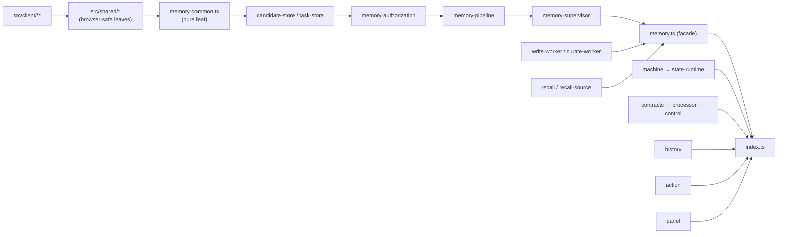

# Project Structure

A file-by-file map of the repository: what each directory is for, which modules are hand-written versus generated, and which module owns which responsibility. Use it as the index when you need to find the right file instead of guessing.

Paths are relative to the repository root. Line counts are approximate and only meant to signal scale.

## Top level

| Path | Kind | Purpose |
| --- | --- | --- |
| `README.md` | hand-written | Project entry point: what it is, quick start, configuration summary, license |
| `CHALLENGE.md` | hand-written | The original interview challenge (Chinese), kept verbatim as the requirement source |
| `LICENSE` | hand-written | MIT |
| `Makefile` | hand-written | The only supported command surface: `bootstrap`, `build`, `install-profile`, `dev`, `verify`, `typecheck`, `lint`, `format-check`, `check`, `stop`, `clean`, `reset` |
| `package.json` | hand-written | Root workspace manifest: pinned `packageManager`, root dependencies (`@deepseek-ai/dsh`, the plugin workspace), dev tooling (typescript, esbuild, eslint, prettier) |
| `pnpm-workspace.yaml` | hand-written | Workspace globs (`dsh/plugins/*`) and allowed build scripts |
| `pnpm-lock.yaml` | generated | Frozen dependency graph; installations run with `--frozen-lockfile` |
| `tsconfig.base.json` | hand-written | Shared strict TypeScript settings inherited by every sub-project |
| `eslint.config.mjs` | hand-written | Flat ESLint config (type-aware rules for TS, hooks-only rules for the client) |
| `.prettierrc.json`, `.prettierignore` | hand-written | Formatting policy and the set of files formatting is allowed to touch |
| `.sanitize-patterns` | hand-written | Patterns excluded from generated/public material |
| `.env.example` | hand-written | Documented environment template; copy to `.env` |
| `.env` | local, git-ignored | Real credentials; never committed. Legacy variants are archived as `.env.legacy-<timestamp>` |
| `docker-compose.yml` | hand-written | The two fixed memory services (`hindsight`, `laya`), their volumes, ports and healthchecks |
| `.dockerignore`, `.gitignore` | hand-written | Build-context and version-control exclusions |
| `assets/` | hand-written | Repository-level imagery (`banner.png` used by the README) |
| `dsh/` | hand-written | Everything the dsh host loads: the install profile and the plugin |
| `scripts/` | hand-written + generated | Toolchain bootstrap, build driver, runtime launcher, runtime verification |
| `deploy/` | hand-written | Dockerfiles and the Laya service source |
| `docs/` | hand-written | This documentation set |
| `.omp/plans/` | hand-written | Historical implementation plans (design rationale, not current specification) |
| `.dsh/` | runtime data, git-ignored | Default `DSH_HOME`: dsh profile install, sessions, storages, logs and the Lepimemory data directory |
| `.runtime/` | downloaded, git-ignored | The pinned Node/pnpm binaries installed by `make bootstrap` |
| `node_modules/` | generated, git-ignored | Workspace dependencies |

## `dsh/` — host profile and plugin

```text
dsh/
├── profiles/lepimemory/          the install profile the launcher generates into DSH_HOME
│   ├── cordis.yml                empty entry list (the tree is composed as patches)
│   ├── cordis.patch.yml          the real profile: model routing, agent preset, plugin row
│   ├── package.json              profile bundles + local plugin link
│   └── pnpm-workspace.yaml
└── plugins/dsh-lepimemory-state/ the character kernel
    ├── src/                      hand-written TypeScript
    │   ├── shared/               browser-safe definitions shared with the client bundle
    │   └── client/               hand-written TSX for the browser panel
    ├── test/                     node:test behaviour suites
    ├── assets/avatar/            62 GIF frames used by the avatar overlay
    ├── cordis.patch.yml          the plugin's own row (databaseFile/dataRoot via dshHomePath)
    ├── tsconfig.json             server output config (src → lib)
    ├── package.json              main/exports/dsh manifest (bundle patch, client inject list)
    ├── lib/                      GENERATED server output (ESM js + d.ts + maps)
    └── client.js                 GENERATED browser bundle (lazy-CJS factory)
```

### The profile

| File | What it declares |
| --- | --- |
| `dsh/profiles/lepimemory/cordis.patch.yml` | Provider routing left empty unless the launcher fills it; default agent model `lepimemory-role`; the `lepimemory` agent preset (persona text, ask-user tool, web tool, compaction group in an isolate realm); the default preset registry entry |
| `dsh/profiles/lepimemory/package.json` | `dsh.profile.bundles`: `@deepseek-ai/dsh-base`, `@deepseek-ai/dsh-web-app`, `@dsh-external/dsh-lepimemory-state` |
| `dsh/plugins/dsh-lepimemory-state/cordis.patch.yml` | Inserts the plugin row with `databaseFile: !!js dshHomePath('lepimemory/runtime.sqlite')` and `dataRoot: !!js dshHomePath('lepimemory')` |
| `dsh/plugins/dsh-lepimemory-state/package.json` | `main`/`types`/`exports` point at generated `lib/` and `client.js`; `dsh.bundle.patch` and `dsh.client.inject` describe how the host loads both halves |

The profile intentionally contains **no credentials and no endpoint defaults**. Routes are resolved at launch time and injected as derived environment variables by the launcher (see [RUNTIME.md](./RUNTIME.md) and [CONFIGURATION.md](./CONFIGURATION.md)).

### Server modules (`src/*.ts`)

| Module | Lines | Responsibility |
| --- | --- | --- |
| `index.ts` | ~360 | Plugin entry: `apply()`, service injection, hook registration, notice rendering, subsystem construction, disposal |
| `config.ts` | ~600 | Pure env → config resolution, route derivation, one-shot legacy `.env` migration, `expandHome` |
| `contracts.ts` | ~960 | Closed wire schemas for every model/background result, `validateResult`/`validateToolArgs`, closed reason dictionaries |
| `store.ts` | ~720 | SQLite owner: schema, version check, legacy import, `transaction()`, `audit()`, state/read projections, history queries |
| `evidence.ts` | ~880 | Session evidence index: metadata rows, in-heap bodies, canonical-surface rehydration, turn windows |
| `processor.ts` | ~630 | Structured model calls: per-kind prompts, route selection, streaming, contract validation, `LEPI_CONTROL_UNAVAILABLE` |
| `control.ts` | ~1360 | Control plane: real user intent → memory operations, source authorisation, receipts, private consent (non-tool) flow |
| `admission.ts` | ~570 | Value judgement per candidate (rule-based request handling, Laya scoring, deferral rules) |
| `memory.ts` | ~270 | Memory facade: constructs stores → authorizer → pipeline → workers → supervisor; exposes the public handle |
| `memory-supervisor.ts` | ~540 | The single scheduler: tick, job slots, leases, remote pump preference, drain |
| `memory-pipeline.ts` | ~450 | normalize/admit job handling: value judgement, bounded admission, ordinary/private split, authorisation hand-off |
| `memory-authorization.ts` | ~600 | Policy reads, candidate policy checks, single-item authorisation, atomic commit |
| `memory-common.ts` | ~160 | Shared leaf: types, constants, pure helpers (no SQL, no side effects) |
| `candidate-store.ts` | ~90 | The only writer of `snapshots` + `lifecycle` |
| `task-store.ts` | ~220 | The only writer of `tasks`: claim/lease, finish, retry, reschedule, expiry sweep |
| `write-worker.ts` | ~1020 | Hindsight retention: stable async identities, receipt requirements, backoff, reconciliation |
| `curate-worker.ts` | ~880 | Post-hoc curation of retained items, restoration only with unchanged-source proof |
| `recall.ts` | ~420 | Recall orchestration: query, policy gate, source binding, rendered injection text |
| `recall-source.ts` | ~390 | Binds remote `raw_id`/document identity back to local approved snapshots and proves currentness |
| `trust.ts` | ~200 | Trust tiers (fact/experience/inference/unknown), decay helpers, `candidateExclusion` policy pre-check |
| `raw-source.ts` | ~150 | Raw/document version hashing and match predicates, `retainItem` payload construction |
| `history.ts` | ~1160 | History coordinator: canonical surface redaction, pending work, session fence, receipt queueing |
| `action.ts` | ~740 | `write_note` tool: approval, atomic file creation, journal, hash verification, error codes |
| `panel.ts` | ~1000 | Host HTTP surface: authenticated read/limited-operation JSON routes plus the avatar route |
| `state-runtime.ts` | ~480 | Session→state observation, prompt section text, decay commits, action reconciliation, read-only effective view |
| `machine.ts` | ~140 | Pure state machine: structural facts → deltas, mood half-life decay, rules as explicit data |
| `json.ts` | ~19 | Lenient JSON read with caller-shaped fallback (array/object) |

### Browser-safe shared modules (`src/shared/*.ts`)

| Module | Shared by | Content |
| --- | --- | --- |
| `domain.ts` | server + client | The vocabulary: contract enums, persistence enums, entity shapes |
| `state.ts` | server + client | State structure, `BASELINE`, `NUMERIC_FIELDS`, validation, tone/near helpers, rendering |
| `api.ts` | server + client | HTTP DTOs for every panel route |
| `activity.ts` | server + client | Pure rules turning chat/session signals into "what is it doing now" |
| `avatar-assets.ts` | server + client | Avatar key → GIF filename (single source of truth) |
| `avatar-frames.ts` | server + client | Activity → tone → candidate frames, warm-up list |
| `pins.ts` | all entry points | `NODE_VERSION`, `PNPM_VERSION`, `DSH_VERSION` |

### Client modules (`src/client/**`)

| Path | Responsibility |
| --- | --- |
| `index.tsx` | Plugin client entry: registers the right-sidebar tab and the avatar dock component, creates the single state feed |
| `hooks.ts` | Data lifecycle hooks: invalidation epoch, history polling, receipts, retry, candidate details, state editor |
| `feed.ts` | The shared 5-second state feed consumed by both panel and avatar |
| `history-model.ts` | Pure view helpers: entry extraction, excerpts, lifecycle/source/task/operation/grant text |
| `status.ts` | Status key sets, labels, tone classes, activity dot |
| `constants.ts` | Page size, tab/kind/group constants, labels |
| `locales.ts` | Chinese (default) and English dictionaries |
| `types.ts` | UI-only state types and hook faces |
| `util.ts` | `fetchJson`, form helpers, time formatting |
| `panel.css` | Panel styles (injected and cleaned up with the component) |
| `components/atoms.tsx` | Meters, slider, section heads, key/value rows, list blocks |
| `components/Panel.tsx` | Panel shell: tab state, feed projection, hook composition |
| `components/StateStrip.tsx` | Five state meters plus activity indicator |
| `components/Badges.tsx` | Count badges |
| `components/HistoryBlock.tsx` | History section: kind tabs, pagination, debug toggle |
| `components/HistoryRows.tsx` | Entry/stage/group rows and detail blocks |
| `components/CandidateDetail.tsx` | Candidate snapshot, lifecycle, sources, related operations |
| `components/RecallDetail.tsx` | Recall ledger detail |
| `components/EditorForm.tsx` | Operator state editor with preview |
| `components/AvatarOverlay.tsx` | The 立绘 overlay: frame selection, preload, cross-fade |
| `tsconfig.json` | Browser-only type check configuration (`noEmit`) |
| `css.d.ts` | Declares CSS imports as strings |

### Tests (`test/*.js`)

| File | Subsystem under test |
| --- | --- |
| `runtime.test.js` | End-to-end scheduling, policy races, disposal, private-candidate handling (~2000 lines) |
| `history.test.js` | Canonical-surface redaction and history work |
| `recall.test.js` | Recall policy gating and source proof |
| `action.test.js` | Action journal, atomic creation, approval outcomes |
| `avatar.test.js` | Avatar frame asset validity and tone/activity selection |
| `panel-groups.test.js` | Grouped history pagination in the store |

They run through the launcher (`make verify`) and directly via the pinned Node. See [TESTING.md](./TESTING.md).

## `scripts/`

| File | Kind | Purpose |
| --- | --- | --- |
| `bootstrap-runtime.sh` | hand-written | Downloads and SHA256-verifies the pinned Node archive and pnpm tarball into `.runtime/`, publishing a `.runtime/bin/node` symlink |
| `build.mts` | hand-written | The build driver: pinned-version checks, optional frozen install, server `tsc`, scripts `tsc`, type-check-only passes, client esbuild bundle |
| `src/runtime.ts` | hand-written | The launcher: `install`, `dev`, `verify` subcommands; config resolution; derived env; compose invocation; profile ownership; readiness |
| `src/verify-runtime.ts` | hand-written | Runtime verification: pinned Node/realpath, store transactions, legacy state/JSONL import, rejection paths, real negative cases |
| `tsconfig.json`, `tsconfig.tools.json` | hand-written | Output config for `src/` and type-check-only config for the driver |
| `dist/` | GENERATED | Compiled launcher and verifier (`runtime.js`, `verify-runtime.js`, maps) |

## `deploy/`

| Path | Purpose |
| --- | --- |
| `deploy/hindsight/Dockerfile` | Builds `lepimemory-hindsight:0.10.0` from the upstream image plus pinned local embedding/reranker models |
| `deploy/laya/Dockerfile` | Builds `lepimemory-laya:0.3.26` on a pinned Python base |
| `deploy/laya/requirements.in` | Direct dependency input for the lock file |
| `deploy/laya/requirements.lock` | Hash-pinned resolved dependency set installed by the image |
| `deploy/laya/server.py` | The Laya service: thread limits, pinned model revisions, `uvicorn` app |

Details, ports and healthchecks are in [DEPLOYMENT.md](./DEPLOYMENT.md).

## Runtime data (`.dsh/`, git-ignored)

The default `DSH_HOME` is the repository-local `.dsh/`; production-style runs point `DSH_HOME` elsewhere.

| Path | Content |
| --- | --- |
| `.dsh/profiles/lepimemory/` | The installed profile copy: `cordis.yml`, generated `cordis.patch.yml`, `package.json`, `pnpm-lock.yaml`, `node_modules/` symlink to the plugin, and a runtime marker file |
| `.dsh/lepimemory/runtime.sqlite` | The single source of truth for state, memory lifecycle, tasks, actions and audit |
| `.dsh/lepimemory/legacy-<timestamp>-<uuid>/` | Archive of the pre-SQLite files (`state.json`, `audit.jsonl`, `recall.jsonl`, `retain.jsonl`, `forget.jsonl`, `action.jsonl`) taken during the one-time migration |
| `.dsh/lepimemory/*.jsonl`, `state.json` | Legacy files still present on disk; their content is imported once and then read from SQLite |
| `.dsh/sessions/`, `.dsh/storages/` | dsh session records and projection caches |
| `.dsh/logs/` | Launcher startup logs |
| `.dsh/.credentials.yaml`, `.dsh/.anonymous-user-id` | dsh host credentials/identity — never commit, never log |

Treat everything under `.dsh/` as user data: it can contain real conversation content.

## Module dependency direction

The import graph is deliberately acyclic and points one way:



Rules that keep it this way:

- `memory-supervisor.ts` never imports `memory-pipeline.ts`; the facade injects the job runners, so the scheduler stays reusable and the graph stays acyclic.
- `memory-common.ts` is a pure leaf: no SQL, no side effects, no imports from its consumers.
- `src/shared/**` and `src/client/**` may not import `node:` builtins or server modules.
- Cross-package imports use explicit `.ts`/`.tsx` specifiers; the compiler rewrites them to `.js` on emit, and imports of already-generated `lib/` output keep `.js`.

## Where to look for what

| I want to… | Start at |
| --- | --- |
| Boot the system | [RUNTIME.md](./RUNTIME.md), `Makefile`, `scripts/src/runtime.ts` |
| Change a setting | [CONFIGURATION.md](./CONFIGURATION.md), `src/config.ts`, `.env.example` |
| Understand why a memory was kept | [MEMORY.md](./MEMORY.md), `src/admission.ts`, `src/memory-authorization.ts` |
| Understand why a memory came back | [RECALL.md](./RECALL.md), `src/recall.ts`, `src/trust.ts` |
| Change the character's mood model | [STATE-AND-EMOTION.md](./STATE-AND-EMOTION.md), `src/machine.ts`, `src/shared/state.ts` |
| Add or change a tool | [ACTION.md](./ACTION.md), `src/action.ts`, `src/index.ts` |
| Debug a bad answer from the ledger | [OBSERVABILITY.md](./OBSERVABILITY.md), `src/store.ts`, `src/panel.ts` |
| Change the panel UI | [UI.md](./UI.md), `src/client/**` |
| Find out how something is verified | [TESTING.md](./TESTING.md), `scripts/src/verify-runtime.ts`, `test/**` |
