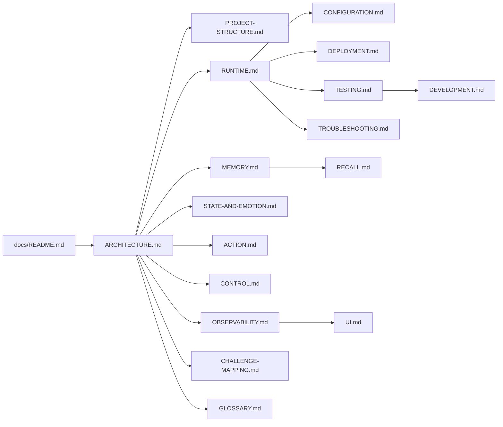

# Lepimemory documentation

This directory is the technical documentation for Lepimemory: an AI character Agent with persistent state, a controlled long-term memory lifecycle, real action capability and an auditable record of everything it does.

The set is written for two readers. One is a developer who has to run, modify or debug the system. The other is a reviewer who needs to judge whether the design holds up — the [challenge mapping](./CHALLENGE-MAPPING.md) exists for that reader. Both are served by the same documents, so each one starts with what it covers and who it is for.

Everything here describes the code at the current commit. Generated artifacts are never quoted; values that are pinned (Node, pnpm, dsh, models, ports) are stated with the file that holds them.

## Start here

| Document | Covers | Read it when |
| --- | --- | --- |
| [ARCHITECTURE.md](./ARCHITECTURE.md) | The whole system: layers, subsystem contracts, one turn end to end, design principles, boundaries | First, always |
| [PROJECT-STRUCTURE.md](./PROJECT-STRUCTURE.md) | Every directory and module with its responsibility, generated vs hand-written, dependency direction | You need to find the right file |
| [GLOSSARY.md](./GLOSSARY.md) | Vocabulary used across the docs and the code (candidate, snapshot, lifecycle, fence, receipt, …) | A term is unfamiliar |

## Running it

| Document | Covers |
| --- | --- |
| [RUNTIME.md](./RUNTIME.md) | Pinned toolchain, `make bootstrap`, the build pipeline, the launcher (`install`/`dev`/`verify`), `DSH_HOME` layout |
| [CONFIGURATION.md](./CONFIGURATION.md) | Complete `LEPI_*` reference, route overrides, `.env` precedence and legacy migration, error codes |
| [DEPLOYMENT.md](./DEPLOYMENT.md) | The Hindsight and Laya containers: images, ports, volumes, healthchecks, egress and model pinning |
| [TROUBLESHOOTING.md](./TROUBLESHOOTING.md) | Symptom → cause → check → fix for the failures this system actually produces |

## How it works

| Document | Covers |
| --- | --- |
| [MEMORY.md](./MEMORY.md) | The write half of memory: evidence, candidates, admission, authorisation, snapshots, retention, curation |
| [RECALL.md](./RECALL.md) | The read half: query formation, the policy gate, source proof, what gets injected |
| [STATE-AND-EMOTION.md](./STATE-AND-EMOTION.md) | Mood and relation, the rule-based state machine, decay, prompt injection, the effective view |
| [ACTION.md](./ACTION.md) | Tools with real side effects, the `prepared` → `executed` journal, approval outcomes |
| [CONTROL.md](./CONTROL.md) | Intent recognition, closed contracts, the structured processor, model routes and fallbacks |
| [OBSERVABILITY.md](./OBSERVABILITY.md) | The SQLite schema, the audit ledger, history projections, the panel HTTP API, debugging recipes |
| [UI.md](./UI.md) | The browser panel and the avatar overlay: components, data lifecycle, activity rules, i18n |

## Working on it

| Document | Covers |
| --- | --- |
| [TESTING.md](./TESTING.md) | The six behaviour suites, the static gates, `make verify` / `make check`, and what each proves |
| [DEVELOPMENT.md](./DEVELOPMENT.md) | Setup order, daily loop, code conventions and invariants, commit conventions, where to add things |
| [CHALLENGE-MAPPING.md](./CHALLENGE-MAPPING.md) | Requirement-by-requirement mapping to the implementation, including what is deliberately absent |

## Suggested reading paths

**"I want to start the system and see it work."**
[RUNTIME.md](./RUNTIME.md) → [CONFIGURATION.md](./CONFIGURATION.md) → [DEPLOYMENT.md](./DEPLOYMENT.md) → [TROUBLESHOOTING.md](./TROUBLESHOOTING.md) if the containers complain.

**"I want to understand the memory design."**
[ARCHITECTURE.md](./ARCHITECTURE.md) → [MEMORY.md](./MEMORY.md) → [RECALL.md](./RECALL.md) → [OBSERVABILITY.md](./OBSERVABILITY.md) to see the ledger it produces.

**"I want to change the character's behaviour."**
[STATE-AND-EMOTION.md](./STATE-AND-EMOTION.md) for mood/relation → `dsh/profiles/lepimemory/cordis.patch.yml` for the persona → [UI.md](./UI.md) for how it is presented.

**"I need to debug a specific answer."**
[OBSERVABILITY.md](./OBSERVABILITY.md) (ledger queries and panel routes) → [RECALL.md](./RECALL.md) if memory was involved → [CONTROL.md](./CONTROL.md) if an operation was refused.

**"I am reviewing the project against the brief."**
[CHALLENGE-MAPPING.md](./CHALLENGE-MAPPING.md) → [ARCHITECTURE.md](./ARCHITECTURE.md) → [TESTING.md](./TESTING.md).

## Conventions used here

- Source references are repo-relative, backticked paths, with symbol names where it matters: `dsh/plugins/dsh-lepimemory-state/src/recall.ts` `createRecall()`.
- Diagrams use Mermaid. Tables are used for reference data (variables, statuses, routes, codes), not for prose.
- Code blocks are real snippets or real commands, shortened with comments where necessary — never illustrative pseudo-code pretending to be source.
- Anything not confirmed by reading the code is marked `[INFERENCE]`. If a document and the code disagree, the code is right.
- Chinese literals that are part of a contract (locale strings, avatar asset filenames, prompt text, status labels) are quoted verbatim; the surrounding explanation is in English.
- Pinned values are stated once and referenced afterwards: Node `v24.20.0`, pnpm `10.28.2`, dsh `0.1.7-rc.2` (`dsh/plugins/dsh-lepimemory-state/src/shared/pins.ts`), Hindsight `0.10.0`, Laya `0.3.26` (`docker-compose.yml`).

## Documentation set at a glance

