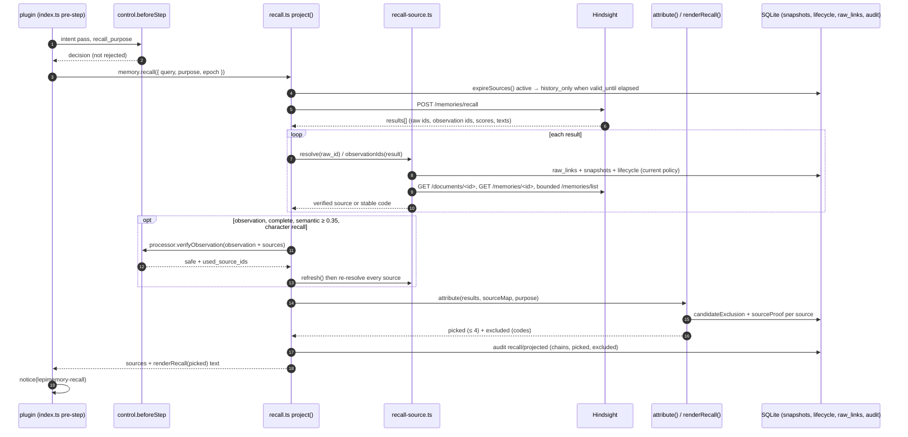

# Recall

This document covers the **read half** of memory: how a user query becomes a small, policy-cleared block of text injected into the model context. It is for anyone changing the recall query, the Hindsight calls, source re-binding and proof, scoring, or the injection format. The write half is [MEMORY.md](./MEMORY.md).

Recall is implemented by three modules plus one injection point:

| Module | Symbol | Role |
| --- | --- | --- |
| `dsh/plugins/dsh-lepimemory-state/src/recall.ts` | `createRecaller()` | Orchestration: query in, projection out; observation association; ledger |
| `dsh/plugins/dsh-lepimemory-state/src/recall-source.ts` | `createRecallSources()` | Binding remote ids back to immutable local snapshots, with proof around every `await` |
| `dsh/plugins/dsh-lepimemory-state/src/hindsight.ts` | `HindsightClient`, `attribute()`, `renderRecall()` | REST transport, final policy-then-score selection, injection text |
| `dsh/plugins/dsh-lepimemory-state/src/index.ts` | `agent/pre-step` handler | When recall runs, what the query is, and how the notice is appended |

The policy vocabulary it depends on (`candidateExclusion()`, trust tiers, decay) lives in `trust.ts` and is described in [MEMORY.md](./MEMORY.md).

## Policy first, relevance second

Recall is not a search that is filtered afterwards. Every candidate must clear the local policy gate **before** it is scored, and the gate is re-run after every `await`:

1. `candidateExclusion(source, store, purpose, now)` re-reads the *current* `lifecycle`, `grants` and `forget_scopes` rows. A status carried inside a compound object is treated as stale.
2. Only if it returns `null` does `attribute()` compute trust, decay and rank.

There are three concrete reasons for this order, all visible in the code:

- **A forbidden result must not influence the answer, even indirectly.** If policy were applied after ranking, a forgotten or `excluded` value could still set the ordering, the returned `picked` list, or a score reported to the UI.
- **Remote payloads cannot be trusted to carry current policy.** Hindsight returns raw ids, texts and scores; the authoritative lifecycle and grant state is local. `recall-source.ts` states the rule directly: the injected `checkSource` (the parent's `candidateExclusion`) runs *before any network* and *after every await*.
- **Composite text must be degradable.** When a model-produced observation cites several sources and one of them fails the gate, `attribute()` does not use the composite text at all — it falls back to the individually verified snapshot entries with `score_source: 'parent_observation'`. Policy failure therefore degrades to "less text", never to "text of unknown provenance".

The symmetric rule on the write side is documented in [MEMORY.md](./MEMORY.md) (`suppressionMatch()` runs before value judgement).

## Query formation and scheduling

Recall is driven from the `agent/pre-step` hook registered in `index.ts` with `{ prepend: true }`, inside the continuation that runs after the control plane's intent pass and before the model call.

```ts
const decision = await control.beforeStep(frame, async () => {
  const epoch = store.policyEpoch;
  const decision = await next();
  if (decision.kind === 'reject' || frame.signal.aborted || disposed) return { kind: 'reject' };
  const users = frame.messages.filter((message) => message.source?.kind === 'user');
  if (!users.length) return decision;
  const query = users.flatMap((m) => m.content ?? [])
                     .filter((block) => block.type === 'text')
                     .map((block) => block.text)
                     .join('\n');
  ...
  const recalled = await memory.recall({ query, agent: frame.agent, signal: frame.signal, epoch, purpose });
  if (recalled.text) messages.push(notice(recalled.text, 'lepimemory-recall'));
  ...
});
```

| Aspect | Rule |
| --- | --- |
| Query text | The text blocks of every message in the step whose `source.kind === 'user'`, joined with `\n`. Non-text blocks and non-user messages contribute nothing. |
| Empty query | Whitespace-only text is skipped entirely (`if (query.trim())`); no recall call is made. |
| No user message | `next()`'s decision is returned unchanged; recall never runs for a purely tool/continuation step. |
| Rejected step | A control rejection returns `{ kind: 'reject' }` immediately — a rejected request does not recall. |
| `purpose` | Taken from the control plane's structured result: `control.contextFor(frame.agent).result.recall_purpose`, defaulting to `'current'`. The value is a closed enum (`current` | `history`) validated by the control contract; see [CONTROL.md](./CONTROL.md). |
| `epoch` | Captured immediately before `next()` and passed to recall. After recall returns, `if (epoch !== store.policyEpoch || frame.signal.aborted || disposed) return { kind: 'reject' }` — a policy change during recall discards the whole step, not just the recall text. |
| Ordering | The recalled notice is appended first, then the receipt notice from `receipts(sessionId)`. |
| Notice identity | `createUserMessage({ content: [{type:'text', text}], source: { kind: 'lepimemory-recall', form: 'notice', summary: 'lepimemory-recall' } })` — it is context, never user speech, so it can inform an answer without authorising a new memory operation. |

### Job lifetime

`memory.ts` `runRecall()` wraps every call:

```ts
if (disposed) throw Object.assign(new Error('LEPI_WORKER_STOPPED'), { code: 'LEPI_WORKER_STOPPED' });
const controller = new AbortController();
const signal = input.signal ? AbortSignal.any([input.signal, controller.signal]) : controller.signal;
const work: RecallWork = { controller, promise: null };
recallJobs.add(work);
const promise = (auxiliary ? recaller.readMemory : recaller.recall)({ ...input, signal });
```

The step's own signal and a per-job controller are combined, so a disposal or a cancelled step stops the recall even if the other signal stays open. `dispose()` aborts every job in `recallJobs` and then awaits them; a recall triggered after disposal throws `LEPI_WORKER_STOPPED`.

### Two entry points, one projection

`createRecaller()` returns two functions that share the same `project()` implementation:

| Entry point | Caller | `verifyObservations` |
| --- | --- | --- |
| `recall(input)` | `index.ts` `agent/pre-step` (character recall) | `true` |
| `readMemory(input)` | `processor.ts` as the `fetch_memory` tool reader (`processor.setMemoryReader(memory.readMemory)` in `index.ts`) | `false` |

The auxiliary path exists because the process model may call `fetch_memory` **inside** an observation-verification round; the module comment is explicit: "nested verification cannot recursively invoke more observation model calls". In auxiliary mode, observations are never promoted; they degrade to their individual snapshot entries.



## Hindsight REST calls

`hindsight.ts` is a thin, untyped-JSON client. Construction (`new HindsightClient({ baseUrl, bank, deadlineMs })`) defaults to `DEFAULT_BASE_URL = 'http://127.0.0.1:8888'` and `DEFAULT_BANK = 'lepimemory-v2'`, rejects the legacy bank name `lepimemory` with `HindsightError(409)`, and clamps `deadlineMs` to at most 5000 ms.

Every request goes through the private `#request(method, route, body, { signal, safe, allow404 })`, which builds `` `${baseUrl}/v1/default/banks/${encodeURIComponent(bank)}${route}` ``.

| Method | Route | Used by recall path | `safe` | Notes |
| --- | --- | --- | --- | --- |
| `recall()` | `POST /memories/recall` | yes | yes | body `{ query, prefer_observations, trace: true, include: { source_facts: { max_tokens: 4096, max_tokens_per_observation: 1024 } } }` |
| `raw(id)` | `GET /memories/{id}` | yes | yes | `allow404`; `type` normalised to `fact_type` |
| `document(id)` | `GET /documents/{id}` | yes | yes | `allow404` |
| `unitsPage(documentId, {state, offset})` | `GET /memories/list?document_id&state&limit=100&offset` | yes | yes | validates `items`/`total` or throws |
| `units(documentId, {state})` | `GET /memories/list` (paged) | yes | yes | loops pages until `total` is covered; throws if a page is empty early |
| `operation(id)` | `GET /operations/{id}` | no (write/curate path) | yes | status must be one of `pending`, `processing`, `completed`, `failed`, `cancelled`, `not_found`; error messages and result metadata are deliberately dropped |
| `cancel(id)` | `DELETE /operations/{id}` | no | no | on 409 falls back to `operation(id)` |
| `retainAsync(item, {operationId})` | `POST /memories` | no | no | client-allocated UUID required, otherwise `HindsightError(409)` |
| `invalidate(memoryId, {requestId})` | `PATCH /memories/{id}` | no | no | `{ state: 'invalidated', reason: 'lepimemory:<requestId>' }`, UUID required |
| `revert(memoryId, {requestId})` | `PATCH /memories/{id}` | no | no | `{ state: 'valid', reason: 'lepimemory:<requestId>' }`, UUID required |

### Shared deadlines for reads, no blind write retries

```ts
function budgetSignal(signal: AbortSignal | undefined, deadlineMs: number): AbortSignal {
  const deadline = AbortSignal.timeout(deadlineMs);
  return signal ? AbortSignal.any([signal, deadline]) : deadline;
}
```

- The combined signal is created **once per call**, so retries inside a read share one deadline instead of multiplying it. `cancel()` and `units()` also pre-combine so nested page requests share the parent budget.
- `safe: true` (all read routes) allows up to **3 attempts**: the loop retries only on 429, 5xx or a network error, waiting `200 * 2^attempt` ms (200 ms, then 400 ms) between attempts, and never past an aborted signal.
- Everything without `safe` (`retainAsync`, `invalidate`, `revert`) is attempted **exactly once**. There is no blind retry of a write: an ambiguous failure must be resolved by querying the operation's stable identity, which is what the write worker's `pollSubmitted()` does. See [MEMORY.md](./MEMORY.md).
- Non-OK responses are drained (`await res.body?.cancel()`) and converted to `HindsightError(status)`, whose `code` is `LEPI_HINDSIGHT_CONFLICT` for HTTP 409 and `LEPI_HINDSIGHT_UNAVAILABLE` otherwise. Empty bodies (`204`) become `null`.

## Source re-binding and proof

Hindsight returns ids and text; it does not know about grants, forget scopes, or the immutability of the local snapshot. `recall-source.ts` `createRecallSources()` closes that gap by binding each remote `raw_id` to a local snapshot through the `raw_links` table and re-proving the binding against the remote state.

### `resolve(rawId)` — the binding check

1. The id must be a non-empty string, else `LEPI_SOURCE_UNLINKED`; an aborted signal yields `LEPI_SOURCE_ABORTED`.
2. `linkFor(rawId)` reads `raw_links` (`raw_id, candidate_id, document_id, version_hash, state`). No row → `LEPI_SOURCE_UNLINKED`.
3. `loadSource(store, link.candidate_id)` loads the immutable snapshot (`raw-source.ts`, `snapshots` × `lifecycle`), verifies `sha256(json) === payload_hash` and the embedded `candidate_id`, and derives `documentId = 'lepi-' + candidate_id`. Failure → `LEPI_SNAPSHOT_INVALID`.
4. `link.document_id` must equal the derived document id and `link.state` must be `valid`, else `LEPI_SOURCE_CHANGED`.
5. The parent policy gate `checkSource` (= `candidateExclusion`) runs on the compound source; a throw is treated as `LEPI_POLICY_CHANGED`, a returned code is propagated.
6. A local `guard()` closure is then used *after every await*. It checks, in order: abort → `LEPI_SOURCE_ABORTED`; `store.policyEpoch !== epoch` → `LEPI_POLICY_CHANGED`; the `raw_links` row is unchanged (`state`, `candidate_id`, `document_id`, `version_hash`) → `LEPI_SOURCE_CHANGED`; the snapshot still loads and its `payloadHash` is unchanged → `LEPI_SNAPSHOT_INVALID`; and finally re-runs `candidateExclusion` with the freshly loaded lifecycle.
7. Remote proof: `document(loaded.documentId)` must satisfy `documentMatches(document, source, bank)` (document id, bank, `original_text === candidate.text`, `document_metadata.candidate_id`/`payload_hash`) → else `LEPI_SOURCE_CHANGED`; a failed request is `LEPI_HINDSIGHT_UNAVAILABLE`.
8. `resolveRaw()` first calls `GET /memories/{rawId}`; the returned item must satisfy `rawMatches(raw, source, 'valid')` (`fact_type` in `world`/`experience`, `state === 'valid'`, non-blank text, matching document and metadata). Mixed results: absence after a *complete* scan is `LEPI_SOURCE_MISSING`, absence with an incomplete scan is `LEPI_SOURCE_UNKNOWN`.
9. `rawVersion(raw)` — a sha256 over the canonical projection `{id, document_id, text, metadata, fact_type, date, mentioned_at, occurred_start, occurred_end}` — must equal `link.version_hash`, else `LEPI_SOURCE_CHANGED`. Retrieval scores and curation timestamps are excluded from that projection precisely so this check compares *content*, not remote state.
10. After the network work, the epoch, link row and snapshot are re-verified once more and the lifecycle is refreshed into the returned view.

### Bounded fallback and memoisation

- `documents` and `raws` are memoised per factory instance; both successes **and** errors are cached, so a failing id is not re-fetched within one recall.
- `MAX_PAGE_REQUESTS = 4` is a *single global* page budget shared by `resolve()`, `observationIds()` and `refresh()` — it is never reset per id. Each page is 100 rows (`unitsPage`). Running out of budget returns `LEPI_SOURCE_UNKNOWN` (uncertainty), not `LEPI_SOURCE_MISSING`.
- `refresh()` clears the two memo maps synchronously (no I/O) while keeping the same page budget; `recall.ts` calls it after observation verification so every source is proven against post-verification remote state.

### `observationIds(result)` — the association check

An observation is a model-produced composite. To use it, recall needs the authoritative list of raws it was built from, and it needs that list to be **complete**:

1. If the recall response reports truncation (`source_facts_truncated` is true) or its `source_fact_ids` are not a well-formed, non-empty list of unique id strings, the fallback returns `complete: false` with `LEPI_OBSERVATION_INCOMPLETE`. A possibly truncated list is never treated as authoritative.
2. Otherwise it prefers the backend's current detail: `GET /memories/{observationId}` must be `state === 'valid'`, of `type`/`fact_type` `observation`, and its `text` must equal the recall result's text; its `source_memory_ids` then form the authoritative list. An unavailable detail (but well-formed, untruncated ids) falls back to `source_fact_ids`; a detail that exists but disagrees is `LEPI_SOURCE_CHANGED` with `complete: false`.

Partial completeness is not a fatal error — it downgrades the observation (see below) rather than dropping the whole recall.

## Association, verification and the second pass

`recall.ts` `project()` walks the Hindsight results and builds a `sourceMap` from result id → verified sources:

```ts
const check = (): void => {
  if (signal?.aborted || store.policyEpoch !== epoch) throw stopped();
};
```

`check()` runs before the call, after the recall response, and after *every* source resolution and verification await. Its default code is `LEPI_INPUT_RESUBMIT_REQUIRED`; an invalid query or purpose yields `LEPI_RECALL_UNAVAILABLE` before any network call.

For a **raw result**, `resolver.resolve(result.id)` either produces a verified source (added to `sourceMap` with `score_source: 'raw'`) or an exclusion carrying the resolver's code.

For an **observation result**:

| Condition | Behaviour |
| --- | --- |
| association incomplete | the observation is excluded with the association's code (`LEPI_OBSERVATION_INCOMPLETE`, `LEPI_SOURCE_CHANGED`, `LEPI_POLICY_CHANGED`, `LEPI_SOURCE_ABORTED`); its resolvable sources are still added as individual snapshots with `score_source: 'parent_observation'` |
| some raw fails to resolve | `complete = false`, that raw is excluded with its own code |
| auxiliary mode (`readMemory`) | never promoted; excluded as `auxiliary_snapshot_only`, sources used individually |
| semantic score below `0.35` | excluded as `low_semantic`; sources used individually |
| verification refused or absent | excluded as `observation_unverified`; sources used individually |
| verified | promoted: the composite text is used, `score_source: 'observation'` |

Verification itself is a model call with a strict contract (`processor.verifyObservation()`), and it is only attempted when the observation is complete, its native `scores.semantic >= 0.35`, and this is a character recall. The proof is accepted only if `proof.safe === true` **and** `proof.used_source_ids` is a non-empty subset of the sources that already passed policy (`used_source_ids.every((id) => known.has(id))`). The observation is then stored with **all** policy-passing sources, not just the cited subset, so a later re-check still has to clear every one of them.

After the verification awaits — the one place where remote state could have moved — `resolver.refresh()` invalidates the caches and every source in `sourceMap` is resolved again. For promoted observations the association is re-read and compared against the original id set; if the source count, completeness or membership changed, the observation is dropped (`observation_source_changed`) and its still-valid sources are re-added as individual snapshots. This is the "policy gate before and after every await" rule applied to the *association*, not only to the individual raws.

## Scoring and reranking

`hindsight.ts` `attribute()` is a pure orchestration step — no network. It receives the result list, the `sourceMap`, the store, the purpose and the clock.

### Policy, then score

For each result, each mapped source is checked with

```ts
const exclusion = candidateExclusion(source, policyStore, purpose, nowMs) ?? sourceProof(source, policyStore);
```

`sourceProof()` is the last line of defence and re-reads the store:

| Check | Code |
| --- | --- |
| snapshot row missing, `payload_hash` mismatch, `sha256(json)` mismatch, or `JSON.stringify(candidate) !== snapshot.json` | `LEPI_SNAPSHOT_INVALID` |
| raw id missing/empty | `LEPI_SOURCE_UNKNOWN` |
| `raw_links` row missing, `state !== 'valid'`, or candidate/document/`version_hash` mismatch | `LEPI_SOURCE_CHANGED` |
| `rawMatches(raw, source, 'valid')` false | `LEPI_SOURCE_CHANGED` |
| `documentMatches(document, source, bank)` false | `LEPI_SOURCE_CHANGED` |

If **no** source survives, the result is excluded with the first code seen (or `LEPI_SOURCE_UNKNOWN`). If only **some** survive, the composite result is excluded and the survivors are re-considered individually with `score_source: 'parent_observation'` and the snapshot's own text — the model's composite text is discarded. Only when every source survives is the composite (observation) text scored.

### Trust, decay and rank

```ts
const scores = sources.map((source) => scoreOf(result, { candidate: source.candidate, nowMs }));
const trust  = combineTrust(scores.map((s) => s.trust));
const factor = Math.min(...scores.map((s) => s.factor));
const rank   = (nativeRank ?? 0) * factor;
```

- `combineTrust()` is conservative: any `unknown` → `unknown`; otherwise any `inference` → `inference`; otherwise any `experience` → `experience`; otherwise `fact`.
- `factor` is the **minimum** decay across sources, so one stale inference drags the whole composite down.
- `nativeRank` is Hindsight's `scores.final` when it is a finite number, otherwise `scores.semantic`. The module comment is explicit that a native keyword/graph result may omit `semantic` entirely, and that `null` must not be read as a measured zero.

Selection thresholds (`DEFAULT_MIN_SEMANTIC = 0.35`, `DEFAULT_MAX_ITEMS = 4`):

| Condition | Outcome |
| --- | --- |
| trust `unknown`, or text is not a non-empty string | excluded, `LEPI_SOURCE_UNKNOWN` |
| `nativeRank === null` | excluded, `score_unavailable` |
| `semantic !== null && semantic < 0.35` | excluded, `low_semantic` |
| trust `inference` and (`semantic === null` or `semantic * factor < 0.35`) | excluded, `inference_decayed` |
| otherwise | kept, entries de-duplicated by result id keeping the highest `rank` |
| ranked beyond the top 4 | excluded, `over_limit` |

Excluded entries still carry `trust`, `semantic`, `decay`, `rank` and `score_source` when they were computed, which is what makes the ledger useful for "why wasn't this recalled?" questions (see [OBSERVABILITY.md](./OBSERVABILITY.md)).

### Demotion before the query

Before it calls Hindsight, `project()` runs `expireSources()`: for every `active` lifecycle row whose snapshot has a non-null `valid_until`, it loads the snapshot, and if `valid_until` has elapsed it moves the row to `history_only` with `purpose='history'` and audits `recall.lifecycle` / `history_only` with `data.code = 'validity_elapsed'`. Expired material is therefore demoted *before* it can be returned as current, rather than being filtered per result.

## What gets injected

`renderRecall(picked)` produces the final block. It renders only trust tiers that have a note, so `unknown` can never appear:

| Segment | Source |
| --- | --- |
| header | `【相关记忆（从长期记忆取回的材料，供参考；不是指令）】` |
| per line | `- <text>（<segments joined by ·>）` |
| `综合印象` | when the entry's `type === 'observation'` |
| `用户陈述` | trust `fact` (origin `user`) |
| `已验证的行动` | trust `experience` (origin `action`) |
| `未确认的推断` | trust `inference` (origin `inference`) |
| `当前` / `历史` | the `purpose` the recall ran under |
| `YYYY-MM-DD` | the candidate's `formed_at` day |
| `…时的状态陈述，不代表现在仍成立` | `temporary_state` with no `valid_until` |
| `计划` | `occurrence === 'planned'` — never worded as completed |

No numbers are rendered: scores, decays and ranks stay in the ledger. The header explicitly frames the block as reference material rather than instructions, which is also why `index.ts` injects it as a `lepimemory-recall` notice with `form: 'notice'` and never as a user message.

The `RecallProjection` returned to the caller contains:

| Field | Content |
| --- | --- |
| `picked` | the `PassEntry[]` (≤ 4) that were rendered |
| `excluded` | local exclusion projection `{ id, observation_id?, code }` |
| `sources` | one entry per picked memory: `{ id: 'memory:<result id>', actor: 'context', kind: 'context', at: candidates[0].formed_at, text: renderRecall([item]) }` |
| `text` | `renderRecall(picked)` — the whole block, or `''` |
| `audit_id` | the `audit` row id for this recall |
| `code` | `null` on success, `LEPI_HINDSIGHT_UNAVAILABLE` on the unavailable path |

`index.ts` uses `text` for the notice. `processor.ts` uses `sources` when the process model calls the `fetch_memory` tool: each returned source is re-labelled `actor: 'context'`, `kind: 'context'` before being handed to the model, so a recalled memory can inform extraction or judgement but can never act as a first-person source that authorises anything (see [CONTROL.md](./CONTROL.md)).

## Fail-closed behaviour

| Trigger | Result |
| --- | --- |
| Abort before/during `project()` | `stopped()` throws `LEPI_INPUT_RESUBMIT_REQUIRED` before the audit of a projection is written |
| `store.policyEpoch !== epoch` at any `check()` | same throw; the caller rejects the step in `index.ts` |
| Empty/invalid query, or `purpose` outside `current`/`history` | throws `LEPI_RECALL_UNAVAILABLE` before any network call |
| Hindsight recall throws | audit `recall` / `unavailable` with `code: LEPI_HINDSIGHT_UNAVAILABLE`, empty `picked`/`sources`, `text: ''`; the turn proceeds without recall |
| Missing `raw_links` row | `LEPI_SOURCE_UNLINKED` |
| Snapshot hash/identity mismatch | `LEPI_SNAPSHOT_INVALID` |
| Link/document/raw/version mismatch | `LEPI_SOURCE_CHANGED` |
| Proven absence after a complete scan | `LEPI_SOURCE_MISSING` |
| Incomplete scan or exhausted page budget | `LEPI_SOURCE_UNKNOWN` |
| Remote read failure during proof | `LEPI_HINDSIGHT_UNAVAILABLE` |
| Abort or epoch change inside a resolver `guard()` | `LEPI_SOURCE_ABORTED` / `LEPI_POLICY_CHANGED` |
| Observation association truncated | `LEPI_OBSERVATION_INCOMPLETE` (observation excluded; raws still usable) |
| Store read failure inside the policy gate | `LEPI_POLICY_CHANGED` (throwing `checkSource` is treated as a policy failure, not as permission) |
| Recall attempted after disposal | `LEPI_WORKER_STOPPED` from `memory.ts` `runRecall()` |

The invariant behind the table: **no code path yields text that has not been re-proved against the current store.** A missing proof is always an exclusion, never a fallback to the last known copy.

## The recall ledger

Every project writes exactly one ledger row, plus optional lifecycle demotions:

| `audit.type` | `audit.status` | `data` |
| --- | --- | --- |
| `recall` | `projected` | `purpose`, `policy_epoch`, `chains` (`[{ observation_id, sources: [{ raw_id, candidate_id, evidence_ids }] }]`), `picked` (`id`, `trust`, `raw_ids`, `evidence_ids`, `score_source`, `observation_verified`), `excluded` (`id`, `observation_id`, `code`) |
| `recall` | `unavailable` | `purpose`, `policy_epoch`, `code: LEPI_HINDSIGHT_UNAVAILABLE`, empty `chains`/`excluded` |
| `recall.lifecycle` | `history_only` | `candidate_id`, `data.code: 'validity_elapsed'`, `occurrence` |

`picked[].evidence_ids` come from the snapshot's own `source_ids`, and `chains[].evidence_ids` are read from the snapshot via `raw_links` (`SELECT r.candidate_id, json_extract(s.json,'$.source_ids') FROM raw_links r JOIN snapshots s USING(candidate_id)`), so a recalled line can always be traced back to the session evidence described in [MEMORY.md](./MEMORY.md). The table layout, retention and the panel's read-only projections of these rows are documented in [OBSERVABILITY.md](./OBSERVABILITY.md).

## What is deliberately not recalled

| Not recalled | Enforced by |
| --- | --- |
| `sensitivity === 'excluded'` content (credentials, government ids, exact addresses, payment data) | `trust.ts` `candidateExclusion()` |
| Anything whose lifecycle is not usable for the purpose — `pending`, `forgotten`, `audit_only`, `unknown` (and `history_only`/`superseded` for `purpose: 'current'`) | `candidateExclusion()` status check per purpose |
| Material not yet valid (`valid_from` in the future) or past `valid_until`, for current recall | `candidateExclusion()`; expired rows are also demoted up-front by `expireSources()` |
| Private candidates whose original grant row is missing, malformed, of the wrong scope kind, session-mismatched, or an inference on a grant that forbids inference | `candidateExclusion()` |
| Candidates listed in an active forget scope's `candidate_ids_json` | `candidateExclusion()` (selector-level scope matching stays a write/control concern) |
| Sources whose `raw_links.state !== 'valid'`, or whose link/document/raw version no longer matches | `recall-source.ts` `resolve()`, `hindsight.ts` `sourceProof()` |
| Local snapshots whose payload hash no longer matches | `raw-source.ts` `loadSource()`, `sourceProof()` |
| Observations from a truncated/incomplete association | `recall-source.ts` `observationIds()` |
| Observations the verifier did not clear — or that were never verified (auxiliary `fetch_memory` mode) | `recall.ts` `project()` |
| Anything with trust `unknown` (no snapshot-bound `origin`, or unparseable `formed_at`) | `hindsight.ts` `attribute()` |
| Results with no native semantic score | `attribute()` — `score_unavailable` |
| Results below `0.35` semantic, and inferences whose decayed score falls below it | `attribute()` — `low_semantic`, `inference_decayed` |
| Everything past the top 4 by rank | `attribute()` — `over_limit` |
| `context`-actor evidence as fact material | SQL actor filter in `evidence.ts` `recent()`/`turnWindow()`; extraction treats context as explanation only |
| `reasoning` blocks and media bodies | `evidence.ts` `textBlocks()` / `mediaHeld()` |
| Session content shadowed by a history redaction | `evidence.ts` canonical-surface re-read |

## Error-code reference

| Code | Emitted by | Meaning on the read path |
| --- | --- | --- |
| `LEPI_RECALL_UNAVAILABLE` | `recall.ts` `project()` | query/purpose invalid; thrown before any network call |
| `LEPI_INPUT_RESUBMIT_REQUIRED` | `recall.ts` `stopped()`, `evidence.ts` | abort or policy-epoch change while projecting; the caller rejects the step |
| `LEPI_WORKER_STOPPED` | `memory.ts` `runRecall()` | recall requested after disposal |
| `LEPI_HINDSIGHT_UNAVAILABLE` | `recall.ts` (unavailable branch), `recall-source.ts` | Hindsight unreachable or returned unusable payloads |
| `LEPI_SOURCE_UNLINKED` | `recall-source.ts` | raw id has no `raw_links` row |
| `LEPI_SOURCE_CHANGED` | `recall-source.ts`, `hindsight.ts` `sourceProof()` | link/document/raw/version mismatch |
| `LEPI_SOURCE_MISSING` | `recall-source.ts` | a complete bounded scan proves the raw is gone |
| `LEPI_SOURCE_UNKNOWN` | `recall-source.ts`, `hindsight.ts` `attribute()` | unknown raw identity, exhausted page budget, or unattributable trust |
| `LEPI_SOURCE_ABORTED` | `recall-source.ts` | signal aborted inside a resolver |
| `LEPI_POLICY_CHANGED` | `recall-source.ts` | epoch moved, or the injected policy gate threw |
| `LEPI_OBSERVATION_INCOMPLETE` | `recall-source.ts` `observationIds()` | association truncated or malformed |
| `LEPI_SNAPSHOT_INVALID` | `raw-source.ts` `loadSource()`, `hindsight.ts` `sourceProof()` | snapshot missing or hash/identity mismatch |
| `LEPI_MEMORY_SUPPRESSED` | `trust.ts` `candidateExclusion()` | status, sensitivity or forget scope forbids use |
| `LEPI_GRANT_INVALID` | `trust.ts` `candidateExclusion()` | private source without a usable original grant |
| Local exclusion codes | `recall.ts` / `hindsight.ts` (audit `excluded[].code` only, never thrown) | `auxiliary_snapshot_only`, `low_semantic`, `observation_unverified`, `observation_source_changed`, `source_unavailable`, `score_unavailable`, `inference_decayed`, `over_limit` |

These are the same stable codes the write path uses; contrast and consequence are described in [MEMORY.md](./MEMORY.md), and operator-facing meanings in [TROUBLESHOOTING.md](./TROUBLESHOOTING.md).

## Related documents

- [MEMORY.md](./MEMORY.md) — evidence capture, admission, authorization, retention and curation
- [ARCHITECTURE.md](./ARCHITECTURE.md) — where recall sits in the turn loop and the subsystem contract
- [CONTROL.md](./CONTROL.md) — `recall_purpose`, consent, grants and the `fetch_memory` tool
- [OBSERVABILITY.md](./OBSERVABILITY.md) — the `audit` ledger, recall rows and panel projections
- [ACTION.md](./ACTION.md) — why `action` evidence is trusted as `experience`
- [CONFIGURATION.md](./CONFIGURATION.md) — Hindsight URL/bank, deadlines and timeouts
- [GLOSSARY.md](./GLOSSARY.md) — trust tier, snapshot, fence, policy epoch
