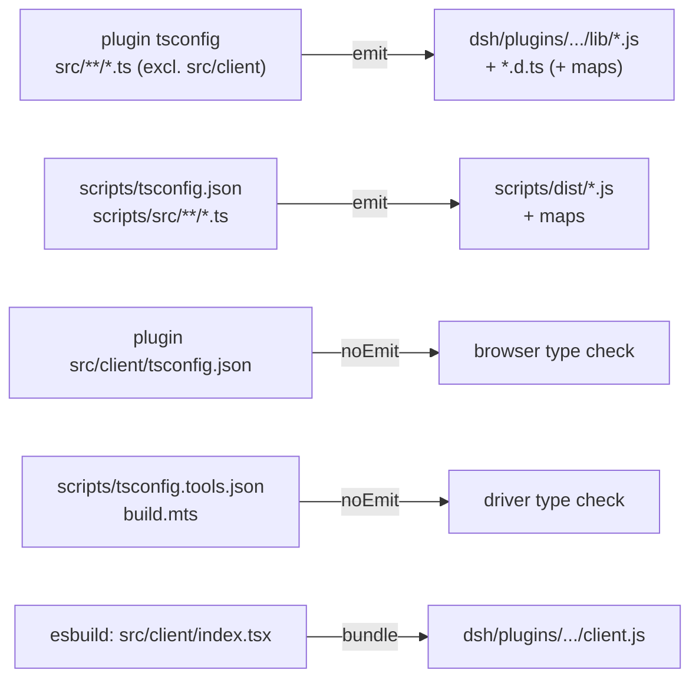
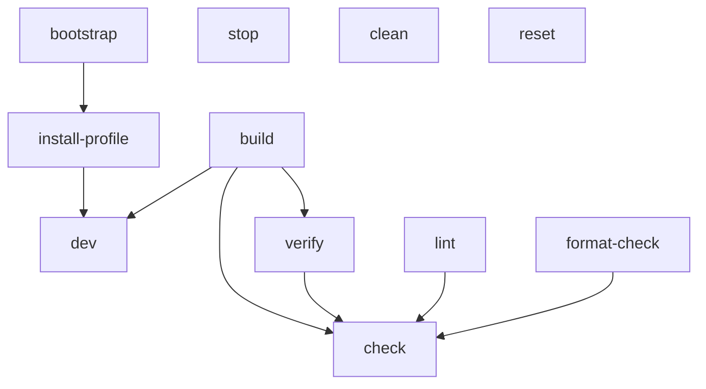

# Runtime

This document describes how Lepimemory pins and launches its runtime: the repository-local Node/pnpm toolchain, the build driver, the launcher that generates the dsh profile and boots the pinned DeepSeek Harness CLI, the `make` entry points, and the on-disk runtime layout. Read it if you are setting up a workstation, changing build/launch behavior, or debugging why `make dev` refuses to start.

Nothing here relies on a globally installed Node, pnpm, or `dsh`. Every path through the runtime begins at `.runtime/bin/node`, and every version is asserted at startup.

## Concept

The runtime is deliberately fail-closed in three places:

1. **Toolchain binding.** `scripts/bootstrap-runtime.sh` downloads official Node `v24.20.0` and pnpm `10.28.2` into `.runtime/`, verifies their checksums, and publishes them atomically. `scripts/build.mts` and `scripts/src/runtime.ts` both refuse to run unless the executing process *is* `.runtime/bin/node` with exactly that version (`LEPI_NODE_UNBOUND`, `LEPI_NODE_VERSION_MISMATCH`) — a system Node can never silently take over.
2. **Installation binding.** The launcher requires the locked repository install of dsh (`node_modules/@deepseek-ai/dsh` at `0.1.7-rc.2`) plus the five pinned plugin helper packages, and re-checks that the plugin's own `peerDependencies`/`dependencies` agree (`LEPI_CLI_VERSION_MISMATCH`, `LEPI_CORE_VERSION_MISMATCH`).
3. **Cutover binding.** `dev` does not merely check that build outputs exist; it imports the plugin entry and requires `RUNTIME_CONTRACT === 1` before launching anything (`LEPI_CORE_NOT_READY`).

The consequence is that a stale or partial artifact can never be served: `make build` exits non-zero on any failure, so `make dev` (which depends on `build`) either launches current code or stops.

## Pinned versions

Versions live in exactly one place — `dsh/plugins/dsh-lepimemory-state/src/shared/pins.ts`:

```ts
export const NODE_VERSION = 'v24.20.0';
export const PNPM_VERSION = '10.28.2';
export const DSH_VERSION = '0.1.7-rc.2';
```

Those constants are consumed by `scripts/build.mts` (`assertPinnedNode()`, `runFrozenInstall()`), by `scripts/src/runtime.ts` (`assertPinnedNode()`, `assertInstallation()`), and by the plugin entry (`dsh/plugins/dsh-lepimemory-state/src/index.ts` `assertRuntime()`). The same versions appear as literals in package manifests, which is why `assertInstallation()` cross-checks them instead of trusting them:

| Version | Declared in code | Mirrored in manifests |
| --- | --- | --- |
| Node `v24.20.0` | `src/shared/pins.ts` `NODE_VERSION` | download URLs in `scripts/bootstrap-runtime.sh` |
| pnpm `10.28.2` | `src/shared/pins.ts` `PNPM_VERSION` | `package.json` `packageManager: "pnpm@10.28.2"` |
| dsh `0.1.7-rc.2` | `src/shared/pins.ts` `DSH_VERSION` | root `package.json` dependency `@deepseek-ai/dsh`; plugin `peerDependencies`/`dependencies` (the five helper packages) |

A version bump is therefore a one-line change plus a bootstrap edit; the launcher will report a mismatch rather than proceed if the two ever disagree.

## Toolchain bootstrap

`make bootstrap` runs `bash scripts/bootstrap-runtime.sh` (POSIX-ish Bash, `set -euo pipefail`, `umask 022`).

**Preconditions.** Platform must be `Linux` or `Darwin` and architecture `x86_64`/`aarch64`/`arm64`; anything else prints `LEPI_UNSUPPORTED_PLATFORM` and exits 1. The host must provide `curl tar openssl shasum find sort diff`; a missing tool prints `LEPI_BOOTSTRAP_UNAVAILABLE: <tool>`. There is no download fallback to any other Node.

**Locking.** `mkdir .runtime/bootstrap.lock` is the mutex; a second concurrent bootstrap prints `LEPI_BOOTSTRAP_BUSY` and exits. An EXIT trap removes the staging directory and the lock.

**Artifacts and verification.** Both artifacts are fetched under fixed names into `.runtime/cache/` and verified before publication:

| Artifact | Source | Verification |
| --- | --- | --- |
| `node-v24.20.0-<platform>-<arch>.tar.xz` | `https://nodejs.org/dist/v24.20.0/<name>.tar.xz` | SHA-256 per platform/arch |
| `pnpm-10.28.2.tgz` | `https://registry.npmjs.org/pnpm/-/pnpm-10.28.2.tgz` | SHA-512 base64 integrity |

Node archive hashes embedded in the script:

| Platform | SHA-256 |
| --- | --- |
| `linux-x64` | `2f2c0da162318f0de47665410c7c8c2ed3d36c8f3105de4bbc61176c70a7cbf2` |
| `linux-arm64` | `5f4ddab610c1ab2016b3c227cebdbf6d9495161487e4739c7b90090595f465f7` |
| `darwin-x64` | `26fc30891004603d094eed11de5efcd03bbd2efbc35c177fc72648d5d7a7701b` |
| `darwin-arm64` | `b7bf7707070b950ba1ec5f1af3bb6de0f2b1962c5033973d94068ab021ef3014` |

The pnpm tarball's expected SHA-512 base64 is `QYcvA3rSL3NI47Heu69+hnz9RI8nJtnPdMCPGVB8MdLI56EVJbmD/rwt9kC1Q43uYCPrsfhO1DzC1lTSvDJiZA==`.

`fetch_archive()` reuses a cached archive only when it re-verifies; a corrupt file is moved aside to `<file>.corrupt-<epoch>-<pid>` and re-downloaded (`curl --fail --show-error --location --retry 2 --connect-timeout 20 --max-time 600`). A checksum mismatch on the freshly downloaded bytes prints `LEPI_ARTIFACT_INTEGRITY` and exits 1 — the corrupt file is never executed.

**Atomic publication.** `publish_tree()` recomputes a manifest of the installed tree (SHA-256 for every regular file, plus the target of every symlink, `LC_ALL=C sort`-ed) and compares it to the tree's own `.verified-tree` file. Identical trees are reused; anything else is quarantined, re-extracted with `tar -xf <archive> -C <stage> --strip-components=1`, given a fresh `.verified-tree`, and moved into place with `mv`. Because symlink *targets* are in the manifest, replacing an executable link cannot evade validation.

**Exposed entry points.** After publication the script writes:

- `.runtime/bin/node` — symlink to `../node-v24.20.0-<platform>-<arch>/bin/node`.
- `.runtime/bin/pnpm` — a Bash wrapper that prepends `.runtime/bin` to `PATH` and `exec`s `$BIN/node $BIN/../pnpm-10.28.2/bin/pnpm.cjs "$@"`, so pnpm always runs on the pinned Node.

Both are written via `<name>.next` + `mv -f` so no half-written executable is ever visible. The script then asserts `<node> --version` is `v24.20.0` (`LEPI_NODE_INCOMPATIBLE`) and `<pnpm> --version` is `10.28.2` (`LEPI_PNPM_INCOMPATIBLE`), and prints:

```
Verified runtime: Node 24.20.0 / pnpm 10.28.2 (linux-x64)
```

## Build driver

`scripts/build.mts` is a type-erased TypeScript file executed directly by the pinned Node (`.runtime/bin/node scripts/build.mts`); it imports only Node builtins and `src/shared/pins.ts` until the TypeScript/esbuild runtime is needed. `main()` accepts exactly three shapes:

| Invocation | Behavior |
| --- | --- |
| `build.mts` | clean generated output, emit everything |
| `build.mts --install` | `pnpm install --frozen-lockfile`, then the normal build |
| `build.mts --typecheck` | declaration refresh + `noEmit` checks only |

Anything else prints `usage: build.mts [--install | --typecheck]` and exits 2.

**Gates.** `assertPinnedNode()` requires `process.version === NODE_VERSION` (`LEPI_NODE_VERSION_MISMATCH`), `.runtime/bin/node` to exist (`LEPI_NODE_UNBOUND`), and `fs.realpathSync(process.execPath)` to equal it (`LEPI_NODE_UNBOUND`). `requireDependencies()` requires `node_modules/typescript/bin/tsc` and `node_modules/esbuild` (`LEPI_DEPS_MISSING` → "run make install-profile"). `runFrozenInstall()` requires `.runtime/bin/pnpm` (`LEPI_PNPM_MISSING`), `pnpm-lock.yaml` (`LEPI_LOCKFILE_MISSING` — the lock must exist before any frozen install), `<pnpm> --version === 10.28.2` (`LEPI_PNPM_VERSION_MISMATCH`), and a zero exit from `pnpm install --frozen-lockfile` (`LEPI_INSTALL_FAILED`).

**Clean.** `cleanGenerated()` removes only generated areas: `dsh/plugins/dsh-lepimemory-state/lib/`, `scripts/dist/`, `dsh/plugins/dsh-lepimemory-state/client.js`, and its `.map`. `assets/`, `test/`, `src/`, and the profile sources are never touched.

**Emit graph.** The four `tsc` projects are run in this order (`runTsc()`, failures → `LEPI_TYPECHECK_FAILED` naming the project and exit status):



| tsconfig | Purpose | Output |
| --- | --- | --- |
| `dsh/plugins/dsh-lepimemory-state/tsconfig.json` | server plugin sources; `rootDir: src`, `outDir: lib`, `declaration: true`, `exclude: ["src/client"]` | `lib/**.js` + `lib/**.d.ts` |
| `scripts/tsconfig.json` | launcher + verify sources; `rootDir: src`, `outDir: dist`, `sourceMap`/`inlineSources` | `scripts/dist/runtime.js`, `scripts/dist/verify-runtime.js` (+ maps) |
| `dsh/plugins/dsh-lepimemory-state/src/client/tsconfig.json` | browser code: `noEmit`, `lib: ["ES2024","DOM","DOM.Iterable"]`, `jsx: "react"`, includes `../shared/**/*.ts` | none |
| `scripts/tsconfig.tools.json` | `noEmit` check of `scripts/build.mts` itself | none |

All four extend `tsconfig.base.json` (`target: ES2024`, `module: ESNext`, `moduleResolution: Bundler`, `strict`, `noUncheckedIndexedAccess`, `noUnusedLocals`/`noUnusedParameters`, `verbatimModuleSyntax`, `rewriteRelativeImportExtensions`, `erasableSyntaxOnly`, `noEmitOnError`). `erasableSyntaxOnly` is what makes running `.mts` directly on Node sound; `scripts/tsconfig.json` sets `declaration: false` because the launcher is consumed as a program, not a library.

**Client bundle.** `buildClient()` bundles `src/client/index.tsx` with esbuild (`bundle: true`, `format: 'cjs'`, `platform: 'browser'`, `target: 'es2022'`, `jsxFactory: 'React.createElement'`, `loader: {'.css': 'text'}`, inline sourcemap, `minify: false`, `charset: 'utf8'`) and wraps the CJS body in the host envelope `window.__ModuleLoader__.load({ id, factory: (require) => { ... } })`. Two assertions make the bundle contract explicit rather than hopeful:

- `readClientPluginId()` requires the plugin `package.json` name to be exactly `@dsh-external/dsh-lepimemory-state` (the client-module boot row id), else `LEPI_CLIENT_ID_MISMATCH`.
- `assertClientBundle()` reads the esbuild metafile and requires (a) the bundle's external imports to equal exactly `react`, `react-dom`, `@deepseek-ai/dsh-client-ui-primitives` (`LEPI_CLIENT_EXTERNALS`) — proving no React runtime was inlined and no host seed was missed — and (b) every bundled input to live under `src/client/` or `src/shared/` (`LEPI_CLIENT_INPUT`), proving no server source or Node builtin leaked into the browser artifact.

Missing entry → `LEPI_CLIENT_ENTRY_MISSING`; empty esbuild output → `LEPI_CLIENT_OUTPUT_MISSING`. The result is written atomically to `dsh/plugins/dsh-lepimemory-state/client.js`.

`scripts/dist/runtime.js` and `scripts/dist/verify-runtime.js` (with `.js.map` files) are generated artifacts; they are gitignored and must never be edited or committed.

## Launcher

`scripts/src/runtime.ts` compiles to `scripts/dist/runtime.js` and is invoked by the pinned Node:

```bash
.runtime/bin/node scripts/dist/runtime.js install   # make install-profile
.runtime/bin/node scripts/dist/runtime.js dev       # make dev
.runtime/bin/node scripts/dist/runtime.js verify    # make verify
```

An unknown subcommand prints `usage: runtime <install|dev|verify>` and exits 2.

### Startup sequence

```mermaid
sequenceDiagram
    participant Make
    participant Launcher as scripts/dist/runtime.js
    participant Cfg as lib/config.js
    participant Profile as $DSH_HOME/profiles/lepimemory
    participant Docker as docker compose
    participant DSH as pinned dsh CLI
    Make->>Launcher: dev
    Launcher->>Launcher: assertPinnedNode()
    Launcher->>Cfg: loadEnvFile(+migrate), resolveConfig(process.env)
    Launcher->>Launcher: assertInstallation() — CLI + 5 helpers at 0.1.7-rc.2
    Launcher->>Launcher: assertCoreReady() — CORE_MODULES + RUNTIME_CONTRACT===1
    Launcher->>Profile: ensureProfile() — copy, patch, package.json, symlink, marker
    Launcher->>Docker: up -d --build (non-fatal; env injected in memory)
    Launcher->>DSH: node --expose-internals lib/bin.js --profile lepimemory --no-open --port <PORT>
    Launcher->>DSH: poll http://127.0.0.1:<PORT>/lepimemory/health until core===true
```

| Subcommand | Steps |
| --- | --- |
| `install` | `assertPinnedNode()` → `loadResolvedConfig()` → `assertInstallation()` → `ensureProfile()` → log `install complete (home <DSH_HOME>, bank <bank>)`. Never starts dsh or Docker. |
| `dev` | `assertPinnedNode()` → `loadResolvedConfig()` → `assertInstallation()` → `await assertCoreReady()` → `ensureProfile()` → `startExternalServices()` → `launchCli()` → wait for core health. Forwards `SIGINT`/`SIGTERM` to the child; exits with the child's code. |
| `verify` | `assertPinnedNode()` → run `scripts/dist/verify-runtime.js` → run `node --test` over six behavior test files → log `verify passed`. |

### Version and cutover gates

`assertInstallation()` reads `node_modules/@deepseek-ai/dsh/package.json` and `lib/bin.js` (absent → `LEPI_CLI_MISSING`), requires the CLI version to equal `DSH_VERSION` (`LEPI_CLI_VERSION_MISMATCH`), then checks the plugin manifest's `peerDependencies['@deepseek-ai/dsh']` and each of `PLUGIN_HELPER_DEPS` — `@deepseek-ai/dsh-llm`, `-tools`, `-session`, `-compaction`, `-system-prompt` — both as declared pins and as *installed* versions resolved through `createRequire(plugin/package.json)` (`LEPI_CORE_VERSION_MISMATCH`).

`assertCoreReady()` requires every file in `CORE_MODULES` — `config.js`, `store.js`, `evidence.js`, `processor.js`, `contracts.js`, `control.js`, `admission.js`, `history.js` — to exist under `dsh/plugins/dsh-lepimemory-state/lib/`, then dynamically imports `lib/index.js` and requires `RUNTIME_CONTRACT === 1`. Both failures are `LEPI_CORE_NOT_READY`. The import is dynamic on purpose: the target is a generated artifact, and nothing of the new core may be loaded before the gate passes.

### Config resolution

`loadResolvedConfig()` calls `lib/config.js` `loadEnvFile({ env: process.env, migrate: true })` and then `resolveConfig(process.env)`. A migration logs `migrated legacy .env; backup written to <path>`; each unresolved connection field logs `missing <FIELD>: add it to <file>; no endpoint is guessed`. A `ConfigError` becomes a `LaunchError` carrying the same code and field, so `LEPI_CONNECTION_INCOMPLETE` and `LEPI_CONFIG_INVALID` propagate unchanged. See [CONFIGURATION.md](./CONFIGURATION.md).

### Profile generation

`ensureProfile()` owns `$DSH_HOME/profiles/lepimemory` and nothing else. Ownership is inspected before anything is written: a directory holding `.lepimemory-runtime.json` with `creator: "lepimemory-runtime"` is "ours"; a missing or empty directory is claimed; a non-empty directory without the marker raises `LEPI_PROFILE_CONFLICT` and is left untouched. Sibling profiles are never touched.

Generation then:

- copies `cordis.yml` and `pnpm-workspace.yaml` verbatim from `dsh/profiles/lepimemory/` (persona and compaction live in the patch, not in code);
- writes `cordis.patch.yml` = the source `cordis.patch.yml` with `forceToolWebFetchFalse()` applied, plus a generated header, plus `generateOverlayEntries(cfg)`;
- writes `package.json` with `bundles: ["@deepseek-ai/dsh-base", "@deepseek-ai/dsh-web-app", "@dsh-external/dsh-lepimemory-state"]` and a `link:` dependency on the plugin directory;
- recreates `node_modules/@dsh-external/dsh-lepimemory-state` as an absolute symlink to the plugin directory (only for a profile it owns);
- writes the marker `.lepimemory-runtime.json` (`creator`, `schema: 1`, `pluginDir`, `generatedAt`).

`forceToolWebFetchFalse()` rewrites `fetch: true` to `fetch: false` in the `tool-web` row of the copied source patch, because the preset's tool-web row lives inside the agent-preset config and cannot be patched by id; if the shape has moved it raises `LEPI_PROFILE_SHAPE`. A missing source patch raises `LEPI_PROFILE_SOURCE_MISSING`.

`generateOverlayEntries(cfg)` appends the connection overlay as the *last* layers, so the profile file alone is the composed config:

- When the shared connection is configured (`cfg.configured`), it emits `llm-pi-ai` with one provider per configured route — ids `lepimemory-role`, `lepimemory-process`, `lepimemory-control-fallback` — each using `api: openai-completions`, the resolved `baseURL`, and `apiKeyEnv` naming the key (never the key itself). On the two fixed processing routes (`process`, `controlFallback`) with model `deepseek-flash` it additionally sets `reasoning: "off"` and a compat block (`thinkingFormat: deepseek`, no reasoning-effort/developer-role), because the verified baseline otherwise spends its bounded output on thinking. Role and UI models are left alone. It also emits `agent-default-model` with `provider: lepimemory-role` and `model: cfg.llm.role.model`.
- When unconfigured, it emits `llm-pi-ai` with `providers: {}` — refusing any custom route *and* neutralising the draft profile's stale official-URL fallback.
- In both cases it emits `tool-web` with `fetch: false` and `searchTimeoutMs: 60000`, and disables `session-reference` and `file-reference-local` to block extra cross-session/local-file expansion surfaces.

Because the overlay only references credentials by `apiKeyEnv` name, no secret is ever written to the profile; values ride the child process environment.

> Observed on this checkout: the committed working tree's `.dsh/profiles/lepimemory/` predates the marker scheme — it has no `.lepimemory-runtime.json` and its `cordis.patch.yml` is still the older draft (`stateFile`, a `memory:` block, `bank: lepimemory`). A launcher run with `DSH_HOME` defaulting to the repository would therefore stop at `LEPI_PROFILE_CONFLICT` by design. Point `DSH_HOME` at a fresh directory (as the Quick Start does) or remove that stale generated profile after confirming no data in it is needed.

### Env passed to children

Two different maps are built, both in memory only:

`dockerEnv(cfg)` — read by `docker compose` for image builds and container environment:

| Variable | Value |
| --- | --- |
| `HINDSIGHT_API_LLM_PROVIDER` | `openai` when the Hindsight route is configured, otherwise `none` |
| `HINDSIGHT_API_LLM_BASE_URL` / `_MODEL` / `_API_KEY` | the resolved Hindsight route |
| `HINDSIGHT_API_EMBEDDINGS_LOCAL_MODEL` / `HINDSIGHT_API_RERANKER_LOCAL_MODEL` | `retrieval.embeddingsLocalModel` / `rerankerLocalModel` |
| `HF_ENDPOINT` | resolved by `buildHfEndpoint()` (below) |
| `LEPI_LAYA_URL` / `LEPI_LAYA_API_KEY` | for the Laya container's auth wiring |

`runtimeEnv(cfg)` — merged into the dsh child's environment:

| Variable | Value |
| --- | --- |
| `LEPI_*_API_KEY` / `LEPI_*_BASE_URL` | `applyDerivedEnv()` output for role/process/control-fallback/hindsight |
| `LEPI_HINDSIGHT_URL`, `LEPI_LAYA_URL`, `LEPI_LAYA_API_KEY` | resolved service endpoints and token |
| `LEPI_BANK`, `LEPI_ADMISSION_BACKEND`, `LEPI_TIME_ZONE` | resolved policy values |

`buildHfEndpoint()` decides the model-bake endpoint: an explicitly set `HF_ENDPOINT` (env or `.env`) always wins; otherwise, if any of `HTTPS_PROXY`/`https_proxy`/`HTTP_PROXY`/`http_proxy` is non-empty it returns the official `https://huggingface.co`, and with no proxy it returns the configured default (`https://hf-mirror.com`). The mirror and a proxy are alternative network paths, not a pair — see [DEPLOYMENT.md](./DEPLOYMENT.md).

### External services

`startExternalServices()` first probes `docker compose version`. If that fails it warns (`docker compose unavailable; memory services were not started (external dependency)`) and continues. Otherwise it logs the effective bake endpoint and spawns:

```bash
docker compose --progress plain up -d --build
```

from the repository root with `process.env` plus `dockerEnv(cfg)`. This is intentionally asynchronous and non-fatal: the child core UI and task status must remain usable when memory services fail to build or start, so both the spawn error and a non-zero exit only produce warnings.

### CLI launch and readiness

`launchCli()` spawns the pinned Node itself (`process.execPath`) with:

```bash
--expose-internals <repo>/node_modules/@deepseek-ai/dsh/lib/bin.js \
  --profile lepimemory --no-open --port <PORT>
```

`DSH_HOME` and `PORT` are set on the child env from the resolved config. `waitForCoreHealth()` polls `http://127.0.0.1:<PORT>/lepimemory/health` every 500 ms for up to 90 s with a 2 s per-request timeout, and accepts only `res.ok` with a body whose `core` field is exactly `true`. Early child exit raises `LEPI_DEV_FAILED`; the deadline raises `LEPI_CORE_NOT_READY`; in both cases the child is sent `SIGTERM`. On success the launcher logs `core ready; open the authenticated link printed by dsh (303 clears the token)` — dsh prints that URL with the launch token as a query parameter, and the first request exchanges it for an authority-bound cookie via a `303` redirect to `./`, so the token disappears from the address bar.

### Launcher error codes

| Code | Raised when |
| --- | --- |
| `LEPI_NODE_VERSION_MISMATCH` | `process.version` is not `v24.20.0` |
| `LEPI_NODE_UNBOUND` | `.runtime/bin/node` missing, or the running executable is not that file |
| `LEPI_CLI_MISSING` | `node_modules/@deepseek-ai/dsh/{package.json,lib/bin.js}` absent |
| `LEPI_CLI_VERSION_MISMATCH` | installed dsh version ≠ `0.1.7-rc.2` |
| `LEPI_CORE_VERSION_MISMATCH` | plugin peer/helper dependency pin or installed helper version ≠ `0.1.7-rc.2` |
| `LEPI_CORE_NOT_READY` | `lib/` cutover incomplete, or `RUNTIME_CONTRACT !== 1`, or core health never reported `core: true` |
| `LEPI_PROFILE_CONFLICT` | profile directory exists, is non-empty, and is not launcher-generated |
| `LEPI_PROFILE_SHAPE` | `tool-web` row or its `fetch` key not found where expected in the source patch |
| `LEPI_PROFILE_SOURCE_MISSING` | `dsh/profiles/lepimemory/cordis.patch.yml` missing |
| `LEPI_DEV_FAILED` | the dsh child exited before core health |
| `LEPI_VERIFY_MISSING` | a verify entry point (`scripts/dist/verify-runtime.js` or a test file) is absent |
| `LEPI_VERIFY_FAILED` | a verify entry point exited non-zero |
| `LEPI_CONNECTION_INCOMPLETE`, `LEPI_CONFIG_INVALID` | re-raised from `config.ts` with the offending field name |
| `LEPI_BOOTSTRAP_BUSY`, `LEPI_BOOTSTRAP_UNAVAILABLE`, `LEPI_UNSUPPORTED_PLATFORM`, `LEPI_ARTIFACT_INTEGRITY`, `LEPI_NODE_INCOMPATIBLE`, `LEPI_PNPM_INCOMPATIBLE` | from `scripts/bootstrap-runtime.sh` |
| `LEPI_NODE_UNBOUND`, `LEPI_DEPS_MISSING`, `LEPI_PNPM_MISSING`, `LEPI_LOCKFILE_MISSING`, `LEPI_PNPM_VERSION_MISMATCH`, `LEPI_INSTALL_FAILED`, `LEPI_TYPECHECK_FAILED`, `LEPI_CLIENT_ID_MISMATCH`, `LEPI_CLIENT_EXTERNALS`, `LEPI_CLIENT_INPUT`, `LEPI_CLIENT_ENTRY_MISSING`, `LEPI_CLIENT_OUTPUT_MISSING` | `scripts/build.mts`: toolchain/build prerequisites. `LEPI_NODE_VERSION_MISMATCH` is raised here too, with the same meaning |

All launcher failures are written as `lepimemory-runtime: <code>[: detail]` on stderr with exit status 1. `LEPI_RUNTIME_DEBUG=1` makes `install` additionally print `redactConfig(cfg)` — a snapshot in which every key value is replaced by `***`.

## Runtime verification

`scripts/src/verify-runtime.ts` is a plain assertion script (no framework), run by `make verify` *after* `make build`. It first asserts the executing Node is exactly `NODE_VERSION` and that `process.execPath` resolves to `.runtime/bin/node`, then works in a throwaway `mkdtemp` home and asserts real behavior of `lib/store.js`:

| Area | What is asserted |
| --- | --- |
| Legacy import | a valid legacy `state.json` plus `audit/recall/retain/forget/action.jsonl` are imported into SQLite; `meta.legacy_archive` names an archive directory holding byte-identical originals |
| Legacy row mapping | imported `action` row gets `session_id`/`call_id` null, `status = 'unknown'`, `data.legacy === true`; `retain` becomes `status = 'failed'`; a legacy `recall` row keeps its session and turn |
| Pragmas | `journal_mode = delete`, `synchronous = 2`, `foreign_keys = 1` |
| Single writer | a second `openStore()` on the same file throws `LEPI_STORE_OWNED`, including from a *separate process* |
| Atomic state commit | `commitState` with a malformed event throws and leaves state and history unchanged; a valid commit stores full `before`/`after` payloads with the real session/turn/call identity |
| Snapshot immutability | `UPDATE snapshots` is refused by a trigger and the row text is unchanged |
| Transactions | a throwing transaction rolls back `policyEpoch`; an `async` transaction callback is rejected and never runs |
| Crash recovery | with a dead-PID owner recorded in `meta`, reopening recovers the `running` task to `submitted`, clears `lease_owner`, and no longer reads the legacy `state.json` |
| Read-only mode | `openStore({ readOnly: true })` reads the committed state and refuses writes |
| Input validation | an unknown history `kind` (`constructor`) throws |

On success it prints a one-line JSON summary and removes the temporary home. `commandVerify()` then runs `node --test` over `test/runtime.test.js`, `test/recall.test.js`, `test/history.test.js`, `test/action.test.js`, `test/avatar.test.js`, and `test/panel-groups.test.js` with the same pinned Node; see [TESTING.md](./TESTING.md).

## Make targets



| Target | Command(s) | Notes |
| --- | --- | --- |
| `bootstrap` | `bash scripts/bootstrap-runtime.sh` | pins Node/pnpm into `.runtime/` |
| `build` | `.runtime/bin/node scripts/build.mts` | `lib/`, `scripts/dist/`, `client.js` |
| `install-profile` | `build.mts --install` then `runtime.js install` | frozen install, build, generate profile |
| `dev` | depends on `build`, then `runtime.js dev` | builds services, launches CLI, waits for core health |
| `verify` | depends on `build`, then `runtime.js verify` | runtime assertions + behavior tests |
| `typecheck` | `.runtime/bin/node scripts/build.mts --typecheck` | declarations + `noEmit` projects |
| `lint` | `pnpm lint` (eslint, `--max-warnings=0`) | never runs without the pinned pnpm |
| `format-check` | `pnpm format:check` (prettier `--check`) | |
| `check` | `verify`, then `lint`, then `format-check` | full gate |
| `stop` | `docker compose stop` | data preserved |
| `clean` | `docker compose down` | containers/network removed, volumes preserved |
| `reset` | `docker compose down -v` + `rm -rf ${DSH_HOME:-./.dsh}` | destroys memory volumes and runtime state |

Two Makefile details matter operationally: `PATH` is prefixed with `$(CURDIR)/.runtime/bin` for every recipe, and `NODE`/`PNPM` are absolute `.runtime/bin` paths. `DSH_HOME` and `PORT` are re-exported to recipes only when they originate from make or the environment, so a value inside `.env` never overrides an explicit `make dev DSH_HOME=...` or a shell variable.

The documented first-run sequence is therefore:

```bash
make bootstrap
cp .env.example .env   # then fill LEPI_LLM_BASE_URL and LEPI_LLM_API_KEY
make install-profile DSH_HOME=/tmp/lepimemory-home
DSH_HOME=/tmp/lepimemory-home PORT=3181 LEPI_BANK=lepimemory-demo make dev
```

## Runtime data layout

### `.runtime/` (repository-local toolchain, gitignored)

```
.runtime/
├── bin/node                       -> ../node-v24.20.0-<platform>-<arch>/bin/node
├── bin/pnpm                       wrapper: pinned node + pnpm-10.28.2/bin/pnpm.cjs
├── cache/node-v24.20.0-<platform>-<arch>.tar.xz
├── cache/pnpm-10.28.2.tgz
├── node-v24.20.0-<platform>-<arch>/    verified tree (+ .verified-tree manifest)
├── pnpm-10.28.2/                       verified tree (+ .verified-tree manifest)
└── bootstrap.lock                      only while a bootstrap is running
```

`<artifact>.corrupt-<epoch>-<pid>` files and `check.XXXXXXXX`/`publish.XXXXXXXX` staging directories can appear next to these while a bootstrap repairs or replaces a tree; they are transient.

### `DSH_HOME`

The launcher resolves `DSH_HOME` in `config.ts`: unset or blank → `<repo>/.dsh`; otherwise `path.resolve(expandHome(value))`, so `~` and `~/...` are expanded. dsh's own home resolution is stricter in precedence (explicitly configured path, then `$DSH_HOME`, then `~/.dsh`, with whitespace-only treated as unset), and the launcher always passes the resolved `DSH_HOME` explicitly to the child.

The current checkout shows this shape (names only; the state store, sessions, and credentials files contain user data and are not reproduced here):

```
$DSH_HOME/
├── .anonymous-user-id
├── .credentials.yaml               dsh-level credential store
├── logs/startup-<ISO-with-':'→'-'>-<uuid>.log
├── sessions/<workspace-slug>/session-<uuid>/
│     ├── session.lock
│     └── session.v4.jsonl.zstd
├── storages/
│     ├── workspace.json
│     └── session_projcache/sessions/session-<uuid>.json
├── profiles/lepimemory/
│     ├── cordis.yml                copied verbatim (empty entry list)
│     ├── cordis.patch.yml          generated: source patch + connection overlay
│     ├── package.json              generated: bundles + link: plugin
│     ├── pnpm-workspace.yaml       copied verbatim (hoisted linker)
│     ├── pnpm-lock.yaml            profile-local install artifacts
│     ├── .plugin-manager/logs/operation-<id>/
│     ├── .lepimemory-runtime.json  launcher ownership marker
│     └── node_modules/@dsh-external/dsh-lepimemory-state -> <repo plugin dir>
└── lepimemory/                     plugin data root (dataRoot option)
      ├── runtime.sqlite            single writer, schema_version 1
      ├── state.json                legacy JSON state (migrated on first open)
      ├── audit.jsonl, recall.jsonl, retain.jsonl
      └── legacy-<epoch-ms>-<uuid>/ archived pre-migration JSON/JSONL files
```

`profiles/`, `sessions/`, `logs/`, and `storages/` are owned by dsh and its plugins (`sessions/` holds the compressed per-session event log, `storages/session_projcache/` the projection cache); the launcher only ever writes `profiles/lepimemory/`. The `lepimemory/` subtree is owned by the plugin's SQLite store, whose file name comes from the profile config (`dshHomePath('lepimemory/runtime.sqlite')`); the legacy directory name is produced by the store as `legacy-${now}-${randomUUID()}`.

Because `.dsh/`, `.runtime/`, `.env`, and `.env.legacy*` are gitignored, nothing in this tree is committed.

## Related documents

- [DEPLOYMENT.md](./DEPLOYMENT.md) — the two memory-service images the launcher starts
- [CONFIGURATION.md](./CONFIGURATION.md) — every `LEPI_*` variable, `.env` semantics, and config error codes
- [DEVELOPMENT.md](./DEVELOPMENT.md) — working on the plugin, build outputs, and the `check` gate
- [TESTING.md](./TESTING.md) — the behavior tests behind `make verify`
- [PROJECT-STRUCTURE.md](./PROJECT-STRUCTURE.md) — where these files live in the repository
- [TROUBLESHOOTING.md](./TROUBLESHOOTING.md) — diagnosing bootstrap, build, and launch failures
