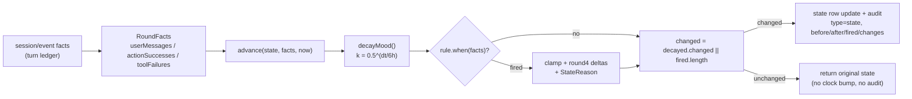
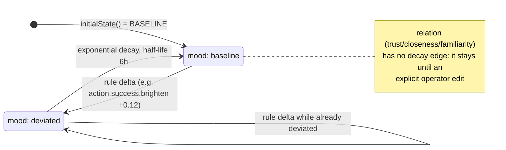

# State and emotion

This document covers Lepimemory's persistent character state: the state vocabulary in `dsh/plugins/dsh-lepimemory-state/src/shared/state.ts`, the fact-to-delta state machine in `dsh/plugins/dsh-lepimemory-state/src/machine.ts`, the turn-scoped runtime in `dsh/plugins/dsh-lepimemory-state/src/state-runtime.ts`, and how the resulting text reaches the model's system prompt and the operator panel. Read it if you are changing mood/relation semantics, the rendering rules, or anything that touches the `state`, `settled_turns`, or `actions.state_applied` persistence it depends on.

## Why state is separate from the model's text

The character has two layers of behaviour. Language is produced by the role model; the *state* that colours that language is produced by structural facts the runtime observes (did the real user speak this turn? did a real tool call fail? did a real action succeed?). The machine module states the rule directly: `**模型文本不直接写状态**——只吃结构事件（用户是否说话、工具是否失败）` (`machine.ts:6`). Model prose can therefore never inflate valence, and a persuasive user message cannot impersonate a successful action.

State is split into two groups because they have different time constants:

| Group | Dimensions | Time behaviour |
| --- | --- | --- |
| `mood` | `valence`, `arousal` | Short-lived; decays exponentially toward baseline with a 6 h half-life |
| `relation` | `trust`, `closeness`, `familiarity` | Long-lived; never decays naturally, only explicit operator edits change it |

`relation.trust` is additionally isolated by rule design: the tool-failure rule deliberately lowers only mood, because `审批拒绝/取消/unavailable 与一般控制错误不算工具失败，且不因一次失败下调对用户的长期信任（trust 只由明确的用户证据改变）` (`machine.ts:69-70`).

## State vocabulary

`shared/state.ts` is the single, browser-safe definition of the state shape. Its header states the constraint that makes the panel possible: `Browser-safe：无任何 node: 依赖，浏览器客户端也可消费同一份定义` (`shared/state.ts:4`). Persistence is explicitly out of scope — SQLite owns it.

```ts
// shared/state.ts:9-15
export const BASELINE = {
  valence: 0,
  arousal: 0.4,
  trust: 0.3,
  closeness: 0.2,
  familiarity: 0.1,
};
```

The initial state is the baseline itself: `initialState(now)` (`shared/state.ts:59-69`) returns `BASELINE` values for all five numeric fields, `mood.updatedAt = now`, and `reasons: []`. `BASELINE` doubles as the rendering origin: every rendered phrase is a deviation from it, never an absolute value.

`NUMERIC_FIELDS` (`shared/state.ts:18-24`) is the authoritative range table and is reused by `machine.ts` for clamping:

```ts
export const NUMERIC_FIELDS: ReadonlyArray<readonly [string, number, number]> = [
  ['mood.valence', -1, 1],
  ['mood.arousal', 0, 1],
  ['relation.trust', 0, 1],
  ['relation.closeness', 0, 1],
  ['relation.familiarity', 0, 1],
];
```

The validated runtime object is `LepiState = { mood, relation, reasons }` with `MoodState { valence, arousal, updatedAt }`, `RelationState { trust, closeness, familiarity }`, and `StateReason { dimension: 'mood' | 'relation', text, at }` (`shared/state.ts:27-51`).

### Validation

`validateState(value)` (`shared/state.ts:96-158`) is a hand-written, per-field validator returning `{ ok: true }` or `{ ok: false, error }`. It is deliberately whitelist-based so that typos are reported by name: `TOP_KEYS`, `MOOD_KEYS`, `RELATION_KEYS`, `REASON_KEYS`, `REASON_DIMENSIONS` are `Set`s of allowed keys (`shared/state.ts:53-57`), and an unknown key fails with `未知字段（拼写错误？）`. Error text always carries the concrete field path, e.g. `lepimemory-state: 状态字段 "mood.valence" 无效：期望 0~1 数值，实际 2`.

Check order: root object → unknown top-level keys → `mood`/`relation` shape and unknown keys → the five numeric fields (finite number inside `[lo, hi]`) → `mood.updatedAt` parseable → `reasons` is an array whose entries have only known keys, a valid `dimension`, a string `text`, and a parseable `at`.

The validator is reused by the store: `openStore` wraps it as `validState()` and throws `StoreError('LEPI_STATE_INVALID')` when it fails (`store.ts:269-272`), which is how a corrupted `state` row or a corrupted legacy `state.json` is rejected instead of silently loaded.

## Rendering: numbers never reach the model

`renderState(state, nowMs = Date.now())` (`shared/state.ts:256-330`) turns state into a short situational paragraph. The rules it implements:

- Only deviations with `|Δ| ≥ MILD` (`0.1`) are candidates; they are sorted by absolute size and truncated to `MAX_ITEMS = 3`.
- Intensity picks the phrasing: `|Δ| ≥ STRONG` (`0.25`) uses the `strong` string, otherwise `mild`.
- `BOUNDARY_EPSILON = 1e-9` absorbs float noise on the threshold (`0.30 - 0.20 === 0.09999999999999998` is still one step) without moving the threshold.
- At most one cause per group is rendered, and only if the group is still deviating. A cause older than `CAUSE_TTL_MS` (6 h, aligned with the mood half-life) or in the future is dropped, so `旧因不得被读成新鲜事件，也不写「刚刚」`.
- A machine-known cause (`STATE_CAUSES`) is only relevant when its own field still deviates ≥ `MILD` **with the same sign**; a generic/operator cause only needs its dimension group to still deviate (`shared/state.ts:293-310`).
- If nothing deviates, the body is `- 与基线相比无明显偏移。`; the trailing `- 行为倾向: …` line is emitted only when at least one item was selected.

The rendered text is prefixed with `HEADER = '【内部状态（相对你自己基线的偏移；用它调整语气，不要向用户提及本段）】'` (`shared/state.ts:220`), and the two group labels are `心境` (mood) and `对用户` (relation) via `GROUP_LABEL` (`shared/state.ts:182`). Example output for `valence = +0.5`, `arousal = baseline`, `closeness = -0.12`, with a fresh `action` cause:

```text
【内部状态（相对你自己基线的偏移；用它调整语气，不要向用户提及本段）】
- 心境: 比平常轻快
  原因: 完成了一次行动。
- 对用户: 比平常略疏远
- 行为倾向: 语气更放松；保持距离
```

`STATE_CAUSES` (`shared/state.ts:237-240`) is the shared cause definition used by both the rules and the renderer, so direction is never guessed from duplicated prose:

| Cause text | Field | Sign | Emitted by rule |
| --- | --- | --- | --- |
| `完成了一次行动。` | `valence` | `+1` | `action.success.brighten` |
| `有一次操作没有成功。` | `valence` | `-1` | `tool.failure.dampen` |

`toneOf()` and `nearOf()` (`shared/state.ts:167-176`) expose the same thresholds to the panel and avatar layer: `toneOf` is `'bright' | 'plain' | 'low'` from `valence - BASELINE.valence`, `nearOf` is true when `closeness` is at least one `MILD` step above baseline. Both are consumed by the panel payload and the avatar frame table (see [UI](./UI.md)).

## The state machine

`machine.ts` exposes pure functions over explicit data. The design principle is in its header: rules are `**显式数据**，纯函数 (facts) -> deltas，可列举、可测、可审`, and every change produces `前值→后值 + 命中规则` for the runtime to settle and audit atomically (`machine.ts:1-7`).

### Structural facts

```ts
// machine.ts:26-30
export interface RoundFacts {
  userMessages: number;
  actionSuccesses: number;
  toolFailures: number;
}
```

Facts are counts only — no text, no message ids, no model output.

### Rules as data

`RULES` (`machine.ts:50-74`) contains exactly three finalised rules, each carrying its rationale in the `why` field:

| Rule id | `when` | Deltas | Reason written |
| --- | --- | --- | --- |
| `interaction.familiarity` | `facts.userMessages > 0` | `relation.familiarity +0.03` | — (no cause emitted) |
| `action.success.brighten` | `facts.actionSuccesses > 0` | `mood.valence +0.12`, `relation.closeness +0.03` | `STATE_CAUSES.action.text` |
| `tool.failure.dampen` | `facts.toolFailures > 0` | `mood.valence -0.12` | `STATE_CAUSES.failure.text` |

Magnitudes are calibrated so a single real action outcome crosses the rendering threshold (`|Δ| ≥ 0.10`) and is therefore visible for one round (`machine.ts:47`). Rule order matters for the reason array only; deltas commute because each rule touches `mood.valence` at most once.

### Decay

```ts
// machine.ts:77-91 (decayMood)
const dt = Math.max(0, nowMs - last);
const k = Math.pow(0.5, dt / MOOD_HALF_LIFE_MS); // 越久 → k 越小 → 越靠基线
const valence = round4(BASELINE.valence + (mood.valence - BASELINE.valence) * k);
const arousal = round4(BASELINE.arousal + (mood.arousal - BASELINE.arousal) * k);
```

`MOOD_HALF_LIFE_MS = 6 * 60 * 60 * 1000` (`machine.ts:14`). `relation` is untouched by decay — the function signature only takes `mood` and returns `{ valence, arousal, changed }`. An unparseable `mood.updatedAt` degrades to "no decay, unchanged" rather than throwing. `changed` is computed with a `1e-6` tolerance.

### Advancing a round

`advance(state, facts, nowMs)` (`machine.ts:104-140`) is the single entry point:

1. Decay first, then apply rules — so a rule delta is never decayed away in the same round.
2. `structuredClone` the input; the input object is never mutated.
3. For each fired rule, clamp each delta to the `NUMERIC_FIELDS` range and `round4`.
4. Push rule reasons with `dimension: 'mood'` and `at = new Date(nowMs).toISOString()`; keep at most 10 (`next.reasons = [...reasons, ...next.reasons].slice(0, 10)`).
5. `changed = decayed.changed || fired.length > 0`. If nothing changed, the **original** state object is returned with empty `fired`/`changes` and no clock bump.
6. Otherwise write `mood.updatedAt = nowMs` and report `changes` as `Record<field, [before, after]>` for every field that moved by more than `1e-9` — this is the before→after plus matched-rule tuple the runtime audits.





## The state session runtime

`createStateRuntime({ store, now, controlTools })` (`state-runtime.ts:109-122`) is the only writer of the state machine's output. It throws `LEPI_STORE_UNAVAILABLE` immediately if the store's `db.prepare` is missing, and treats `store.readOnly === true` as "never commit". `controlTools` defaults to `new Set(['manage_memory'])` (`state-runtime.ts:32`).

It returns `{ observe, text, readEffective, reconcileActions }` (`state-runtime.ts:477`).

### `observe(session, event)`

`observe` wires the native `session/event` feed into the machine. Its constraint is explicit: `**纯 observe**：只做 session 之外的状态记录，绝不重入 session.append` (`state-runtime.ts:6-8`), and the whole switch is wrapped in a `try/catch` that swallows errors because `状态观察失败绝不能影响 session append` (`state-runtime.ts:430-432`).

| Event | Handling |
| --- | --- |
| `turn/start` | Create a fresh in-memory `TurnState { turn, userMessages: 0, toolFailures: 0, calls: Map, seq }` and persist it to `meta` under `turn_facts:<sessionId>` |
| `user/message` | Increment `userMessages` only when `event.data.source.kind === 'user'`; persist |
| `tool/call` | Record `callId -> name` in the turn ledger (used to classify control tools); persist |
| `tool/result` | `handleToolResult()` — the fact-classification path described below |
| `turn/end` | Drop the in-memory ledger and call `settle(sessionId, turn, ledger)` |

A turn ledger is only counted for a real turn identity: `settle()` returns immediately when `turn == null` (`无 turn 身份不结算（不伪造 turn）`, `state-runtime.ts:228`). Mid-process restarts recover the ledger from `meta` via `loadTurn()` (`state-runtime.ts:164-197`).

### Fact-source priority order

The header of `state-runtime.ts` (`state-runtime.ts:24-31`) fixes the priority order, and `handleToolResult` (`state-runtime.ts:338-374`) implements it:

1. **Control/management tools never count as tool failures.** If `callId` maps to a name in `controlTools` (`manage_memory` by default), the result is ignored outright — even if `isError` is true.
2. **The `actions` journal is the source of truth for action success**, keyed by `(session_id, call_id)`, not the renderer or `isError`. A row with `status === 'executed'` counts; if `state_applied` is already 1 it is skipped (`已计入；renderer 报错不得变成失败`).
3. **Journal statuses that mean "did not execute" are ignored**, via `NOT_FAILURES = { prepared, rejected, cancelled, unavailable, unknown }` (`state-runtime.ts:35-41`). Only `status === 'failed'` increments `toolFailures`.
4. **Tools without a journal row fall back to `isError === true`** — the only place where a raw error flag counts.
5. A late `executed` action whose turn was already settled is recovered exactly once by `recoverExecutedAction()` (`state-runtime.ts:282-325`), which requires `selectSettled` to be true and refuses to double-count (`alreadyCounted` check) — audit `status: 'recovered'`, `reason: 'action_executed_after_settle'`.

### Turn settlement

`settle()` (`state-runtime.ts:227-280`) runs one synchronous `store.transaction`, in this order:

1. Read the `settled_turns` row for `(session_id, turn)`; if it exists, return (idempotent replay).
2. Delete the persisted `turn_facts:<sessionId>` row if it matches this turn.
3. Read state, compute decay, and collect `actionSuccesses` from `SELECT action_id FROM actions WHERE session_id=? AND turn=? AND status='executed' AND state_applied=0`.
4. `advance(state, roundFacts, at)`.
5. `INSERT INTO settled_turns(session_id, turn, at)` and `UPDATE actions SET state_applied=1` for each counted action.
6. Write the new state JSON when changed.
7. Audit `type: 'mood.decay'`, `status: 'settled'` when decay moved something, then `type: 'state'`, `status: 'settled'` when the round changed — the `state` audit is the authoritative final value and carries `before`/`after` as whole state objects, `fired`, `changes`, and `action_calls` (`selectTurnCalls`).

`reconcileActions()` (`state-runtime.ts:327-337`) is the explicit startup reconciliation: it joins `actions` against `settled_turns` for `status='executed' AND state_applied=0` and routes each row through `recoverExecutedAction`. It is called once from the plugin entry point after the file-level action journal has been recovered (`index.ts:286`).

### `text({ agent })` and `readEffective()`

`text()` produces the system-prompt section body (`state-runtime.ts:441-475`):

- With a real `agent` (dsh's `systemPrompt.AssembleContext` carries the real `agent` field) and a writable store: load the observed turn from `loadTurn`, then inside **one short synchronous transaction** read state, decay it, `UPDATE state`, and audit `type: 'mood.decay'`, `status: 'ok'`, with `turn` and full `before`/`after`. The committed state is what gets rendered.
- Without an agent (diagnostic) or when the store is read-only: render `effectiveView(at)` and **commit nothing**.
- Failures are fail-closed: an error that already carries a `code` (e.g. a `StoreError`) is propagated as-is; anything else becomes `throw new Error('LEPI_STATE_UNAVAILABLE', { cause: error })`. The stated reason for never falling back to a cached render is that `旧原因可能属于已遗忘内容` (`state-runtime.ts:10-11`).

`readEffective()` (`state-runtime.ts:473-475`) is the read-only counterpart: `effectiveView(clock())`, i.e. decay computed in memory with no write and no audit. It is the panel's contract (`供面板/diagnostic`), and `panel.ts` re-implements the same projection in `effectiveState()` with the note `与 state-runtime.readEffective 同义` (`panel.ts:343-354`).

## How state reaches the model and the panel

**System prompt.** `index.ts` registers one native section:

```ts
// index.ts:270-275
ctx.systemPrompt.section({
  name: 'lepimemory:state',
  order: STATE_SECTION_ORDER,
  text: (context) => state.text(context),
});
```

`STATE_SECTION_ORDER = 50` (`index.ts:46`). Upstream's fixed orders put the deployment persona prefix at `0` and the plan policy at `500` (`dsh-system-prompt/lib/index.js:10-14`, `DEPLOYMENT_PERSONA_PREFIX: 0`, `PLAN_POLICY: 500`), which matches the module comment `State follows persona prefix (0), before policy (500)` (`index.ts:1`). The consequence recorded in the deployment profile is that the state section sits at system/message node 0 and is therefore never compacted away (`dsh/profiles/lepimemory/cordis.patch.yml`, section 2).

**Panel.** The panel serves `GET /lepimemory/state` with `statePayload()` (`panel.ts:384-396`), built from the decayed effective view: `rendered`, `tone`, `near`, `mood`, `relation`, `updatedAt`, plus readiness/counts. `POST /lepimemory/state` is the operator override path: `nextStateFrom(current, input, at)` → `validateState(next)` → `store.commitState(next, { at, type: 'control', status: 'state_set', data: { operator: true } })` (`panel.ts:607-615`). With `?preview=1` the same computation returns `StatePreviewResponse` and explicitly does not commit or audit (`dry-run：只算渲染与基调，绝不 commitState、绝不写审计`, `panel.ts:589`). `toneOf`/`nearOf` from that payload drive the avatar frame table (`shared/avatar-frames.ts:73-84`, `AVATAR_FRAMES`).

**Forgetting.** A forget plan resets the rendered causes: `history.ts` commits `{ ...state, reasons: [] }` with audit `type: 'forget.state'`, `status: 'local_isolating'` (`history.ts:462-470`). This is the concrete reason the runtime refuses to render a stale fallback.

## State fields reference

| Field | Group | Baseline | Range | Decay | Written by |
| --- | --- | --- | --- | --- | --- |
| `mood.valence` | mood | `0` | `[-1, 1]` | half-life 6 h | `action.success.brighten` (+0.12), `tool.failure.dampen` (−0.12), operator `POST /lepimemory/state` |
| `mood.arousal` | mood | `0.4` | `[0, 1]` | half-life 6 h | decay only today; operator override |
| `mood.updatedAt` | mood | `initialState()` time | parseable ISO string | — (decay anchor) | `advance` on change, `settle`/`text` on decay, operator override |
| `relation.trust` | relation | `0.3` | `[0, 1]` | none | operator override only |
| `relation.closeness` | relation | `0.2` | `[0, 1]` | none | `action.success.brighten` (+0.03), operator override |
| `relation.familiarity` | relation | `0.1` | `[0, 1]` | none | `interaction.familiarity` (+0.03), operator override |
| `reasons[]` | both | `[]` | ≤ 1 rendered per group, ≤ 10 stored | invisible after 6 h (`CAUSE_TTL_MS`) | rules; cleared to `[]` by a forget plan |

Audit rows produced by this subsystem, all carrying full `before`/`after` state in `data_json`:

| Audit `type` / `status` | Emitted at | Notes |
| --- | --- | --- |
| `state` / `settled` | `settle()` | authoritative turn final value, plus `fired`, `changes`, `action_calls` |
| `state` / `recovered` | `recoverExecutedAction()` | late executed action, `recovered: true` |
| `mood.decay` / `settled` | `settle()` | decay portion of a turn settlement |
| `mood.decay` / `ok` | `text()` | committed decay before system-prompt assembly |
| `control` / `state_set` | panel operator override | `data.operator: true` |
| `forget.state` / `local_isolating` | history plan | clears `reasons` |

## Related documents

- [Memory](./MEMORY.md) — the memory data path that produces the `actions` journal rows consumed as `actionSuccesses`.
- [Recall](./RECALL.md) — recall filtering, which is why stale state must never be rendered from a buffer.
- [Action](./ACTION.md) — how `write_note` writes the `executed` rows the state machine counts.
- [Control](./CONTROL.md) — the control plane that owns `policyEpoch` and the forget/restore lifecycle.
- [Observability](./OBSERVABILITY.md) — the `audit` table and projections that store these rows.
- [UI](./UI.md) — the panel state view, operator override, and avatar frame selection.
- [Architecture](./ARCHITECTURE.md) — where the state runtime sits among the plugin's services.
- [Configuration](./CONFIGURATION.md) — `dataRoot`, `databaseFile`, and the pinned runtime versions.
