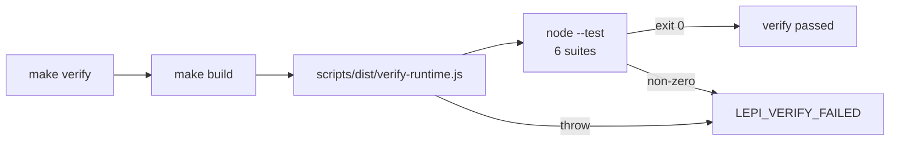

# Testing

How Lepimemory is verified: which runner is used, how to run each suite, what every suite protects, what the static gates cover, and what the runtime verification program actually proves. Read this before changing a contract, and re-read the "adding a test" recipe before writing a new one.

## Why the verification looks the way it does

The codebase is built around a small number of fail-closed contracts: a status in SQLite is a claim about the real world, an audit row is a receipt, and an error code is a promise that nothing was silently invented. The test suites exist to hold those promises, so they follow four rules that are visible directly in the code.

- **A receipt requires proof.** Nothing may report success without evidence. `dsh/plugins/dsh-lepimemory-state/src/action.ts` only writes `executed` after the written file's hash matches the registered hash, and `test/action.test.js` asserts the converse: a renderer failure after the file commit still counts as one successful action, while a rejection creates no file, no state change and no evidence.
- **A failure is a failure, not a downgrade.** When an audit write, a policy check or a prompt assembly fails, the runtime throws a stable code instead of returning a cached or stale value. `state-runtime.ts` documents this ("失败 fail-closed：抛稳定错误，绝不回退渲染旧状态") and `test/action.test.js` covers it with a failed `mood.decay` audit that rejects prompt assembly rather than serving a cached cause.
- **Assert consumer-visible behaviour, never implementation echoes.** `test/history.test.js` states it in its header comment: the suites assert "the durable surface, next provider request, evidence reads, store rows) ... never registration strings, wire names or mock echoes". Consumers are the real `Session` log, the real provider request object, the SQLite rows.
- **Synthetic material only.** Every fixture builds its own temporary directory and synthetic text; no credentials, no cloud model, no network beyond `127.0.0.1` throwaway HTTP servers. `test/history.test.js` even pins an unreachable Hindsight base URL (`http://127.0.0.1:1`) where the scheduler must not call it.

Everything in this document is grounded in the test files themselves, `scripts/src/verify-runtime.ts`, `scripts/src/runtime.ts` and the root manifests.

## The test runner

There is no third-party test framework. Every suite is a plain ESM module that imports `test` from `node:test` and `assert` from `node:assert/strict`, and is executed by Node's built-in test runner through the `--test` flag:

```js
// dsh/plugins/dsh-lepimemory-state/test/avatar.test.js:1-2
import assert from 'node:assert/strict';
import { test } from 'node:test';
```

Two consequences matter when you add tests:

- Suites are executed by the **pinned Node** (`.runtime/bin/node`, v24.20.0), never a system Node. `scripts/build.mts` and `scripts/src/runtime.ts` both refuse to run under any other interpreter.
- Suites import the plugin's **compiled output**, not the TypeScript sources: `import { openStore } from '../lib/store.js';`. Generation happens in the build step, so `make build` must have run (the `make verify` target depends on `build` for exactly this reason). Never edit `lib/` — it is a generated, gitignored artifact.

Native dsh packages are resolved through the pinned CLI dependency graph rather than whatever pnpm happens to lay out on disk:

```js
// dsh/plugins/dsh-lepimemory-state/test/runtime.test.js:832-835
const rootRequire = createRequire(new URL('../../../../package.json', import.meta.url));
const nativeRequire = createRequire(rootRequire.resolve('@deepseek-ai/dsh/package.json'));
const { Context } = nativeRequire('@deepseek-ai/cordis');
```

## Running the suites

All commands run from the repository root. The first-run prerequisites (`make bootstrap`, `make install-profile`) are covered in [DEVELOPMENT.md](./DEVELOPMENT.md).

| Command | What it does |
| --- | --- |
| `make verify` | Builds (`make build`), runs `scripts/dist/verify-runtime.js`, then runs all six suites in one `node --test` invocation. This is the canonical verification entry point. |
| `make check` | The full gate: `make verify`, then `make lint`, then `make format-check`. |
| `make build` | Regenerates `lib/`, `scripts/dist/` and `client.js`; required before any direct test run. |
| `make typecheck` | Declaration refresh plus `--noEmit` checks for the four TypeScript projects. Not part of `make check` because `make build` already compiles every project. |
| `make lint` | `pnpm lint`, i.e. ESLint with `--max-warnings=0`. |
| `make format-check` | `pnpm format:check`, i.e. `prettier --check` over the hand-written file list. |

Running a single suite directly (after `make build`):

```bash
.runtime/bin/node --test dsh/plugins/dsh-lepimemory-state/test/avatar.test.js
```

Running the whole behavioural set exactly the way `make verify` does:

```bash
.runtime/bin/node --test \
  dsh/plugins/dsh-lepimemory-state/test/recall.test.js \
  dsh/plugins/dsh-lepimemory-state/test/history.test.js \
  dsh/plugins/dsh-lepimemory-state/test/action.test.js \
  dsh/plugins/dsh-lepimemory-state/test/avatar.test.js \
  dsh/plugins/dsh-lepimemory-state/test/panel-groups.test.js \
  dsh/plugins/dsh-lepimemory-state/test/runtime.test.js
```

`scripts/src/runtime.ts` `commandVerify()` runs `verify-runtime.js` first and then spawns that same invocation through `runEntry()`. `runEntry()` fails closed in two ways: a missing file raises `LEPI_VERIFY_MISSING` ("added at the Step-11 cutover"), and a non-zero exit raises `LEPI_VERIFY_FAILED` naming the file. On success the launcher prints `verify passed`.



### What each suite covers

Two suites are broad runtime suites with many fixtures; four are focused per-subsystem suites. Top-level case counts are exact at HEAD.

| Test file | Lines | Cases | Subsystem | Key invariants |
| --- | --- | --- | --- | --- |
| `test/runtime.test.js` | 2039 | 55 (+2 nested) | config, Hindsight client, store, processor, contracts, control, evidence, admission, memory scheduler, raw sources, write/curate workers | Fail-closed config, bounded retries, policy-epoch fencing, privacy consent, admission boundaries, worker identity and cleanup |
| `test/history.test.js` | 1200 | 19 | history coordinator, canonical surface, native agent loop, control | Isolation is durable and auditable; fenced input never reaches a provider; a forgotten target never comes back |
| `test/recall.test.js` | 438 | 11 | recall, trust, source resolution, observation verification | Only approved sources rank; forgotten/changed material never leaves the runtime; expiry is history, not success |
| `test/action.test.js` | 494 | 12 (one loops 3 outcomes) | action tool (`write_note`), state runtime | Real side effects only; journal determines success; recovery never rewrites files |
| `test/avatar.test.js` | 109 | 6 | avatar asset manifest, state tone mapping, client activity priority | Manifest and assets agree; 62 frames are valid 256×256 GIF89a; activity precedence is deterministic |
| `test/panel-groups.test.js` | 89 | 4 | store `historyGroups()` (panel grouping) | Grouping, group-level pagination, kind filtering and stage truncation are a single host-side rule |

No suite is skipped or marked TODO, and none uses `describe`/`it` or `.only`.

#### `test/runtime.test.js` — the end-to-end runtime suite

This is the broadest suite: 55 top-level cases plus two nested subtests. It escalates fixture realism in layers:

- pure environment maps and `resolveConfig` calls for configuration;
- scripted streaming-LLM objects (`processorFixture`, plus hand-written `async *stream()` generators) for the processor and contract layer;
- a real `HindsightClient` against a throwaway `node:http` server created by `withHttp()`;
- `nativeControlFixture()`, which boots a real Cordis `Context` with the real `AgentRegistry`, `Session`/`foldSurface`, `UserQuestionService` and native session plumbing, faking only the agent object and the operator's answers;
- `schedulerFixture()`, which builds the real `createMemoryRuntime` over a real SQLite store with stubbed `processor.extract` / `admission.evaluate` and a deliberately unreachable Hindsight client;
- `remoteWorkerFixture()`, which seeds real SQLite rows and drives the real write/curate workers against an in-memory fake Hindsight implementing the same shapes.

Representative invariants, grouped by owner:

| Owner | Invariant the suite protects | Example case |
| --- | --- | --- |
| `config.ts` | A URL and its key are an atomic pair; a half-filled pair throws `LEPI_CONNECTION_INCOMPLETE` naming the missing field. Legacy `.env` migration takes a `0o600` byte-identical backup and is one-shot. Unsafe policy values fail before startup. | "incomplete connections never send a key to an inferred endpoint", "legacy migration preserves connections with a private backup and is one-shot" |
| `hindsight.ts` | A lost write acknowledgement never triggers a second retain submission; read retries are bounded to 3 and never leak a server error body; pagination has no gaps. | "a lost write acknowledgement never triggers another retain submission", "safe read retries are bounded and never expose a server error body" |
| `store.ts` | A corrupt or invalid legacy state is preserved, not replaced; ownership is exclusive. | "invalid legacy state remains untouched and can be corrected before retry", "an existing corrupt SQLite file is never replaced by JSON or an initial state" |
| `processor.ts` / `contracts.ts` | Closed JSON cannot pass as a valid submission; a policy change mid-stream rejects `LEPI_INPUT_RESUBMIT_REQUIRED`; structural repair is attempted exactly once and never echoes forbidden values; foreign citations never become facts; the output budget is charged even by a failed stream. | "closed JSON cannot make a truncated, aborted, max-token or duplicate submission valid", "a failed primary stream still consumes the bounded output budget before fallback" |
| `control.ts` | A private consent card persists no body; ambiguous or custom answers never grant; late answers after timeout, policy change or disposal are cancelled; an evidence fence requires fresh input instead of parking or requeueing the rejected body. | "native private consent binds the displayed item without persisting its body or committing a conversation message", "an evidence fence requires fresh input rather than parking or requeuing the rejected body" |
| `admission.ts` | Laya probabilities respect content-specific inclusive boundaries; a high score cannot authorise memory when clipping is reported or usage evidence is missing. | "the same laya probability respects content-specific inclusive admission boundaries", "a high probability cannot authorize memory when clipping is reported or its evidence is missing" |
| `memory.ts` | Admission that crossed a policy epoch is refused; deferral parks until an operator retry; disposal drains without a late grant; an aborted turn with only committed input creates no task. | "scheduler refuses a private candidate whose admission crossed a policy epoch", "scheduler disposal cancels its native private card and drains without a late grant" |
| `raw-source.ts` | Version hashes ignore state/score/metadata ordering but change with content; raw proof cannot borrow authority from an observation, a foreign document or a text-only hash. | "curation state changes preserve semantic source versions but altered content cannot restore", "raw proof cannot borrow authority from an observation, foreign document or text-only content hash" |
| `write-worker.ts` / `curate-worker.ts` | A lost acknowledgement keeps its `operation_id`; `not_found` is not proof of safety; lifecycle is re-read after every await; a completed operation with no usable raw never produces a written receipt. | "lost acknowledgements and explicit unknown rechecks retain identity and recover current truth without resubmission", "the integrated worker rereads lifecycle after document awaits instead of activating a forgotten snapshot" |

#### `test/history.test.js` — canonical-history consumer regressions

The header comment defines the contract this file protects:

```js
/**
 * Step 9 canonical-history consumer regressions.
 * ...
 * A small fake `redactHistory` supplies deterministic semantic judgements so
 * the coordinator's native windows can be isolated; everything around it
 * (SQLite fence, evidence references, JSONL surface, provider request) is real.
 *
 * Synthetic material only. No credentials, no cloud model.
 */
```

The fixture `nativeHistoryFixture()` boots the released native graph as real Cordis fibers — `dsh-agent`, `dsh-session`, `dsh-llm`, `dsh-tools`, `dsh-system-prompt`, `dsh-session-projection`, `dsh-user-questions`, `dsh-session-persistence-jsonl` (writing into a temp `sessions/` root), `dsh-session-query-sqlite` and `dsh-agent-loop` — and registers a `SyntheticTransport extends LlmAdapter` through the public `ctx.llm.registerAdapter(['synthetic-history'], …)` API. Only the semantic judge (`redactHistory`), `checkControl` and `matchGrant` are scripted, so windowing, epoch fencing, SQLite writes, evidence gates and provider filtering are all real.

Marker constants make the fake's judgements declarative: `TOKEN` stands in for forgotten private material, `KEEP` for "keep only the non-token span in this node", `UNCERTAIN` for an unresolvable node, `BOGUS` for a missing span proof, `TOOL` for paired tool material.

| Group | Invariant | Example case |
| --- | --- | --- |
| Atomic forget | A confirmed forget is one durable cutover: epoch + 1, lifecycle `forgotten`, one active scope, meta pointer, request epochs, audit rows, a pending history-work fence — with `state.reasons` cleared but numerics and the approved snapshot untouched. | "forget advances the policy epoch and clears state reasons atomically without touching mood or relation" |
| Input fencing | While a history fence is pending, ordinary input produces no committed `user/message`, no step start and no provider request; only the real `agent/inbox/spliced` trace survives. | "a pending canonical-history fence rejects ordinary input before the provider and keeps only the inbox splice" |
| Isolation durability | The replacement survives a JSONL reload, applies to cold sessions too, and a raw SQL `restore` cannot rebuild the old surface. | "release replaces the forgotten target across a live and a cold session while the safe statement survives and the original log stays auditable" |
| Epoch races | An epoch bump while the proof is being assembled rejects the stale assembly and leaves the fence; a policy change after a real `fetch_context` prevents the commit. | "a policy epoch change while the proof is being assembled rejects the stale proof and leaves the fence" |
| Tool pairing | A forgotten tool call and its result are replaced as one balanced unit with no orphan result. | "a forgotten tool call and its result are replaced as one balanced pair with no orphan result" |
| Real processor | The real `createProcessor` fetches the genuine evidence row and keeps an independent span through `submit_result`. | "the real processor fetches a genuine evidence reference and keeps an independent span through submit_result" |
| Native control | A remember turn keeps the command and reply; a forget command stays visible; a control outage keeps the input and error visible without calling the role; a first greeting in a new session is not mistaken for old inbox material. | "a native control outage keeps the user input and error visible without calling the role" |
| Ordering and forks | `sourceEventSeqs` follow canonical surface order, not log order; a fork reuses only the proved prefix and an obsolete inherited prefix is trapped. | "a fork after isolation reuses only the proved prefix and an obsolete inherited prefix never reaches a processor again" |

#### `test/recall.test.js` — recall and source trust

The fixture seeds `snapshots`, `lifecycle` and `raw_links` rows directly, then serves a synthetic observation from a local HTTP server that answers `/recall`, `/documents/<id>` and raw-memory lookups. `createRecaller` is exercised with a stub `processor.verifyObservation`.

| Invariant | Example case |
| --- | --- |
| An observation never lends fact authority to an unknown source or an unconfirmed inference; inference keeps its own formation age and the "unconfirmed inference" label. | "observation never lends fact authority to an unknown source or unconfirmed inference" |
| An observation containing forgotten material never reaches the verifier, and its text never appears in recall audit rows. | "a mixed observation containing forgotten material never reaches the verifier; allowed snapshot keeps parent relevance" |
| A change to a source body during verification excludes the item with `LEPI_SOURCE_CHANGED` — there is no local-snapshot fallback. | "external raw changes during observation verification cannot escape through a local snapshot fallback" |
| Expired planned memories become `history_only`, never "completed". | "expired planned memories become historical, never completed; undated-cutoff states remain dated statements" |
| A revoked grant stays readable for the original item but cannot be borrowed by another candidate (`LEPI_GRANT_INVALID`). | "an original kept private grant remains readable after revocation, but another candidate cannot borrow it" |
| Fallback source scans stop after four pages and never report an incomplete scan as "missing". | "source fallback scans stop at four pages across refresh and do not call an incomplete scan missing" |
| A forget that lands between the document and raw awaits stops the following raw query. | "forget between document and raw awaits stops the subsequent raw body query" |
| Partial observation fallback ranks each snapshot independently within the explicit item budget; `over_limit` items are excluded and the composite body never renders. | "partial observation fallback ranks each snapshot independently within the explicit item budget" |
| A null semantic score keeps ranked approved facts, but inference and forgotten sources are excluded (`score_unavailable`, `LEPI_MEMORY_SUPPRESSED`). | "native null semantic retains ranked approved facts without lending relevance to inference or forgotten sources" |

#### `test/action.test.js` — real side effects

This suite boots the real native agent loop with `@deepseek-ai/dsh-user-approval` and a synthetic transport that can emit `write_note` tool calls, then installs the real `installAction()`. Success and failure are read from the `actions` journal, the `notes/` directory and the state runtime — never from `isError`.

| Invariant | Example case |
| --- | --- |
| Rejected/cancelled/unavailable notes create no file, no successful-action state and no evidence; only the audit row records the real outcome. | "native rejected, cancelled and unavailable notes create neither file nor successful-action state or evidence" |
| Two allowed notes with the same title keep both bodies, settle each real turn once, and record `state_applied = 1`. | "allowed native notes with the same title preserve both bodies and settle each real turn only once" |
| Schema/whitespace rejection cannot create a note or lower relationship trust. | "native schema and whitespace rejection cannot create a note or lower relationship trust" |
| Diagnostic state reads are read-only; real prompt assembly persists exactly one elapsed decay. | "diagnostic effective state is read-only while actual native assembly persists exactly one elapsed decay before pre-step" |
| Recovery accepts only a matching final hash; a missing or changed file becomes `unknown` and is never rewritten or deleted. | "prepared recovery accepts only the matching final hash and never rewrites a missing or changed file" |
| An existing destination wins the atomic link race and is never overwritten or removed (`LEPI_NOTE_COLLISION`). | "an existing destination wins the atomic link race and is never overwritten or removed" |
| A renderer error after the file commit neither negates the journal nor counts as a second failed action. | "a renderer error after a real file commit cannot negate the journal or count as a second failed action" |
| A repeated call identity cannot create another file or apply the state twice. | "a repeated native call identity cannot create another file or count the original action twice" |
| A failed state audit leaves no numeric delta, no settlement and no applied action; the same real end can be retried. | "failed state audit commits no numeric delta, settlement or action application, and the same real end can be retried" |
| A failed decay audit rejects prompt assembly instead of returning a cached cause. | "a failed decay audit rejects native prompt assembly rather than returning a cached state cause" |
| An old settled turn replay cannot erase current facts across a runtime restart. | "an old settled end replay cannot erase the current real turn facts across a runtime restart" |
| Two files committed before a journal failure recover as one successful turn, without rewriting or double brightening. | "two real files committed before journal failure recover as one successful turn, without rewriting or double brighten" |

#### `test/avatar.test.js` — assets and activity mapping

Six small cases with no fake infrastructure; two read the real asset directory.

| Invariant | Example case |
| --- | --- |
| Every manifest key matches `/^[a-z][a-z0-9-]{0,31}$/`. | "清单键名形状合法" |
| The files in `assets/avatar/` are exactly the manifest's values — no missing, no extra. | "assets/avatar/ 的文件集合与清单的值完全相等（无缺失、无多余）" |
| Every asset is a 256×256 GIF89a. | "每个素材都是 256x256 的 GIF89a" |
| `toneOf` steps at the MILD boundary; `nearOf` requires one step above baseline closeness. | "toneOf 在 MILD 边界分档，nearOf 以 closeness 高出基线一档为准" |
| Activity precedence: approval/question > tool/speak/think > error > idle. | "活动优先级：审批/提问 > 工具/说话/思考 > 错误 > 待机" |
| Text output counts as "speak" only on a running assistant step. | "文本输出只在 running 的 assistant step 上算“说话”" |

#### `test/panel-groups.test.js` — one grouping rule

`store.historyGroups()` is the single host-side grouping authority for the panel. The suite creates rows through `store.audit()` in a temp database and asserts grouping, group-level pagination, shared kind filtering and truncation.

| Invariant | Example case |
| --- | --- |
| Rows group by subject; group order follows each group's newest row; within a group the order is newest-first. | "historyGroups 按主体归组、组序按各组最新一条" |
| Pagination counts groups, not rows, and `total` is the number of groups. | "historyGroups 以组为单位分页" |
| `historyGroups` and `history` share the same `kind` filter. | "historyGroups 与 history 共用同一 kind 过滤口径" |
| A group with more than `stages` rows is truncated to 50 and flagged `truncated: true`. | "historyGroups 截断超过 stages 的阶段并标记 truncated" |

## Static gates

`make check` runs the static gates after `make verify`. Both gate scripts are declared in `package.json` and cover only hand-written files; generated output (`lib/`, `client.js`, `scripts/dist/`) is never linted or formatted, it is regenerated.

### Lint

```bash
# package.json
"lint": "eslint scripts/src scripts/build.mts dsh/plugins/dsh-lepimemory-state/src dsh/plugins/dsh-lepimemory-state/test/*.test.js eslint.config.mjs --max-warnings=0"
```

`--max-warnings=0` promotes any warning to a failure, so there is no tolerated warning class. `eslint.config.mjs` is a flat config with a type-aware TypeScript block for the four tsconfig projects and a browser-globals block for the client. Rules worth knowing before you write code:

| Rule | Setting | Practical effect |
| --- | --- | --- |
| `@typescript-eslint/no-explicit-any` | `error` | `any` must be replaced with a narrow interface or `unknown` plus a narrowing helper (the codebase's `asRecord`/`firstRow` pattern). |
| `@typescript-eslint/no-floating-promises` | `error` | Fire-and-forget promises must be explicitly `void`ed or handled. |
| `@typescript-eslint/no-misused-promises` | `error` | No async callbacks passed where a synchronous one is expected. |
| `@typescript-eslint/ban-ts-comment` | `ts-expect-error` allowed *with a description*; `ts-ignore`/`ts-nocheck` banned | Suppressions must state why they are correct. |
| `no-unused-vars` (JS) and `@typescript-eslint/no-unused-vars` (TS) | `error` with `argsIgnorePattern: '^_'`, `caughtErrors: 'all'` | Prefix intentionally unused args/locals with `_`. |
| `no-empty` | `error` with `allowEmptyCatch: true` | Empty `catch {}` is allowed; other empty blocks are not. |
| `react-hooks/rules-of-hooks` / `exhaustive-deps` | `error` / `warn` (client only) | With `--max-warnings=0` a missing dependency array entry fails the gate. |

`eslint.config.mjs` also ignores `.env*`, `.runtime/`, `.dsh/`, `.omp/` and all generated artifacts. Lint target globs matter: the test glob is `test/*.test.js`, so a test file that does not end in `.test.js` is invisible to both lint and format checks.

### Formatting

```bash
# package.json
"format:check": "prettier --check .prettierrc.json package.json pnpm-workspace.yaml eslint.config.mjs scripts/src scripts/build.mts dsh/plugins/dsh-lepimemory-state/package.json dsh/plugins/dsh-lepimemory-state/src dsh/plugins/dsh-lepimemory-state/test/*.test.js"
```

`.prettierrc.json` fixes the style: `printWidth: 100`, `tabWidth: 2`, `singleQuote`, `trailingComma: "all"`, `semi`, `endOfLine: "lf"`. `.prettierignore` excludes the toolchain and local state (`node_modules/`, `.runtime/`, `.dsh/`, `.omp/`, `.env*`), generated output, binary assets, the verbatim CSS bundled through esbuild's `text` loader, the lockfile, `docs/DEVLOG.md` and `CHALLENGE.md` (both frozen, hand-formatted inputs). The `docs/DEVLOG.md` entry is a leftover from the earlier documentation layout: that file no longer exists in this checkout, and the ignore line is simply inert.

`pnpm format` (the root `format` script; the Makefile exposes only the check as `make format-check`) writes the same file set in place; use it before committing rather than hand-fixing spacing. When invoking it directly, use the pinned pnpm at `.runtime/bin/pnpm` — the Makefile puts `.runtime/bin` first on `PATH` for exactly this reason.

## What `runtime.js verify` proves

`make verify` first runs `scripts/dist/verify-runtime.js`, compiled from `scripts/src/verify-runtime.ts`. It is not a behaviour suite: it is a single linear program that asserts the store and runtime invariants no unit test can fake, and then prints a one-line JSON summary of the claims it proved. It starts by refusing to run anywhere except the pinned interpreter:

```ts
// scripts/src/verify-runtime.ts
assert.equal(process.version, NODE_VERSION);
assert.equal(
  fs.realpathSync(process.execPath),
  fs.realpathSync(path.join(root, '.runtime/bin/node')),
);
```

It then builds a temp home containing a legacy `state.json` plus `audit/recall/retain/forget/action.jsonl`, opens a real store, and asserts:

| Claim | Assertion |
| --- | --- |
| Legacy import | `store.readState()` equals the legacy state; all five `.jsonl` records become history rows; a legacy action row has `session_id = null`, `call_id = null`, `status = 'unknown'` and `data.legacy = true`; the recall row keeps its legacy `session_id`/`turn`; the failed retain maps to `failed`. |
| Legacy files are archived, not consumed | The originals are copied byte-identically into a directory recorded under meta `legacy_archive`, still readable there. |
| SQLite pragmas | `journal_mode = delete`, `synchronous = 2`, `foreign_keys = 1`. |
| Single writer | A second `openStore()` on the same file throws `LEPI_STORE_OWNED`; so does a competing process spawned via `spawnSync`. |
| State commits are audited and atomic | `commitState()` with a bare status throws and changes nothing; a valid event commits with full `before`/`after` and identity fields; a thrown error inside `store.transaction()` rolls back (including `bumpPolicyEpoch`); an async transaction callback throws and its body never runs. |
| Snapshots are immutable | `UPDATE snapshots SET json = …` throws and the row is unchanged. |
| Crash recovery | After installing a demonstrably dead PID as the owner and a `running` write task, reopening the store reclaims ownership, resets the lease and moves the task back to `submitted` with its `operation_id` preserved. |
| Read-only stores cannot write | A `readOnly: true` store reads state but its `UPDATE` throws. |
| Unknown history kinds are rejected | `store.history({ kind: 'constructor' })` throws. |

The final `console.log` reports `sqlite: 'rollback/reopen proven'`, `legacy: 'preserved once'`, `writer: 'second process refused'`, `stateAudit: 'atomic full before/after'`, `snapshot: 'immutable'`, `readonly: 'write refused'`, plus the recovered operation id.

## Fail-closed codes asserted by the suites

These codes are contracts, not messages. The suites pin them so a refactor cannot silently change the failure mode.

| Code | Meaning | Asserted in |
| --- | --- | --- |
| `LEPI_CONNECTION_INCOMPLETE` | A URL/key pair is incomplete; the field name is reported. | `test/runtime.test.js` (config cases) |
| `LEPI_CONFIG_INVALID` | A configuration value is out of range, an unknown enum, a bad time zone, or the reserved legacy bank. | `test/runtime.test.js` |
| `LEPI_STATE_INVALID` | The legacy `state.json` fails validation; the file is left untouched. | `test/runtime.test.js` |
| `LEPI_STORE_UNAVAILABLE` | The SQLite file is corrupt or unusable; it is never replaced. | `test/runtime.test.js` |
| `LEPI_STORE_OWNED` | Another live runtime owns the database. | `scripts/src/verify-runtime.ts` |
| `LEPI_HINDSIGHT_UNAVAILABLE` | The memory backend cannot be reached; read retries are bounded. | `test/runtime.test.js` |
| `LEPI_INCOMPLETE_STREAM` / `LEPI_CONTROL_UNAVAILABLE` | A model stream or control result is invalid or unavailable. | `test/runtime.test.js`, `test/history.test.js` |
| `LEPI_INPUT_RESUBMIT_REQUIRED` | History fencing or an epoch race requires the user to resubmit; the body is not requeued. | `test/runtime.test.js`, `test/history.test.js` |
| `LEPI_MEMORY_SUPPRESSED` | The candidate's lifecycle forbids recall. | `test/runtime.test.js`, `test/recall.test.js` |
| `LEPI_SOURCE_CHANGED` / `LEPI_SOURCE_UNKNOWN` | A source body changed or cannot be proven. | `test/recall.test.js` |
| `LEPI_GRANT_INVALID` | A private grant no longer covers the item being read. | `test/recall.test.js` |
| `LEPI_RETAIN_EMPTY` | A write completed but produced no usable raw material. | `test/runtime.test.js` |
| `LEPI_NOTE_COLLISION` / `LEPI_NOTE_UNKNOWN` / `LEPI_NOTE_INVALID` / `LEPI_NOTE_EMPTY` / `LEPI_NOTE_WRITE_FAILED` | `write_note` failure classes; success is only ever `executed`. | `test/action.test.js` |
| `LEPI_ACTION_IDENTITY` | The action's exact `(sessionId, callId)` identity is unavailable; the tool refuses to guess. | `src/action.ts` (documented contract) |
| `LEPI_WORKER_STOPPED` | Recall was requested after disposal. | `src/memory.ts` (documented contract) |

## Adding a test

The conventions below are what the existing suites do; follow them rather than introducing a second style.

1. **Name the file `test/<topic>.test.js`** under `dsh/plugins/dsh-lepimemory-state/test/`. Only `*.test.js` is inside the lint and format globs, and only files listed in `commandVerify()` run under `make verify`.
2. **Import the compiled modules**: `import { openStore } from '../lib/store.js';`. Run `make build` first, and never import from `lib/` in a way that assumes a `.ts` path.
3. **Use the built-in runner**: `import { test } from 'node:test'` and `import assert from 'node:assert/strict'`. Do not add a test framework dependency.
4. **Create a temp home and clean up in `t.after`**:
   ```js
   const home = fs.mkdtempSync(path.join(os.tmpdir(), 'lep-my-topic-'));
   const store = openStore({ dbFile: path.join(home, 'runtime.sqlite') });
   t.after(() => {
     store.close();
     fs.rmSync(home, { recursive: true, force: true });
   });
   ```
5. **Prefer real infrastructure over mocks.** If a native dsh service is involved, resolve it the way the suites do (`createRequire(rootRequire.resolve('@deepseek-ai/dsh/package.json'))`) and boot it as a fiber. If an HTTP boundary is involved, use the `withHttp()` helper pattern instead of mocking the client's methods — that is what keeps the client's retry and error-body behaviour covered.
6. **Fake only the semantic decision**, never the mechanism around it. The `redactHistory` fake in `test/history.test.js` is the model: the windowing, fencing, persistence and provider filtering stay real while a small deterministic function supplies judgements.
7. **Assert consumer-visible behaviour and stable codes**, not registration strings, internal field names or mock echoes. When something must *not* happen, prefer a hard trap (`assert.fail(...)`) or an explicit count assertion (`captures.length === 0`) over a vague truthiness check.
8. **Advance clocks explicitly.** Fixtures inject `now: () => clock` and expose setters so time-based decay and TTL behaviour is deterministic rather than wall-clock dependent.
9. **Register the suite** in `scripts/src/runtime.ts` `commandVerify()` if it is a new top-level file, then confirm `make verify` runs it and prints `verify passed`.
10. Finish with `make check`. Formatting and lint failures are part of the gate, not optional.

## Related documents

- [DEVELOPMENT.md](./DEVELOPMENT.md) — the day-to-day loop, build outputs and where to add code.
- [RUNTIME.md](./RUNTIME.md) — what `make dev`/`make verify` launch and how the launcher gates work.
- [DEPLOYMENT.md](./DEPLOYMENT.md) — Docker services, profiles and the install flow.
- [CONFIGURATION.md](./CONFIGURATION.md) — every `LEPI_*` variable the config tests pin.
- [MEMORY.md](./MEMORY.md) — the lifecycle and worker stages the memory tests drive.
- [RECALL.md](./RECALL.md) — the recall projection and trust rules.
- [ACTION.md](./ACTION.md) — the `write_note` journal the action suite guards.
- [OBSERVABILITY.md](./OBSERVABILITY.md) — the audit rows and history tables the tests read back.
