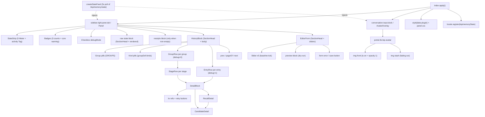
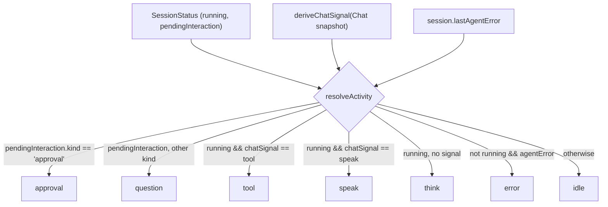

# Browser panel and character overlay

This document describes the browser half of the Lepimemory plugin: how dsh loads it, what it renders, where its data comes from, and how the character sprite and the status strip decide what "it is doing right now". Read it if you are changing anything under `dsh/plugins/dsh-lepimemory-state/src/client/`, adding a history kind, or debugging why the panel shows something the server did not send.

Everything in this half is derived from two inputs: the authenticated JSON routes documented in [Observability](./OBSERVABILITY.md), and the host's session/chat snapshots. The browser never reads the database and never derives state on its own.

## How the client half is mounted

The plugin ships two build artifacts with different hosts:

| Artifact | Consumed by | Contract |
| --- | --- | --- |
| `lib/index.js` (`package.json` `main`, `exports['.']`) | the dsh Node process | the ordinary cordis plugin entry |
| `client.js` (`exports['./client']`) | the dsh browser runtime | a `window.__ModuleLoader__.load({ id, factory })` envelope |

`package.json` also declares the manifest the host reads:

```json
"dsh": {
  "manifestVersion": 1,
  "bundle": { "patch": "./cordis.patch.yml" },
  "client": {
    "platform": "web",
    "inject": [
      "@deepseek-ai/dsh-client-ui-renderer",
      "@deepseek-ai/dsh-client-ui-conversation",
      "@deepseek-ai/dsh-client-ui-session",
      "@deepseek-ai/dsh-client-locale",
      "@deepseek-ai/dsh-client-ui-sidebar-right"
    ]
  }
}
```

`dsh.client.platform = "web"` marks this as a browser module; the `inject` list names the host client modules that must be present before the plugin's own `apply()` runs. The profile side is a plain `link:` dependency and a bundle entry:

```json
// dsh/profiles/lepimemory/package.json
"dependencies": { "@dsh-external/dsh-lepimemory-state": "link:../../../dsh/plugins/dsh-lepimemory-state" },
"dsh": { "profile": { "bundles": ["@deepseek-ai/dsh-base", "@deepseek-ai/dsh-web-app", "@dsh-external/dsh-lepimemory-state"] } }
```

### Build output

`scripts/build.mts` `buildClient()` produces `client.js` with esbuild:

| Option | Value | Why it matters |
| --- | --- | --- |
| `entryPoints` | `src/client/index.tsx` | one browser entry |
| `bundle`, `format: 'cjs'` | true / cjs | the host factory is a CJS `require` shim |
| `platform`, `target` | `browser`, `es2022` | no Node builtins may creep in |
| `jsx: 'transform'`, `jsxFactory` / `jsxFragment` | `React.createElement` / `React.Fragment` | React arrives from the platform seed, not the bundle |
| `external` | `react`, `react-dom`, `@deepseek-ai/dsh-client-ui-primitives` | the only modules `require` can resolve |
| `loader: { '.css': 'text' }` | `panel.css` becomes a string | styles ship inside the bundle |
| `minify` | `false` | the artifact stays readable |
| `sourcemap` | `inline` | no separate map file to copy |

The output is wrapped in the exact envelope the host expects:

```js
window.__ModuleLoader__.load({
  id: "@dsh-external/dsh-lepimemory-state",
  factory: (require) => {
    'use strict';
    var module = { exports: {} };
    var exports = module.exports;
    /* bundled body */
    return module.exports;
  },
});
```

The bundle id is the package name — `readClientPluginId()` throws `LEPI_CLIENT_ID_MISMATCH` if `package.json` `name` drifts, because the host uses it as the client-module boot row id. `assertClientBundle()` then proves two properties from the esbuild metafile: the output's external imports are *exactly* the three seeds, and every bundled input lives under `src/client/` or `src/shared/`. A server module or a `node:` import therefore fails the build instead of producing a silently broken bundle. `src/client/css.d.ts` declares the `*.css` text-loading shape for the type checker.

Type checking is separate: `src/client/tsconfig.json` uses `noEmit: true`, `jsx: "react"`, DOM libs, `types: []`, and includes `../shared/**/*.ts` — which is why `src/shared/*` is compiled twice, once into `lib/` for the host and once into `client.js` for the browser. Shared files must stay browser-safe; `activity.ts`, `avatar-assets.ts`, `avatar-frames.ts`, `api.ts`, `state.ts` and `domain.ts` are written with that constraint.

## Mount contract

`src/client/index.tsx` exports `inject` and `apply`:

```ts
export const inject = ['slots', 'locale', 'sidebarRightTabs'];

export function apply(ctx: Context): void { /* effects and slot registrations */ }
```

`apply()` does five things, and every registration that needs a disposer is wrapped in `ctx.effect(...)`:

1. **Styles.** Removes any existing `style[data-plugin="@dsh-external/dsh-lepimemory-state"]` node (so a hot reload cannot stack duplicates), then appends a `<style>` element containing the bundled `panel.css` text. The disposer removes it again.
2. **Locale.** `ctx.locale.register(NS, dicts)` with `NS = 'lepimemoryState'`, then `const tLe = ctx.locale.bind(NS)` for the tab titles.
3. **Shared state feed.** `createStateFeed()` returns one ObservableSnapshot-style source (`getSnapshot`/`subscribe`/`refresh`). Both the panel and the overlay receive the *same* feed instance through the injected `injectFeed()` props, so there is exactly one `/lepimemory/state` poller per browser tab. The feed itself owns no cordis registration.
4. **Right-sidebar tab type.** `ctx.sidebarRightTabs.register({ id: PANEL_TAB_ID, kind: PANEL_KIND, title: () => tLe('panelTitle'), guide: [{ id: 'lepimemory-state', order: 40, title, description }] })` registers the tab type and its entry in the tab picker.
5. **Two slot views.** `sidebar.right.pane.tab` renders `Panel` under `key: PANEL_TAB_ID`; `conversation.input.dock` renders `AvatarOverlay` with `id: 'lepimemory-avatar'`, `order: 6`. The dock registration only supplies session hooks — the sprite itself is portaled to `document.body` and does not occupy input layout. Each slot view is registered through its own `ctx.slots.inject(...)` effect, because a slot callback must return exactly one disposer.

| Slot | Key / id | Component | Injected props |
| --- | --- | --- | --- |
| `sidebar.right.pane.tab` | `PANEL_TAB_ID` | `Panel` | `t`, `useLepState`, `refreshLepState`, plus session-scoped `sessionId`, `useSession`, `useSessionStatus`, `useChat` |
| `conversation.input.dock` | `lepimemory-avatar` | `AvatarOverlay` | same |

| Constant | Value | Role |
| --- | --- | --- |
| `NS` | `lepimemoryState` | locale namespace |
| `STYLE_PLUGIN_ID` | `@dsh-external/dsh-lepimemory-state` | `data-plugin` marker on the injected style node |
| `PANEL_TAB_ID` | `@dsh-external/dsh-lepimemory-state/panel` | tab identity and the body slot key |
| `PANEL_KIND` | `lepimemoryState` | tab-type discriminator for the two-step tab registration |
| `PAGE` | `10` | history page size (client and URL `limit`) |

## Component tree



## Panel

`Panel.tsx` owns only view state — `open`, `group`, `kind`, `offset`, `expanded`, `rawOpen`, `debug` — plus the hook composition. It renders **nothing** until the first state snapshot arrives (`if (s === null) return null;`); while the feed is in the `loading` phase the right sidebar shows an empty tab rather than a placeholder. When the feed is `forbidden`, it renders the single line `t('forbidden')` ("无权访问（权限已丢失）") and clears `expanded`; when it is in any other failure phase it renders `t('unavailable')`.

### State strip

`StateStrip` renders five `Meter`s and one activity `Tag`:

- `valence` over `[-1, 1]`; `arousal`, `trust`, `closeness`, `familiarity` over `[0, 1]`. The fill width is `clampPercent((value - lo) / (hi - lo) * 100)`, and a thin 1px tick marks the baseline from `BASELINE` in `src/shared/state.ts`.
- The activity tag uses `statusTone(ACT_CLASS[activity])` plus `StateDot state={activityDot(activity)}` for the dot colour, with the label from `t('act_' + activity)`.
- The summary line is composed of `t('strip_now')`, the tone label `t('tone_' + tone)`, an optional `t('rel_near')`, and the activity label — for example `此刻：心情明亮 · 对你更亲近 · 执行工具中`.

Missing numbers render as `—`, never as `0`: `Meter` checks `typeof value === 'number' && Number.isFinite(value)` before computing a width.

### Badges

`Badges` renders three neutral tags plus an optional danger tag:

| Tag | Value | Note |
| --- | --- | --- |
| `badge_memories` | `counts.lifecycle.active` | lifecycle rows with `status='active'` |
| `badge_tasks` | `counts.tasks.queued + counts.tasks.running` | see the gap noted below |
| `badge_grants` | `counts.grants.active` | `revoked_at IS NULL` |
| `badge_core_bad` | shown when `core === false` | Node/dsh/schema mismatch |

### Debug mode, raw state, receipts

- The `debugMode` checkbox only affects history rendering: grouped rows versus flat rows, and whether the host-generated `summary` string is appended to each row. Its tooltip is `t('debugHint')`.
- The `stateRaw` section is a `SectionHead` (collapsed by default) whose body is the **model-facing** rendered state text (`s.rendered`, produced by `renderState()` on the host) inside `div.lep-raw__body`. This is the literal text injected into the system prompt before policy, so it is the fastest way to see what the character "feels".
- The receipts section renders only when `receipts.length > 0`. Receipts are the client-side union of two sources: history entries of type `control`, `consent`, `task`, `retain`, `forget` or `action` (deduplicated by `task:<id>` → `request:<id>` → `audit:<id>`, newest wins), and local results of retry/save actions. At most `PAGE` (10) are kept, sorted by `at` descending.

### History

`HistoryBlock` is presentational: it consumes `hist` plus callbacks and issues no fetches. Its layout:

1. A pill row for `GROUPS` — `它记得什么` (`recall`/`retain`/`forget`), `它做了什么` (`action`/`task`), `它为什么这样` (`audit`/`control`), `授权与隐私` (`consent`).
2. A pill row for the selected group's kinds. Selecting a group resets both `kind` (to the group's first kind) and `offset`.
3. The list. In grouped mode (`debug === false`) each `GroupRow` is one subject; in debug mode each `EntryRow` is one audit row.
4. Pagination: `prev`/`next` step by `PAGE`, disabled at the ends. The page label is `pageOfGroups` (`第 {p}/{q} 页 · 共 {n} 组`) in grouped mode and `pageOf` in debug mode, where `p = floor(offset / PAGE) + 1` and `q = max(1, ceil(total / PAGE))`.

An empty result renders `t('empty')`; a `null`/failed history renders `t('unavailable')` or `t('forbidden')`. Because the panel keeps the previous response visible while a debug-toggle refetch is in flight, both shapes are read defensively (`Array.isArray(hist.groups)`, `Array.isArray(hist.entries)`).

Row anatomy:

| Row | Content |
| --- | --- |
| `GroupRow` | newest entry's time, intent label, status tag, candidate excerpt, a `›`-joined status trail built by deduplicating consecutive equal labels over the reversed stages, a `×N` tag when more than one stage, and a detail toggle |
| `StageRow` | time, status tag, intent label, detail toggle; rendered indented under an expanded group |
| `EntryRow` | time, intent label, status tag, excerpt, optional raw `summary` (debug), detail toggle when something is worth showing |

`buildRefs()` decides whether a row is expandable and builds the detail body: `session`, `turn`, `step`, `call`, `request`, `task`, `candidate`, `operation`, `action` references, any `data.action_calls` array entries, and a `code` line from `data.code ?? data.error_code ?? data.reason_code`. For `retain` rows with `status === 'admission'` it additionally surfaces `backend`, `verdict`, `score`, `model`, `revision` and `truncated` — the admission evidence, which is the fastest way to see why a memory was deferred. Retry buttons appear for a `request_id` and/or `task_id`, and both are disabled while their own retry is in flight.

Intent labels come from `INTENT_KEY`, which maps the audit `type` to a human phrase (`retain` → `写入记忆`, `control` → `状态控制`, …). Status labels come from `statusLabel()` and are never optimistic: an unknown status string is displayed verbatim and a legacy row gets the `（历史记录）` suffix.

### Candidate detail

`CandidateDetail` renders the `/lepimemory/candidate` payload for one id: the `lifecycle` line (via `lifecycleText()`), the snapshot header (`payload_hash` truncated to 12 characters plus `created_at`), and the `sources` / `raw_links` / `tasks` / `operations` / `grants` lists formatted by the `history-model.ts` helpers. When the snapshot has no `text` — which is what the server does for a `forgotten` candidate without `reveal=1` — it shows a `reveal` button ("查看原始获准快照（仅审计，不恢复）") and, once revealed, a `revealHide` button. Revealing re-fetches with `reveal=1`; it never mutates anything.

### Recall detail

`RecallDetail` is driven entirely by the audit row's `data` payload, which `recall.ts` writes on every projection. It requires `data.chains` to be an array and otherwise renders nothing. For each chain it shows the `observation_id` and then, per source, the `raw_id`, `candidate_id`, the joined `evidence_ids`, and a verdict line:

- `recallSelected` ("已入选") when the source's `raw_id` appears in `data.picked[].raw_ids`;
- the matching `data.excluded[].code` otherwise;
- `recallNotSelected` when there is no exclusion record either.

Sources that cite a candidate get a nested toggle (key `c<entryId>-<candidate_id>`) that expands another `CandidateDetail`. The trailing `recallExcluded` list renders `id · code [· 综合观察 observation_id]`. This is the only place in the UI where the retrieval decision, rather than its result, is visible; the row semantics of those audit payloads belong to [Recall](./RECALL.md).

### Operator editor

`EditorForm` renders a `SectionHead` plus, when open, five `Slider`s (valence `-1..1`; arousal/trust/closeness/familiarity `0..1`; step `0.01`) each carrying a baseline tick with the `baseline` label. Below them: a submit button showing `save`/`saving…`, the fixed cause note `t('opCauseFixed')` ("原因：操作者调整演示状态"), any validation error, and a preview block that shows `ed_previewing` while the debounce is pending, `ed_preview_failed` when the dry run failed, or the tone label plus the dry-run `rendered` text.

The form never submits a cause: the host fixes it. Validation before submit is client-side and mirrors `NUMERIC_FIELDS`, and a violation produces the interpolated `formRange` message (`字段 {field} 必须在 {lo}..{hi}`).

## Data layer

### Shared state feed

`feed.ts` `createStateFeed()` is a hand-written ObservableSnapshot source with four phases:

| Phase | Body | Cause |
| --- | --- | --- |
| `loading` | `null` | initial state, before the first response |
| `ok` | `StateBody` | HTTP 2xx with `ok !== false` |
| `forbidden` | `null` | HTTP `401` or `403` |
| `error` | `null` | any other failure, non-JSON response, or a network error |

Behaviour: `subscribe()` starts a `setInterval(load, 5000)` on the *first* listener and clears it when the last one leaves, so the poller's lifetime is the union of the panel's and the overlay's. `refresh()` is `load()`. Every `load()` increments a module-local `seq`, aborts the previous `AbortController`, and drops its own response if a newer load started; `AbortError` never transitions the phase. Both the panel (via `useLepState`) and the overlay read this one snapshot, which is why the strip's tone and the sprite's tone can never disagree.

### Invalidation epoch

`useInvalidation()` returns `{ epoch, invalidate, onInvalidate }`. It is a synchronous fan-out rather than a global store: `invalidate()` increments a ref and calls every registered reset callback. Each hook registers its own reset and uses the epoch to drop late responses:

- a `401`/`403` from *any* request calls `invalidate()`, which aborts in-flight work everywhere and wipes private caches — the browser equivalent of the server's "auth before data" invariant;
- the `forbidden` feed phase also calls `invalidate()` from the panel's effect;
- reset callbacks clear `hist`, `receipts`, `retrying`, `cand` and the editor's open/save state.

The panel registers its invalidation handlers *after* all hooks are created, so a `forbidden` snapshot reaching the effect cannot race a hook that has not yet subscribed.

### Hooks

| Hook | Route | Trigger / cadence | Stale-response guards |
| --- | --- | --- | --- |
| `usePanelHistory` | `GET /lepimemory/history?kind=&limit=10&offset=[&grouped=1]` | effect on `open`/`kind`/`offset`/`debug`/manual refresh; then every 5 s; `setHist(null)` on each (re)subscribe | local `alive`, request `seq`, and epoch equality with `invalidation.epoch.current` |
| `useReceipts` | *(none — derives from history)* | every `hist` change | dedupes by audit id per key; keeps ≤ 10 newest |
| `useRetry` | `POST /lepimemory/retry` | user click on a row's retry button | `mounted` ref plus epoch |
| `useCandidateDetails` | `GET /lepimemory/candidate?id=[&reveal=1]` | whenever the visible candidate set changes (history or expansion) | per-id `AbortController` identity check; aborts ids that left the visible set |
| `useStateEditor` | `POST /lepimemory/state?preview=1` (250 ms debounce) and `POST /lepimemory/state` (submit) | preview on any form change; submit on button | `mounted` ref plus epoch |

Two details are worth knowing because they are deliberate:

- **The panel always polls, even while the history section is collapsed.** `usePanelHistory` substitutes `kind='audit'`, `offset=0` and drops `grouped=1` when `open === false`, so collapsing the section keeps a cheap poll alive instead of a second data path.
- **Candidate details refresh silently.** `loadCandidate()` keeps an existing `ok` record instead of falling back to `loading`, so the 5-second cycle does not flash the inline snapshot text. `reveal` state is remembered per id and re-applied on the next load (`loadCandidate(id, !!record && record.phase === 'ok' && record.revealed)`).

## Pure view models

These modules have no React, no fetch and no database knowledge, which is what makes the panel's rendering testable by inspection.

`history-model.ts`:

| Function | Purpose |
| --- | --- |
| `entryKey(e, index)` | stable expansion key: `e<id>`, falling back to `<at>-<index>` when there is no id |
| `chainsOf(data)` | reads `data.chains` defensively (non-array → `[]`) |
| `entriesOf(hist)` | flattens grouped or flat history into a single entry list, used by receipts and candidate loading |
| `excerptOf(node)` | snapshot `text` trimmed to 60 characters plus `…`, or `null` when unavailable |
| `lifecycleText` / `sourceText` / `rawText` / `taskText` / `opText` / `grantText` | one-line renderings of each candidate sub-entity |

`status.ts`:

| Symbol | Role |
| --- | --- |
| `STATUS_KEYS` | status string → locale key for the 28 statuses the UI expects; unknown strings fall through to the raw value |
| `OK_STATUS` | `written`, `reconciled`, `executed`, `applied` — the only statuses ever rendered as success |
| `PENDING_STATUS` | `pending`, `deferred`, `running`, `submitted`, `prepared` |
| `ERR_STATUS` | `failed`, `rejected`, `cancelled`, `expired`, `unavailable`, `blocked` |
| `statusLabel(t, status, legacy)` | localized label; appends `legacySuffix` for migrated rows |
| `statusClass(status, legacy)` | `ok`/`warn`/`err`/`muted`; legacy rows are forced to `muted` unless they truly failed |
| `statusTone(cls)` | class → dsh `Tag` tone (`success`/`warning`/`danger`/`quiet`) |
| `activityDot(activity)` | `error` → `error`, `idle` → `idle`, everything else → `ongoing` |

`constants.ts` holds the static tables: `PAGE`, `KINDS`/`KIND_LABEL` (the eight kinds and their tab labels), `GROUPS` (the four groups and their kind membership), `INTENT_KEY` (type → "what it wanted to do"), and `ACT_CLASS` (activity → badge colour class: `approval`/`question` → `ok`, `think`/`speak`/`tool` → `warn`, `error` → `err`, `idle` → `muted`).

## Activity signal

`src/shared/activity.ts` is the single rule that answers "what is it doing right now". It is shared verbatim by the status strip and the sprite, so the two can never disagree about the moment.



`deriveChatSignal(snapshot)` walks the chat snapshot's `nodes` iterator and returns:

- `'tool'` as soon as a `tool-call` node exists whose `data.root` has no `kind === 'tool-result'` — i.e. a tool that has not produced a result yet. This is checked in the same pass that looks for assistant output, and it wins;
- otherwise `null` unless an `assistant-step` node has `data.status === 'running'`; in that case `'speak'` when any text block is non-empty after `trim()`, else `'think'`.

Ordering is therefore: approvals/questions > a tool still running > assistant streaming > error > idle, matching the test named `活动优先级：审批/提问 > 工具/说话/思考 > 错误 > 待机` in `test/avatar.test.js`.

Both consumers read the same three inputs through the same host hooks:

```ts
const status = useSessionStatus((map) => (sessionId ? map.get(sessionId) : undefined));
const agentError = useSession((s) => (s ? s.lastAgentError : null));
const chatSignal = useChatSafe((cs) => deriveChatSignal(cs));
const activity = resolveActivity(status, chatSignal, agentError);
```

When the `useChat` seat is missing, both components substitute `fallbackChat = () => null as never`, which degrades the signal to session status only (`think`/`approval`/`question`/`error`/`idle`); the overlay logs a one-time `console.warn` in that case.

## Avatar overlay

### Asset inventory

`src/shared/avatar-assets.ts` is the single source of truth for keys: `AVATAR_ASSETS` maps 62 keys to file names, `AvatarKey` is `keyof typeof AVATAR_ASSETS`, and the type constraint makes a typo a compile error on both sides. `test/avatar.test.js` asserts that the key set matches the on-disk file set exactly (no missing, no extra), that every key matches `^[a-z][a-z0-9-]{0,31}$`, and that every file is a 256×256 GIF89a. All 62 assets are 256×256; the overlay displays them at **128 px**, i.e. a 2× retina scale.

Two keys map to a semantically closest frame rather than to a literal name match, exactly as the module comment documents: `nosetouch` → `摸头.gif` (head-pat, used as "warmth") and `bell` → `叹号.gif` (an exclamation mark, used as "attention"). Apart from that the mapping is one-to-one — no file backs two keys, and every file is referenced by a key.

| Key | File | Key | File |
| --- | --- | --- | --- |
| `work-tired` | `工作(疲倦).gif` | `greet` | `打招呼 1.gif` |
| `work` | `工作(普通).gif` | `nod` | `点头.gif` |
| `work-nap` | `工作(小睡).gif` | `shake` | `摇头.gif` |
| `work-angry` | `工作(生气).gif` | `question` | `问号.gif` |
| `type-annoyed` | `打字(恼怒).gif` | `bell` | `叹号.gif` |
| `type` | `打字(普通).gif` | `megaphone` | `扩音器.gif` |
| `type-angry` | `打字(生气).gif` | `bubble` | `冒泡 1.gif` |
| `record` | `记录 1.gif` | `expect` | `期待 1.gif` |
| `idea` | `主意.gif` | `stop` | `停止.gif` |
| `think` | `思考(自信地).gif` | `arrive` | `到达.gif` |
| `clueless` | `六七.gif` | `shades` | `墨镜反光.gif` |
| `daze` | `呆 1.gif` | `knock` | `敲头.gif` |
| `blink` | `眨眼.gif` | `crowbar` | `撬棍 3.gif` |
| `laugh` | `笑.gif` | `press` | `按钮 (拍击).gif` |
| `cheer` | `加油.gif` | `button` | `按钮.gif` |
| `cheers` | `干杯.gif` | `magic` | `魔法.gif` |
| `celebrate` | `庆祝.gif` | `guitar` | `吉他.gif` |
| `clown` | `小丑 1.gif` | `cola` | `摇可乐.gif` |
| `angry` | `生气.gif` | `drink` | `喝(饮料杯).gif` |
| `cry` | `哭 1.gif` | `gift` | `礼物 1.gif` |
| `cry2` | `哭 2.gif` | `glowstick` | `荧光棒 2.gif` |
| `dead` | `死亡.gif` | `fan` | `电风扇 2.gif` |
| `shocked` | `惊吓.gif` | `loading` | `加载(茶_咖啡杯).gif` |
| `scared` | `害怕 1.gif` | `loading-sleep` | `加载(睡觉).gif` |
| `nervous` | `紧张 1.gif` | `sleep` | `睡觉(普通).gif` |
| `sweat` | `汗.gif` | `idle-pngtuber` | `PNGTuber 闲置.gif` |
| `dizzy` | `头晕.gif` | `cheese` | `奶酪糊脸.gif` |
| `shy` | `害羞 2.gif` | `jailed` | `坐牢 2.gif` |
| `lick` | `舔舔.gif` | `jailed1` | `坐牢 1.gif` |
| `heart` | `爱心 3.gif` | `trash` | `垃圾桶.gif` |
| `rose` | `玫瑰.gif` | `nosetouch` | `摸头.gif` |

The source comments group the keys as work/typing, emotion/expression, communication/prompt, and tool/status; only a subset is referenced by the frame table — the rest are curated spares kept in the inventory on purpose.

### Frame candidates

`src/shared/avatar-frames.ts` maps `AvatarActivity` × `AvatarTone` to an ordered candidate list. The first key is the preferred frame; the rest are fallbacks used only when the previous image fails to load.

| Activity | `bright` | `plain` | `low` |
| --- | --- | --- | --- |
| `idle` | `laugh`, `celebrate`, `cheers` | `idle-pngtuber`, `work`, `blink` | `daze`, `sleep`, `sweat` |
| `think` | `think`, `idea`, `cheer` | `think`, `idea`, `loading` | `clueless`, `dizzy`, `question` |
| `speak` | `glowstick`, `megaphone`, `bubble` | `type`, `megaphone`, `nod` | `type-annoyed`, `type-angry`, `type` |
| `tool` | `magic`, `shades`, `knock` | `record`, `work`, `shades` | `work-tired`, `work-angry`, `crowbar` |
| `approval` | `expect`, `press`, `bell` | `question`, `expect`, `button` | `jailed`, `jailed1`, `nervous` |
| `question` | `expect`, `press`, `question` | `question`, `expect`, `button` | `clueless`, `shocked`, `shy` |
| `error` | `clown`, `cheese` | `stop`, `angry`, `dead` | `cry`, `cry2`, `trash` |

`idle` has an extra `near` group, used only for idle-with-affection: `nosetouch`, `heart`, `greet`, `rose`, `lick`. Eleven keys appear in more than one cell (for example `think`, `work`, `question`, `expect`, `press`, `button`, `clueless`, `megaphone`, `type`, `shades`, `idea`) — reuse across activity/tone cells is intended, while file reuse across keys is not.

`avatarCandidates(activity, tone, near)` resolves a candidate list:

- an unknown activity falls back to the `idle` table; an unknown tone falls back to that table's `plain` list;
- when `activity === 'idle' && near === true`, the `near` list is prepended to the tone list, so `nosetouch` (or the first frame that successfully loads) is shown first.

`AVATAR_PRELOAD_KEYS` is the deduplicated first element of every list — 18 keys: `laugh`, `idle-pngtuber`, `daze`, `nosetouch`, `think`, `clueless`, `glowstick`, `type`, `type-annoyed`, `magic`, `record`, `work-tired`, `expect`, `question`, `jailed`, `clown`, `stop`, `cry`.

### Runtime selection

`AvatarOverlay` derives `(activity, tone, near)` exactly as the panel does, then:

1. `tone` comes from the state feed (`feed.body.tone`, defaulting to `plain`) and `near` from `feed.body.near === true`, so the sprite's mood always matches the strip's.
2. `candidates = avatarCandidates(activity, tone, near)`; `idx` is reset to `0` whenever `activity`, `tone` or `near` changes.
3. `key = candidates[min(idx, candidates.length - 1)]` — when every candidate has failed, the last one is retried rather than rendering nothing.
4. `` on the top layer increments `idx`, which walks down the fallback list. A successful load sets the cross-fade flag.
5. A cross-fade uses two absolutely-positioned `` layers: `front` fades in over 240 ms (the CSS `transition: opacity 240ms ease` plus `is-on`), `stash` keeps the previous key underneath and is dropped from state 240 ms later. Both layers share `key`-based React keys so a key change remounts the element.
6. On mount, all `AVATAR_PRELOAD_KEYS` are loaded via `new Image()` so the first switch after startup does not flicker.

The sprite is rendered with `ReactDOM.createPortal(..., document.body)` into `div.lep-avatar` with `role="img"` and `aria-label={t('avatarAlt')}`. Its CSS pins it to the bottom-right of the viewport (`right: 14px; bottom: 14px; width/height: 128px; pointer-events: none; z-index: 35`), which is why the dock slot exists only to acquire session hooks: the dock does not lay the sprite out.

Image URLs are always `/lepimemory/avatar?key=<key>` — the authenticated route documented in [Observability](./OBSERVABILITY.md), which serves only keys from this inventory and supports `304` responses via `last-modified`.

## Internationalization

`src/client/locales.ts` exports `zh` (the authoritative dictionary), `en` (checked with `satisfies Record<LepKey, string>` so a missing or extra key fails compilation), `LepKey` (`keyof typeof zh`), and `dicts = { zh, en }` for `ctx.locale.register`. There are 143 keys in each dictionary; the module also augments the host's `LocaleNamespaceMap` with `lepimemoryState: LepKey`, which is what type-constrains the `t` seat passed to components.

Key groups (all keys are `LepKey`, so they are compile-checked at every use site):

| Prefix / family | Examples | Consumed by |
| --- | --- | --- |
| *(bare)* | `unavailable`, `forbidden`, `history`, `empty`, `prev`, `next`, `detail`, `collapse` | panel shell, pagination, row toggles |
| `tab_` | `tab_audit` … `tab_consent` | `KIND_LABEL` |
| `grp_` | `grp_memory`, `grp_action`, `grp_why`, `grp_privacy` | `GROUPS` |
| `it_` | `it_audit`, `it_recall`, `it_retain`, … | `INTENT_KEY` and receipt lines |
| `st_` | `st_pending` … `st_parked` (28 keys) | `statusLabel` |
| `act_` | `act_idle` … `act_error` | `StateStrip`, avatar context |
| `tone_` | `tone_bright`, `tone_plain`, `tone_low` | strip summary and editor preview |
| `ref*` | `refSession` … `refTruncated`, `refObservation`, `refRaw`, `refEvidence` | detail rows |
| `badge_` | `badge_memories`, `badge_tasks`, `badge_grants`, `badge_core_bad` | `Badges` |
| `ed_`, `opTitle`, `opCauseFixed`, `save*` | editor chrome | `EditorForm` |
| `retry*` | `retryRequest`, `retryTask`, `retryQueued`, `retryResubmit`, … | retry receipts |
| `cand*`, `snapshot`, `lifecycle`, `sources`, `raw_links`, `tasks`, `operations`, `grants`, `reveal*` | candidate detail | `CandidateDetail` |

Templates use `{name}` placeholders interpolated by `fill()` in `util.ts`: `pageOf`/`pageOfGroups` (`{p}`, `{q}`, `{n}`) and `formRange` (`{field}`, `{lo}`, `{hi}`). An unknown placeholder is left as-is rather than replaced with `undefined`.

The two dictionaries are maintained key-for-key; there is no fallback chain beyond the host's locale resolution, and `zh` is the default.

## Styling

`panel.css` is injected once per page as a `<style>` node tagged `data-plugin="@dsh-external/dsh-lepimemory-state"`. It contains only class-scoped rules (the sole element contexts are the two descendant selectors `.lep-row time` and `.lep-slider input[type=range]`) and reads exclusively from the host's design-token variables, so it follows the dsh theme in both light and dark mode.

| Class family | Purpose |
| --- | --- |
| `.lep-state` | panel scroll container (`overflow-y: auto`, token font, transparent background) |
| `.lep-section`, `.lep-sechead`, `.lep-sechead__chev/__icon/__title` | disclosure sections (top border between sections, chevron rotation via `is-open`) |
| `.lep-strip`, `.lep-strip__group`, `.lep-strip__grouplabel`, `.lep-strip__summary` | activity/counts strip layout |
| `.lep-meter`, `.lep-meter__label/__track/__fill/__base/__value` | meter with a baseline tick (52×6 track) |
| `.lep-act`, `.lep-act__dot` | activity tag and dot |
| `.lep-badges`, `.lep-toolbar`, `.lep-tabs` | badge row, toggle row, pill rows |
| `.lep-hist__body/__list/__empty/__nav`, `.lep-row`, `.lep-row--stage`, `.lep-stages`, `.lep-stages__list`, `.lep-pageinfo` | history list and pagination |
| `.lep-intent`, `.lep-excerpt`, `.lep-rawsum`, `.lep-detail`, `.lep-kv`, `.lep-sublist`, `.lep-snap-text` | row text, detail blocks, key/value rows, snapshot body |
| `.lep-form`, `.lep-field`, `.lep-field--slider`, `.lep-slider`, `.lep-slider__tick`, `.lep-preview`, `.lep-form__actions` | operator editor |
| `.lep-note`, `.lep-err`, `.lep-receipts`, `.lep-raw__body`, `.lep-rowbtn` | hints, errors, receipts, raw state body, row buttons |
| `.lep-avatar`, `.lep-avatar img`, `.lep-avatar img.is-on` | fixed 128px sprite with a 240 ms opacity cross-fade |

Token variables used: `--dsw-font-xs-13`, `--dsw-font-xs-strong-13`, `--dsw-font-xxxs-11`, `--dsw-font-markdown-code-font-family`, `--dsw-radius-xs`, `--dsw-radius-sm`, `--dsw-alias-label-primary/secondary/tertiary`, `--dsw-alias-link`, `--dsw-alias-border-l2/l3`, `--dsw-alias-bg-layer-1/2`, `--dsw-alias-interactive-bg-hover`, `--dsw-alias-state-business-primary`, `--dsw-alias-state-error-primary`.

## Feature to route to source

| UI feature | HTTP route | Primary source |
| --- | --- | --- |
| Status strip values, tone, near, core | `GET /lepimemory/state` | `src/client/components/StateStrip.tsx`, `hooks.ts` (`feed.ts`) |
| Counts badges | `GET /lepimemory/state` (`counts`) | `src/client/components/Badges.tsx` |
| Raw state text | `GET /lepimemory/state` (`rendered`) | `src/client/components/Panel.tsx` |
| History tabs and rows | `GET /lepimemory/history?kind=&limit=&offset=&grouped=1` | `src/client/components/HistoryBlock.tsx`, `HistoryRows.tsx` |
| Row detail refs and retry buttons | `GET /lepimemory/history` (`entries[].*`), `POST /lepimemory/retry` | `HistoryRows.tsx` (`buildRefs`), `hooks.ts` (`useRetry`) |
| Candidate snapshot, lifecycle, sources, links, tasks, operations, grants | `GET /lepimemory/candidate?id=[&reveal=1]` | `src/client/components/CandidateDetail.tsx` |
| Recall chains, picked/excluded verdicts | `GET /lepimemory/history` (`data.chains`, `data.picked`, `data.excluded`) | `src/client/components/RecallDetail.tsx` |
| System receipts | `GET /lepimemory/history` (types `control`/`consent`/`task`/`retain`/`forget`/`action`) | `hooks.ts` (`useReceipts`) |
| Operator editor and dry-run preview | `POST /lepimemory/state`, `POST /lepimemory/state?preview=1` | `src/client/components/EditorForm.tsx`, `hooks.ts` (`useStateEditor`) |
| Character sprite | `GET /lepimemory/avatar?key=` | `src/client/components/AvatarOverlay.tsx`, `shared/avatar-frames.ts` |
| Activity dot and labels | *(no route — host session/chat snapshots)* | `shared/activity.ts`, `client/status.ts` |

## Known gaps and dead branches

These are behaviours the code as written does not deliver; they are recorded here rather than silently documented as features.

- **`badge_tasks` undercounts.** `Badges` reads `counts.tasks.queued + counts.tasks.running`, but the host builds `counts.tasks` with `SELECT status,count(*) FROM tasks GROUP BY status`, and `'queued'` is not a value in the `TaskStatus` union. The badge therefore shows only the `running` count and silently ignores `pending`, `deferred`, `submitted` and `unknown` rows.
- **The editor's receipt-key branches are unreachable.** `useStateEditor` looks for `r.body.audit_id`, `r.body.id` and `r.body.request_id`, but the commit response is a `StateResponse`, which contains none of those fields. The receipt is therefore always keyed `state:<timestamp>`; `refreshLepState()` is what actually updates the UI.
- **`deriveChatSignal` ignores a `tool-call` node whose `data.root` is absent or falsy.** Only `data.root` is inspected, so such a node contributes nothing and a turn that only contains it degrades to the assistant-step branch (or to `null`).

None of these affects the audit trail; all three are presentation-level and are pinned by no test.

## Related documents

- [Observability](./OBSERVABILITY.md) — the routes, their DTOs, authentication and the audit rows behind every row in the panel.
- [Architecture](./ARCHITECTURE.md) — how the browser half fits into the plugin as a whole.
- [Project structure](./PROJECT-STRUCTURE.md) — the file map, including `client.js` as generated output.
- [Runtime](./RUNTIME.md) — launcher, profile bundles and how the client bundle is served.
- [Configuration](./CONFIGURATION.md) — `PORT`, `DSH_HOME`, `LEPI_BANK` and the rest of what shapes the runtime the panel reports on
- [Memory](./MEMORY.md) — the write pipeline whose stages appear in the history tabs.
- [Recall](./RECALL.md) — the `chains`/`picked`/`excluded` payload rendered by `RecallDetail`.
- [State and emotion](./STATE-AND-EMOTION.md) — `tone`, `near`, decay and what the strip's numbers mean.
- [Action](./ACTION.md) — the action ledger rows surfaced under the action tab.
- [Control](./CONTROL.md) — requests, consents and the retry button semantics.
- [Testing](./TESTING.md) — including `test/avatar.test.js`, which pins the asset inventory, frame tone boundaries and activity priority.
- [Development](./DEVELOPMENT.md) — the build that produces `client.js` and the typecheck configuration for the browser half.
- [Troubleshooting](./TROUBLESHOOTING.md) — what to do when the panel is blank, forbidden, or shows a stale sprite.
