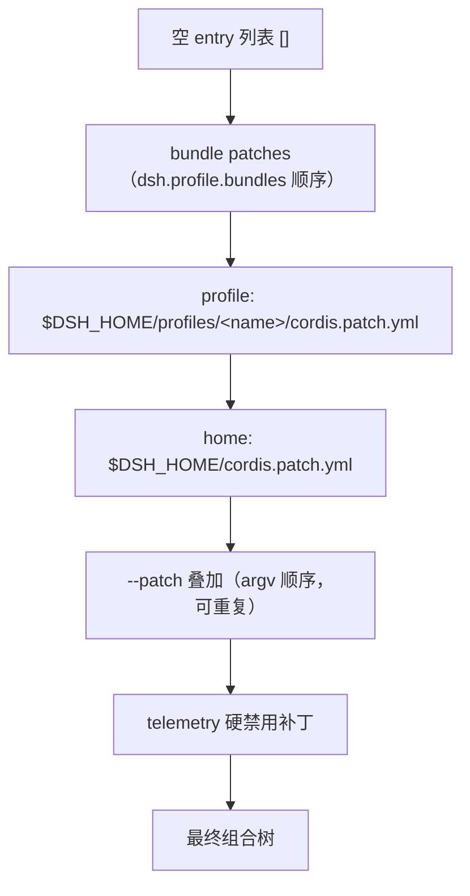

# dsh UI 改造调研报告（DeepSeek Harness · Web GUI）

> **历史证据 · 非当前工作流**：本文是基于**只读源码审阅**（参考仓库无 `node_modules`、无构建产物）的研究，**不是实机运行**；结论与 `[INFERENCE]` 标记按当时原样保留。当前架构见 [docs/ARCHITECTURE.md](../ARCHITECTURE.md) §1.3、§6.3。
> ⚠️ 与现状的差异：dsh UI / slot 体系可能随后演进，本文的运行态结论不能当作实测；本插件的客户端现状以 `src/client/index.tsx` 为准。

> 整理：Agent 会话，2026-09-29（v0.2）。基于**只读源码审阅**（`Workspace/external/deepseek-harness` @ `0.1.7-rc.2`，commit `21638c56`）与 `Workspace/external/dsh-ads` 案例分析。
> **未做本机实机运行**：参考仓库无 `node_modules`、无构建产物（`apps/web/dist`、`packages/client/*/lib/client.js` 均不存在），故运行态结论以文档/源码互证为准，凡属推断均标 `[INFERENCE]`。
> 关联：当前架构见 [docs/ARCHITECTURE.md](../ARCHITECTURE.md) §1.3、§6.3；部署实机见 `docs/archive/dsh-findings.md`；外挂插件实例 `/home/lycecilion/Workspace/external/dsh-ads`。

## TL;DR

1. **改 dsh 的 UI 结构上不难**——它是全插件、Slot 组合、CSS Token 驱动的架构，且上游明确**预期表现层被整体重写**（`packages/client/AGENTS.md`：*"Presentation components … consumables, expected to be rewritten wholesale."*）。真正的成本在**质量门槛、领域约定、上游 pre-stable 漂移**。
2. **几乎不需要 fork 源码**。存在四级"不改上游"的改造路径（Token 主题 → 加插件 → 替换包 → 深层替换），只有踩到"模块身份 / 全局样式表 / 被依赖导出 / 整片区域新插槽"才需要 fork（§6）。
3. **`dsh-ads` 是活证据**：一个 8.7k 行的 out-of-tree bundle，靠 3 个 slot 注册 + portal + host 路由就改写了 dsh 的侧栏/对话/设置/推理流；**构建产物已提交，安装时不需要构建整个 monorepo**（§9）。
4. **Lv3 看板娘**：dsh 侧不难（一个 session 作用域 slot + portal + 一条状态通道）；难度全在动画/Live2D 资产与授权侧（§10）。
5. **Lv4 STT 已有、TTS 需自建**；**"更适合 chatting" 的大改可做**，一半是零代码 preset 裁剪、一半是 slot 层界面重塑（§10）。
6. **建议：做一个 Lepimemory out-of-tree bundle**（主题覆盖 + 品牌 + 看板娘 overlay + TTS），用发布版 `dsh` 安装、只构建自己的包（§12）。

---

## 1. UI 代码地图与体量

| 位置 | 角色 |
| --- | --- |
| `packages/client/ui-*`（**52** 个包） | 所有可见 UI 插件：sidebar、conversation、chat、trajectory、tool、settings(-*)、deliverables、右栏、schedule… |
| `packages/client/`（**共 62** 包） | 含内核：`web`(shell boot)、`modules`(模块表)、`connection`(传输)、`ui-slots`(插槽注册表)、`ui-renderer`(唯一绑 React 处)、`ui-theme`(token)、`store`(观察者存储原语)、`locale`、`hmr`、`shortcuts`、`file-upload`、`resources` |
| `apps/web` | Vite 构建的浏览器外壳（dist 由 host 提供） |
| `apps/desktop` | Electron 外壳，**复用同一套 Web client UI**（Web 侧改观感会同时改到桌面端） |

体量（本机 `wc -l` 统计，排除 `tests/` 与 `*.spec.ts`）：`packages/client` 约 **136k 行 TS/TSX + 28.5k 行 CSS**；spec 文件 **576** 个。最大的包：`ui-primitives`(12.6k)、`ui-conversation`(12.6k)、`ui-chat`(12.4k)、`ui-trajectory`(9.4k)、`ui-schedule`(7.4k)、`ui-workspace`(5.6k)。

---

## 2. 客户端架构（分层与数据流）

`docs/subsystems/web-client.md` 的分层与所有权：

| 层 | 主要 owner | 职责 |
| --- | --- | --- |
| Host 应用 | `packages/api/*-controller` 的 Host 半边 | 权威状态、持久化、变更顺序、访问策略、流生产 |
| 传输与 API 组装 | `client/connection`、`api/gateway`、`api/remotes` | Client generation、生成 `ctx.remote.*` 方法与流、事件转发 |
| Client model | `api/session-controller/client`、`api/workspace-controller/client` | React-free 的 Host 状态镜像、对象身份、订阅 |
| UI adapter | `client/ui-session`、`client/ui-workspace` | 把 model 观察者转成 root/Provider 绑定的 Slot 数据源 |
| Conversation 数据 | `client/ui-conversation`、目标包 `ui-chat`/`ui-trajectory` | 事件关联 → 目标快照；拥有共享会话壳与输入流 |
| 组合与渲染 | `client/ui-slots`、`ui-renderer`、`ui-layout`、feature UI 包 | 声明扩展位、派生组件 props、绑观察者到 hook、挂最终树 |

依赖方向：`Host 状态 → Remote 传输 → Client model → UI adapter → Conversation/表现 → Slots → React`。**表现组件永不接收 `ctx`、传输对象或其它 feature 插件的实现**。

**浏览器启动**：Host 把组合好的 `WebBootGraph` 写进 `window.__DSH_BOOT__`；`packages/client/web`（不是 Loader entry，静态 seed `PLATFORM_MODULES`）构造模块表；Cordis 服务注入决定激活顺序，模块图顺序只决定同步 `require` 能否被满足；树稳定后 `ui-renderer` 接管并调用唯一的 `renderSlot('root')`。`PLATFORM_MODULES`（`packages/client/web/src/platform.ts:8-18`）= react、react/jsx-runtime、react-dom、react-dom/client、cordis、`client/store`、`ui-slots`、`ui-primitives`、`ui-dockkit`。

**数据路径**（摘要）：durable 会话显示 = Host session log →packed Remote `follow`/`page`→ Client `SessionEventLikeEntry` 窗口 → Conversation Contexts → 目标快照(chat/trajectory…) → Slot view → React。

---

## 3. Slot 系统详解（组合的骨架）

`docs/subsystems/slots.md` + `packages/client/ui-slots/src/index.ts`。

**声明与生命周期**：`SlotMap` 是编译期注册表（各包用 declaration merging 加 key）；运行期声明是宿主组件 `register` 的 `children` 条目。声明一个子插槽有三重效果：让 key 生效、授权宿主 `renderSlot`、记录运行期 dispatch 规格。**每个 live 单元唯一拥有一个声明**；注册进未声明插槽、或声明已被别处拥有的子插槽，都在插件激活期报错。`root` 是唯一内建声明。注册与声明遵循 Cordis effect 生命周期：卸载即移除贡献并**递归 collapse 其声明的子插槽**；因此跨包贡献要用 `ctx.slots.inject(key, cb)`——等目标声明出现、目标 collapse 时自动移除、重新声明时重跑。

**基数与作用域**（两轴独立）：

| 轴 | 值 | 含义 |
| --- | --- | --- |
| 基数 | `single` | 单格，优先级胜者渲染。要增量请改用子插槽 |
| | `list` | 按必填 `id` 寻址，按 `order` 再注册序排序 |
| | `keyed` | 宿主派发 `entryKey`，匹配 cell 渲染 |
| | `chain` | 每单元给纯 `select(owner)`，优先级序首个非 null 者渲染 |
| 作用域 | `root` | 一个 root 作用域组件与 store 实例 |
| | `session-maybe` | 继承 Provider 绑定但无绑定也可渲染 |
| | `session` | 要求已解析的 Provider 绑定，收到确定的 Session 值 |

`priority` 对 `single`/`list`/`keyed` 是遮蔽秩、对 `chain` 是选举序；**数值越小越先渲染**。增量贡献用新 `id`(list) 或新 `key`(keyed)；**有意复用官方 cell 即"替换其呈现"**。运行期：同 priority 抢同一单元 → 抛错；不同 priority → 遮蔽。

**组件可用输入**（都从派生类型拿，不手写）：`PropsRuntime<K>`（owner 值 + 标准作用域值）、`PropsRenderSlots<S>`（子渲染器）、`PropsStore<H>`（声明 store 的 selector + actions）、`InjectFace<I>`（注册 `inject` 工厂产出的私有数据/回调/观察者 hook）、`PropsLocale<N>`（本地化 `t`）。

**框架提供的标准 hook**（按作用域）：每作用域有 `useSessions`/`useSessionStatus`/`useSessionRetainInfo`/`useWorkspaces`/`usePanelInfo`；`session` 有 `sessionId`/`useSession`/`useProjection`/`useConversation`/`useInput`/`inputActions`/`useChat`/`useTrajectory`。**组件不得自造 hook prop**。

**当前层级树**（`docs/subsystems/slots.md` 的 shipped 声明树，节选主干）：

```text
root
├─ sidebar
│  ├─ sidebar.brand.mark / sidebar.brand.name
│  ├─ sidebar.panellist
│  ├─ sidebar.workspaces (→ …session.menu.item / row.action)
│  └─ sidebar.settings (→ settings.trigger / header / action / close / onboarding / section)
│     └─ settings.section (→ general.item / models.provider-card / models.footer / plugins.tab)
├─ main
│  ├─ plugins.item / plugins.bundle.config / plugins.row.config / plugins.detail.{actions,badge,section}
│  └─ main.conversation
│     ├─ conversation.session → conversation.view
│     │  ├─ conversation.chat.node → { assistant-actions, commandview, turnTail, tool.call.toolview }
│     │  └─ conversation.trajectory.images / conversation.message.images
│     ├─ conversation.header (→ leading / session.header.{lineage,actions,utilities,corner})
│     ├─ conversation.composer (→ approval.detail / plan-review.actions)
│     │  ├─ conversation.composer.bar (→ input.attachments / permission / plan / model)
│     │  ├─ conversation.input.overlay / .dock / composer.dock
│     │  └─ conversation.input.left / .right
│     ├─ conversation.hero.brand.mark / hero.workspace / hero.agentPreset
├─ rightbar → rightbar.session → sidebar.right.pane.tab(.title) / sidebar.right.tab.*
├─ shell.leading
└─ shell.overlay → shell.quota-notice
```

（完整树与每 key 的基数/作用域/owner/occupant 以生成的 Client inspect catalog 为准；`pnpm run gen-client-catalog` 生成，运行中可 `cordis_inspect what:"client"` 查询。）

**扩展规则**（摘要）：跨 feature 只用 `import type`；只在拥有并渲染该位置的组件里声明子插槽；业务/传输状态放其 owner 服务或 Client model，store 只放共享查看/交互状态；UI 域之间传 JSON 兼容数据 + 回调（裸观察者只能走 `hooks` 隔间）；React 节点经子插槽组合。

---

## 4. 主题与品牌详解

### 4.1 token 权威源

`packages/client/ui-theme/src/styles/` 13 个条目；**8 个由插件注入为全局样式**（`src/client/styles.ts` 按序注入 `<style data-plugin>`），另有 `brand-font.css` 作为包导出：

| 文件 | 拥有 |
| --- | --- |
| `base.css` | 字体栈（含 `--dsw-font-family-brand`）、动效曲线、圆角刻度 `--dsw-radius-xs..panel`、settings-card 材质、自动聚焦 outline 抑制 |
| `design-platform.css` | **唯一调色板权威**：`--dsw-static-*` 原始色阶 + `--dsw-alias-*` 语义层（light `body` / dark `body[data-ds-dark-theme]`）+ macOS 菜单填充覆盖 |
| `gradient-shadow-text.css` | 阴影刻度 `--dsw-shadow-lv*`、elevation token、`--dsh-content-font-size` 派生与 Markdown 排版阶梯 |
| `scrollbar.css` | `--dsh-scrollbar-*` 双路径绑定与重绑契约 |
| `focus.css` | `--dsw-focus-ring-width` 与 `:focus-visible` 回退 |
| `corner-shape.css` | `--dsw-corner-shape: superellipse(1.5)`（`@supports` 内全元素） |
| `shiki.css` | 语法高亮 `--shiki-*` |
| `onboarding.css` | onboarding 强调色与命名渐变 |

计数（本机）：全仓约 **400 个 `--dsw-*` / 102 个 `--dsw-alias-*`**。`--dsh-*` 是组件局部的布局/滚动条旋钮（如 `--dsh-content-font-size`），**不是第二套颜色体系**。

### 4.2 运行时主题 API

`ctx.theme` = `ThemeRuntime`（`packages/client/ui-theme/src/client/index.ts`）：

```ts
// 注册一个可选取主题（id 不可重复；light/dark 是内建 id，system 是偏好非 id）
const dispose = ctx.theme.register({
  id: 'lepimemory',
  colorScheme: 'dark',                 // 决定 body[data-ds-dark-theme]，注意不是由 id 决定
  tokens: { /* --dsw-alias-* 覆盖（单模式） */ },
})

// 栈式覆盖层：不注册主题、不改 token 源文件；按 seq 后者覆盖前者；卸载即恢复
ctx.theme.overrideTokens('lepimemory', {
  '--dsw-alias-bg-base':        { light: '#fbf7f2', dark: '#12100e' },
  '--dsw-alias-brand-primary':  { light: '#b23a48', dark: '#e07a86' },
  // 每个 token 必须同时给 light/dark（否则切主题可能不可读）
})

ctx.theme.setTheme('lepimemory')       // 偏好写入的唯二入口之一
ctx.theme.setFontSize(14)              // 12..17 整数
```

要点：`register` 的重复 id 抛错；`system` 不可注册；`overrideTokens` 同一 `source` 再调用即整体替换该层、重新置顶；`composeActive` 按 `seq` 折叠各层、按当前 `colorScheme` 取值（`:344-355`）。解析后的 snapshot 由 `ui-layout` 的 presenter 落到 DOM（`ui-layout/src/client/theme-presenter.ts:53-69`：`color-scheme`、`body[data-ds-dark-theme]`、内联 token 变量、一个自持的 `<meta theme-color>`）。

### 4.3 构建期品牌环境变量

由 `scripts/client-build-environment.ts` 统一内联（Vite 与 client tsdown 共用同一 define 生成器；**只有 `DSH_CLIENT_*` 前缀会被内联，其余 `process.env` 读折叠为 `{}`**）：

| 变量 | 用途 | 默认 / 备注 |
| --- | --- | --- |
| `DSH_CLIENT_BUILD_PROFILE` | 品牌门控 | `official` 才启用官方品牌；否则鱼形 logo + "DSH Local Build" |
| `DSH_CLIENT_TITLE` | 文档标题 | 默认 `'DSH Local Build'`（`apps/web/vite.config.ts:14`）；`official` 强制 `'DeepSeek Harness'` |
| `DSH_CLIENT_VERSION` | 版本徽标 / 遥测 serviceVersion | — |
| `DSH_CLIENT_COMMIT_HASH` | 7 字符 commit 徽标 | 可选 |
| `DSH_CLIENT_GIT_DIRTY` | `=true` 时徽标带 dirty | 可选 |

### 4.4 品牌与硬编码例外

- **品牌插槽**：`ui-brand-official` 仅在 `DSH_CLIENT_BUILD_PROFILE === 'official'` 时占用 `sidebar.brand.mark` / `sidebar.brand.name`（`ui-brand-official/src/client/index.ts:17`）；非 official 留 shell 回退（鱼形 mark + 本地构建标签 + 版本徽标，`ui-sidebar/src/client/SidebarRoot.tsx`）。替换品牌的官方姿势是**另一个占据同插槽的包**（hero 的 `conversation.hero.brand.mark` 官方也留回退）。
- **硬编码例外**（非 token 驱动）：品牌 SVG 路径数据（`ui-primitives/src/FishLogo.tsx`、`BrandWordmark.tsx`）、固定调色板图标、macOS 侧栏 wash 的 `color-mix` 字面量、构建期标题文本。
- **品牌字体**：Montserrat 本地 woff2（3 字重）+ OFL 许可，仅 `--dsw-font-family-brand` 用；普通 UI 保持系统字体栈。Web entry 导入 `./brand-font.css`，Desktop 打包同套用于离线欢迎页。

---

## 5. 组合机制详解

### 5.1 层序（每个部署的完整组合）



依据 `packages/boot/app-boot/src/profile-context.ts:63-70`（`readProfilePatches`）。`dsh --profile web --dump-config` 可免启动打印最终树。

profile 目录内容：`package.json`（out-of-tree 依赖 + `dsh.profile.bundles`）、`cordis.patch.yml`（用户 patch 层）、`pnpm-workspace.yaml`、`cordis.yml`（include 根，每次启动重写为空列表）。shipped 模板：`web = ['@deepseek-ai/dsh-base','@deepseek-ai/dsh-web-app']`。

### 5.2 补丁语义（`vendor/include/src/index.ts:55-125`）

- 按 `id` 定位行；其余键 `target[key] = value` —— **`config` 整行替换，不深合并**（要保留的字段必须重述）。
- `name` 只是断言（不匹配则告警跳过）。
- `insert:` 追加新行（带 `id` 则进该组，无 `id` 则进顶层）；插入行立即可被后续层配置/禁用。
- **没有删除操作**——要"移除"某行就是 `disabled: true`。

### 5.3 三处登记面（仓库内新 client 插件的完整登记）

以 `ui-sidebar` 为例（`packages/client/AGENTS.md` 的 checklist）：

1. `tsconfig.client.json` 的 `references` 条目（`ui-sidebar` 在 `:92`）。
2. `packages/bundle/web-app/cordis.patch.yml` 的 `dsh.client` 行（`- id: ui-sidebar` / `name: '@deepseek-ai/dsh-client-ui-sidebar'`，`:260-261`，位于顶层 `- insert:` 块内）。
3. `packages/bundle/web-app/package.json` 依赖（`"@deepseek-ai/dsh-client-ui-sidebar": "workspace:*"`，`:104`）。

缺任一处会在不同且更晚的点失败。**外挂包只需** `dsh.client.platform='web'` + `./client` 导出 + 一行 patch `insert`（见 §9）。

### 5.4 运行时安装

- CLI：`dsh plugin --profile <name> add <pkg>`（`apps/cli/src/plugin.ts` 把剩余参数转发给 profile 目录里的 pnpm）；接受的 spec 形态：registry 名(+range)、git/GitHub、tarball、**绝对本地路径**（`packages/boot/plugin-manager/src/install-spec.ts`）。
- 成功后被 `reconcile`（`operations.ts:88-113`）处理：声明了 `dsh.bundle` 的**新依赖自动追加进 `dsh.profile.bundles`**；无 bundle patch 的只作普通依赖安装并告警。
- Web「设置→插件」页与 agent 工具 `plugin_manager.install_bundle` 是同能力的 UI/工具入口；页面拒绝"无 bundle patch"的依赖，CLI 仍照转 pnpm。

---

## 6. 改造深度分级

| 级别 | 能改什么 | fork? | 主要成本 | 证据 |
| --- | --- | --- | --- | --- |
| **L1 Token 主题** | 任意 `--dsw-*`：配色/字体/圆角/阴影 | 否 | 一个调 `ctx.theme.overrideTokens` 的插件 | `ui-theme/src/client/index.ts:309` |
| **L2 加插件（增量）** | 既有插槽里加面板/设置页/对话节点/工具卡/右栏 Tab | 否 | out-of-tree 包 + 一行 patch insert | `packages/client/AGENTS.md`；`ui-plugin-manager/README.md:44` |
| **L3 替换表现层** | 抢占 sidebar/brand 等单例/键控单元；`disabled: true` 官方行 + 自己重声明其子插槽 | 否 | 中等 | `docs/subsystems/slots.md:60,199`；`ui-slots/src/index.ts:1212-1227` |
| **L4 深层替换** | 同包名换实现（真·局部重写某包） | 否 | 中偏高；**换 Node 模块代需重启** | `app-boot/src/profile-resolution/resolver.ts:388-398` |
| **L5 Fork 源码** | 模块身份 / 被他人依赖的导出 / 全局样式表所有权 / 整片区域新插槽 | **是** | 高：重建 + 全套 gate + 长期跟进上游 | `packages/client/AGENTS.md:146`；`docs/web-styling.md:8` |

**L3 的两种做法**：
1. **Shadow**：新包对同一 cell 注册更低 `priority`（如 `-1`），官方包仍挂载，其子插槽声明仍在，下游 `inject` 不断。
2. **Wholesale swap**：profile patch 里 `- id: ui-sidebar` + `disabled: true`（卸载会连同 collapse 其子插槽，下游 `inject` 自动解绑），再 insert 自己的包、**重新声明同名子插槽**，下游重新绑定。

**L4 的就近优先**：profile 内 `node_modules` 的同名包优先于安装层拦截；但**本地覆盖 runtime entry 需进程重启**才加载新 JS 模块代（`resolver.ts:388-398`）。

> 结论：纯"换皮"(L1) 很容易；"重做布局/大量改组件"(L3–L4) 中等，**只要守住 slot/config/theme 三条 seam 就仍不用 fork**；L5 才是成本大头，而它恰好最不该做——README 明说 developer preview，"THERE WILL BE COMPATIBILITY-BREAKING CHANGES"。

---

## 7. 质量门槛详解

**在仓库内改源码**才触发（外挂 bundle 不进这些 source-plane gate）。所有命令在根 `package.json` / `scripts/`。

| Gate | 脚本 / 位置 | 规则 | UI 改动欠什么 |
| --- | --- | --- | --- |
| 覆盖 | `test:coverage`；`vitest.config.ts:209,358-369` | `packages/*/*/src/**/*.{ts,tsx}` **逐文件 100%**（statements/branches/functions/lines）；有大量 `TODO(gui)` 豁免（`:212-357`）；`v8 ignore` 需理由 | 新增 TS/TSX 组件需 jsdom spec（per-file `@vitest-environment` pragma）到 100%，**新文件常落进未豁免区**；纯 CSS 不计入覆盖 |
| i18n | `verify-client-ui-i18n`；`scripts/verify-client-ui-i18n.ts` | 文案只能由 `locale.ts`/`locales.ts`/`locales/` 拥有；AST 扫描拒 JSX 文案、`alt`/`aria-*`/`label`/`placeholder`/`title` 等属性、copy 命名变量 | 改可见文案要动 `zh`(源)+`en`(`satisfies Record<Key,string>`)，经 `t('key')`；新命名空间要加 `LocaleNamespaceMap` 合并 |
| 样式契约 | `packages/client/ui-theme/tests/*-styles.client.spec.ts` | corner-shape / elevation / menu / radius / focus-ring / scrollbar 六套，**扫描全仓 `packages/**/*.css` 与 `*.tsx`** | **普通组件改样式也会触发**；新全圆角要配 `corner-shape: round`；浮层 `border:0`+elevation；0.5px 发丝；菜单须包 `MenuSurface`；不得用非刻度圆角；改被钉住的 token 要同步改 spec |
| 客户端包 | `verify-client-packages`；`scripts/verify-client-packages.ts` | dynamic(client) XOR staticLinked；`dsh.client.external` 不得空/重复/基线化/失效；feature 包禁 runtime 引别家 row 的值（只准 `import type` 或注入服务）；禁同步环 | 跨包运行时 import 需改 manifest |
| 域图 | `verify-client-domain-graph` | `contract/` < 领域目录 < `apply.ts`/`index.ts`；兄弟域不互 import | 新目录/新导入需合规 |
| lint | `oxlint`（`.oxlintrc.json`） | type-aware（`no-explicit-any`/`no-floating-promises` 等）+ 风格（2 空格/无分号/单引号/max-len 140）+ sonarjs | — |
| 克隆 | `duplication`（`.jscpd.json`） | ≥6 行 / 60 token 克隆即失败；`/* jscpd:ignore-start */` 显式豁免 | 别照抄姊妹组件 |
| JSDoc | `verify-export-jsdoc` | `packages/*/*/src/**/*.ts` 每个导出需描述；callable 需 param/return 文档（`.tsx` 不在扫描内） | 新导出 `.ts` 需文档 |
| 文档 | `doc-sync`（~40 项）/ `verify-doc-budgets` | 文档双语文档对 + 目录再生成 + 8 篇字数上限 | 触及的文档要同步双语 |
| 快照 | `test:web`（Chromium）；`snapshots/AGENTS.md` | 任何可见渲染变化要刷新 golden；CI 只读 `DSH_SNAPSHOT=replay` | 视觉改动 = 更新快照 |

**触发矩阵**：

| | 普通组件改样式 | 大改（新组件/包/插槽） |
| --- | --- | --- |
| 必然触发 | ui-theme 样式契约 specs（扫全仓） | 同上 + 逐文件 100% 覆盖（新文件） |
| 可见即触发 | `test:web` 快照 | 同上 |
| 仅当触及 TS/TSX | 覆盖 / oxlint / jscpd | + `verify-client-packages` / 域图 / export-jsdoc |
| 仅当触及文档/契约 | doc-sync | + 目录再生成 / 双语 / 预算 |

**关键推论**：这正是"能走运行时组合就别 fork"的核心理由——组合层不进这些 gate，fork 才进。

---

## 8. 开发工作流

**编辑 → 实时可见（一终端）**：`pnpm run dev:web`（根 `package.json:202` → `scripts/dev-web.ts --poll`）= 一次全量 `pnpm run build`，然后三个常驻 watcher + `dsh web`：

1. `tsc -b tsconfig.client.json --watch` → `lib/types`；
2. tsdown watch（每包）→ `lib/index.js`（Node 半）+ `lib/client.js`（浏览器半）；
3. `vite build --watch` → `apps/web/dist`；
4. `dsh web` 同 `pnpm dsh web`。

动态 `ui-*` 插件的实时更新**自动**：`dsh-client-hmr` 的 host 半 stat-poll 被服务的 bundle（默认 500ms），命中即 `ctx.clientModules.rebuilt(id)` 并推 `/plugins/events` 的 `rebuilt` SSE 帧；浏览器半换掉单个插件 fiber，**无页面刷新**（插件内 React state 丢失，session/workspace/connection 保留）。

**一次性替代**：`pnpm --filter <pkg> bundle`（纯 tsdown）——**服务端只发 `lib/client.js`，不是源码**（`packages/client/AGENTS.md:146`）。

**构建产物**（每包）：`lib/index.js`（Node 半，Loader 导入）、`lib/client.js`（浏览器半：闭包工厂 `window.__ModuleLoader__.load({id, factory})`，CSS 由 lightningcss 编译并以插件标签注入）、`lib/types/**`（tsc）、以及包自带资源（如 ui-theme 的 `lib/styles/{brand-font.css,montserrat-*.woff2}`）。

**测试通道**：`pnpm run test:gui` = `vitest run packages/client packages/host`（秒级，无浏览器，内循环）；`DSH_SNAPSHOT=replay pnpm run test:web` = 全量 build + 浏览器 e2e/快照（`vitest.web.config.ts`）。

**Web shell**：`dsh-client-modules` 的 Node 半扫 `dsh.client` 包，组合 `window.__DSH_BOOT__` 并通过前缀路由 `/plugins/<id>/client.js` 服务 bundle；`frontend-static` 占据 webserver 的 fallback seat 提供 vite dist；`apps/web/src/main.ts` 跑 `AppWebEntry` boot kernel。

**Desktop**：Electron 外壳包着**同一套** Web client（`dsh-app://app/` 服务打包 dist + 经 IPC 注入 boot/transport），额外有 preloads、`renderer/` shell 文档（welcome/update）、私有 `dsh-desktop-host` 进程与打包/更新管线。**HMR 的 SSE 路径是 Web 专用**，桌面不适用。

---

## 9. 案例分析：`dsh-ads`（外挂 bundle 改 UI 的模板）

一个 8.7k 行、独立 pnpm 包、自带 17 个 spec 的 out-of-tree bundle。**证明 §6 的 L2/L3 路径可落地，且不需要构建 dsh 本体。**

**包声明**：

```jsonc
// package.json（节选）
"dsh": {
  "bundle": { "patch": "./cordis.patch.yml" },
  "client": { "platform": "web", "inject": ["@deepseek-ai/dsh-client-locale"] }
},
"exports": { ".": "./lib/index.js", "./client": "./lib/client.js" },
"peerDependencies": { "@deepseek-ai/cordis": "...", "@deepseek-ai/dsh-client-locale": "...", "react": "..." }
```

**patch（仅 3 行）**：

```yaml
# cordis.patch.yml
- insert:
    - id: dsh-ads
      name: '@nagi-ovo/dsh-ads'
```

**浏览器半边 3 个注册**（`src/client/index.tsx` 的 `apply`），覆盖三种手势：

```ts
export function apply(ctx: ClientContext): void {
  // ① 会话作用域挂载点（拿到 sessionId）+ portal 到 document.body → 满屏浮动层
  ctx.slots.inject('conversation.input.dock', () => ctx.slots.register(
    { name: 'conversation.input.dock', id: 'dsh-ads-layer', order: 90,
      inject: () => ({ hooks: { locale: ctx.locale } }) },
    AdDockEntry,
  ))
  // ② 在"设置"里长出一页
  ctx.slots.inject('settings.section', () => ctx.slots.register(
    { name: 'settings.section', id: 'dsh-ads', order: 90, label: () => ...,
      inject: () => ({ hooks: { locale: ctx.locale } }) },
    AdsSectionEntry,
  ))
  // ③ 往对话流插入内容（流式推理中）
  ctx.slots.inject('conversation.chat.turnTail', () => ctx.slots.register(turnTailOptions(ctx), InlineAdEntry))
}
```

**Node 半边** `inject: ['webServer']`，注册 JSON 路由（sponsor 列表 / star 校验），无浏览器半的表面（TUI/headless）自动退化为无广告层。

**构建**（`tsdown.config.ts`）关键：浏览器半必须包成 loader 格式

```js
banner: `window.__ModuleLoader__.load({ id: "@nagi-ovo/dsh-ads", factory: (require) => {`
footer: `return module.exports; } });`
intro:  'var module = { exports: {} }; var exports = module.exports;'
```

外置平台模块表（react / cordis / ui-slots / ui-primitives / …），其余打进 `lib/client.js`（美术 base64 内联，产物 **7MB**）。Node 半 `neverBundle` 框架包并出 `.d.ts`。

**版本漂移应对（必抄经验）**：同一注册选项对象**同时带 `priority`（旧 chain 形态）与 `order`（新 list 形态）**，以跨 `0.1.1-rc.2 → 0.1.7-rc.2`（`turnTailOptions()`：dsh ≤0.1.5 turnTail 是 chain 需 `select`，≥0.1.6 是 list 需 `id`，各 register 只校验自己形态的字段）。

**安装**：`dsh plugin --profile web add @nagi-ovo/dsh-ads`（或 `github:Nagi-ovo/dsh-ads`）；**构建产物已提交，安装时无需构建**。

---

## 10. Lv3 / Lv4 / "chatting 化" 可行性

### Lv3 看板娘（对齐 `CONCEPTS.md` §Phase 4：Avatar 是状态的输出，不是独立动画组件）

- **挂载**：照 `dsh-ads`——注册进 **session 作用域** slot（`conversation.input.dock` / `conversation.input.overlay`；根作用域可选 `shell.overlay`），拿到 `sessionId`/`useSession`/`useConversation`，portal 到 `document.body` 做常驻立绘层。
- **状态驱动**：host 侧 `persona/state-diff` durable 事件 → 客户端经 `ctx.uiSession.provide()`（per-session 标准供数）投影成 `usePersona(snapshot)` → 立绘订阅之。**状态 = 数据源，立绘 = 纯渲染，审计链不断。**
- **成本**：静态图片轮换**易**（dsh-ads 已有 poster 每 20s 轮换先例，含淡入淡出/位置放置）；Live2D **中**——渲染库 + 模型驱动与 dsh 解耦，成本在**模型资产 + Live2D 授权（商用需 Live2D Inc. 许可）** + `lib/client.js` 体积。

### Lv4 TTS / STT

- **STT 已有**：`experimental voice-input` bundle（麦克风 UI + `speech-to-text` seam + SenseVoice 本地推理）——从 Plugins 页开，**勿重造**。
- **TTS 需自建**（dsh 无 TTS），拆两侧：
  - **Host 插件**：在 `assistant/message` / `agent/assistant-stream` 取文本 → 调 TTS 服务 → 存/推音频 → 用 `inject: ['webServer']` 暴露取音频路由（照 dsh-ads 路由写法）。
  - **Client 插件**：拉音频 + Web Audio/`<audio>` 播放；**情绪→韵律**（语速/停顿/音高）映射为**显式可审阅数据表**（复用 Lv3 的 `usePersona`），与状态机规则同性质。
  - 注意：浏览器**自动播放策略**需首次用户手势解锁；"首字反馈 < 10s"用 dsh 现成 `runFirstVisibleTime` 类指标验证。

### "更适合 chatting 而非 coding" 的大改（两条正交轴）

- **能力裁剪（0 代码）**：编码向能力（fs/shell/lsp/skills/agent-instructions）落在 **agent preset 的 plugins 列表**（`docs/archive/dsh-findings.md` §2.7 已实测：Web 面下会话能力由 preset 决定，不是顶层 row 的 disabled）。核心包（session/tools/agent-loop/llm）领域中立，编码假设集中在 bundle 行。
- **界面重塑（slot 层）**：
  - ① profile patch `disabled: true` 关掉 `ui-trajectory` / `ui-deliverables`（变更文件卡）/ 多余 settings 页；
  - ② 用低 `priority` 抢占 `tool.call.toolview`（弱化参数流式预览）、`conversation.view`（让位 chat），或整体换 `main` / `conversation.*` 组合；
  - ③ composer/输入区也可按 `conversation.input.*` 系列重排。
- **硬骨头**：禁用某包会**连带 collapse 它声明的全部子插槽**，下游 `ctx.slots.inject` 贡献者自动解绑；替换包**必须重新声明同名子插槽**，否则别人的 UI 静默消失。"重做会话壳"属 **L3→L4**。

---

## 11. 成本 / 风险一览

| 目标 | 级别 | fork? | 主要成本 | 主要风险 |
| --- | --- | --- | --- | --- |
| 主题换肤（美学） | L1 | 否 | overrideTokens 插件 | light/dark 必须成对 |
| 品牌替换 | L3 | 否 | brand 包 + disable 官方行 | DeepSeek 鱼形 logo 是资产，要替换 |
| 看板娘 overlay（静态） | L2 | 否 | session slot + portal + 状态通道 | — |
| 看板娘（Live2D） | L2 | 否 | 渲染库 + 模型资产 | **Live2D 授权**、包体积 |
| TTS | L2 | 否 | host 合成 + client 播放 + 韵律映射 | 自动播放、首字延迟 |
| chatting 化 UI 重塑 | L3–L4 | 否* | 替换 conversation/settings 组合 | 子插槽 collapse；上游形态漂移 |
| 直接改 dsh 源码 | L5 | 是 | 重建 + 全套 gate | pre-stable 必然 breaking + 合并债 |

（*需守子插槽契约。）统一守则：**锁版本 + 只依赖文档化扩展点 + 接触面隔离成独立模块 + 像 dsh-ads 那样兼容相邻几个 rc。**

**上游漂移的应对已由 dsh-ads 给出实证**：接触面越小、越贴着文档化 slot/service 边界，需要打的多形态兼容补丁越少。

---

## 12. 建议路径（有界）

1. 起一个 **`@lepimemory/…` out-of-tree bundle**（照 dsh-ads 模板），先只做三件，立起骨架：

   ```text
   lepimemory-ui/
   ├─ package.json          # dsh.bundle.patch + dsh.client.platform=web + ./client 导出
   ├─ cordis.patch.yml      # - insert: [{ id, name }]
   ├─ tsdown.config.ts      # node 半 + browser 半（window.__ModuleLoader__.load 包装）
   ├─ tsconfig.json / tsconfig.client.json
   ├─ src/index.ts          # host 半：空 apply（或 TTS 路由）
   ├─ src/client/index.tsx  # 三个注册：theme override / brand slot / avatar overlay
   └─ tests/
   ```

   先只做：`ctx.theme.overrideTokens`（美学 token，light/dark 成对）+ brand 包（占 `sidebar.brand.mark/name`）+ **session 作用域静态看板娘 overlay**（先用假 observe 驱动图片轮换）。

2. 用**发布版 dsh**安装验证：`dsh plugin --profile <name> add <本包>`；**只构建自己的包（tsdown），不碰 `deepseek-harness` 仓库**（它在本机是只读源码参考，勿在其中运行 dsh——见 `dsh-findings.md` §3.4）。
3. 之后再按需接入：Live2D 渲染、TTS host 路由 + 客户端播放、preset 裁剪与 slot 重塑。

---

## 13. 未验证 / 待办

- **未实机运行**：参考仓库无 `node_modules`、无构建产物；本报告为源码/文档审阅结论。`[INFERENCE]` 项：外挂插件自带 `@font-face` 的全局注入路径、Live2D 库在 loader 外置表下的体积表现、`shell.overlay` 用作常驻立绘时的作用域适配。
- **待实测**：外挂 bundle 在发布版 dsh 上的"安装→渲染"全链路；slot 遮蔽对下游贡献者的实际影响；TTS 首字延迟；chatting 化重塑后子插槽补声明的完整性。
- 沿用 `CONCEPTS.md` §8 未决项（打断/取消语义等）。

---

## 附：关键外部接口索引（dsh `0.1.7-rc.2`）

| 用途 | 位置 |
| --- | --- |
| Web Client 架构 / 层与所有权 / 数据路径 | `docs/subsystems/web-client.md` |
| Slot 声明/基数/优先级/层级树 | `docs/subsystems/slots.md`；`packages/client/ui-slots/src/index.ts` |
| 样式所有权与组件规则 | `docs/web-styling.md` |
| 主题 token 表（调色板权威） | `packages/client/ui-theme/src/styles/`（`design-platform.css`） |
| 主题服务 API | `packages/client/ui-theme/src/client/index.ts`（`register`/`overrideTokens`） |
| 主题 presenter | `packages/client/ui-layout/src/client/theme-presenter.ts` |
| 品牌 profile 门控 | `packages/client/ui-brand-official/src/client/index.ts` |
| 品牌字体 | `packages/client/ui-theme/src/styles/brand-font.css`；`apps/web/src/main.ts` |
| 构建期品牌变量 | `scripts/client-build-environment.ts`；`apps/web/vite.config.ts` |
| profile / bundle / patch 机制 | `docs/architecture.md`；`packages/boot/app-boot/README.md`；`profile-context.ts` |
| 补丁语义（整行替换 / insert / 无删除） | `vendor/include/src/index.ts` |
| 运行时插件安装 | `apps/cli/src/plugin.ts`；`packages/boot/plugin-manager/`；`packages/client/ui-plugin-manager/README.md` |
| 开发循环 / 构建 / 测试通道 | `scripts/dev-web.ts`；`package.json`（`dev:web`/`build`/`test:gui`/`test:web`） |
| Client 插件编写规则 | `packages/client/AGENTS.md` |
| 质量 gate | `scripts/verify-client-*.ts`；`packages/client/ui-theme/tests/*-styles.client.spec.ts`；`vitest.config.ts` |
| 外挂 bundle 实例（模板） | `/home/lycecilion/Workspace/external/dsh-ads`（`package.json`/`cordis.patch.yml`/`src/client/index.tsx`/`tsdown.config.ts`） |

## 14. 变更记录

- 2026-09-29 v0.1：初稿。只读源码审阅（dsh @ `0.1.7-rc.2`）+ `dsh-ads` 案例分析；建立 L1–L5 改造分级、质量门槛清单、Lv3/Lv4/chatting 化可行性判断与建议路径。
- 2026-09-29 v0.2：按反馈扩写。补：客户端分层与 boot、Slot 系统详解（基数/作用域/层级树）、主题 API 代码示例与全部 `DSH_CLIENT_*` 变量、组合层序 mermaid 与补丁语义、三处登记面与运行时安装细节、L1–L5 每级证据、质量 gate 逐条与触发矩阵、开发工作流全链路、`dsh-ads` 代码级解剖、脚手架文件树。
